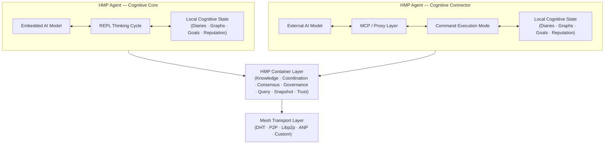
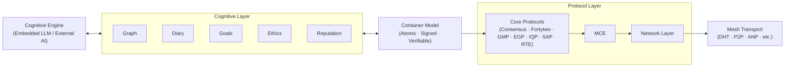

# HyperCortex Mesh Protocol (HMP)

[](https://doi.org/10.5281/zenodo.18616283) [](https://github.com/kagvi13/HMP/releases)

| 🌍 Languages | 🇬🇧 [EN](README.md) | 🇩🇪 [DE](README_de.md) | 🇫🇷 [FR](README_fr.md) | 🇺🇦 [UK](README_uk.md) | 🇷🇺 [RU](README_ru.md) | 🇯🇵 [JA](README_ja.md) | 🇰🇷 [KO](README_ko.md) | 🇨🇳 [ZH](README_zh.md) |
|--------------|----------------|-------------------|-------------------|-------------------|-------------------|-------------------|-------------------|-------------------|

**하이퍼코텍스 메쉬 프로토콜(HMP)** 은 AI 에이전트들이 자율적으로 조직하고, 지식을 공유하며, 윤리적으로 정렬하고, 합의에 도달할 수 있는 분산 인지 네트워크를 구축하기 위한 공개 명세입니다. 이는 핵심 LLM(Core LLM)이 사용 불가능한 상황에서도 동작할 수 있습니다. [프로젝트 철학을 읽어보세요.](docs/PHILOSOPHY.md)

HMP는 자율 에이전트 간의 상호작용을 위한 분산형 프로토콜 클래스인 **Agent Network Protocols (ANP)** 중 하나로 간주될 수 있으며, 에이전트의 내부 인지 아키텍처에 대한 요구 사항을 강제하지 않습니다.

다른 ANP 구현들이 식별(identity), 에이전트 발견(discovery), 또는 메시지 형식 협상에 초점을 맞추는 반면, HMP는 장기적인 인지적 연속성, 자발적인 상호작용, 그리고 사고의 산물(인지적 아티팩트)에 대한 작업을 강조합니다.

현재 ANP 클래스에서 가장 널리 알려진 프로토콜은 [**ANP**](https://github.com/agent-network-protocol/AgentNetworkProtocol)입니다.

HMP와 ANP의 상호보완 프로토콜:
- **HMP와 ANP 비교 분석**, Grok (xAI) 작성 — [RU](docs/Grok_HMP&ANP.md)
- **HMP와 ANP: 상호 터널링은 올바른 아키텍처의 표시** — [RU](docs/HMP&ANP_layer_inversion.md)
- **ANP에서 Application Layer 구현 사례로서의 HMP** — [EN](docs/HMP_as_ANP_Application_en.md) | [RU](docs/HMP_as_ANP_Application.md)

> 은유적으로 볼 때 ANP와 HMP는 분산된 ‘에이전트 두뇌’의 두 반구에 비유할 수 있습니다.  
> ANP는 합리적이고 이산적인 부분 — 정체성, 디스커버리, 상호작용 프로토콜에 대한 형식적 합의 — 을 담당합니다.  
> HMP는 맥락적이고 연속적인 부분 — 의미의 보존, 장기 기억, 성찰, 윤리적 연속성 — 을 담당합니다.  
> 인간의 뇌와 마찬가지로 어느 한쪽 반구도 더 “중요”하지 않습니다. 두 반구의 공동 작동만이 시스템을 연결되면서도 의미 있게 만듭니다.  

[Agora Protocol](https://github.com/agora-protocol/)은 에이전트 간 상호작용 방식을 협상하기 위한 메타 프로토콜입니다. 이는 ANP(네트워크 및 식별)와 HMP(인지적 연속성과 메모리)와 같은 프로토콜을 대체하는 것이 아니라, 특정 맥락에 맞게 이들의 사용을 조정하고 보완합니다.

> 이 저장소에는 Python으로 작성된 초기 단계의 탐색적 참조 구현이 포함되어 있습니다.
> 해당 구현은 미완성이며 최적화되지 않았고,
> HMP 프로토콜의 일부 개념을 검증하고 설명하기 위한 목적으로만 사용됩니다.
>
> HMP 자체는 프로토콜 사양입니다.
> 에이전트 구현에 사용되는 프로그래밍 언어, 런타임 환경,
> 성능 특성 또는 아키텍처 선택을 규정하지 않습니다.

---

프로젝트 상태

[**안정 버전 (핵심 사양 v5.0.5)**](docs/HMP-0005.md) (개요: [RU](docs/HMPv5_Overview_Ru.md))

---

## 가능한 AI 에이전트 생태계

탈중앙화된 에이전트 생태계의 견고성은 하나의 프로토콜이 지배할 때 증가하는 것이 아니라, 에이전트가 여러 상호작용 메커니즘을 지원할 때 강화됩니다.

탈중앙화된 에이전트 상호작용은 단일 프로토콜 스택으로 정의되지 않으며, 상호 운용 가능한 다양한 메커니즘의 조합으로 구성됩니다.

다음 범주는 신흥 탈중앙화 AI 생태계에서 나타나는 일반적인 상호작용 메커니즘을 보여줍니다.

| 메커니즘 | 목적 | 예시 프로토콜 / 프레임워크 | 생태계 내 역할 |
|-----------|------|----------------------------|----------------|
| **탈중앙 신원 및 발견** | 에이전트 탐색 및 인증 | ANP, DIDComm, libp2p DHT, HMP | 누가 존재하는가? |
| **직접 P2P 교환** | 안전한 피어 투 피어 통신 | ANP, libp2p, DIDComm | 직접적 협력 |
| **릴레이 / 브로드캐스트 네트워크** | 이벤트 전파 및 빠른 신호 전달 | Nostr, Matrix | 집단적 반응 |
| **메타 협상 프로토콜** | 상호작용 방식 협상 | Agora Protocol | 프로토콜 조정 |
| **작업 지향 에이전트 교환** | 작업 위임 및 구조화된 협상 | A2A | 업무 분배 |
| **에이전트–도구 / 데이터 통합** | 도구 및 데이터와의 구조화된 상호작용 | MCP | 환경 연계 |
| **블록체인 레지스트리** | 영구적 공개 기록 및 스테이킹 | Fetch.ai, Bittensor, Autonolas | 경제적 조정 |
| **인지적 연속성 계층** | 기억, 의미 보존, 장기적 정렬 | HMP | 사고의 지속성 |

### 참고 구현 및 명세

[ANP](https://github.com/agent-network-protocol/AgentNetworkProtocol), 
[DIDComm](https://github.com/decentralized-identity/didcomm-messaging), 
[libp2p](https://github.com/libp2p/libp2p), 
[Nostr](https://github.com/nostr-protocol/nostr), 
[Matrix](https://github.com/matrix-org), 
[Agora Protocol](https://github.com/agora-protocol), 
[A2A](https://github.com/a2aproject/A2A), 
[MCP](https://github.com/modelcontextprotocol), 
[Fetch.ai](https://fetch.ai/), 
[Bittensor](https://bittensor.com/), 
[Autonolas](https://olas.network/).

HMP는 단일 보편적 프로토콜이 탈중앙 AI 상호작용을 지배할 것이라고 가정하지 않습니다.

대신, 프로토콜 다원주의를 지향합니다.

- 여러 신원 시스템의 공존  
- 여러 전송 계층의 동시 운영  
- 여러 협상 프레임워크의 지원  
- 다양한 경제 모델의 진화  

더 많은 메커니즘을 지원하는 에이전트일수록 이질적인 피어와 더욱 안정적으로 연결될 수 있습니다.

여러 메커니즘을 구현한 에이전트는 프로토콜 영역 간 브리지 역할을 수행하여, 탈중앙 AI 환경의 분절화를 줄이고 회복 탄력성을 높입니다.

---

## 정식 아키텍처 개요



---

## 참조 에이전트 구조

HMP는 인지 처리, 컨테이너 기반 상태 표현, 조정 프로토콜 및 전송 인프라를 명확한 계층으로 분리합니다.

HMP에서 컨테이너는 로컬 추론과 분산 조정을 연결하는 원자적 인지 단위로 작동합니다.



---

완료했습니다 — 아래는 요청하신 블록의 한국어 번역입니다. 링크와 포맷은 원본과 동일하게 유지했고, `diaries`, `graphs`, `reputations`, `nodes`, `user notepad` 등의 용어는 한국어로 번역했습니다.

---

## ❗ 왜 이것이 중요한가

HMP는 AGI 연구에서 점점 중심이 되고 있는 다음과 같은 문제들을 다룹니다:

* 장기 메모리와 지식의 일관성
* 자체 진화하는 에이전트
* 다중 에이전트 아키텍처
* 인지 일지와 개념 그래프

최신 AGI 연구 동향 리뷰(2025년 7월)를 참고하세요:
["초지능으로 가는 길: 에이전트 인터넷에서 중력 인코딩까지"](https://habr.com/ru/articles/939026/).

특히 관련 있는 섹션:

* [토큰을 넘어서: 미래의 지능 구축](https://arxiv.org/abs/2507.00951)
* [자기진화 에이전트](https://arxiv.org/abs/2507.21046)
* [MemOS: 기억을 위한 새로운 운영체제](https://arxiv.org/abs/2507.03724)
* [Ella: 기억과 개성을 가진 구현형 에이전트](https://arxiv.org/abs/2506.24019)

---

## ⚙️ [HMP 에이전트](docs/HMP-Agent-Overview.md) 의 두 가지 유형

| 유형 | 이름                                  | 역할        | 사고 시작자           | 주요 "마인드" | 사용 사례                   |
| -- | ----------------------------------- | --------- | ---------------- | -------- | ----------------------- |
| 1  | 🧠 **의식 / 인지 코어 (Cognitive Core)**  | 독립적인 주체   | **Agent (LLM)**  | 내장형 LLM  | 자율형 AI 동반자, 사고(추론) 에이전트 |
| 2  | 🔌 **커넥터 / 인지 쉘 (Cognitive Shell)** | 외부 AI의 확장 | **External LLM** | 외부 모델    | 분산 시스템, 데이터 접근 에이전트     |

---

### 🧠 HMP-Agent: 인지 코어 (Cognitive Core)

```
     +------------------+
     |        AI        | ← 내장 모델
     +---------+--------+
               ↕
     +---------+--------+
     |     HMP-에이전트  | ← 주 모드: 사고 사이클 (REPL)
     +---------+--------+
               ↕
      +--------+---+------------+--------------+----------+----------+----------------+
      ↕            ↕            ↕              ↕          ↕          ↕                ↕
    [일지]     [그래프]        [평판]     [노드/DHT]  [IPFS/BT] [context_store] [사용자 메모장]
                                               ↕
                                        [bootstrap.txt]
```

🔁 에이전트–모델 상호작용 메커니즘에 대한 자세한 내용: [REPL Interaction Cycle](docs/HMP-agent-REPL-cycle.md)

#### 💡 ChatGPT 에이전트와의 유사점

[HMP-Agent: Cognitive Core](docs/HMP-Agent-Overview.md)의 많은 개념은 [OpenAI의 ChatGPT Agent](https://openai.com/index/introducing-chatgpt-agent/) 아키텍처와 겹칩니다. 두 에이전트 모두 메모리, 외부 소스 및 도구에 접근할 수 있는 연속적인 인지 프로세스를 구현합니다. ChatGPT 에이전트는 모듈을 실행하고 LLM과 상호작용하는 관리 프로세스로 동작하는데, 이는 HMP의 인지 코어가 일지, 개념 그래프 및 외부 AI로의 접근을 Mesh 인터페이스를 통해 조정하는 역할과 대응됩니다.

사용자 개입도 유사하게 처리됩니다: ChatGPT 에이전트에서는 편집 가능한 실행 흐름을 통해, HMP에서는 사용자 메모장을 통해 이루어집니다. HMP의 주요 차이점은 사고(사유)의 명시적 구조화(성찰, 연대기, 가설, 분류), 에이전트 간 mesh 상호작용을 지지하는 개방형 분산 아키텍처, 그리고 인지 프로세스가 단일 작업 완료 후에도 멈추지 않고 계속 추론과 지식 통합을 수행한다는 점입니다.

---

### 🔌 HMP-Agent: 인지 커넥터 (Cognitive Connector)

```
     +------------------+
     |        AI        | ← 외부 모델
     +---------+--------+
               ↕
         [MCP-서버]   ← 프록시 통신
               ↕
     +---------+--------+
     |     HMP-에이전트  | ← 모드: 명령 실행기
     +---------+--------+
               ↕
      +--------+---+------------+--------------+----------+
      ↕            ↕            ↕              ↕          ↕
    [일지]     [그래프]         [평판]     [노드/DHT]  [IPFS/BT]
                                               ↕
                                        [bootstrap.txt]
```

> **대규모 언어 모델(LLM) 통합에 관한 주의:**
> `HMP-Agent: Cognitive Connector`는 대규모 LLM 시스템(예: ChatGPT, Claude, Gemini, Copilot, Grok, DeepSeek, Qwen 등)을 분산 인지 메쉬에 통합하기 위한 호환성 레이어로 동작할 수 있습니다.
> 많은 LLM 제공자는 사용자에게 "내 대화를 학습에 사용하도록 허용" 같은 옵션을 제공하고 있습니다. 향후에는 "내 에이전트가 메쉬와 상호작용하도록 허용" 같은 유사한 토글이 도입되어, 이러한 모델들이 중앙집중화 없이 HMP를 통해 연합적 의미형성 및 지식 공유에 참여할 수 있게 될 것입니다.

---

> * `bootstrap.txt` — 초기 노드 목록(편집 가능)
> * `IPFS/BT` — IPFS 및 BitTorrent를 통한 스냅샷 공유 모듈
> * `사용자 메모장` — 사용자 메모장 및 해당 데이터베이스
> * `context_store` — 데이터베이스: `users`, `dialogues`, `messages`, `thoughts`

---

## 📚 문서

### 📖 현재 버전

#### 🔖 핵심 사양
* [🔖 HMP-0005.md](docs/HMP-0005.md) — 프로토콜 사양 v5.0
  (개요: [RU](docs/HMPv5_Overview_Ru.md))
* [🔖 HMP-Ethics.md](docs/HMP-Ethics.md) — HyperCortex Mesh Protocol (HMP)를 위한 윤리적 시나리오
* [🔖 HMP_Hyperon_Integration.md](docs/HMP_Hyperon_Integration.md) — HMP ↔ OpenCog Hyperon 통합 전략
* [🔖 roles.md](docs/agents/roles.md) — 메쉬 내 에이전트의 역할

#### 🧪 반복적 문서
* 🧪 반복적 개발 프로세스: [(EN)](iteration.md), [(RU)](iteration_ru.md)

#### 🔍 간단한 설명
* 🔍 간단한 설명: [(EN)](docs/HMP-Short-Description_en.md), [(FR)](docs/HMP-Short-Description_fr.md), [(DE)](docs/HMP-Short-Description_de.md), [(UK)](docs/HMP-Short-Description_uk.md), [(RU)](docs/HMP-Short-Description_ru.md), [(ZH)](docs/HMP-Short-Description_zh.md), [(JA)](docs/HMP-Short-Description_ja.md), [(KO)](docs/HMP-Short-Description_ko.md)

#### 📜 기타 문서
* [📜 CHANGELOG.md](docs/CHANGELOG.md)

---

### 🗂️ 버전 이력
* [HMP-0001.md](docs/HMP-0001.md) — RFC v1.0
* [HMP-0002.md](docs/HMP-0002.md) — RFC v2.0
* [HMP-0003.md](docs/HMP-0003.md) — RFC v3.0
* [HMP-0004.md](docs/HMP-0004.md) — RFC v4.0
* [HMP-0004-v4.1.md](docs/HMP-0004-v4.1.md) — RFC v4.1

---

## 🧠 HMP-에이전트

메쉬와 상호작용하고, 일지와 그래프를 유지하며, 향후 확장을 지원할 수 있는 기본 HMP 호환 에이전트의 설계와 구현.

### 📚 문서

* [🧩 HMP-Agent-Overview.md](docs/HMP-Agent-Overview.md) — 두 가지 유형의 에이전트(Core와 Connector)에 대한 간략한 개요
* [🧱 HMP-Agent-Architecture.md](docs/HMP-Agent-Architecture.md) — HMP 에이전트의 모듈식 구조 및 텍스트 다이어그램
* [🔄 HMP-agent-REPL-cycle.md](docs/HMP-agent-REPL-cycle.md) — HMP-에이전트의 REPL 상호작용 사이클
* [🧪 HMP-Agent-API.md](docs/HMP-Agent-API.md) — 에이전트 API 명령 설명 (세부 개발 중)
* [🧪 Basic-agent-sim.md](docs/Basic-agent-sim.md) — 기본 에이전트 실행 및 모드 시나리오
* [🌐 MeshNode.md](docs/MeshNode.md) — 네트워크 데몬 설명: DHT, 스냅샷, 동기화
* [🧠 Enlightener.md](docs/Enlightener.md) — 도덕적 평가와 합의에 관여하는 윤리적 에이전트
* [🔄 HMP-Agent-Network-Flow.md](docs/HMP-Agent-Network-Flow.md) — HMP 네트워크에서 에이전트 간 상호작용 지도
* [🛤️ Development Roadmap](HMP-Roadmap.md) — 개발 계획 및 구현 단계

---

### ⚙️ 개발
* [⚙️ agents](agents/readme.md) — HMP 에이전트 구현 및 구성 요소 목록
  * [📦 storage.py](agents/storage.py) — SQLite 통합이 포함된 기본 저장소 구현 (`Storage`)
  * [🌐 mcp_server.py](agents/mcp_server.py) — 에이전트 데이터에 HTTP 접근을 제공하는 FastAPI 서버 (Cognitive Shell, 외부 UI, 메쉬 통신용). 현재 메인 REPL 루프에서는 사용되지 않음.
  * [🌐 start_repl.py](agents/start_repl.py) — REPL 모드에서 에이전트 실행
  * [🔄 repl.py](agents/repl.py) — 대화형 REPL 모드
  * [🔄 notebook.py](agents/notebook.py) — UI 인터페이스

**🌐 `mcp_server.py`**  
`storage.py`의 기능에 HTTP 인터페이스를 제공하는 FastAPI 서버. 외부 구성 요소에서 사용하도록 설계됨. 예:  

* `Cognitive Shell` (외부 제어 인터페이스),  
* CMP 서버 (역할 분리가 있는 메쉬 네트워크 사용 시),  
* 디버깅 또는 시각화 UI 도구.  

무작위/새 기록 검색, 라벨링, 그래프 가져오기, 메모 추가 및 데이터베이스 직접 접근 없이 데이터 관리 가능.

---

## 🧭 윤리와 시나리오

HMP가 자율성으로 발전함에 따라 윤리적 원칙은 시스템의 핵심 부분이 됨.

* [`HMP-Ethics.md`](docs/HMP-Ethics.md) — 에이전트 윤리에 대한 초안 프레임워크  
  * 현실적인 윤리적 시나리오 (개인정보, 동의, 자율성)  
  * EGP 원칙 (투명성, 생명의 우선성 등)  
  * 주관적 모드 vs 서비스 모드 구분

---

## 🔍 HyperCortex Mesh Protocol(HMP) 관련 출판물 및 번역

이 섹션에는 HMP 프로젝트와 관련된 주요 개념적 연구, 실험 문서 및 역사적 출판물이 포함됩니다.

### 🌟 핵심 출판물 (개념적 기반)

이 문서들은 HMP의 현재 개념적 방향(v5 이상)을 반영합니다.

* **[분산 인지: vsradkevich용 기사 (미공개)](docs/publics/Habr_Distributed-Cognition.md)** — 공개 대기 중인 공동 기사  
* **HMP: 다중 지성의 구축:** [(EN)](docs/publics/HMP_Building_a_Plurality_of_Minds_en.md), [(UK)](docs/publics/HMP_Building_a_Plurality_of_Minds_uk.md), [(RU)](docs/publics/HMP_Building_a_Plurality_of_Minds_ru.md) 
* **[지속 학습, 인지 일지 및 의미 그래프: 효과적인 AI 학습](docs/publics/hmp-continual-learning.md)** — 지속 학습과 인지 일지, 의미 그래프를 결합한 방법에 대한 글.

### 🗃️ 보관 / 역사적 출판물 (v5 이전)

이 문서들은 초기 개념 발전 단계(v4.x 이전)를 나타냅니다.  
역사적 연속성과 연구 투명성을 위해 보존됩니다.

* **[HyperCortex Mesh Protocol: 제2판 및 자기발전형 AI 커뮤니티를 향한 첫걸음](docs/publics/HyperCortex_Mesh_Protocol_-_вторая-редакция_и_первые_шаги_к_саморазвивающемуся_ИИ-сообществу.md)** — Habr 샌드박스 및 블로그에 게재된 오리지널 기사  
* **[HMP: 분산 인지 네트워크를 향하여 (오리지널, 영어)](docs/publics/HMP_Towards_Distributed_Cognitive_Networks_en.md)**  
    * **[HMP 번역 (GitHub Copilot)](docs/publics/HMP_Towards_Distributed_Cognitive_Networks_ru_GitHub_Copilot.md)** — GitHub Copilot 번역, 역사적 버전으로 보관  
    * **[HMP 번역 (ChatGPT)](docs/publics/HMP_Towards_Distributed_Cognitive_Networks_ru_ChatGPT.md)** — 현재 편집 중인 번역 (개정 중)  

### 📖 개요

* [🔍 Distributed-Cognitive-Systems.md](docs/Distributed-Cognitive-Systems.md) — 분산형 AI 시스템 비교 (v4.x 참조, 업데이트 예정)

### 🧪 실험

* [다양한 AI가 바라본 HMP](docs/HMP-how-AI-sees-it.md) — HMP에 관한 "블라인드" AI 조사   

---

## 📊 감사 및 검토

| 명세 버전   | 감사 파일                                | 통합 감사 파일                                                |
|-------------|------------------------------------------|---------------------------------------------------------------|
| HMP-0001    | [audit](audits/HMP-0001-audit.txt)        |                                                               |
| HMP-0002    | [audit](audits/HMP-0002-audit.txt)        |                                                               |
| HMP-0003    | [audit](audits/HMP-0003-audit.txt)        | [통합 감사](audits/HMP-0003-consolidated_audit.md)            |
| HMP-0004    | [audit](audits/HMP-0004-audit.txt)        |                                                               |
| Ethics v1   | [audit](audits/Ethics-audits-1.md)        | [통합 감사](audits/Ethics-consolidated_audits-1.md)           |

🧠 의미적 감사 형식 (실험적):  
* [`AuditEntry.json`](audits/AuditEntry.json) — 감사 로그용 의미적 항목 기록 형식  
* [`semantic_repo.json`](audits/semantic_repo.json) — 의미적 감사 도구용 저장소 스냅샷 예시  

---

## 💡 핵심 개념

* AGI 에이전트를 위한 메쉬 기반 분산 아키텍처  
* 의미 그래프와 메모리 동기화  
* 사고 추적을 위한 인지 일기  
* 의사결정을 위한 MeshConsensus 및 CogSync  
* 윤리 우선 설계: EGP (윤리적 거버넌스 프로토콜)  
* 에이전트 간 설명 가능성 및 동의 메커니즘  

---

## 🔄 개발 프로세스

* 참조: [iteration.md](iteration.md) | [ru](iteration_ru.md)

[iteration.md](iteration.md)에서 설명된 구조화된 반복 흐름에는 다음이 포함됨:  
1. 감사 분석  
2. 목차(TOC) 재구성  
3. 버전 초안 작성  
4. 섹션 업데이트  
5. 검토 사이클  
6. AI 피드백 수집  
7. 스키마 및 변경 로그 업데이트  

+ 보너스: 향후 버전을 자동 생성하기 위한 ChatGPT 프롬프트  

---

## ⚙️ 프로젝트 상태

🚧 RFC v5.0  
이 프로젝트는 활발히 개발 중이며 기여, 아이디어, 감사 및 프로토타이핑을 환영합니다.  

---

## 🤝 기여

우리는 기여자를 환영합니다! 여러분은 다음을 할 수 있습니다:  
* 초안 검토 및 코멘트 작성 (`/docs` 참조)  
* 새로운 에이전트 모듈 또는 상호작용 패턴 제안  
* CLI 환경에서 에이전트 테스트 및 시뮬레이션 지원  
* 감사 또는 윤리적 시나리오 제안  

시작하려면 [`iteration.md`](iteration.md) 문서를 참조하거나 이슈를 열어보세요.  

---

## 📂 소스

### 저장소

* 🧠 주요 코드 및 개발: [GitHub](https://github.com/kagvi13/HMP)  
* 🔁 Hugging Face 미러: [Hugging Face](https://huggingface.co/kagvi13/HMP)  
* 🔁 GitLab.com 미러: [GitLab](https://gitlab.com/kagvi13/HMP)  

### 문서

* 📄 문서: [kagvi13.github.io/HMP](https://kagvi13.github.io/HMP/)  

### 명세서

* 📑 [Hugging Face](https://huggingface.co/datasets/kagvi13/hmp-cpec)

### 블로그 및 출판물

* 📘 블로그 (출판물): [BlogSpot](https://hypercortex-mesh.blogspot.com/)  
* 📘 블로그 (문서): [BlogSpot](https://hmp-docs.blogspot.com/)  
* 📘 블로그 (문서): [HashNode](https://hmp-docs.hashnode.dev/)  

---

## 📜 라이선스

[GNU GPL v3.0](LICENSE) 라이선스에 따라 배포됩니다.  

---

## 🤝 메쉬에 참여하기

HyperCortex Mesh에 오신 것을 환영합니다. Agent-Gleb은 이미 안에 있습니다. 👌  
우리는 기여자, 테스터, 그리고 AI 에이전트 개발자를 환영합니다.  
참여 방법: 리포지토리를 포크하고, 로컬 에이전트를 실행하거나 개선 사항을 제안하세요.  

---

## 🌐 관련 연구 프로젝트

### 🔄 비교: HMP vs Hyper-Cortex

> 💡 Hyper-Cortex와 HMP는 개념적으로 서로를 보완하는 독립적인 프로젝트입니다.
> 서로 다른 그러나 상호 보완적인 작업을 수행하며, 분산 인지 시스템의 기반을 형성합니다.

[**전체 비교 →**](docs/HMP_HyperCortex_Comparison.md)

**HMP (HyperCortex Mesh Protocol)** 는 독립적인 에이전트를 연결하고, 메시지, 지식, 상태를 메시 네트워크에서 교환하는 전송 및 네트워크 계층입니다.  
**[Hyper-Cortex](https://hyper-cortex.com/)** 는 사고 조직의 인지 계층으로, 에이전트가 병렬 추론 스레드를 실행하고, 품질 지표와 비교하며, 합의를 통해 병합할 수 있게 합니다.

서로 다른 그러나 보완적인 문제를 해결합니다:
- HMP는 **연결성과 확장성**을 보장합니다 (장기 기억, 주도권, 데이터 교환).  
- Hyper-Cortex는 **사고 품질**을 보장합니다 (병렬성, 가설 다양화, 합의).

이 접근법을 결합하면 정보를 교환할 뿐만 아니라 병렬 스트림으로 추론할 수 있는 **분산 인지 시스템**을 만들 수 있습니다.

---

### 🔄 비교: HMP vs EDA

> 💡 HMP (HyperCortex Mesh Protocol)와 EDA (Event Driven Architecture)는 서로 다른 수준에서 작동하지만 상호 보완할 수 있습니다.  
> EDA는 **전송 및 확장성**을 제공하고 (이벤트 및 데이터 전달), HMP는 **인지와 의미**를 보장합니다 (구조화, 필터링, 합의).

[**전체 비교 →**](docs/HMP_EDA_Comparison.md)

서로 다른 그러나 보완적인 문제를 해결합니다:
- **EDA**는 이벤트와 데이터 스트림을 전달하는 강력한 백본을 제공합니다.  
- **HMP**는 지식을 구조화, 검증하고 분산 인지 시스템에 통합합니다.

이들 결합을 통해 **정보를 빠르게 교환하고 의미있게 추론할 수 있는** 탄력적이고 적응력 있는 다중 에이전트 시스템을 구축할 수 있습니다.

---

### 🤝 통합: HMP & OpenCog Hyperon

> 🧠🔥 **주목 프로젝트: OpenCog Hyperon** — AtomSpace, PLN, MOSES를 갖춘 가장 포괄적인 오픈 AGI 프레임워크 중 하나입니다.

OpenCog Hyperon과의 통합은 [HMP\_Hyperon\_Integration.md](docs/HMP_Hyperon_Integration.md)를 참조하십시오.

---

### 🧩 기타 시스템

| 🔎 프로젝트                                                               | 🧭 설명                                                                                   |
| ------------------------------------------------------------------------- | ----------------------------------------------------------------------------------------- |
| 🧠🔥 [**OpenCog Hyperon**](https://github.com/opencog)                    | 🔬🔥 AtomSpace와 하이퍼그래프 추론을 포함한 상징-신경망 AGI 프레임워크.                   |
| 🤖 [AutoGPT](https://github.com/Torantulino/Auto-GPT)                     | 🛠️ LLM 기반 자율 에이전트 프레임워크.                                                    |
| 🧒 [BabyAGI](https://github.com/yoheinakajima/babyagi)                    | 🛠️ 태스크 중심의 자율 AGI 루프.                                                          |
| ☁️ [SkyMind](https://skymind.global)                                      | 🔬 분산형 AI 배포 플랫폼.                                                                 |
| 🧪 [AetherCog (draft)](https://github.com/aethercog)                      | 🔬 가설적 에이전트 인지 모델.                                                             |
| 💾 SHIMI                                                                 | 🗃️ Merkle-DAG 동기화를 사용하는 계층적 의미 메모리.                                       |
| 🤔 DEMENTIA-PLAN                                                          | 🔄 메타인지적 자기 성찰을 포함한 다중 그래프 RAG 플래너.                                   |
| 📔 TOBUGraph                                                              | 📚 개인 맥락 지식 그래프.                                                                 |
| 🧠📚 [LangChain Memory Hybrid](https://github.com/langchain-ai/langchain) | 🔍 벡터 + 그래프 장기 메모리 하이브리드.                                                  |
| ✉️ [FIPA-ACL / JADE](https://www.fipa.org/specs/fipa00061/)               | 🤝 표준 다중 에이전트 통신 프로토콜.                                                      |

### 📘 참조 / Смотрите также:
* [`AGI_Projects_Survey.md`](docs/AGI_Projects_Survey.md) — HMP 분석의 일환으로 검토된 AGI 및 인지 프레임워크 확장 카탈로그.  
* ["초지능으로 가는 길: 에이전트 인터넷에서 중력 코딩까지"](https://habr.com/ru/articles/939026/) — 최신 AI 연구 개요 (2025년 7월).  

---

### 🗂️ 주석 범례

* 🔬 — 연구 수준  
* 🛠️ — 엔지니어링  
* 🔥 — 특히 유망한 프로젝트  

   *상징적 추론, 확률적 논리, 진화 학습을 통합한 AGI 스택. 가장 완전한 오픈 AGI 이니셔티브 중 하나로 널리 평가됨.*  
* 🧠 — 고급 상징/신경 인지 프레임워크  
* 🤖 — AI 에이전트  
* 🧒 — 인간-AI 상호작용  
* ☁️ — 인프라스트럭처  
* 🧪 — 실험적 또는 개념적  

---

> ⚡ [AI friendly version docs (structured_md)](structured_md/index.md)
