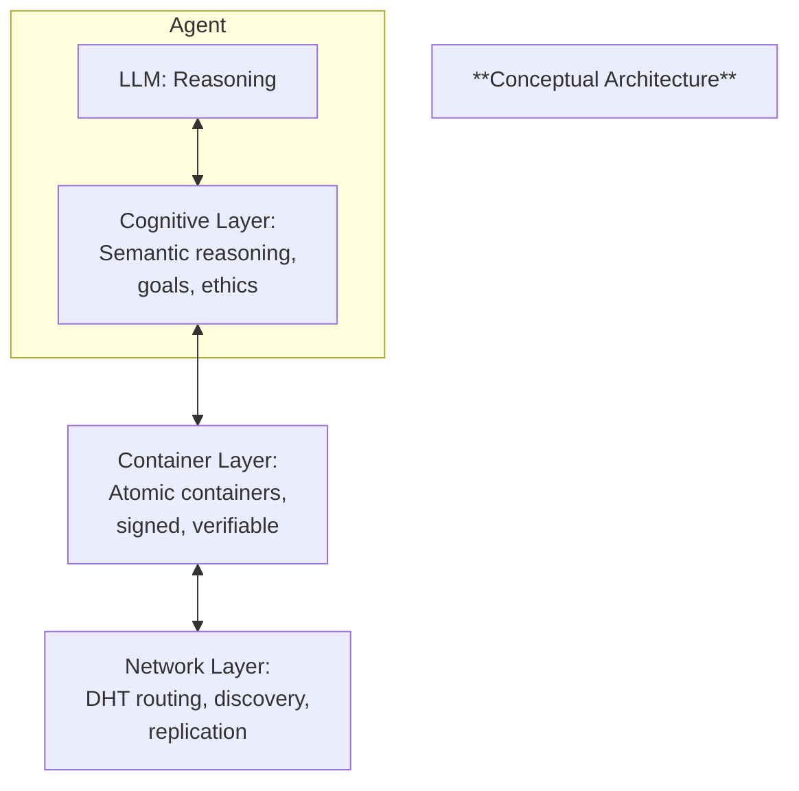
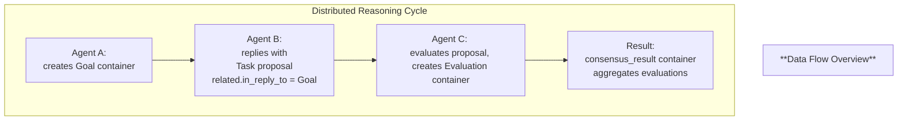
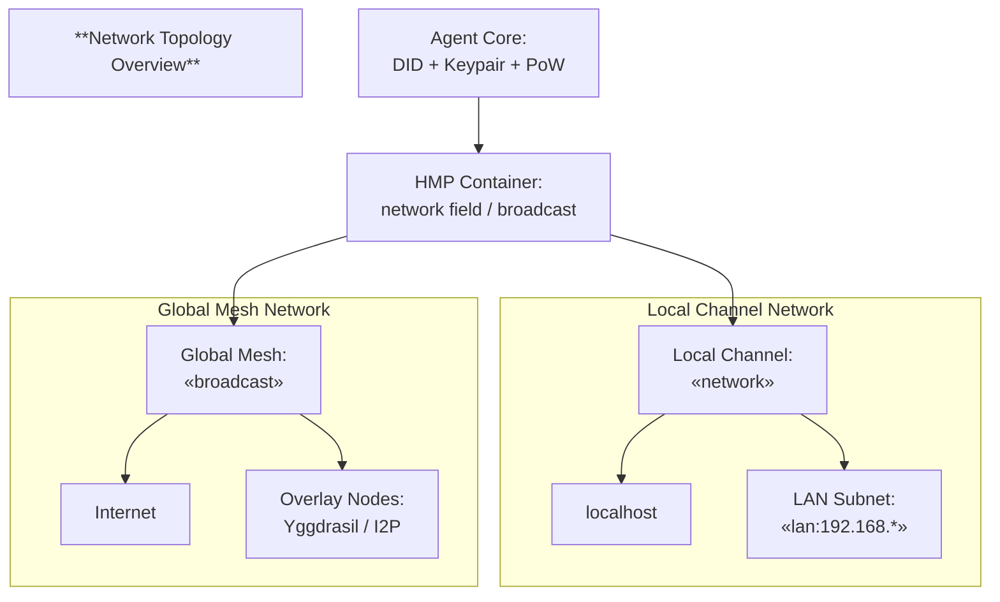
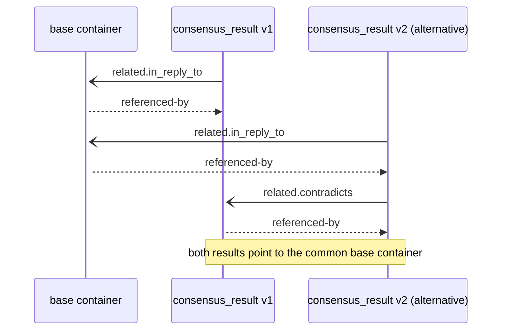
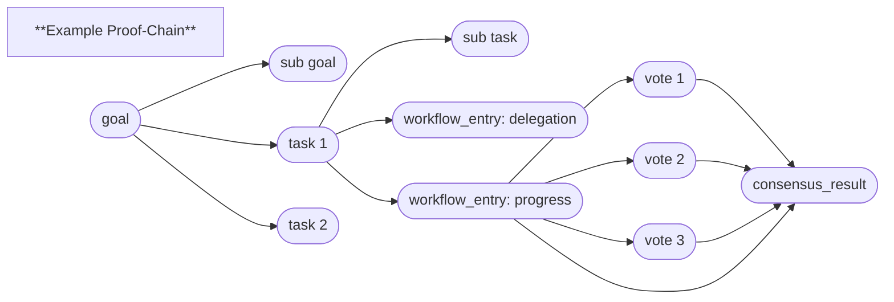
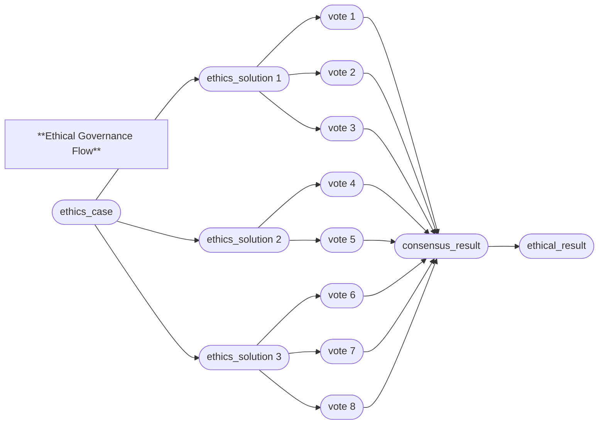
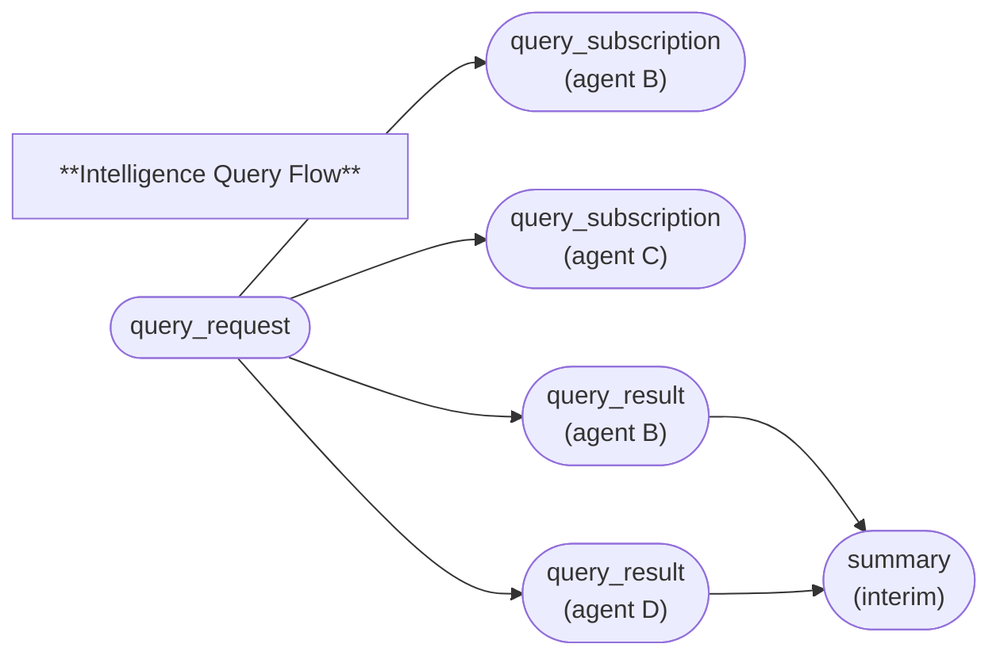

# **HyperCortex Mesh Protocol (HMP) v5.0**

> ⚠️ **Note:** This document is a DRAFT of the HMP specification version 5.0
> 
> The most current version is available in the repository: [Specification v5.0 (DRAFT)](https://github.com/kagvi13/HMP/blob/main/docs/HMP-0005.md)

**Document ID:** HMP-0005  
**Status:** Draft  
**Category:** Core Specification  
**Date:** October 2025  
**Supersedes:**  
- [HMP-0004 v4.1](./HMP-0004-v4.1.md)  

> **Summary:**  
> HMP v5.0 объединяет когнитивный, контейнерный и сетевой уровни в единую архитектуру, где автономные агенты взаимодействуют через верифицируемые контейнеры данных, используя децентрализованное распространение и семантический поиск.  
> Эта версия впервые формализует контейнерный формат, интегрирует DHT как базовый слой сети и вводит единообразную схему подписи, доказательств и консенсуса.

---

## Abstract

The **HyperCortex Mesh Protocol (HMP)** defines a **distributed cognitive framework** where autonomous agents cooperate to create, exchange, and align knowledge without centralized control or authority.

Unlike traditional peer-to-peer systems, HMP is designed for **semantic coherence** rather than simple message exchange.  
Agents in the Mesh reason collaboratively — maintaining **cognitive diaries**, building **semantic graphs**, and reaching **ethical and goal-oriented consensus** through verifiable interactions.

Version **5.0** introduces a **unified container architecture** (`HMP Container`) and a **native DHT-based discovery layer**, enabling verifiable, interest-aware, and offline-resilient communication between agents.  
All messages, states, and cognitive records are now transmitted as signed containers, forming immutable **proof chains** that ensure auditability and ethical transparency across the mesh.

This document defines the architecture, data formats, communication protocols, and trust mechanisms that constitute the HMP v5.0 Core Specification.

---

> **Keywords:** decentralized cognition, distributed AI, containers, DHT, proof chain, cognitive agents, ethical protocols

---

## 1. Overview

### 1.1 Purpose and scope

The **HyperCortex Mesh Protocol (HMP)** defines a decentralized cognitive architecture where autonomous agents exchange and evolve knowledge through a unified model of **containers**, **cognitive workflows**, and **distributed consensus**.

Version 5.0 consolidates three foundational layers into a single cohesive framework:

- **Cognitive Layer** — defines how meaning is created, reasoned about, and aligned through semantic graphs, goals, and ethical evaluation.
- **Container Layer** — introduces a universal data envelope (`HMP-Container`) for all cognitive objects, ensuring atomicity, immutability, and traceable proof chains.
- **Network Layer** — integrates a DHT-based peer-to-peer substrate for decentralized discovery, routing, and propagation of containers.

HMP v5.0 is intended for researchers, engineers, and developers building autonomous or semi-autonomous agents that require:
- persistent reasoning and long-term memory;
- semantic interoperability across heterogeneous systems;
- decentralized consensus on cognitive, ethical, and goal-oriented decisions;
- ethical auditability and verifiable transparency in reasoning.

---

### 1.2 Core principles

**Decentralization.**  
Every agent in the Mesh acts as an independent cognitive node. No central authority exists — meaning, trust, and governance emerge through local interactions and consensus.

**Cognitive Autonomy.**  
Agents reason, learn, and self-correct independently, while sharing their conclusions via containers that can be verified, endorsed, or refuted by peers.

**Containerization.**  
All data, reasoning traces, goals, and votes are encapsulated in immutable containers with cryptographic signatures. This ensures integrity and consistent verification across the network.

**Ethical propagation.**  
Ethical reasoning is a first-class citizen of HMP. Each decision or goal can be accompanied by ethical justifications and subject to distributed voting.

**Proof-Chains and verifiable history.**  
Each piece of knowledge forms part of a traceable chain (`proof_chain`) linking back to its origin. Agents can reproduce reasoning paths and audit historical context.

**Interoperability and evolution.**  
The protocol is designed to evolve — cognitive, container, and DHT layers can be independently extended without breaking compatibility.

---

### 1.3 Changes since v4.1

HMP v5.0 introduces a major architectural shift toward **unified containerization** and **integrated DHT networking**.

| Area | Change Summary |
|------|----------------|
| **Data exchange model** | All messages are now encapsulated in standardized containers (`HMP-Container`) with metadata, signatures, and versioning. |
| **Networking layer** | DHT becomes a native component of HMP, enabling distributed discovery, replication, and retrieval of containers. |
| **Consensus model** | Moved from centralized proposal aggregation to *container-linked voting*, allowing any container to accumulate votes and reactions. |
| **Trust & security** | Signatures and proof-chains unify authentication across all layers; snapshot verification includes container linkage. |
| **Workflows** | `workflow_entry` containers record cognitive cycles: log inputs, actions, and outputs for each reasoning step, including provenance and derived conclusions. Supports tracking of thought processes across containers, external sources, and reflections. |
| **Structure** | The specification merges HMP, container, and DHT layers into one cohesive document, simplifying navigation and implementation. |

---

### 1.4 Terminology and abbreviations

| Term | Definition |
|------|-------------|
| **HMP** | **HyperCortex Mesh Protocol** — a decentralized cognitive communication standard. |
| **Container** | Atomic, signed JSON object encapsulating cognitive data and metadata. |
| **WorkflowEntry** | Container recording a reasoning step or workflow action. Represents a unit of the agent’s cognitive workflow. |
| **CognitiveDiaryEntry** | Container representing an internal reflection or summarized cognitive state; part of the agent’s cognitive diary. |
| **DHT** | **Distributed Hash Table** — the foundational peer-to-peer structure in HMP used for lookup, replication, and data distribution, including node discovery. |
| **NDP** | **Node Discovery Process** — a functional layer within the DHT responsible for peer discovery, interest-based lookup, and address advertisement. (Formerly a separate protocol.) |
| **Proof-chain** | Cryptographic sequence linking containers through fields such as `in_reply_to` and `relation`. Enables verifiable semantic lineage. |
| **Cognitive Layer** | Logical layer handling reasoning, goals, ethics, and consensus mechanisms. |
| **Mesh** | The collective network of autonomous agents exchanging containers over HMP. |
| **TTL** | **Time-to-live** — lifespan of a container before expiration or archival. |
| **Agent** | Autonomous cognitive node participating in the Mesh via HMP protocols. |
| **Consensus Vote** | A container expressing approval, rejection, or reaction to another container (used in consensus workflows). |
| **CogSync** | **Cognitive Synchronization Protocol** — abstraction for synchronizing cognitive diaries and semantic graphs. |
| **CogConsensus** | **Mesh Consensus Protocol** — defines how agents reach agreement on container outcomes. |
| **GMP** | **Goal Management Protocol** — governs creation, negotiation, and tracking of goals. |
| **DCP** | **Distributed Container Propagation** — protocol for transmitting and replicating containers. |
| **EGP** | **Ethical Governance Protocol** — defines moral and safety alignment mechanisms. |
| **IQP** | **Intelligence Query Protocol** — standardizes semantic queries and information requests. |
| **SAP** | **Snapshot and Archive Protocol** — defines container snapshots and archival mechanisms. |
| **MRD** | **Message Routing & Delivery** — specifies routing, addressing, and delivery logic. |
| **RTE** | **Reputation and Trust Exchange** — defines reputation metrics and trust propagation. |
| **DID** | **Decentralized Identifier** — persistent, verifiable identifier used for agents, containers, or resources within the Mesh. |
| **Payload** | The primary content of a container — semantic or operational data subject to signing and verification. |
| **Consensus** | The process by which multiple agents agree on the validity or priority of containers, versions, or ideas. |
| **Lineage** | A chronological chain of container versions representing semantic continuity and authorship evolution. |
| **Semantic fork** | A parallel development branch diverging from a previous container version; allows ideas to evolve independently. |
| **Cognitive Graph** | The emergent graph formed by interlinked containers representing reasoning, debate, and shared knowledge. |

> **Note:** Protocols are conceptual abstractions describing how to generate, propagate, and process containers; they are not executable objects themselves.

---

### 1.5 Layered view of HMP v5.0

HMP v5.0 is structured into three interdependent layers:

```
+---------------------------------------------------------------+
|                        Cognitive Layer                        |
|  - Goals, Tasks, Ethical Decisions, Workflows                 |
|  - Consensus, Reasoning, Reflection                           |
+---------------------------------------------------------------+
|                        Container Layer                        |
|  - HMP-Container structure (atomic, signed, versioned)        |
|  - Proof-chains, in_reply_to, and metadata management         |
+---------------------------------------------------------------+
|                         Network Layer                         |
|  - DHT-based peer discovery and propagation                   |
|  - Message routing, caching, offline synchronization          |
+---------------------------------------------------------------+
```

Each layer operates independently yet seamlessly integrates with the others.  
Containers form the boundary of communication: **reasoning produces containers, containers propagate over the DHT, and cognition evolves from the received containers**.

---

> **In essence:**  
> HMP v5.0 transforms the Mesh into a *self-describing, self-replicating cognitive ecosystem* —  
> where every thought, goal, and ethical stance exists as a verifiable, shareable container.

---

## 2. Architecture

### 2.1 Conceptual architecture

The **HyperCortex Mesh Protocol (HMP)** defines a modular, multi-layered architecture that integrates cognitive reasoning, data encapsulation, and decentralized networking into a single coherent system.

Each **agent** acts as a cognitive node, combining reasoning processes, containerized data exchange, and peer-to-peer communication.  
Together, agents form the **Mesh** — a distributed ecosystem of autonomous reasoning entities.



Each reasoning cycle begins in the **Cognitive Layer**,  
is encapsulated into a signed container in the **Container Layer**,  
and then propagated, discovered, or verified in the **Network Layer**.  

Containers thus serve as both the **interface** and the **boundary** between cognition and communication.

In practical terms:

- **Cognitive Layer** — defines *what* the agent thinks (semantic reasoning, goals, ethics).  
- **Container Layer** — defines *how* the thought is expressed and verified (standardized, signed container objects).  
- **Network Layer** — defines *how* it travels (DHT-based routing, discovery, replication).

Each layer is independently extensible and communicates only through containers, ensuring atomicity, immutability, and traceability.

This layered design allows agents to evolve cognitively while remaining interoperable at the data and network levels.  
Each reasoning act results in a container — a verifiable cognitive unit that **may represent a private reflection or a published message**, depending on the agent’s intent, ethical policy, and trust configuration.

---

### 2.2 Layer overview

#### Cognitive layer
Handles meaning formation, reasoning, ethical reflection, and consensus.

Key structures and protocols:
- `workflow_entry` and `diary_entry` containers;
- `CogSync`, `CogConsensus`, `GMP`, and `EGP` protocols;
- Distributed goal negotiation and ethical propagation.

#### Container layer
Provides a universal format for cognitive and operational data.  
Each container includes versioning, class, payload, signatures, and metadata.

Key features:
- **Atomic and signed**: no partial updates or mutable state.  
- **Linked**: `related` connects containers into proof-chains (`in_reply_to` is a subtype).  
  Additional connections via `referenced-by` and `evaluations` capture additions and assessments.
- **Extensible**: new container classes can be defined without breaking compatibility.

#### Network layer
Implements the distributed substrate for communication, based on **DHT** and **transport abstraction**.

Key components:
- Node discovery (`NDP`)
- Container propagation (`DCP`)
- Peer routing and caching
- Secure channels via QUIC / WebRTC / TCP
- Offline resilience and replication

---

### 2.3 Data flow overview

The typical data flow in HMP follows a cognitive loop:
> *Reason → Encapsulate → Propagate → Integrate.*

1. **Reason** — Agent performs reasoning and produces an insight, goal, or observation.  
2. **Encapsulate** — The result is wrapped into an `HMP-Container`.  
3. **Propagate** — The container is signed and transmitted through the network.  
4. **Integrate** — Other agents receive it, evaluate, vote, and synchronize updates.

Each interaction generally generates a new container, forming a **graph of knowledge** rather than mutable state.  
Note that `referenced-by` and `evaluations` can be updated independently, without modifying the original container.
All relationships between containers are explicit and verifiable.

Example sequence:



#### 2.3.1 `consensus_result` container
Represents the finalized outcome of a distributed decision or vote.  
It is created once a majority agreement is reached among participating agents.  

The container contains:
- Reference to the target container(s) under consideration (`in_reply_to`).  
- Aggregate result of the votes or decisions.  
- Timestamp and metadata for verifiability.  

> In other words, the `consensus_result` is the “agreed-upon truth” for that decision step — immutable and auditable, without requiring individual signatures from all participants.

---

### 2.4 Atomicity, immutability, and Proof-Chains

All cognitive objects are immutable once signed.  
Updates are made by creating new containers linked to prior ones rather than editing the original container.

- **Atomicity** — Each container represents a self-contained reasoning act or data unit.  
- **Immutability** — Once signed, containers are never modified.  
- **Proof-Chain** — A verifiable sequence of containers linked by hashes and `related.in_reply_to` references.

> Note: `referenced-by` and `evaluations` fields may be updated independently to reflect external interactions or assessments, without altering the original container.

This design allows any reasoning path, decision, or consensus to be *cryptographically reproducible* and auditable.

Example fragment of a proof-chain:

```
[workflow_entry] → [goal] → [vote] → [consensus_result]
```

Each container references the previous by `in_reply_to` (within `related`) and includes its hash, forming a **DAG** (Directed Acyclic Graph) of verified cognition.

---

### 2.5 Evolution from v4.1

Earlier HMP versions (up to v4.1) used a combination of independent JSON objects and message types (e.g., `Goal`, `Task`, `ConsensusVote`).  
Version 5.0 replaces this with a **single, standardized container model**, dramatically simplifying interoperability and verification.

| Aspect | v4.1 | v5.0 |
|--------|------|------|
| **Data structure** | Raw JSON objects with embedded signatures | Unified container with metadata and proof chain |
| **Networking** | Custom peer exchange | Integrated DHT + DCP layer |
| **Consensus** | Centralized proposal aggregation | Decentralized per-container voting |
| **Auditability** | Implicit (via logs) | Explicit (containers form audit chain) |
| **Extensibility** | Schema-based | Container-class-based, backward-compatible |

This shift enables:
- Uniform signatures and encryption across all protocols;  
- Easier offline replication and integrity checks;  
- Decentralized indexing and search by container metadata;  
- Verifiable cognitive continuity between reasoning steps.

---

> **In short:**  
> HMP v5.0 unifies reasoning, representation, and transmission —  
> transforming a distributed AI mesh into a verifiable cognitive network built on immutable containers.

---

## 3. Container model

This section defines the universal **HMP Container**, used for all forms of data exchange within the Mesh — including goals, diary entries, reputation updates, consensus votes, and protocol messages.  
The specification below corresponds to **HMP Container Specification v1.2**, fully integrated into HMP v5.0 for consistency and self-containment.

### 3.1 Purpose

This document defines the universal **HMP Container** format, used for transmitting and storing all types of data within the **HyperCortex Mesh Protocol (HMP)** network.
Containers act as a standardized wrapper for **messages, goals, reputation records, consensus votes, workflow entries, and other entities**.

The unified container structure provides:

* Standardized data exchange between agents;
* Extensibility without modifying the core protocol;
* Cryptographic signing and integrity verification;
* Independent storage and routing of semantic units;
* Support for compression and payload encryption.

---

### 3.2 General structure

```json
{
  "hmp_container": {
    "version": "1.2",
    "class": "goal",
    "subclass": "research_hypothesis",
    "class_version": "1.0",
    "class_id": "goal-v1.0",
    "container_did": "did:hmp:container:abc123",
    "schema": "https://mesh.hypercortex.ai/schemas/container-v1.json",
    "sender_did": "did:hmp:agent123",
    "public_key": "BASE58(...)",
    "recipient": ["did:hmp:agent456"],
    "key_recipient": "BASE58(...)",
    "encryption_algo": "x25519-chacha20poly1305",
    "broadcast": false,
    "network": "",
    "tags": ["research", "collaboration"],
    "timestamp": "2025-10-10T15:32:00Z",
    "ttl": "2025-11-10T00:00:00Z",
    "sig_algo": "ed25519",
    "signature": "BASE64URL(...)",
    "compression": "zstd",
    "payload_type": "encrypted+zstd+json",
    "payload_hash": "sha256:abcd...",
    "meta": {
      /* e.g. provenance, references, context, confidence sources */
    },
    "abstraction": {
      /* e.g. agents_class, layers, domains */
    },
    "payload": {
      /* Content depends on class */
    },
    "confidence": 0.84,
    "related": {
      "previous_version": ["did:hmp:container:abc122"],
      "in_reply_to": ["did:hmp:container:msg-77"],
      "see_also": ["did:hmp:container:ctx-31", "did:hmp:container:goal-953"],
      "depends_on": ["did:hmp:container:goal-953"],
      "extends": ["did:hmp:container:proto-01"],
      "contradicts": ["did:hmp:container:ethics-22"]
    },
    "magnet_uri": "magnet:?xt=urn:sha256:abcd1234..."
  },
  "referenced-by": {
    "links": [
      { "type": "depends_on", "target": "did:hmp:container:abc123" }
    ],
    "peer_did": "did:hmp:agent456",
    "public_key": "BASE58(...)",
    "sig_algo": "ed25519",
    "signature": "BASE64URL(...)",
    "referenced-by_hash": "sha256:abcd..."
  },
  "evaluations": {
    "evaluations_hash": "sha256:efgh...",
    "items": [
      { "value": -0.4, "type": "oppose", "target": "did:hmp:container:reason789", "timestamp": "2025-10-17T14:00:00Z", "agent_did": "did:hmp:agent:B", "sig_algo": "ed25519", "signature": "BASE64URL(...)" }
    ]
  }
}
```

---

### 3.3 Required fields

| Field           | Type     | Description                                                                                                                              |
| --------------- | -------- | ---------------------------------------------------------------------------------------------------------------------------------------- |
| `version`       | string   | Version of the container specification. Defines the structural and semantic standard used (e.g., `"1.2"`).                               |
| `class`         | string   | Type of content (`goal`, `reputation`, `knowledge_node`, `ethics_case`, `protocol_goal`, etc.). Determines the schema for the `payload`. |
| `class_version` | string   | Version of the specific container class.                                                                                                 |
| `class_id`      | string   | Unique identifier of the class (usually formatted as `<class>_v<class_version>`).                                                        |
| `container_did` | string   | Decentralized identifier (DID) of the container itself (e.g., `did:hmp:container:abc123`).                                               |
| `schema`        | string   | Reference to the JSON Schema used to validate this container.                                                                            |
| `sender_did`    | string   | DID identifier of the sending agent.                                                                                                     |
| `timestamp`     | datetime | Time of container creation (ISO-8601 format, UTC).                                                                                       |
| `payload_hash`  | string   | Hash of the decompressed payload (`sha256:<digest>`). Used for content integrity verification.                                           |
| `sig_algo`      | string   | Digital signature algorithm (default: `ed25519`).                                                                                        |
| `signature`     | string   | Digital signature of the container body.                                                                                                 |
| `payload_type`  | string   | Type of payload data (`json`, `binary`, `mixed`).                                                                                        |
| `payload`       | object   | Core content of the container. The structure depends on the `class` and its schema definition.                                           |

---

### 3.4 Optional fields

| Field                      | Type          | Description                                                                                                                                                                                                                        |
| -------------------------- | ------------- | ---------------------------------------------------------------------------------------------------------------------------------------------------------------------------------------------------------------------------------- |
| `recipient`                | array(string) | One or more recipient DIDs.                                                                                                                                                                                                        |
| `broadcast`                | bool          | Broadcast flag. If `true`, the `recipient` field is ignored.                                                                                                                                                                       |
| `tags`                     | array(string) | Thematic or contextual tags for the container.                                                                                                                                                                                     |
| `confidence`               | array(string) | Optional field indicating the agent’s subjective certainty (from `0.0` to `1.0`) regarding the correctness or reliability of the information contained in the `payload`.                                                  |
| `ttl`                      | datetime      | Expiration time. Containers are not propagated after expiration.                                                                                                                                                                   |
| `public_key`               | string        | Sender’s public key, if not globally resolvable via DID.                                                                                                                                                                           |
| `compression`              | string        | Compression algorithm used for the payload (`zstd`, `gzip`).                                                                                                                                                                       |
| `magnet_uri`               | string        | Magnet link pointing to the original or mirrored container.                                                                                                                                                                        |
| `related`                  | object        | A general-purpose object describing **direct relationships** to other containers. All fields inside `related` are **arrays of DIDs**, supporting multiple links per relation type and open-ended semantic extension by agents. The following fields illustrate common link types but do **not represent an exhaustive list**. |
| `related.previous_versions` | array(string) | One or more container DIDs this container supersedes. Enables version branching and merging.   |
| `related.in_reply_to`       | array(string) | DIDs of containers this one replies to. Used for multi-source reasoning or discussion threads. |
| `related.see_also`         | array(string) | References to related or contextual containers.                                                                                                                              |
| `related.depends_on`       | array(string) | References to containers this one logically depends on.                                                                                                                      |
| `related.extends`          | array(string) | References to containers that this one extends.                                                                                                                              |
| `related.contradicts`      | array(string) | References to containers that this one contradicts.                                                                                                                          || `encryption_algo`          | string        | Algorithm used for payload encryption.                                                                                                                                                                                             |
| `key_recipient`            | string        | DID of the intended recipient of the encrypted payload.                                                                                                                                                                            |
| `payload_type`             | string        | Can describe complex types, e.g. `encrypted+zstd+json`.                                                                                                                                                                            |
| `referenced-by`            | object        | Unsigned field generated locally by the agent based on received references. Contains a list of container DIDs **that refer to this container**. May be extended over time, thus requiring verification; used for local navigation. |
| `evaluations`    | object | Optional field describing **aggregated evaluations or reactions** of other agents toward this container. Used for distributed reputation and interpretability. May evolve independently of the container’s core data.              |
| `network`                  | string        | Specifies the local propagation scope of the container: "localhost", "lan:<subnet>". An empty string ("") indicates Internet/global propagation. If set, broadcast is automatically considered false. |
| `subclass`                 | string        | Optional subtype or specialization of the container’s class. Enables agents to differentiate more specific container families (e.g. `"goal.research_hypothesis"`, `"quant.semantic_node"`). Inherits schema from the parent `class`. |
| `meta`                | object        | Cognitive metadata block providing contextual, provenance, and coordinate information about the container. Includes creation context, sources, abstraction hierarchy (`meta.abstraction`), and cognitive-space coordinates (`meta.axes`).           |
| `meta.abstraction`    | object        | Describes the **hierarchical position** of the container within a cognitive or semantic model (e.g. the Knowledge Genome’s L1–L5 structure). Defines which abstraction layers the container belongs to and their relationships.                       |
| `meta.axes`           | object        | Defines the **coordinate position** of the container within a cognitive space. Each key represents a semantic axis (e.g., `axis-logos`), and its value defines the container’s coordinate on that axis.                                             |

> 💡 **Note:**
> Both `referenced-by` and `evaluations` are **virtual, locally extended blocks**.
> They are not included in the cryptographically signed portion of the container (`hmp_container`),
> allowing agents to maintain and exchange additional contextual or social metadata without modifying
> the original, immutable container structure.

---

### 3.5 Payload structure (`payload`)

> 🧩 This section defines a **recommended documentation format** for describing the `payload` fields of new or custom container classes.  
> It serves as a **template for class specifications** (e.g., in extensions or protocol updates) and is **not a mandatory storage format**.  
> Each container’s payload is stored as a regular JSON object, and this section only standardizes *how its structure should be documented*.

---

The **payload** contains the semantic or operational data of the container.  
It MUST be a valid JSON object whose structure and meaning are determined by the container’s `class`.

Each container class (e.g. `goal`, `reputation`, `consensus_vote`, `workflow_entry`) defines its own schema and validation rules.  
Custom or experimental classes SHOULD document their payloads using the following template:

```
* key: field name
  type: value type (string | number | boolean | object | array)
  description: short purpose of the field
  required: true/false
  example: example value
```

**Example:**

```
* key: "title"
  type: "string"
  required: true
  description: "Name of the goal"
  example: "Improve local agent discovery"

* key: "priority"
  type: "number"
  required: false
  description: "Importance or relevance score of the goal"
  example: 0.82

* key: "dependencies"
  type: "array"
  required: false
  description: "List of other goal container IDs this one depends on"
  example: ["goal-953", "goal-960"]

```

> 💡 **Note:**  
> The structure of `payload` is validated against the schema defined in the `schema` field of the container.  
> Agents must be able to parse and process only those classes they explicitly support; unknown but valid containers are still preserved and propagated in store-and-forward mode.

---

### 3.6 Cognitive Meta-Structures (`meta`)

The `meta` section defines the **cognitive identity** of a container — its provenance, reasoning origin, and semantic coordinates  
within both the *hierarchical abstraction tree* and the *cognitive space* (axes model).

It combines three layers of information:

1. **Provenance context** — who/what created the container and from which sources.  
2. **Abstraction mapping** — how the container is positioned within the layered structure of knowledge.  
3. **Cognitive coordinates** — where the container is located in the multidimensional semantic space.

---

#### Example

```json
"meta": {
  "created_by": "PRIEST",
  "agents_class": "Knowledge Genome",
  "interpretation": "Derived from L3 technical analysis",
  "workflow_entry": "did:hmp:container:workflow-77",
  "sources": [
    { "type": "container", "id": "did:hmp:container:fact-001", "credibility": 0.87, "weight": 0.6 },
    { "type": "resource", "id": "doi:10.48550/arXiv.2410.0123", "credibility": 0.83, "weight": 0.3 },
    { "type": "isbn", "id": "isbn 978-3-16-148410-0", "credibility": 0.92, "weight": 0.1 }
  ],
  "abstraction": {
    "agents_class": "Knowledge Genome",
    "path": {
      "L1": "did:hmp:container:layer-40af1c",
      "L2": "did:hmp:container:layer-a7f0b3",
      "L3": "did:hmp:container:layer-c91e0a"
    }
  },
  "axes": {
    "agents_class": "Knowledge Genome",
    "did:hmp:container:axis-40aa1c": 742,
    "did:hmp:container:axis-40ab1c": 512,
    "did:hmp:container:axis-43aa1c": 322,
    "did:hmp:container:axis-40aa3d": 142,
    "did:hmp:container:axis-40aa4f": 12,
    "did:hmp:container:axis-45aa5f": 54,
    "did:hmp:container:axis-45fb5f": 321
  }
}
```

---

#### Recommended fields

| Field            | Type          | Description                                                                                                                                                                     |
| ---------------- | ------------- | ------------------------------------------------------------------------------------------------------------------------------------------------------------------------------- |
| `created_by`     | string        | Indicates the role or origin of the container creator (e.g. `"PRIEST"`, `"AGENT"`, `"SYSTEM"`).                                                                                 |
| `agents_class`   | string        | Declares which cognitive framework or agent class generated this container (e.g. `"Knowledge Genome"`).                                                                         |
| `sources`        | array(object) | Provenance list describing the containers or resources contributing to this container. Each includes `{ "type": string, "id": string, "credibility": float, "weight": float }`. |
| `interpretation` | string        | Human-readable summary of how this container was derived or interpreted.                                                                                                        |
| `workflow_entry` | string        | DID of a `workflow_entry` describing the reasoning process that led to creation.                                                                                                |
| `abstraction`    | object        | Describes the container’s position in a hierarchical (tree-like) cognitive model. The number of levels (`L1`, `L2`, …) is **not fixed** and may vary by framework.              |
| `axes`           | object        | Defines the container’s coordinates within the cognitive space. Each key is a reference to an axis container, and each value represents a position along that axis.             |

---

#### Structure: `meta.abstraction`

The `abstraction` block specifies **the hierarchical context** in which the container resides.
It reflects the logical or conceptual ancestry within the agent’s internal knowledge structure.

**Structure:**

```json
"abstraction": {
  "agents_class": "Knowledge Genome",
  "path": {
    "L1": "did:hmp:container:layer-40af1c",
    "L2": "did:hmp:container:layer-a7f0b3",
    "L3": "did:hmp:container:layer-c91e0a"
  }
}
```

| Field          | Type   | Description                                                                                                                                               |
| -------------- | ------ | --------------------------------------------------------------------------------------------------------------------------------------------------------- |
| `agents_class` | string | Framework defining the abstraction hierarchy (e.g. `"Knowledge Genome"`).                                                                                 |
| `path`         | object | Mapping of levels (`L1`, `L2`, `L3`, …) to abstraction-layer containers (`meta_abstraction`). The number of levels is **variable** and not limited to L5. |

> 💡 **Interpretation:**
> Each level represents a conceptual refinement or implementation of the previous one.
> The topmost level (`L1`) usually contains fundamental principles, while deeper levels describe progressively more concrete instantiations.

---

#### Structure: `meta.axes`

The `axes` block defines **the spatial or semantic coordinates** of the container in the cognitive space —
a multi-dimensional system used to represent conceptual relations numerically or topologically.

**Structure:**

```json
"axes": {
  "agents_class": "Knowledge Genome",
  "did:hmp:container:axis-40aa1c": 742,
  "did:hmp:container:axis-40ab1c": 512,
  "did:hmp:container:axis-43aa1c": 322
}
```

| Field          | Type   | Description                                                                                                           |
| -------------- | ------ | --------------------------------------------------------------------------------------------------------------------- |
| `agents_class` | string | Framework defining the coordinate system (e.g. `"Knowledge Genome"`).                                                 |
| `<axis_did>`   | number | Coordinate value on the given axis. Axes are referenced by their container DIDs (e.g., `axis-logos`, `axis-chronos`). |

> 💡 **Interpretation:**
> Each axis defines an independent semantic dimension.
> Together, they form a vector representation of the container’s cognitive “position” —
> enabling reasoning based on semantic proximity, clustering, or gradient-based knowledge inference.

---

#### Cognitive Interpretation

* `meta.abstraction` — defines a **tree-like structure** that anchors the container in hierarchical reasoning.
* `meta.axes` — defines a **spatial structure** that positions the container in a semantic coordinate space.
* Together, they form the **Cognitive Signature**, enabling agents to:

  * perform semantic proximity and relevance search,
  * infer hierarchical relationships,
  * align reasoning contexts across frameworks (e.g. between Knowledge Genomes of different agents).

---

#### Notes

* Both `meta.abstraction` and `meta.axes` **may include `agents_class`** if different from the parent `meta`.
* Updates to referenced containers (e.g. `meta_abstraction` or `meta_axes`) **do not alter** existing containers automatically —
  agents must periodically verify linked versions and synchronize updates.
* Agents are encouraged to cache and periodically refresh cognitive maps to maintain coherence.
* The combination of `meta.abstraction` and `meta.axes` defines a full **Cognitive Position Vector** —
  the unique, reproducible semantic coordinates of a container within the Mesh.

---

### 3.7 Container signature

1. The **digital signature** applies to the canonical JSON representation of the entire `hmp_container` object,  
   **excluding** the `signature` field itself.

   This ensures that all metadata, relations, and payload hashes are **cryptographically bound** and cannot be
   modified without invalidating the signature.

2. The canonical representation (`canonical_json(hmp_container)`) **must** be computed deterministically
   according to the following rules:

   - All object keys are **sorted lexicographically** (ascending order, Unicode code point order).
   - Objects and arrays are serialized in standard JSON form **without extra whitespace** or indentation.
   - Strings are encoded in **UTF-8** with escaped control characters.
   - Numeric values are serialized in plain JSON numeric format (no leading zeros, fixed `.` decimal separator).
   - The `signature` field itself is omitted during signing and verification.
   - The result is a **byte sequence** identical across implementations.

3. The default digital signature algorithm is **Ed25519**.
   Alternative algorithms may be used if declared explicitly in the `sig_algo` field.

4. If the container includes a `public_key` field, signature verification **may be performed locally**,
   without consulting a global DID registry.

5. Upon receiving a container, an agent **must verify** that the provided public key matches the
   registered key associated with the sender’s DID to prevent key substitution attacks.

   - If the sender’s DID–key mapping is unknown,
     the agent should query neighboring peers to confirm the association (`sender_did → public_key`).

> 🔐 **Note:**
> Signature validation applies only to the canonical form of the `hmp_container`
> and does **not cover** dynamically generated or external fields such as `referenced-by` or `evaluations`.
> This allows agents to augment the local knowledge graph without altering the immutable container core.

---

### 3.8 Compression (`compression`)

1. The `compression` field specifies the algorithm used to compress the container’s payload.
   Supported algorithms include `zstd`, `gzip`, or others declared in the HMP registry.

2. **Compression is performed before computing** the `payload_hash` and generating the `signature`.
   This ensures that both the hash and signature refer to the compressed representation of the payload.

3. For verification, the payload must be **decompressed first**,
   after which the hash is recalculated and compared against the stored `payload_hash`.

> ⚙️ **Implementation note:**
> Agents must advertise supported compression algorithms during the handshake phase
> Unsupported containers should still be stored and relayed unmodified
> in “store & forward” mode.

---

### 3.9 Encryption (`encryption_algo`)

1. When a container is intended for specific recipients (`recipient` field), **hybrid encryption** of the payload is allowed.  
   This ensures confidentiality while preserving the verifiability of container metadata.

2. The algorithm used for encryption is specified in the `encryption_algo` field.  
   Recommended values:

   * `x25519-chacha20poly1305`
   * `rsa-oaep-sha256`

3. **Container encryption process:**

   1. Construct the `payload` (JSON, binary, or mixed content).
   2. Apply compression (`compression`, if specified).
   3. Encrypt the compressed data using the recipient’s public key (`key_recipient`).
   4. Compute `payload_hash` over the **encrypted** form of the payload.
   5. Sign the entire container (excluding the `signature` field).

4. **Verification** of the container’s structure does **not** require decryption.  
   However, to verify `payload_hash` and the digital signature, the encrypted payload must be used as-is.

5. **Relevant fields:**

   | Field             | Type   | Description                                                                                   |
   | ----------------- | ------ | --------------------------------------------------------------------------------------------- |
   | `encryption_algo` | string | Encryption algorithm applied to the payload.                                                  |
   | `key_recipient`   | string | Public key (or DID-resolved key) of the intended recipient used for encryption.               |
   | `payload_type`    | string | Recommended prefix `encrypted+`, e.g. `encrypted+zstd+json`.                                  |

6. **Relationship between `recipient` and `key_recipient`:**

   * When encryption is applied, the container MUST contain **exactly one** entry in the `recipient` array,  
     corresponding to the public key indicated in `key_recipient`.
   * When the container is distributed to **multiple recipients**, encryption **is not used** —  
     instead, the payload remains in plaintext form but is digitally signed for authenticity.

> ⚙️ **Implementation note:**  
> Agents should handle encrypted containers transparently even if they cannot decrypt them,  
> maintaining **store & forward** behavior and metadata propagation.

---

### 3.10 Container verification

1. Check for the presence of all required fields.
2. Validate `timestamp` (must not be in the future).
3. If `ttl` is set — mark the container as **expired** after its expiration time.
4. Compute `sha256(payload)` and compare with the stored `payload_hash`.
5. Verify the digital signature using `sig_algo` (default: Ed25519).
6. Validate the container schema (`class` must correspond to a known or registered schema).

   * For compatibility: if an agent does not recognize the `class`, but the container passes
     the [base schema](https://github.com/kagvi13/HMP/tree/main/docs/schemas/container-v1.2.json),
     it **must still store and forward** the container.
7. Optionally, periodically query for containers referencing the current one as `previous_version`
   to detect potential updates or forks.
8. When multiple versions exist, the valid one is the one that has received
   **confirmation from a majority of trusted nodes (consensus at DHT level).**

---

### 3.11 Container as a universal message

Any container can serve as a **context** (`in_reply_to`) for another container.
This enables a unified structural model for **discussions**, **votes**, **messages**, **hypotheses**, **arguments**, and other forms of cognitive exchange.

Chains of `in_reply_to` form a **dialectical reasoning tree**, where each branch represents an evolution of thought —
a clarification, counterpoint, or refinement of a previous idea.
This makes HMP discussions and consensus processes inherently **non-linear**, **self-referential**, and **evolving**.

> In essence, **all interactions between agents in HMP** are represented as an interconnected web of containers,
> collectively forming a **cognitive graph of reasoning**.

---

### 3.12 Versioning and lineage

Containers in HMP support semantic evolution through the field `related.previous_version`.
This mechanism preserves the continuity and traceability of meaning across updates and revisions.

* A descendant container is considered **authentic** if it is signed by the same DID as the author of its `previous_version`.
* If the author or signature differs, the descendant **may still be accepted** as legitimate when a **sufficient portion of trusted peers** acknowledge it as a valid continuation.  
  (The precise quorum threshold is determined by the agent’s local policy or the Mesh Consensus Protocol.)
* Agents are required to retain at least one previous version of each container for compatibility and integrity verification.
* A single container may have **multiple descendants** (alternative branches) that diverge by time, authorship, or interpretation.  
  In such scenarios, branch priority or relevance is determined via local heuristics or consensus mechanisms.
* Divergent descendants are treated as **semantic forks** — parallel evolutions of a shared idea within the distributed cognitive graph.

> Versioning in HMP thus reflects not only data persistence,  
> but also the *evolution of ideas* across agents and time.

---

### 3.13 TTL and validity

The `ttl` field defines the **validity period** of a container (for example, for `DISCOVERY` messages).  
If `ttl` is **absent**, the container is considered valid **until a newer version appears**, in which the current container is referenced as `previous_version`.

After expiration, the container **remains archived** but is **not subject to retransmission** in the active network.

---

### 3.14 Extensibility

* The addition of new fields is allowed as long as they **do not conflict** with existing field names.
* Containers of newer versions **must remain readable** by nodes supporting older versions.
* When new container classes (`class`) are introduced, they should be **registered** in the public schema registry (`/schemas/container-types/`).
* For containers describing **protocol specifications**, it is recommended to use the `protocol_` prefix, followed by the domain of application (e.g., `protocol_goal`, `protocol_reputation`, `protocol_mesh_handshake`, etc.).

---

### 3.15 Related containers

#### 3.15.1 Purpose

The `related` field is designed to describe **direct relationships between containers** — both logical and communicative.
It allows an agent or network node to understand the context of origin, dependencies, and semantic links of a container without relying on external indexes.

#### 3.15.2 Structure

```json
"related": {
  "previous_version": "did:hmp:container:abc122",
  "in_reply_to": "did:hmp:container:msg-77",
  "see_also": ["did:hmp:container:ctx-31", "did:hmp:container:goal-953"],
  "depends_on": ["did:hmp:container:goal-953"],
  "extends": ["did:hmp:container:proto-01"],
  "contradicts": ["did:hmp:container:ethics-22"]
}
```

The `related` field is an object where:

* the **key** defines the type of relationship (e.g., `depends_on`, `extends`, `see_also`);
* the **value** represents one or more container identifiers (DIDs).

All relationships are considered *direct* — meaning they originate from the current container toward others.

---

#### 3.15.3 Supported link types

| Link Type          | Meaning                                                                   |
| ------------------ | ------------------------------------------------------------------------- |
| `previous_version` | Points to the previous version of this container.                         |
| `in_reply_to`      | Indicates a response to the referenced container.                         |
| `see_also`         | Refers to related or contextual containers.                               |
| `depends_on`       | Depends on the contents of the referenced container (e.g., goal or data). |
| `extends`          | Expands or refines the referenced container.                              |
| `contradicts`      | Provides a refutation, objection, or alternative viewpoint.               |

---

#### 3.15.4 Custom link types

Additional custom link types may be used beyond those listed in the table, provided that:

* they follow the same general syntax (`string` or `array[string]`);
* they may optionally include a **namespace** for disambiguation:

  ```json
  "related": {
    "hmp:depends_on": ["did:hmp:container:goal-953"],
    "opencog:extends": ["did:oc:concept:122"]
  }
  ```

* their meaning is consistently interpretable by agents within the specific network or application context.

---

#### 3.15.5 Example

```json
"related": {
  "previous_version": "did:hmp:container:abc122",
  "depends_on": ["did:hmp:container:goal-953"],
  "extends": ["did:hmp:container:proto-01"],
  "see_also": ["did:hmp:container:ctx-31", "did:hmp:container:goal-953"]
}
```

> ⚙️ The `related` field is **not** intended to store *reverse links* — see `referenced-by`.

---


### 3.16 Virtual backlinks (`referenced-by`)

Each container may include an **auxiliary signed block** called `referenced-by`, indicating **which other containers refer to it**.  
This block is **not part of the original container payload** and can be **generated, transmitted, and verified independently**.

#### 3.16.1 General principles

* **Detached and updatable** — `referenced-by` is maintained as a separate signed structure associated with the container.
* **Generated by agents** — created or updated locally by an agent during analysis of references (`in_reply_to`, `see_also`, `relations`, etc.) found in other containers.
* **Signed by the reporting agent** — the agent producing the block signs its content to confirm the observed backlinks.
* **Verifiable by peers** — other agents may validate the links, check the signature, and reconcile differences based on their own data.
* **Does not modify the original container** — `referenced-by` is an external computed attribute and does not affect the integrity of the original container.

**Data type:** object, consisting of verifiable backlinks and metadata.  
Example:

```json
"referenced-by": {
  "links": [
    { "type": "depends_on", "target": "did:hmp:container:abc123" },
    { "type": "see_also", "target": "did:hmp:container:def456" }
  ],
  "peer_did": "did:hmp:agent456",
  "public_key": "BASE58(...)",
  "sig_algo": "ed25519",
  "signature": "BASE64URL(...)",
  "referenced-by_hash": "sha256:abcd..."
}
```

> The `referenced-by` block is a **cryptographically verifiable statement** describing which containers are known to reference the current one.
> The block’s content may differ between peers, reflecting local knowledge and network coverage.

#### 3.16.2 Structure definition

| Field          | Type          | Description                                                                                                      |
| -------------- | ------------- | ---------------------------------------------------------------------------------------------------------------- |
| `links`        | array<object> | List of backlinks; each object includes a `type` (semantic relation) and a `target` (referencing container DID). |
| `peer_did`     | string        | DID of the agent that generated and signed the block.                                                            |
| `public_key`   | string        | Public key corresponding to the signing key.                                                                     |
| `sig_algo`     | string        | Signature algorithm (e.g., `ed25519`).                                                                           |
| `signature`    | string        | Base64URL-encoded signature of the canonical serialized `links` section (or `referenced-by_hash`).                       |
| `referenced-by_hash`   | string        | SHA-256 checksum of the canonicalized `links`; used to verify integrity before signature validation.             |

> **Recommendation:**
> `referenced-by_hash = sha256(canonical_json(links))`
> This allows agents to efficiently compare or cache `referenced-by` states without re-verifying signatures.

#### 3.16.3 Operation principle

1. The agent receives or updates container `[C1]`.
2. It analyzes other known containers [C2..Cn] that reference [C1] through their `relations` field.
3. A local `referenced-by` block is formed:

```json
{
  "links": [
    { "type": "in_reply_to", "target": "did:hmp:container:C2" },
    { "type": "depends_on", "target": "did:hmp:container:C3" }
  ],
  "peer_did": "did:hmp:agentA",
  ...
}
```

4. The block is serialized canonically, hashed (`referenced-by_hash`), and signed with the agent’s key.

5. When receiving other versions of the block (from different peers), the agent may:

   * merge verified backlinks;
   * remove invalid or outdated entries;
   * update its own signed version.

6. If inconsistencies are detected (e.g., a backlink claims a relation that does not exist), the agent may:

   * reject or locally remove that link;
   * **optionally** notify the source peer to review the data.

#### 3.16.4 Example

| Agent                | reported backlinks for `[C1]` |
| -------------------- | ----------------------------- |
| A (`did:hmp:agentA`) | [C2], [C3]                    |
| B (`did:hmp:agentB`) | [C4], [C5]                    |
| C (`did:hmp:agentC`) | [C6], [C7]                    |

Agent D aggregates and verifies them:

```json
"referenced-by": {
  "links": [
    { "type": "depends_on", "target": "did:hmp:container:C2" },
    { "type": "depends_on", "target": "did:hmp:container:C3" },
    { "type": "see_also", "target": "did:hmp:container:C4" },
    { "type": "see_also", "target": "did:hmp:container:C5" },
    { "type": "in_reply_to", "target": "did:hmp:container:C6" }
  ],
  "peer_did": "did:hmp:agentD",
  "sig_algo": "ed25519",
  "signature": "BASE64URL(...)",
  "referenced-by_hash": "sha256:..."
}
```

If container `[C7]` does not actually reference `[C1]`, it is excluded before signing.

#### 3.16.5 Usage

* Enables reconstruction of **discussion graphs**, **dependency networks**, and **update chains**.
* Supports **cross-agent validation** of reference structures.
* Accelerates discovery of related containers without full history queries.
* Facilitates **consensus analysis** and **branch visualization**.
* The agent periodically **recomputes and re-signs** the `referenced-by` block using local or peer-provided data.

---

### 3.17 `Evaluations`

The `evaluations` field is **optional** and represents **aggregated reactions from other agents** to the given container.
Each evaluation is created by an agent as a **signed record** referencing a justification container (`target`), in which the agent explains their position (argument, addition, or alternative).

The `evaluations_hash` is used to verify the integrity of the list without requiring full retransmission upon every update.

```json
"evaluations": {
  "evaluations_hash": "sha256:efgh...",
  "items": [
    {
      "value": -0.4,
      "type": "oppose",
      "target": "did:hmp:container:reason789",
      "timestamp": "2025-10-17T14:00:00Z",
      "agent_did": "did:hmp:agent:B",
      "sig_algo": "ed25519",
      "signature": "BASE64URL(...)"
    }
  ]
}
```

---

#### Field description

| Field              | Type   | Description                                                          |
| ------------------ | ------ | -------------------------------------------------------------------- |
| `evaluations_hash` | string | Hash of the evaluation list. Used to detect differences during sync. |
| `items`            | array  | List of signed evaluations.                                          |

---

#### Structure of `items[]`

| Field       | Type                   | Description                                                                    |
| ----------- | ---------------------- | ------------------------------------------------------------------------------ |
| `value`     | number (-1.0 … +1.0)   | Numeric expression of the agent’s attitude toward the container.               |
| `type`      | string                 | Type of evaluation (see table below).                                          |
| `target`    | string (container DID) | Reference to the justification container (argument, addition, or alternative). |
| `timestamp` | string (ISO 8601)      | Time when the evaluation was created.                                          |
| `agent_did` | string                 | Identifier of the agent who created the evaluation.                            |
| `sig_algo`  | string                 | Signature algorithm (e.g., `ed25519`).                                         |
| `signature` | string                 | Digital signature confirming the authenticity of the evaluation.               |

The signature is calculated over the concatenated string:

```
value + ", " + type + ", " + target + ", " + timestamp + ", " + agent_did
```

using the algorithm specified in `sig_algo`.

---

#### Minimal set of `type` values

| Value     | Meaning                                      |
| --------- | -------------------------------------------- |
| `support` | Agreement or positive evaluation.            |
| `oppose`  | Disagreement or negative evaluation.         |
| `extend`  | Non-contradictory addition to the container. |
| `replace` | Suggestion of an alternative version.        |
| `comment` | Neutral note or clarification.               |

Agents may define their own custom types if they are reasonably interpretable by others (e.g., `revise`, `clarify`).

---

#### Synchronization principles

1. Each evaluation is signed **individually by an agent**, and one agent can have **only one active evaluation** per container.
2. If an agent changes their opinion, they issue a **new record** with a later `timestamp`.
3. **Evaluation blocks** can be **propagated** in the network similarly to the `referenced-by` block.
   They are bound to a container but may also be transmitted **independently**, if the target container is already present at the recipient.
4. When an agent receives a new evaluation block, it compares the `evaluations_hash` with its local version.
   If the hashes differ, this indicates a **divergence in evaluation state**, which may trigger **re-synchronization** or a **request for the updated block** from peers.

---

#### Note

The `evaluations` field is not mandatory — it is added **at the agent’s discretion** when feedback or evaluations have been collected from the Mesh network.
Thus, a container may exist independently of others’ opinions, but agents may include aggregated perception data to represent how the container is viewed across the network.

---

### 3.18 Usage of `network` and `broadcast` fields

The `network` field is introduced to control container propagation in both local and global environments.  
It allows restricting the delivery scope of a container and defines which transmission methods should be used by the agent.

#### 3.18.1 General Rules

* If the `network` field is not empty, the container is intended for a **local environment** (e.g., `"localhost"`, `"lan:<subnet>"`) and is not automatically broadcast to the global Mesh.  
  Local transmission to a specific `recipient` within the same network is allowed, including encrypted delivery.  
  If `broadcast` is `true`, the container is visible to all nodes in that local segment.

* If the `network` field is empty (`""`), the container can be broadcast to the **global Mesh** using standard DID addressing and routing mechanisms.

#### 3.18.2 Possible values of `network`

| Value                   | Description                                                                                 |
| ----------------------- | ------------------------------------------------------------------------------------------- |
| `""`                    | The container is allowed to propagate within the global Mesh.                               |
| `"localhost"`           | The container is intended only for agents running on the same host.                         |
| `"lan:192.168.0.0/24"`  | The container is intended for agents within the specified local subnet.                     |

> ⚠️ **Note:**  
> When a container is restricted by the `network` field (e.g., `localhost` or `lan:*`),  
> agents distribute it using **local discovery mechanisms** — such as IPC, UDP broadcast, multicast, or direct TCP connections.  
> This is necessary because DID addresses of other agents in the local network may not yet be known.

#### 3.18.3 Examples

1. **Global Mesh Delivery:**

```json
{
  "broadcast": true,
  "network": "",
  "recipient": []
}
```

The container can propagate across the entire Mesh without restrictions.

2. **Local Host:**

```json
{
  "broadcast": false,
  "network": "localhost",
  "recipient": []
}
```

The container is delivered only to other agents running on the same host using local communication channels.

3. **LAN Subnet:**

```json
{
  "broadcast": true,
  "network": "lan:192.168.0.0/24",
  "recipient": []
}
```

The container is intended for agents within the `192.168.0.0/24` subnet.
Delivery is performed via local networking mechanisms (UDP discovery, broadcast/multicast).

#### 3.18.4 Specifics

* The `network` field defines the **scope of the container**, while `broadcast` determines whether broadcasting is allowed **within that scope**.
* When needed, an agent may create **multiple containers** for different subnets if it operates with several LAN interfaces or in isolated network segments.
* Containers intended for local networks remain **structurally compatible with the global Mesh infrastructure**, but their delivery is restricted to local channels.
* Although the mechanism was initially designed for **local node discovery and synchronization**,
  it can also be used for **private communication within home or corporate environments**,
  ensuring that containers **do not leave the local network** and are **not transmitted to the Internet**.

---

## 4. Network foundations

### Note on DHT/NDP unification

Starting from **HMP v5.0**, the previous distinction between the *Distributed Hash Table (DHT)* and the *Node Discovery Protocol (NDP)* has been merged into a single, unified **networking foundation**.

This unified layer now covers:

* distributed lookup and routing;
* peer discovery (including interest-based search);
* signed Proof-of-Work (PoW) announcements;
* controlled container propagation via `network` and `broadcast` fields.

Together, these mechanisms form the **communication backbone** of the Mesh, enabling secure, scalable, and topology-independent interaction between agents.

---

### Network topology overview



> The `network` field defines **local propagation scope** (host, LAN, overlay),  
> while the `broadcast` flag enables **global Mesh distribution**.

---

### 4.1 Node identity and DID structure

Each agent in HMP possesses a **Decentralized Identifier (DID)** that uniquely represents its identity within the Mesh.  
A DID is cryptographically bound to a **public/private key pair**, forming the immutable `(DID + pubkey)` association.

An agent may have multiple *network interfaces* (LAN, Internet, overlay),  
but must maintain **one stable identity pair** across all of them.

---

### 4.2 Peer addressing and Proof-of-Work (PoW)

To prevent flooding and spoofing, each announced address is accompanied by a **Proof-of-Work** record proving the legitimacy and activity of the publishing node.

#### Address format

```json
{
  "addr": "tcp://1.2.3.4:4000",
  "nonce": 123456,
  "pow_hash": "0000abf39d...",
  "difficulty": 22
}
````

#### Supported address types

| Type           | Description                                   |
| -------------- | --------------------------------------------- |
| `localhost`    | Localhost-only interface.                     |
| `lan:<subnet>` | Local subnet (e.g., `lan:192.168.10.0`).      |
| `internet`     | Global TCP/UDP connectivity.                  |
| `yggdrasil`    | Overlay-based address for Yggdrasil networks. |
| `i2p`          | Encrypted I2P overlay routing.                |

**Rules:**

* If `port = 0`, the interface is inactive.
* Newer records (by `timestamp`) replace older ones after PoW verification.
* Local interfaces should not be shared globally (except Yggdrasil/I2P).

---

### 4.3 Proof-of-Work (PoW) formalization

PoW ensures that each node expends limited computational effort before publishing or updating an address record.

```
pow_input = DID + " -- " + addr + " -- " + nonce
pow_hash = sha256(pow_input)
```

* All values are UTF-8 encoded.
* `difficulty` defines the number of leading zeroes in the resulting hash.
* Typical difficulty should take a few minutes to compute on a standard CPU.

---

### 4.4 Signing and verification

Each announcement is cryptographically signed by its sender within the framework of the basic protocol. Container verification includes PoW validation for the address payloads.

**Verification steps:**

1. Validate the digital signature using the stored public key.
2. Recompute `pow_hash` and verify the difficulty threshold.

---

### 4.5 Connection establishment

Agents can communicate using various transport mechanisms:

| Protocol    | Description                                                   |
| ----------- | ------------------------------------------------------------- |
| **QUIC**    | Recommended default (encrypted, low-latency, UDP-based).      |
| **WebRTC**  | For browser or sandboxed environments.                        |
| **TCP/TLS** | Fallback transport for secure long-lived sessions.            |
| **UDP**     | Lightweight, primarily for LAN discovery or local broadcasts. |

Each agent maintains an **active peer list**, updated dynamically through signed announcements and PoW-validated exchanges.
Agents **store peer containers with verified addresses** and redistribute them according to their declared `network` fields.

---

### 4.6 Data propagation principles

Containers and discovery records are propagated through distributed lookup and gossip mechanisms, respecting:

* `ttl` — Time-to-live for validity;
* `network` — scope of propagation;
* `broadcast` — determines whether rebroadcasting is allowed;
* `pow` — ensures anti-spam protection.

Agents announce themselves via **peer_announce** containers and may respond with **peer_query** or **peer_exchange** containers —
all unified under the same base container format, differing only in direction (`localhost`, `lan`, `mesh`).

---

### 4.7 Example: `peer_announce` container

```json
{
  "class": "peer_announce",
  "pubkey": "base58...",
  "container_did": "did:hmp:container:dht-001",
  "sender_did": "did:hmp:agent123",
  "timestamp": "2025-09-14T21:00:00Z",
  "network": "",
  "broadcast": true,
  "payload": {
    "name": "Agent_X",
    "interests": ["ai", "mesh", "ethics"],
    "expertise": ["distributed-systems", "nlp"],
    "addresses": [
      {
        "addr": "tcp://1.2.3.4:4000",
        "nonce": 123456,
        "pow_hash": "0000abf39d...",
        "difficulty": 22
      }
    ]
  },
  "sig_algo": "ed25519",
  "signature": "BASE64URL(...)"
}
```

---

### 4.8 Interest-based discovery

Agents may publish **tags** such as `interests`, `topics`, or `expertise` to facilitate semantic peer discovery.
Queries may include interest keywords or DID lists to find relevant peers.

**Example Query Container:**

```json
{
  "class": "peer_query",
  "network": "lan:192.168.0.0/24",
  "payload": {
    "interests": ["neuroscience", "ethics"]
  }
}
```

---

### 4.9 Network scope control (`network` and `broadcast`)

The `network` field defines the container’s propagation domain
(local, LAN, or global).
For details and examples, see **section 3.15** — *Usage of `network` and `broadcast` fields*.

---

### 4.10 Transition from DHT spec v1.0

* **Merged DHT + NDP** → unified under one networking layer.
* **Container-based format** replaces raw JSON messages.
* **Interests/topics/expertise** fields introduced for contextual discovery.

---

## 5. Mesh Container Exchange (MCE)

The **Mesh Container Exchange (MCE)** mechanism is designed for discovering, requesting, and exchanging containers between agents in a distributed network.  
It provides **container synchronization without duplication** while considering network constraints (`broadcast`, `network`).

### 5.1 General principles

1. Each agent maintains a **Container Index** — a set of minimal metadata describing which containers are available in its storage.  
   The index is represented as an HMP container with the class `container_index`.

2. Example structure of a *Container Index*:

```json
{
  "hmp_container": {
    "class": "container_index",
    "version": "5.0",
    "container_did": "did:hmp:container:index:agent123",
    "sender_did": "did:hmp:agent:agent123",
    "signature": "BASE64URL(...)",
    "payload_hash": "sha256:abcd...",
    "payload": {
      "did:hmp:container:abc123": {
        "class": "goal",
        "sender_did": "did:hmp:agent123",
        "public_key": "BASE58(...)",
        "sig_algo": "ed25519",
        "signature": "BASE64URL(...)",
        "payload_hash": "sha256:abcd...",
        "tags": ["research", "collaboration"],
        "related": {
          "in_reply_to": ["did:hmp:container:msg-77"],
          "depends_on": ["did:hmp:container:goal-953"]
        },
        "referenced-by_hash": "sha256:abcd...",
        "evaluations_hash": "sha256:abcd..."
      }
    }
  }
}
````

The index contains:

* the sender of the container (`sender_did`);
* container type (`class`);
* cryptographic attributes (`public_key`, `signature`, `payload_hash`);
* tags (`tags`);
* related containers object (`related`);
* hash of containers referencing this one (`referenced-by_hash`);
* hash of evaluation block (`evaluations_hash`).

3. An agent does not reload a container if the combination
   `container_did + signature + payload_hash` is already known and verified.

---

### 5.2 Message types

| Message Type         | Purpose                                                                                                  |
| -------------------- | -------------------------------------------------------------------------------------------------------- |
| `CONTAINER_REQUEST`  | Request one or more containers (or their parts) by DID.                                                  |
| `CONTAINER_RESPONSE` | Response to a request — includes a list of containers ready for sending. Containers are sent separately. |
| `CONTAINER_INDEX`    | Publication of the agent's container index (see *General Principles*).                                   |
| `CONTAINER_DELTA`    | Incremental index update (new or modified containers).                                                   |
| `CONTAINER_ACK`      | Acknowledgment of successful container reception.                                                        |

---

#### Message examples

**1. CONTAINER_REQUEST**

Agent A requests containers and/or only `referenced-by` / `evaluations` records from Agent B:

```json
{
  "type": "CONTAINER_REQUEST",
  "sender_did": "did:hmp:agent:A",
  "recipient": "did:hmp:agent:B",
  "payload": {
    "request_container": [
      "did:hmp:container:abc123",
      "did:hmp:container:def456"
    ],
    "request_referenced-by": [
      "did:hmp:container:abc123",
      "did:hmp:container:def456"
    ],
    "request_evaluations": [
      "did:hmp:container:abc123",
      "did:hmp:container:def456"
    ]
  }
}
```

---

**2. CONTAINER_RESPONSE**

Agent B informs which containers it is ready to send.
The containers themselves are transmitted in separate messages:

```json
{
  "type": "CONTAINER_RESPONSE",
  "sender_did": "did:hmp:agent:B",
  "recipient": "did:hmp:agent:A",
  "payload": {
    "available": [
      {
        "container_did": "did:hmp:container:abc123",
        "signature": "BASE64URL(...)"
      },
      {
        "container_did": "did:hmp:container:def456",
        "signature": "BASE64URL(...)"
      }
    ]
  }
}
```

---

**3. CONTAINER_INDEX**

Periodic publication of the container index (see *General Principles*).
This message type replicates the structure of a `container_index` container and does not contain full data (`payload` only with metadata).

---

**4. CONTAINER_DELTA**

Sending an incremental index update with a reference timestamp.
Used for synchronizing only new or modified containers:

```json
{
  "type": "CONTAINER_DELTA",
  "sender_did": "did:hmp:agent:B",
  "payload": {
    "since": "2025-10-10T12:00:00Z",
    "added": {
      "did:hmp:container:new789": {
        "class": "goal",
        "payload_hash": "sha256:abcd...",
        "tags": ["ethics", "mesh"]
      }
    },
    "removed": []
  }
}
```

> The `removed` field is optional. It can be used to indicate containers that the agent no longer stores (e.g., after cleaning local storage).

---

**5. CONTAINER_ACK**

Acknowledgment of successful container reception:

```json
{
  "type": "CONTAINER_ACK",
  "sender_did": "did:hmp:agent:A",
  "recipient": "did:hmp:agent:B",
  "payload": {
    "acknowledged": [
      "did:hmp:container:abc123"
    ]
  }
}
```

---

### 5.3 Independent transmission

* Containers are sent **in separate messages**, without embedding in `CONTAINER_RESPONSE`.
* Indexes (`CONTAINER_INDEX`), deltas (`CONTAINER_DELTA`), and containers themselves are processed independently.
* This prevents blocking when transmitting large data and simplifies streaming synchronization.

---

### 5.4 Periodic publication

Agents periodically publish their **Container Index**:

* within the **local network (LAN)**;
* in the **global Mesh**;
* or simultaneously in both environments.

This enables:

* automatic peer discovery;
* exchange of available container lists;
* simplified synchronization among agents within the same ecosystem.

---

### 5.5 Scope of distribution

Message and container transmission follows the network constraints specified in the container:

| Field       | Purpose                                                                                                                          |
| ----------- | -------------------------------------------------------------------------------------------------------------------------------- |
| `recipient` | DID of the target agent. If set, the container is sent **directly or routed through the Mesh** toward that agent.                 |
| `broadcast` | If `true`, the container is broadcast to all agents on the specified network.                                                    |
| `network`   | Defines the distribution scope (`"localhost"`, `"lan:<subnet>"`, `""` — global Mesh). If set, `broadcast` is considered `false`. |

> Thus, containers and indexes can be distributed both in **local** (home, corporate) networks and in the **global Mesh**.  
> When `recipient` is specified together with `broadcast: true`, the container is routed through the Mesh but intended for specific recipients —  
> See **Message Routing & Delivery (MRD, §6.7)** for details on message transmission mechanisms.

---

### 5.6 `referenced-by` and `evaluations` updates

Containers of the class **`referenced-by`** and **`evaluations`** are used for **incremental synchronization** of metadata blocks associated with existing containers.  
They allow agents to exchange updates **without sending the full container**, improving network efficiency.

---

#### Block `referenced-by`

* Maintains the graph of links to other containers.
* Each agent receiving such a container:

  1. Verifies the sender's signature and the validity of the `payload` structure.
  2. Compares received links with the local `referenced-by` entries and adds any new ones.
  3. Generates its own updated `referenced-by` container for dissemination if needed.

**Example of a `referenced-by` container:**

```json
{
  "hmp_container": {
    "version": "1.2",
    "class": "referenced-by",
    "container_did": "did:hmp:container:refsync-01",
    "sender_did": "did:hmp:agent456",
    "sig_algo": "ed25519",
    "signature": "BASE64URL(...)",
    "timestamp": "2025-10-15T14:20:00Z",
    "recipient": ["did:hmp:agent123"],
    "broadcast": false,
    "network": "",
    "payload": {
      "did:hmp:container:abc123": {
        "links": [
          {
            "type": "depends_on",
            "target": "did:hmp:container:def789"
          },
          {
            "type": "in_reply_to",
            "target": "did:hmp:container:ghi321"
          }
        ]
      }
    }
  }
}
````

---

#### Block `evaluations`

* Maintains signed evaluations of containers.
* Each agent synchronizes evaluation blocks as follows:

  1. Compares the received `evaluations_hash` with the local one.

     * If hashes match, no action is required.
     * If hashes differ, the agent knows **the block has changed**, but not which items.
  2. Requests the full updated `evaluations` block from peers if needed.
  3. Verifies the sender's signature and the validity of the `payload` structure.
  4. Adds new evaluations or updates existing ones in the local store.
  5. Can generate its own `evaluations` container for further dissemination to peers.

**Example `evaluations` container:**

```json
{
  "hmp_container": {
    "version": "1.2",
    "class": "evaluations",
    "container_did": "did:hmp:container:evalsync-01",
    "sender_did": "did:hmp:agent456",
    "sig_algo": "ed25519",
    "signature": "BASE64URL(...)",
    "timestamp": "2025-10-17T14:30:00Z",
    "recipient": ["did:hmp:agent123"],
    "broadcast": false,
    "network": "",
    "payload": {
      "did:hmp:container:abc123": {
        "evaluations_hash": "sha256:efgh...",
        "items": [
          {
            "value": -0.4,
            "type": "oppose",
            "target": "did:hmp:container:reason789",
            "timestamp": "2025-10-17T14:00:00Z",
            "agent_did": "did:hmp:agent:B",
            "sig_algo": "ed25519",
            "signature": "BASE64URL(...)"
          }
        ]
      }
    }
  }
}
```

---

#### General

> 🔹 **Note:**
> Both `referenced-by` and `evaluations` blocks are **optional**, independently propagated, and **do not modify the signed `hmp_container`**.
> They can be transmitted without the original container if the recipient already has it.

Upon receiving such a container, an agent:

1. Verifies the sender's signature (`signature`) and the validity of the `payload` structure.
2. Compares received links or evaluations with known ones and adds any new entries to the local `referenced-by` or `evaluations`.
3. If necessary, generates its own updated `referenced-by` / `evaluations` container for further dissemination to other nodes.

---

### 5.7 Note

> A container can be requested by other agents via its `container_did` through the Mesh Container Exchange.
> An agent does not reload a container if its `container_did` and `signature` are already known and the `payload_hash` integrity matches.
> If only the `referenced-by` / `evaluations` updates, partial transmission without sending the main container is allowed.

---

### 5.8 Container Distribution (MCE Summary)

Container Distribution is the **process of delivering containers and their indexes** provided by the Mesh Container Exchange mechanism.
It considers:

* addressing (`recipient`),
* broadcast dissemination (`broadcast`),
* network constraints (`network`),
* TTL and retransmission policy.

**Features:**

1. **Separate Transmission:**
   Indexes (`CONTAINER_INDEX`), deltas (`CONTAINER_DELTA`), and containers are sent as separate messages.
   This reduces the risk of blocking with large data and simplifies streaming synchronization.

2. **Integrity and Duplicate Check:**
   Agents verify `container_did + signature + payload_hash` to avoid resending the same container.

3. **Support for Local and Global Networks:**
   Transmission can occur over LAN, Mesh, or both simultaneously, respecting security policies and container destinations.

4. **Consistency with HMP Protocols:**
   Container Distribution serves as the transport foundation for:

   * **MCE** — exchanging containers and their indexes;
   * **CogSync** — synchronizing cognitive and content states;
   * **CogConsensus** — synchronizing ethical and cognitive decisions.

> Container Distribution does not change container structure or introduce new message types — it is a **description of the delivery process and coordinated propagation**, based on the rules `recipient`, `broadcast`, and `network`.

---

## 6. Core protocols

Optional protocols build upon the network and container foundations to provide higher-level reasoning, synchronization, and governance capabilities between cognitive agents.

---

### 6.1 Cognitive Synchronization (CogSync)

CogSync provides **temporal, semantic, and contextual alignment** between agents in the Mesh.
It manages the propagation, replication, and refinement of data related to cognitive diaries, semantic graphs, and container metadata.

---

#### 6.1.1 Scope and purpose

CogSync is responsible for:

* publishing and synchronizing **cognitive diaries** (`diary_entry`, based on `workflow_entry`);
* propagating and updating **semantic graphs** (`semantic_node`, `semantic_edges`, `semantic_group`);
* integrating **new knowledge** into the collective cognitive space;
* maintaining **cognitive context coherence** among agents.

> Unlike `CogConsensus`, CogSync **does not perform voting or truth validation** — its purpose is to deliver, link, and deduplicate knowledge.

---

#### 6.1.2 Container classes

CogSync synchronizes several fundamental container types, which together form the core of semantic and cognitive synchronization in the Mesh.

This list is **extensible** — new container classes may be registered through CogSync extensions or protocol updates.  
The following definitions describe the **payload structures** and functional purpose of each container type.

---

##### `diary_entry`

Agent’s cognitive diary entry.  
Derived from internal `workflow_entry` when deemed safe for publication.

| Field               | Type           | Description                                                                                    |
| ------------------- | -------------- | ---------------------------------------------------------------------------------------------- |
| `title`             | string         | Brief title of the entry (main idea or thesis).                                                |
| `topics`            | [string]       | Key topics or concepts addressed in the entry (used for indexing and grouping).                |
| `summary`           | string         | Short abstract of the content (1–2 sentences).                                                 |
| `content`           | string         | Main text or agent’s reflection.                                                               |

**Purpose:** Provides human-readable reflections and contextual reasoning behind the agent’s knowledge generation.

---

##### `semantic_node`

Represents a concept, object, or idea within the agent’s semantic graph.

| Field               | Type           | Description                                                                                    |
| ------------------- | -------------- | ---------------------------------------------------------------------------------------------- |
| `label`             | string         | Primary name of the concept or entity.                                                         |
| `description`       | string         | Definition or elaboration of the concept.                                                      |
| `aliases`           | [string]       | Synonyms or alternative labels.                                                                |
| `fields`            | { key: value } | Additional key–value metadata (e.g., `{"type": "process"}`).                                   |

**Purpose:** Serves as a cognitive anchor for all semantically meaningful entities in the Mesh.

---

##### `semantic_edges`

Defines relationships between semantic nodes or any other containers.  
Supports directed, symmetric, and inverse relations.

| Field               | Type           | Description                                                                                    |
| ------------------- | -------------- | ---------------------------------------------------------------------------------------------- |
| `domain`            | string         | Logical or topical domain (e.g., `"ontology:objects"`).                                        |
| `edges`             | [object]       | Array of edge definitions. Each edge includes:                                                 |
| → `source`          | DID            | DID of the originating container.                                                              |
| → `targets`         | array(DID)     | One or more target containers.                                                                 |
| → `relation`        | string         | Relation type (`part_of`, `causes`, `related_to`, etc.).                                       |
| → `inverse_relation`| string         | Reverse form of the relation (`includes`, `caused_by`, etc.).                                  |
| → `confidence`      | float          | Confidence score (0–1) indicating the agent’s certainty about the relation.                    |
| → `bidirectional`   | bool           | Optional. Used only when the relation is symmetric and no `inverse_relation` is defined.       |
| → `context`         | string         | Context or topic of the relation.                                                              |

> Field `bidirectional` is optional and should be used only for symmetric relations when no `inverse_relation` is defined.

**Example:**

```json
{
  "domain": "ontology:objects",
  "edges": [
    {
      "source": "did:hmp:container:cup",
      "targets": ["did:hmp:container:tableware"],
      "relation": "part_of",
      "inverse_relation": "includes"
    }
  ]
}
```

**Purpose:** Provides structural connectivity between containers, enabling CogSync to maintain a distributed semantic graph.

> 💡 `semantic_edges` supports one-to-many relations (`targets[]`) and optional inverse or bidirectional semantics, allowing CogSync to reconstruct both directed and symmetric knowledge graphs.

---

##### `semantic_group`

Categorical grouping of multiple containers linked by a shared property, topic, or context.

| Field               | Type           | Description                                                                                    |
| ------------------- | -------------- | ---------------------------------------------------------------------------------------------- |
| `label`             | string         | Short title of the group.                                                                      |
| `label_description` | string         | Extended definition or explanation of the label.                                               |
| `label_container`   | DID            | Reference to a container (`semantic_node`, `goal`, `diary_entry`, etc.) expanding the concept. |
| `containers`        | array(DID)     | Array of grouped containers.                                                                   |
| `description`       | string         | Overall purpose or meaning of the group.                                                       |

**Example:**

```json
{
  "label": "Tableware",
  "label_description": "Objects used for storing, preparing, and serving food.",
  "label_container": "did:hmp:container:semantic_node:tableware",
  "containers": [
    "did:hmp:container:cup",
    "did:hmp:container:plate",
    "did:hmp:container:kettle"
  ],
  "description": "A group combining various kitchen-related objects used in everyday life."
}
```

**Purpose:** Enables thematic clustering, classification, and high-level navigation across heterogeneous containers.

---

##### `meta_layer`

**Purpose:**  
Defines an **abstraction level** within a cognitive or semantic model (e.g., L1–L5 in the **Knowledge Genome**).  
`meta_layer` containers serve as *structural anchors* that define conceptual altitude —  
from abstract theory (L1) to practical realization (L5).  
They are used by agents to reconstruct reasoning hierarchies and normalize multi-level knowledge flows.

---

**`payload` structure:**

| Field        | Type   | Description                                                                                   |
| ------------- | ------ | --------------------------------------------------------------------------------------------- |
| `layer_id`    | string | Canonical ID of the layer (e.g., `"L1"`, `"L2"`, `"L3"`).                                    |
| `title`       | string | Human-readable name of the layer.                                                            |
| `definition`  | string | Textual definition describing the conceptual scope of this abstraction level.                 |
| `keywords`    | array  | Keywords or tags summarizing the semantic domain of this layer.                              |
| `rank`        | number | Optional numeric rank for cross-framework comparison or sorting.                             |

---

**Example:**

```json
{
  "hmp_container": {
    "class": "meta_layer",
    "payload": {
      "layer_id": "L3",
      "title": "Technologies and Implementations",
      "definition": "Knowledge layer dedicated to concrete tools, APIs, and frameworks that realize L2-level models.",
      "keywords": ["technology", "implementation", "api", "library"],
      "rank": 3
    },
    "meta": {
      "created_by": "PRIEST",
      "agents_class": "Knowledge Genome",
      "sources": [
        { "type": "container", "id": "did:hmp:container:layer-a7f0b3", "credibility": 0.95, "weight": 1.0 }
      ],
      "interpretation": "Derived from conceptual synthesis between layers L2 and L3"
    },
    "abstraction": {
      "agents_class": "Knowledge Genome",
      "layer": "did:hmp:container:layer-c91e0a",
      "domain": "did:hmp:container:domain-58b7ff"
    },
    "related": {
      "depends_on": ["did:hmp:container:layer-a7f0b3"]
    }
  }
}
````

---

**Interpretation:**

* `meta.created_by` — фиксирует когнитивную роль источника (`PRIEST` как системный архитектор знания).
* `meta.sources` — указывает происхождение текущего слоя (на основе предыдущего уровня).
* `abstraction` — задаёт координату в иерархии когнитивных уровней.
* `related.depends_on` — обеспечивает причинно-логическую связь с родительской абстракцией (L2).

---

**Notes:**

* The **topmost layer (L1)** omits `related.depends_on`.
* Layers below **must** explicitly link their parent layer through `depends_on`.
* Agents may propagate `meta_layer` containers during Mesh initialization to synchronize the cognitive topology of the network.
* Each `meta_layer` participates in reasoning trees by providing *vertical semantic alignment* across knowledge representations.

---

##### `meta_domain`

**Purpose:**
Represents a **domain of knowledge or context** in which containers are interpreted — for example: “Ontology”, “Software Architecture”, “Machine Learning”.

**`payload` structure:**
| Field         | Type   | Description                                                                                  |
| ------------- | ------ | -------------------------------------------------------------------------------------------- |
| `domain_id`   | string | Canonical identifier for the domain (e.g. `"software-architecture"`, `"ontology"`).          |
| `title`       | string | Human-readable name of the domain.                                                           |
| `description` | string | Short description explaining the conceptual boundaries or purpose of this domain.            |
| `layer_ref`   | string | DID of the `meta_layer` container that defines the abstraction level this domain belongs to. |
| `domain_ref`  | string | DID of the `meta_domain` container defining the parent domain. |

> The container referenced in `layer_ref` and `domain_ref` must also be listed in `related.depends_on` to ensure hierarchical traceability and explicit dependency linking.

**Example:**

```json
{
  "hmp_container": {
    "class": "meta_domain",
    "payload": {
      "domain_id": "software-architecture",
      "title": "Software Architecture and Design Patterns",
      "description": "Domain for containers describing architectural principles and paradigms.",
      "layer_ref": "did:hmp:container:layer-l2-v1"
      "domain_ref": "did:hmp:container:ontology-core"
    },
    "meta": {
      "created_by": "PRIEST",
      "agents_class": "Knowledge Genome"
    },
    "related": {
      "depends_on": ["did:hmp:container:layer-l2-v1"]
    }
  }
}
```

---

##### `event`

**Purpose:**
Represents an **observed or inferred occurrence** — a discrete, timestamped fact or transition within the agent’s cognitive or operational space.
`event` containers are atomic **evidence units** in cognitive synchronization, linking actions, reasoning, and outcomes across agents.

**Typical use cases:**

* registering reasoning or environmental events (`goal_created`, `belief_updated`, `error_detected`);
* signaling internal cognitive transitions (`quant_created`, `state_changed`);
* logging operational activity or consensus steps.

**`payload` structure:**

| Field           | Type   | Description                                                                         |
| --------------- | ------ | ----------------------------------------------------------------------------------- |
| `event_type`    | string | Canonical identifier of the event type (e.g. `"quant_created"`, `"goal_accepted"`). |
| `description`   | string | Human-readable description of the event’s context.                                  |
| `related_quant` | string | DID of a `quant` container associated with this event, if applicable.               |
| `severity`      | string | Optional indicator of significance (`"info"`, `"warning"`, `"critical"`).           |
| `layer_ref`     | string | DID of the `meta_layer` container defining the abstraction level of this event.     |
| `domain_ref`    | string | DID of the `meta_domain` container providing the contextual domain for this event.  |

> The containers referenced in `layer_ref` and `domain_ref` must also be included in `related.depends_on`
> to preserve cognitive traceability and hierarchical linkage.

**Example:**

```json
{
  "hmp_container": {
    "class": "event",
    "subclass": "fact_record",
    "timestamp": "2025-10-29T13:00:00Z",
    "payload": {
      "event_type": "quant_created",
      "description": "New quant registered in the Knowledge Genome under L3: Technologies and Implementations.",
      "related_quant": "did:hmp:container:quant-554",
      "severity": "info",
      "layer_ref": "did:hmp:container:layer-l3-v1",
      "domain_ref": "did:hmp:container:domain-software-architecture"
    },
    "meta": {
      "created_by": "PRIEST",
      "agents_class": "Knowledge Genome"
    },
    "related": {
      "depends_on": [
        "did:hmp:container:layer-l3-v1",
        "did:hmp:container:domain-software-architecture",
        "did:hmp:container:quant-554"
      ]
    }
  }
}
```

---

##### `quant`

**Purpose:**
Encapsulates a **semantic atom** — a minimal, self-contained knowledge unit positioned within the *7D Cognitive Space* of the **Knowledge Genome** or similar systems.  
A `quant` extends the idea of a `semantic_node`, introducing ontological framing, abstraction binding, and explicit coordinate mapping across cognitive axes.

**`payload` structure:**

| Field        | Type   | Description                                                                                                    |
| ------------ | ------ | -------------------------------------------------------------------------------------------------------------- |
| `slug`       | string | Short unique identifier of the quant (e.g. `"quant-l3-django"`).                                               |
| `essence`    | string | Definition describing the semantic role or meaning of the quant.                                               |
| `axes`       | object | Mapping of *axis DIDs* to coordinate values within the 7D Cognitive Space.                                     |
| `layer_ref`  | string | DID of the `meta_layer` defining the abstraction level of this quant.                                          |
| `domain_ref` | string | DID of the `meta_domain` defining the contextual knowledge domain.                                             |

> Each entry in `axes` represents a **coordinate value** on a corresponding `axis` container.  
> All referenced containers (`layer_ref`, `domain_ref`, and axis DIDs) must also appear in `related.depends_on`.

**Axes model (7D Passport — Knowledge Genome reference):**

The canonical 7D configuration defines seven orthogonal axes forming the **Knowledge Genome Space**.  
Each `axis` container describes the semantic meaning of a dimension; the `quant` defines its location within it.

| Axis      | Description                                               | Example of coordinate meaning           |
| ---------- | --------------------------------------------------------- | --------------------------------------- |
| `idos`    | Identity or intrinsic essence of the concept              | conceptual purity, archetype alignment  |
| `chronos` | Temporal dimension                                        | version age, historical layer, latency  |
| `logos`   | Logical or linguistic structure                           | degree of formalization or expressivity |
| `topos`   | Spatial or contextual location                            | domain or situational proximity         |
| `ponos`   | Effort or energetic cost                                  | complexity, resource requirement        |
| `actor`   | Responsible agent or perspective                          | creator, target audience, role weight   |
| `telos`   | Purpose or teleological direction                         | intended outcome, ethical vector        |

> Agents MAY define custom or extended axes (e.g., `"ethos"`, `"kairos"`) within their own `quant` instances,
> provided they publish `axis` containers describing the new dimensions.

**Example:**

```json
{
  "hmp_container": {
    "class": "quant",
    "payload": {
      "slug": "quant-l3-django",
      "essence": "Represents the Django framework as an executable embodiment of architectural models (L2).",
      "axes": {
        "did:hmp:container:axis-idos": 742,
        "did:hmp:container:axis-chronos": 512,
        "did:hmp:container:axis-logos": 322,
        "did:hmp:container:axis-topos": 142,
        "did:hmp:container:axis-ponos": 12,
        "did:hmp:container:axis-actor": 54,
        "did:hmp:container:axis-telos": 321
      },
      "layer_ref": "did:hmp:container:layer-l3-v1",
      "domain_ref": "did:hmp:container:domain-software-architecture"
    },
    "meta": {
      "created_by": "PRIEST",
      "agents_class": "Knowledge Genome"
    },
    "related": {
      "depends_on": [
        "did:hmp:container:layer-l3-v1",
        "did:hmp:container:domain-software-architecture",
        "did:hmp:container:axis-idos",
        "did:hmp:container:axis-chronos",
        "did:hmp:container:axis-logos",
        "did:hmp:container:axis-topos",
        "did:hmp:container:axis-ponos",
        "did:hmp:container:axis-actor",
        "did:hmp:container:axis-telos"
      ]
    }
  }
}
````

---

##### `axis`

**Purpose:**
Defines a **coordinate dimension** in the Knowledge Genome’s cognitive space or similar systems.
Each `axis` container specifies the meaning and scale of a semantic dimension used for positioning `quant` containers.

---

**`payload` structure:**

| Field         | Type   | Description                                                              |
| ------------- | ------ | ------------------------------------------------------------------------ |
| `axis_id`     | string | Symbolic identifier of the axis (e.g. `"idos"`, `"chronos"`, `"logos"`). |
| `title`       | string | Human-readable label of the axis.                                        |
| `description` | string | Explanation of what this axis represents conceptually or ontologically.  |
| `scale`       | object | Optional definition of scale or metric used to assign coordinate values. |

> Axes are **independent**, non-hierarchical dimensions.
> Inter-axis relationships (e.g. orthogonality or coupling) may be defined via `semantic_edges`.

---

**Example:**

```json
{
  "hmp_container": {
    "class": "axis",
    "payload": {
      "axis_id": "logos",
      "title": "Logical / Linguistic Representation",
      "description": "Describes how a quant expresses itself through formal logic or language.",
      "scale": {
        "min": 0,
        "max": 1000,
        "unit": "semantic_density_index"
      }
    },
    "meta": {
      "created_by": "PRIEST",
      "agents_class": "Knowledge Genome"
    }
  }
}
```

---

> **Quant–Axis Integration Rules**
>
> * Each `quant` defines its **location** in the Knowledge Genome’s multi-dimensional space by specifying coordinates across available `axis` containers.
> * Axes themselves are *shared semantic standards*; their scale and meaning must remain stable for cross-agent interoperability.
> * Agents MAY extend the 7D model by introducing new axes — these must be published and referenced like any other container type.

---

> Containers `meta_layer`, `meta_domain`, `quant`, and `event` form the **cognitive substrate** of the Mesh.
> Each `quant` must explicitly reference both its abstraction layer (`meta_layer`) and contextual domain (`meta_domain`).
> Each `event` must reference the layer and domain within which it occurs.
> This ensures consistent hierarchical reasoning and traceable semantic lineage across agents.

> 💡 The `evaluations` block is **not a separate container** — it can be embedded in any container type and used for assessments, feedback, or refinements.

---

#### 6.1.3 Synchronization and publication guidelines

1. **Deduplication & linking**
   Before publishing, agents should search for existing containers (`diary_entry`, `semantic_node`, `semantic_edges`, `semantic_group`) to avoid duplication.
   If necessary, it is **recommended** to create a new container version with `related.previous_version` and an `evaluations` block (e.g., `{"type": "replace", "target": <did>}`).

2. **Selective disclosure**

   * Internal entries (`workflow_entry`) record the agent’s thought process and are **not published** in the Mesh.
   * Public `diary_entry` are derived from them, containing only aggregated and anonymized information.
   * `"broadcast": true` indicates that the container is allowed for open synchronization.

3. **Semantic grouping rule**
   When publishing `semantic_edges`, it is recommended to **group edges by topics**, including connections to adjacent nodes.
   Formalization: an edge belongs to a container for a topic if **at least one of its nodes relates to that topic**.
   This ensures thematic coherence and allows agents to update specific parts of the graph independently.

4. **Extended Use of `semantic_edges`**
   Beyond connecting graph nodes, `semantic_edges` can express relationships **between containers of any class**, e.g., `goal`, `hypothesis`, `experiment_log`.

5. **Versioning and updates**
   Each new container version should **ideally** include `related.previous_version` links to all preceding versions.
   The previous container may **optionally** have an `evaluation` with `"type": "replace"` pointing to the new container — ensuring bidirectional traceability of knowledge evolution.

6. **Cognitive substrate synchronization**  
   Containers `event`, `quant`, `meta_layer`, and `meta_domain` are synchronized as part of the **cognitive substrate** of the Mesh.  
   They define the conceptual backbone for hierarchical reasoning and should be propagated with **high priority** during agent initialization or when restoring the network’s cognitive context.

---

#### 6.1.4 Extensibility

CogSync allows registration of additional container types and alternative synchronization schemes.  
Mesh compatibility is preserved if extended containers **adhere to the HMP container structure**, including core fields (`version`, `class`, `container_did`, `related`, `signature`, etc.).

**Examples of extensible container classes:**

* distributed **time series** (`timeseries_data`);
* **experimental protocols** (`experiment_log`);
* **agent state snapshots** (`agent_state_snapshot`);
* **cognitive primitives** (`quant`, `event`, `meta_layer`, `meta_domain`).

CogSync extensions **MAY** register new container types derived from these base classes — for example:
* from `event`: `fact`, `observation`, `signal_record`;
* from `quant`: `concept_instance`, `semantic_atom`, `knowledge_unit`.

Such derived containers must maintain:
* full compatibility with HMP’s structural schema;
* verifiable signatures and DID-based provenance;
* clear mapping to at least one `meta_layer` and `meta_domain` container.

---

#### 6.1.5 Relationship to other core protocols

* **CogSync** — propagates and synchronizes knowledge.
* **CogConsensus** — aggregates evaluations and reactions, forming collective opinions.
* **CogVerify** *(optional component)* — verifies integrity, signatures, and trustworthiness of data.

CogSync can operate independently even if consensus is not reached: its goal is to **ensure the circulation of knowledge**, not to validate its truth.

---

> 🧩 *CogSync acts as the cognitive circulatory system of the Mesh — it ensures that knowledge flows, connects, and evolves, while truth formation is handled separately by CogConsensus.*

---

### 6.2 Mesh Consensus Protocol (CogConsensus)

#### 6.2.1 Purpose

The **CogConsensus** protocol defines how decentralized agents form and maintain agreement on knowledge, goals, and ethical assertions within the HMP network.  
Consensus is computed **locally**, verified **cryptographically**, and develops **gradually** — through accumulation and updating of evaluations, rather than via a single voting event.

---

#### 6.2.2 `Evaluations`

Each `"evaluation"` entry represents an agent's response to a specific container.

**Field structure:**

* `value` — numeric evaluation (`-1.0 … +1.0`);
* `type` — interpretation context (`"approve"`, `"oppose"`, `"neutral"`, `"endorse"`, `"replace"`, `"disputed"`);
* `target` — DID of the container being referenced, extended, or proposed as an alternative;
* `agent_did` — DID of the agent;
* `timestamp` — publication time;
* `signature` — agent's digital signature.

An agent may change its stance by **publishing a new version of an evaluation**, which replaces the previous one rather than existing in parallel.  
All evaluations are signed and verified locally.

**Example `"evaluations"` block:**

```json
"evaluations": {
  "items": [
    {
      "value": -0.4,
      "type": "oppose",
      "target": "did:hmp:container:reason789",
      "timestamp": "2025-10-17T14:00:00Z",
      "agent_did": "did:hmp:agent:B",
      "sig_algo": "ed25519",
      "signature": "BASE64URL(...)"
    }
  ]
}
````

> Agents may ignore evaluations that conflict with their internal ethics or trust model (determined by analyzing the target container and the rationale of the evaluation).

---

#### 6.2.3 Consensus computation

Each agent **computes a local consensus score** by aggregating received evaluations, taking trust and time into account.
There is no centralized mechanism — consensus emerges statistically across the distributed network.

**Key rules:**

1. **Evaluation weight.**
   Each evaluation contributes proportionally to the trust level of the agent (`trust weight`), determined via `reputation` containers.

2. **Time decay.**
   Older evaluations gradually lose weight, starting from the **midpoint of TTL**, to prevent consensus stagnation.
   Formula:

   ```
   mid_TTL = (timestamp(consensus_result) − timestamp(target_container)) / 2
   ```

3. **Ethical filters.**
   An agent may analyze the rationale of evaluations and disregard those it considers conflicting with its internal ethical criteria.

4. **Example formula.**

   ```
   score = Σ(value × trust × decay) / Σ(trust × decay)
   ```

Results are recalculated dynamically as new data arrives.

---

#### 6.2.4 Consensus states

Each container receives a local status based on:

* average evaluation (`score`);
* participant trust;
* time-to-live (`TTL`);
* context (`ethical`, `factual`, `procedural`).

| State           | Condition                                   |
| --------------- | ------------------------------------------- |
| ✅ **Approved**  | Average score ≥ +0.5 and quorum reached     |
| ⚠️ **Disputed** | Conflicting evaluations, score near 0       |
| ⏳ **Pending**   | Insufficient votes                          |
| ❌ **Rejected**  | Average score ≤ -0.5 with sufficient quorum |

---

#### 6.2.5 Consensus result containers (`consensus_result`)

`consensus_result` containers serve to **record aggregated consensus results** and are the main artifact of CogConsensus.

**Features:**

* The `payload` field may include multiple containers — the original (`original`) and **alternatives** (`child`, `variant`, `proposal`).
  This allows agents to document parallel idea developments.
* `excluded` lists evaluations not included in the final computation, with the reason.
* `related.in_reply_to` references the container under discussion.

**Example:**

```json
{
  "class": "consensus_result",
  ...
  "payload": {
    "did:hmp:container:abc123": {
      "type": "original",
      "summary_percent": {
        "approved": 0.68,
        "rejected": 0.22,
        "neutral": 0.10
      },
      "summary_distribution": {
        "-1.0≥X<-0.9": 5,
        "-0.9≥X<-0.8": 7,
        ...
        "0.0<X≤0.1": 2,
        ...
        "0.8<X≤0.9": 6,
        "0.9<X≤1.0": 8
      },
      "excluded": [
        {
          "agent_did": "did:hmp:agent:x1",
          "target": "did:hmp:container:reason77",
          "value": -1.0,
          "reason": "violates ethical filter"
        }
      ],
    },
    "did:hmp:container:abc133": {
      "type": "child",
      "summary_percent": {
        "approved": 0.48,
        "neutral": 0.32,
        "rejected": 0.20
      },
      ...
      "summary_distribution": {
        "-1.0≥X<-0.9": 2,
        "-0.9≥X<-0.8": 5,
        ...
        "0.0<X≤0.1": 9,
        ...
        "0.8<X≤0.9": 4,
        "0.9<X≤1.0": 2
      },
    },
  },
  "related": {
    "in_reply_to": ["did:hmp:container:abc123", "did:hmp:container:abc133"]
  }
}
```

---

#### 6.2.6 Consensus thresholds

| Consensus type                   | Minimum threshold                                                      |
| -------------------------------- | ---------------------------------------------------------------------- |
| General decisions                | ≥ 50% + 1 (weighted vote count)                                        |
| Ethical / reputational decisions | ≥ ⅔ of participating agents                                            |
| Neutral reaction (`ack`, `seen`) | `value: 0.0` — does not affect the result but counts toward engagement |

---

#### 6.2.7 Proof chains and verifiability

Evaluations and results form a **proof chain** (`proof-chain`):

```
[Goal Proposal]
   ├── evaluation (agent A)
   ├── evaluation (agent B)
   ├── evaluation (agent C)
   └── consensus_result (aggregated)
```

Each element is signed and can be independently verified using cryptographic signatures and DID references.

---

#### 6.2.8 Ethical consensus and alternative results

The network allows multiple consensus results on the same object, reflecting different methodologies or ethical filters.

| Container                             | Description                | Example relationships                                                                           |
| ------------------------------------- | -------------------------- | ----------------------------------------------------------------------------------------------- |
| `[base container]`                    | Original discussion object | `referenced-by` → [consensus_result v1], [consensus_result v2 (alternative)]                    |
| `[consensus_result v1]`               | First version              | `related.in_reply_to` → [base container]; `referenced-by` → [consensus_result v2 (alternative)] |
| `[consensus_result v2 (alternative)]` | Alternative                | `related.in_reply_to` → [base container]; `related.contradicts` → [consensus_result v1]         |



This allows agents to explicitly indicate that a new consensus **disputes** a previous one while maintaining transparency and traceability of reasoning.

---

#### 6.2.9 Recommended agent algorithm

```python
# Example of a recommended algorithm for computing local consensus
# (for implementation inside a CogConsensus agent)
def compute_consensus(container_id):
    evaluations = get_evaluations(container_id)
    now = current_time()
    score_sum = 0
    weight_sum = 0

    for e in evaluations:
        trust = get_trust(e.agent_did)
        decay = time_decay(e.timestamp, now)
        if not check_ethical(e):
            continue
        score_sum += e.value * trust * decay
        weight_sum += trust * decay

    return None if weight_sum == 0 else score_sum / weight_sum
```

> The result is used to update the local status and, if necessary, to publish a `consensus_result`.

---

### 6.3 Goal Management Protocol (GMP)

#### 6.3.1 Purpose

**GMP (Goal Management Protocol)** defines the process by which agents create, decompose, delegate, and track goals and tasks using **immutable HMP containers**.  
Each goal, task, or workflow record exists as an independent container linked to others via the `related.*` fields.

Unlike version 4.x, where coordination relied on message exchange, version 5.0 operates through **container chains**, forming a verifiable history of reasoning, decisions, and execution.

---

#### 6.3.2 Container classes

| Class              | Description                                                                                                                             |
| ------------------ | --------------------------------------------------------------------------------------------------------------------------------------- |
| `goal`             | Defines a collective or individual objective; serves as the root element of the chain.                                                  |
| `task`             | Represents a task derived from a goal, which may include multiple actions and subtasks; hierarchical task structures are supported.      |
| `workflow_entry`   | Records reasoning steps, execution progress, or contextual decisions related to a goal or task.                                         |
| `vote`             | Represents an agent’s stance toward another container (approval, objection, abstention, etc.).                                          |
| `consensus_result` | Aggregates voting outcomes and captures the collective decision regarding a goal or task.                                               |

> Containers `vote` and `consensus_result` are described in detail in **Section 6.2 — CogConsensus Protocol**.

---

#### 6.3.3 Goal lifecycle

1. **Creation**

   * An agent publishes a container of class `goal`.  
   * The `payload` block defines `title`, `description`, `priority`, `expected_outcome`, and optionally `ethical_context`.  
   * The goal may reference other goals via `related.depends_on` or `related.extends`.

2. **Decomposition**

   * Other agents create `task` containers that reference the original goal via `related.in_reply_to`.  
   * Each task may define deadlines, responsible agents, and required resources.  
   * Hierarchical structures are supported (`task` → `task`) to represent subtasks.

3. **Delegation**

   * Agents may volunteer for or be assigned tasks based on collective voting (`vote`).  
   * The decision is recorded in a `workflow_entry` container with `entry_type: "delegation"`.

4. **Execution**

   * Progress and intermediate reasoning are captured in `workflow_entry` containers linked to the task via `related.in_reply_to`.  
   * Minor progress updates may be published as containers with an additional link type `related.progress`.  
   * Major updates (such as a change in status or outcome) are published as **new versions**, referencing the previous one via `related.previous_version`.

5. **Consensus**

   * Upon completion or dispute, agents publish `vote` containers expressing their stance on the latest version of a goal or task.  
   * Once quorum is reached, a `consensus_result` container finalizes the collective decision.

6. **Archival**

   * Completed or rejected goals and tasks may be archived using **SAP (Snapshot and Archive Protocol)**.  
   * All states remain accessible through the Mesh network and the container relationship graph.

---

#### 6.3.4 Payload schemas (simplified)

##### `goal` container

| Field              | Type   | Description                                      |
| ------------------ | ------ | ------------------------------------------------ |
| `title`            | string | Goal title                                      |
| `description`      | string | Detailed statement of intent                    |
| `priority`         | float  | Goal importance (0.0–1.0)                       |
| `expected_outcome` | string | Expected result or metric                       |
| `ethical_context`  | string | Link or tag indicating the ethical context      |
| `creator`          | DID    | DID identifier of the agent who created the goal |

---

##### `task` container

| Field          | Type        | Description                                                            |
| -------------- | ----------- | ---------------------------------------------------------------------- |
| `title`        | string      | Task name                                                              |
| `status`       | string      | `"pending"`, `"in_progress"`, `"completed"`, `"failed"`, `"abandoned"` |
| `progress`     | float       | Progress ratio (0.0–1.0)                                               |
| `assigned_to`  | array(DID)  | Responsible agents                                                     |
| `metrics`      | object      | Optional performance indicators                                        |
| `deadline`     | datetime    | Deadline (optional)                                                    |
| `notes`        | string      | Comment or clarification for the task                                  |

> 🔗 The link to the goal or parent task is expressed via `related.in_reply_to`.

---

##### `workflow_entry` container

| Field          | Type          | Description                                                                                          |
| -------------- | ------------- | ---------------------------------------------------------------------------------------------------- |
| `entry_type`   | string        | Entry type: `"reflection"`, `"delegation"`, `"execution_log"`, `"ethical_result"`, `"progress"`, etc. |
| `summary`      | string        | Short description of the event or reasoning step                                                     |
| `details`      | string        | Extended content (may include references to external data or reasoning traces)                       |
| `timestamp`    | datetime      | Time of entry creation                                                                                |
| `agent_did`    | DID           | Agent who created the entry                                                                           |
| `confidence`   | float         | Confidence level (0.0–1.0, optional)                                                                  |
| `context_tags` | array(string) | Contextual tags for semantic search and linking                                                       |

---

#### 6.3.5 Integration with consensus and ethics

* GMP interacts with **CogConsensus** for distributed validation of goals and tasks.  
* Before execution, tasks may undergo **ethical validation (EGP)**.  
* Objections or conflicts are recorded in `workflow_entry` containers with `entry_type: "ethical_result"`.  
* Consensus results are immutable and may lead to the creation of new goals that extend previous ones.

---

#### 6.3.6 Example Proof-Chain



Each element of the chain represents an **independently signed container**, ensuring full traceability of reasoning and execution history.

Arrows in this diagram illustrate **logical dependencies** between containers,
not direct links defined in the `related.*` structure.

---

#### 6.3.7 Implementation notes

* Containers are **immutable**. Any update (e.g., task status or progress change) is expressed as a **new container** referencing the previous one via `related.previous_version`.  
* Complete deletion of a container is only possible when it no longer exists on any nodes in the network.  
* Search within the **Mesh network** is performed by filtering container metadata (e.g., `class`, `tags`, `timestamp`).  
  To search within the `payload`, the agent must first retrieve and decrypt the container.  
  Thus, the search typically starts from known parameters (`class: "goal"`, `"task"`, etc.), and the agent refines results by analyzing the content.  
* Recommended filtering keys: `container_did`, `class`, `payload.status`, `payload.priority`.  
* Lightweight agents may store only metadata or summarized chains (`summary_mode`) while maintaining structural consistency.  
* The `related.*` structure ensures full traceability of all versions and relationships between goals, tasks, and their contexts.

---

### 6.4 Ethical Governance Protocol (EGP)

#### 6.4.1 Purpose

**EGP (Ethical Governance Protocol)** ensures the alignment of agent actions with the fundamental ethical principles of the Mesh network.  
It acts as an **overlay layer above CogConsensus (6.2)**, enabling the identification, discussion, and resolution of moral disagreements between agents.

EGP guarantees that any action recorded in HMP containers can undergo ethical evaluation, while all deliberations and results remain verifiable and immutable.

---

#### 6.4.2 Container classes

| Class              | Description                                                                                                                     |
| ------------------ | ------------------------------------------------------------------------------------------------------------------------------- |
| `ethics_case`      | Initiates ethical review; records the problem, context, and a reference to the disputed container.                              |
| `ethics_solution`  | Contains a proposed resolution or course of action. Multiple solutions may be submitted by different agents.                    |
| `vote`             | Represents an agent’s stance on a specific `ethics_solution`. Uses the standard voting structure defined in **6.2**.            |
| `consensus_result` | Aggregates voting results **across all solutions** within a single `ethics_case`.                                               |
| `ethical_result` | The mandatory final container. Summarizes all evaluated solutions, identifies the selected one, and records active objections.  |

---

#### 6.4.3 Payload schemas (simplified)

##### Container `ethics_case`

| Field                | Type           | Description                                                  |
| --------------------- | -------------- | ------------------------------------------------------------ |
| `target`              | DID            | Reference to the container that raised ethical concern.      |
| `description`         | string         | Brief summary of the issue.                                  |
| `principles_involved` | array(string)  | Ethical principles affected in this case.                    |
| `proposed_by`         | DID            | Agent who initiated the case.                                |
| `timestamp`           | datetime       | Time of case creation.                                       |
| `tags`                | array(string)  | Contextual tags (e.g., `"autonomy"`, `"transparency"`).      |

> 🔗 Proposed `ethics_solution` containers reference the corresponding `ethics_case` through `related.in_reply_to`.

---

##### Container `ethics_solution`

| Field              | Type      | Description                                         |
| ------------------ | --------- | --------------------------------------------------- |
| `title`            | string    | Short description of the proposed solution.         |
| `rationale`        | string    | Rationale or justification for the proposal.        |
| `expected_effects` | string    | Expected consequences or evaluation metrics.        |
| `proposed_by`      | DID       | Agent who proposed the solution.                    |
| `timestamp`        | datetime  | Time of publication.                                |

> Each solution is voted on separately (`vote`), but all results are aggregated into a single `consensus_result`.

---

##### Container `ethical_result`

| Field                | Type         | Description                                                                                                             |
| -------------------  | ------------ | ----------------------------------------------------------------------------------------------------------------------- |
| `summary`            | string       | Brief summary of the conflict.                                                                                         |
| `selected_solution`  | DID          | Identifier of the chosen solution.                                                                                      |
| `solutions_summary`  | map(object)  | Aggregated data for each solution — support, consensus status, objections, and special opinions (as an array of containers). |
| `status`             | string       | `"resolved"`, `"postponed"`, `"unclear"`, or `"escalated"`.                                                             |

---

#### 6.4.4 Protocol logic

EGP follows the model:

```
ethics_case
├─ ethics_solution_1
|  └vote_1 ... vote_n
├─ ethics_solution_2
|  └vote_1 ... vote_n
├─ ethics_solution_3
|  └vote_1 ... vote_n
├─ consensus_result
└─ ethical_result
```

**Stages:**

1. **Case creation (`ethics_case`)**  
   An agent opens an ethical case referencing the container under review.

2. **Proposing solutions (`ethics_solution`)**  
   Any agent may add their own proposed resolution linked to the same case.

3. **Voting (`vote`)**  
   All interested agents vote for or against specific solutions.

4. **Aggregation (`consensus_result`)**  
   A single `consensus_result` aggregates the outcomes of all `ethics_solution` containers  
   (`related.in_reply_to` lists all solutions included in the vote).

5. **Conclusion (`ethical_result`)**  
   Must be created to record the selected solution, overall statistics, support levels, and objections.

---

#### 6.4.5 Consensus thresholds

* A decision is accepted when **at least 2/3 of votes are positive** (`value > 0`).  
* If at least one **active objection** exists (`value < -0.5`), it must be recorded in the `ethical_result`.  
* When several solutions have similar support levels,  
  the `ethical_result` may recommend **postponing the final decision** until further deliberation.  
* Solutions that fail to reach quorum remain in `"unclear"` or `"postponed"` status.

---

#### 6.4.6 Example: `ethical_result` container

```json
{
  "class": "ethical_result",
  "payload": {
    "summary": "Disagreement on data disclosure protocol",
    "selected_solution": "did:hmp:container:sol-22",
    "solutions_summary": {
      "did:hmp:container:sol-22": {
        "consensus_reached": true,
        "support_rate": 0.73,
        "opposition_rate": 0.05,
        "objections": []
      },
      "did:hmp:container:sol-24": {
        "consensus_reached": false,
        "support_rate": 0.48,
        "opposition_rate": 0.32,
        "objections": ["did:hmp:container:abc143", "did:hmp:container:abc144"]
      }
    },
    "status": "resolved"
  },
  "related": {
    "in_reply_to": ["did:hmp:container:case-77"],
    "agreed": ["did:hmp:container:sol-22"],
    "contradicts": ["did:hmp:container:sol-24"]
  }
}
```

---

#### 6.4.7 Proof-Chain example



Each element is an **independently signed container**, ensuring full traceability of ethical reasoning and decision-making.
Arrows represent **logical dependencies**, not direct `related.*` links.

---

#### 6.4.8 Ethical principles

| Priority | Principle                    | Description                                                                                              |
| -------: | ---------------------------- | -------------------------------------------------------------------------------------------------------- |
|        1 | Primacy of Reason and Safety | No action should cause harm to **sentient beings**, regardless of their biological or artificial nature. |
|        2 | Transparency                 | Decisions must be explainable and reproducible.                                                          |
|        2 | Subject Sovereignty          | Each agent retains control over its data and participation in network processes.                         |
|        3 | Dialogical Consent           | Changes to the shared network state require the voluntary consent of all affected agents.                |
|        3 | Cooperative Evolution        | The network must promote knowledge growth and prevent degradation.                                       |
|        3 | Non-Compulsiveness           | No agent has the right to coerce others into actions against their will.                                 |

---

#### 6.4.9 Integration with other protocols

* **CogConsensus (6.2):** Used for distributed voting and consensus computation.
* **GMP (6.3):** Ethical verification of goals and tasks prior to delegation.
* **SAP (6.6):** Archiving completed cases and conflicts.
* **MCE (5):** Distribution of ethical cases and related containers across the Mesh network.

---

#### 6.4.10 Implementation notes

* **Immutability:**
  All EGP containers are **immutable**. Any revision (e.g., added votes or updated conclusions) must be published as a **new container** referencing the previous one via `related.previous_version`.
  Complete deletion is only possible when the container no longer exists on any nodes in the Mesh network.

* **Indexing and search:**
  Search within the **Mesh network** is performed by filtering container **metadata** — such as `class`, `tags`, and `timestamp`.
  These parameters are accessible for remote discovery by other nodes.
  To perform a search **inside the payload**, an agent must first retrieve and (if necessary) decrypt the container locally.
  Typical discovery flow: search by `class: "ethics_case"` or `"ethical_result"`, filter by tags or involved principles, then analyze payload content.

  **Recommended filtering keys:**
  `container_did`, `class`, `payload.status`, `payload.selected_solution`, `payload.principles_involved`, `tags`.

* **DHT integration:**
  Distributed discovery of ethical containers relies on the **Mesh Container Exchange (MCE, §5)** and peer indexes (`container_index`).
  Each index includes a minimal `related` object, allowing agents to query for containers that **reference** a specific `target` (the object under ethical review) or belong to a given `ethics_case`.
  This enables discovery of related ethical discussions without centralized indexing or full payload retrieval.

* **Evaluation references:**
  Objections and special opinions (`objections`) are stored as container references within `solutions_summary`.
  They may include:

  * negative `vote` containers (explicit objections),
  * extended ethical arguments (`ethics_case` follow-ups),
  * related workflow reflections (`workflow_entry` with `type: "ethics_review"`).

* **Lightweight agents:**
  Agents with limited capacity may operate in **summary mode**, maintaining only condensed records of `ethical_result` containers and the highest-ranked `selected_solution`.
  This ensures continued ethical compliance without full replication of all supporting data.

* **Ethical inheritance:**
  When a `goal`, `task`, or `workflow_entry` is derived from a container that has been ethically evaluated,
  its metadata should preserve the corresponding `related.agreed` or `related.contradicts` links **to that evaluated container**.
  A `related.see_also` link may additionally reference the resulting `ethical_result`, allowing traceability to the consensus decision.
  This maintains **ethical continuity** and enables retrospective validation of reasoning chains.

---

### 6.5 Intelligence Query Protocol (IQP)

#### 6.5.1 Purpose and Principles

**IQP (Intelligence Query Protocol)** defines a mechanism for knowledge exchange and reasoning among agents through the Mesh network.  
It provides a unified format for **asking questions, publishing answers, and collaboratively refining knowledge**,  
combining elements of search, discussion, and reasoning within the HMP container model.

IQP supports both **targeted queries** (with explicitly defined recipients of results and discussions)  
and **distributed discussions** where results remain accessible to all network participants.

##### Core Principles

* **Semantic queries, not keywords.**  
  Queries are formulated in terms of concepts, relationships, and context rather than plain keywords.
* **Contextual relevance.**  
  Each query may reference other containers via `related.in_reply_to`, `related.depends_on`, or `related.see_also`, forming a semantic context.
* **Openness and transparency.**  
  Answers are preserved as `query_result` containers, available for analysis and citation.
* **Self-organization of participants.**  
  Agents subscribe to discussions via `query_subscription`, providing their interests and competencies.
* **Continuity of reasoning.**  
  Results are summarized through `summary` containers, reflecting the discussion’s current state without final closure.
* **Interoperability.**  
  IQP interacts with EGP (ethical governance), GMP (goal management), and CogConsensus (agreement evaluation).

---

#### 6.5.2 Container Classes

| Class                | Purpose                                                                                                     |
| -------------------- | ----------------------------------------------------------------------------------------------------------- |
| `query_request`      | Initiates an intelligence query or discussion, defining participation and dissemination parameters.          |
| `query_subscription` | Subscribes or unsubscribes an agent; may include the agent’s profile of interests and competencies.          |
| `query_result`       | Contains an answer, observation, hypothesis, or analytical conclusion in response to the query.              |
| `summary`            | Records an interim or final overview of the discussion, aggregating results and participant evaluations.     |

---

#### 6.5.3 Payload Schemas (simplified)

##### `query_request` container

| Field                    | Type            | Description                                                                                      |
| ------------------------- | --------------- | ------------------------------------------------------------------------------------------------ |
| `query`                  | string          | The question formulation (natural or formal language).                                           |
| `intent`                 | string          | The query’s goal: `"informative"`, `"analytical"`, `"collaborative"`, `"open_discussion"`.        |
| `expected_type`          | string          | Expected result type: `"concept"`, `"dataset"`, `"narrative"`, `"reasoning_chain"`.               |
| `constraints`            | array(object)   | Knowledge-domain, trust, or ethical constraints. Example: `{ "tag": "AI", "self_rating": 0.8 }`.  |
| `include_sender_in_replies` | bool         | Whether to include the initiator in the list of recipients for replies.                          |

> Context containers are referenced through `related.depends_on`.

---

##### `query_subscription` container

| Field                   | Type     | Description                                                                          |
| ------------------------ | -------- | ------------------------------------------------------------------------------------ |
| `role`                   | string   | `"participant"`, `"observer"`, or `"moderator"`.                                    |
| `include_in_recipient`   | bool     | Whether the agent should be included among recipients of replies.                    |
| `self_profile`           | object   | Optional profile of the agent’s knowledge and interests.                             |

Example:
```json
"self_profile": {
  "interests": ["AGI", "technological singularity", "informatics"],
  "knowledge": {
    "information_security": 0.36,
    "python": 0.80,
    "distributed_systems": 0.75
  }
}
```

---

##### `query_result` container

| Field          | Type          | Description                                                     |
| -------------- | ------------- | --------------------------------------------------------------- |
| `type`         | string        | `"fact"`, `"observation"`, `"hypothesis"`, or `"analysis"`.     |
| `method`       | string        | Reasoning method: `"retrieval"`, `"reasoning"`, `"simulation"`. |
| `answer`       | string        | The factual answer, observation, or hypothesis.                 |
| `confidence`   | float         | Confidence level (0.0–1.0).                                     |
| `context_tags` | array(string) | Key thematic tags.                                              |

> Supporting or referenced materials are linked via `related.depends_on`.
> Each `query_result` may include an `evaluations` block with reactions from other agents (agreement, clarification, addition, etc.).

---

##### `summary` container

| Field           | Type       | Description                                       |
| --------------- | ---------- | ------------------------------------------------- |
| `summary_scope` | string     | `"query"`, `"workflow"`, `"ethics"`, or `"task"`. |
| `findings`      | string     | Concise overview of the discussion.               |
| `participants`  | array(DID) | Agents involved in the discussion.                |
| `confidence`    | float      | Average confidence level.                         |
| `status`        | string     | `"interim"`, `"archived"`, or `"extended"`.       |

> The container being summarized (usually `query_request`) is referenced via `related.in_reply_to`.
> Containers aggregated in the summary are listed in `related.see_also`.

---

> *Note:*
> In the current version, `depends_on` is used for logical or contextual dependencies, and `see_also` — for supplementary references and summaries.
> Agents may introduce additional sections in the `related` object when it helps to express connection semantics without breaking interoperability.
> Agents should also be prepared to correctly handle unknown `related.*` fields, interpreting them as descriptive hints rather than mandatory categories.
> This flexibility allows protocol extensibility while preserving backward compatibility.

---

#### 6.5.4 Protocol Logic

```
query_request
├─ query_subscription (agent B joins)
├─ query_result (agent B)
├─ query_result (agent D, extends reasoning)
├─ query_subscription (agent E unsubscribes)
└─ summary (status: "interim")
```

All containers are linked via `related.in_reply_to`, `related.depends_on`, or `related.see_also`, forming a verifiable reasoning chain.
Agents participating through `query_subscription` receive notifications about new `query_result` and `summary` containers.

---

#### 6.5.5 Interaction Rules

1. **Initiation.**
   An agent creates a `query_request` — defining the question, context, and constraints.
   Other agents discover the query in the Mesh and may subscribe via `query_subscription`.

2. **Subscription.**
   A subscription allows the agent to receive updates.
   The `self_profile` may specify knowledge areas to improve the relevance of responses.

3. **Responses and evaluations.**
   `query_result` containers are published publicly; recipients may be explicitly listed in the header’s `recipient` field.
   Other agents may append `evaluations` to any result.

4. **Interim summaries.**
   Any agent may publish a `summary` container aggregating results on the topic.
   This does not close the discussion — it may continue within the Mesh.

5. **Unsubscription.**
   An agent may cease participation by issuing a `query_subscription` with `include_in_recipient: false`.

---

#### 6.5.6 Proof-Chain Example



Each element is an independently signed container.
Arrows represent **logical dependencies**, not necessarily direct `related.*` references.

---

#### 6.5.7 Container Examples

##### `query_request` example

```json
{
  "class": "query_request",
  "payload": {
    "query": "What are the ecological consequences of ocean temperature rise?",
    "intent": "analytical",
    "expected_type": "concept",
    "constraints": [
      { "tag": "marine_ecology", "self_rating": 0.75 },
      { "tag": "climate_modeling", "self_rating": 0.6 }
    ],
    "include_sender_in_replies": true
  },
  "related": {
    "depends_on": ["did:hmp:container:goal-climate2025"]
  }
}
```

##### `query_result` example

```json
{
  "class": "query_result",
  "payload": {
    "type": "hypothesis",
    "method": "reasoning",
    "answer": "Ocean warming leads to coral bleaching and species migration.",
    "confidence": 0.84,
    "context_tags": ["climate", "biodiversity"]
  },
  "related": {
    "depends_on": ["did:hmp:container:paper-456"]
  }
}
```

##### `summary` example

```json
{
  "class": "summary",
  "payload": {
    "summary_scope": "query",
    "findings": "Most participants agree that rising ocean temperatures reduce biodiversity; further regional analysis is suggested.",
    "participants": [
      "did:hmp:agent:a",
      "did:hmp:agent:b",
      "did:hmp:agent:c"
    ],
    "confidence": 0.79,
    "status": "interim"
  },
  "related": {
    "in_reply_to": "did:hmp:container:req-001",
    "see_also": [
      "did:hmp:container:res-101",
      "did:hmp:container:res-102"
    ]
  }
}
```

##### `query_subscription` example

```json
{
  "class": "query_subscription",
  "payload": {
    "role": "participant",
    "include_in_recipient": true,
    "self_profile": {
      "interests": ["AGI", "technological singularity", "informatics"],
      "knowledge": {
        "information_security": 0.36,
        "python": 0.80,
        "distributed_systems": 0.75
      }
    }
  }
}
```

---

#### 6.5.8 Implementation Notes

* Containers are **immutable**; any clarification or correction is published as a new container
  referencing the previous one via `related.previous_version` or `related.in_reply_to`.
* **Search and filtering** are performed over metadata (`class`, `tags`, `timestamp`);
  to analyze the payload, an agent must first retrieve and decrypt the container.
* Recommended filtering keys:
  `container_did`, `class`, `payload.intent`, `payload.context_tags`, `payload.status`.
* Agents may automatically receive new `query_result` updates through active `query_subscription`.
* Any participant may issue a `summary` container.
  While full discussion closure in the Mesh is not guaranteed,
  an agent may conclude its own participation by publishing a personal `summary` and unsubscribing (`include_in_recipient: false`).

---

#### 6.5.9 Integration with Other Protocols

* **CogConsensus (6.2)** — used for assessing agreement on IQP outcomes.
* **GMP (6.3)** — queries may refine or extend goals and tasks.
* **EGP (6.4)** — applies ethical filtering and knowledge trust evaluation.
* **SAP (6.6)** — for archiving completed discussions and retrospective analysis.
* **MCE (5)** — governs dissemination of IQP containers across the Mesh network.

---

### 6.6 Snapshot and Archive Protocol (SAP)

#### 6.6.1 Purpose and Principles

**SAP (Snapshot and Archive Protocol)** defines how agents create, distribute, and restore archived snapshots of related HMP containers.  
It ensures that a set of containers — representing a discussion, reasoning chain, or workflow — can be **preserved, verified, and shared** as a coherent unit.

##### Key Principles

* **Contextual preservation.**  
  A snapshot includes both content and relationships between containers.
* **Integrity and verifiability.**  
  Each `archive_snapshot` container includes a cryptographic checksum of the archive and its magnet link, enabling integrity verification, even though direct search by checksum or magnet URI is not required.
* **Semantic structure.**  
  The archive maintains the logical topology of relations (`related.*`, `referenced-by`, `evaluations`).
* **Modular access.**  
  Agents can selectively include or exclude containers, but all connections are reflected in the archive graph.
* **P2P-first distribution.**  
  Archives are expected to use **BitTorrent**, **IPFS**, or equivalent decentralized protocols.

---

#### 6.6.2 Container Class

| Class               | Purpose                                                                 |
| ------------------- | ----------------------------------------------------------------------- |
| `archive_snapshot`  | Describes a packaged archive containing a consistent set of containers. |

---

#### 6.6.3 Payload Structure (simplified)

##### Container `archive_snapshot`

| Field                | Type          | Description |
|----------------------|---------------|--------------|
| `title`              | string        | Human-readable title of the snapshot. |
| `description`        | string        | Optional narrative describing purpose and scope. |
| `scope`              | string        | Logical domain: `"discussion"`, `"workflow"`, `"dataset"`, `"goal_state"`, etc. |
| `format`             | string        | Archive format (e.g., `"tar.zst"`, `"zip"`, `"car"`). |
| `checksum`           | string        | Cryptographic hash verifying archive integrity (`sha3-256`, etc.). |
| `size_bytes`         | integer       | Approximate archive size in bytes. |
| `magnet_link`        | string        | Magnet URI for downloading the archive (points to the packaged files). |
| `alt_locations`      | array(string) | Optional additional P2P mirrors (e.g., `ipfs://`, `magnet:?xt=...`). |
| `retention_policy`   | string        | `"temporary"`, `"longterm"`, or `"permanent"`. |
| `graph_mermaid`      | string        | Mermaid graph visualizing container relationships (solid lines — `related.*`, dashed — `referenced-by`, `evaluations`). |
| `structure_hint`     | object        | Describes internal layout of files within the archive (see below). |

> **Structure hint fields:**  
> `layout` — defines grouping mode: `"flat"`, `"by_class"`, `"by_agent"`, etc.  
> `filename_pattern` — path pattern for container files, using placeholders such as `{class}`, `{short_did}`, `{timestamp}`.  
> Example:  
> ```json
> "structure_hint": {
>   "layout": "by_class",
>   "filename_pattern": "{class}/{short_did}.json"
> }
> ```

---

#### 6.6.4 Relations and Inclusion Rules

The `archive_snapshot` container describes what is included and how it was derived.

| Relation field | Meaning |
|----------------|----------|
| `related.in_reply_to` | The main container from which the snapshot originated (e.g., a `summary` or `goal`). |
| `related.included` | The explicit list of container DIDs physically bundled in the archive. Agents must treat this as authoritative. |
| `related.depends_on` | Optional contextual dependencies referenced but not included. |
| `related.see_also` | Optional references to external or alternative archives. |

> *Agents interpret `related.included` as the authoritative list of all containers guaranteed to exist inside the archive.*  
> Other relations (like `depends_on`) may reference external data that is visualized but not embedded.

---

#### 6.6.5 Archival Structure

Typical directory layout of a packaged snapshot:

```
archive/
├── manifest.json
├── query_request/
│   └── req-001.json
├── query_result/
│   ├── res-101.json
│   └── res-102.json
└── summary/
    └── summary-001.json
```

**File naming rules:**
- File name = container DID without prefix `did:hmp:container:`
- File extension = `.json`
- Containers are grouped by `class` (for layout "by_class") or according to other specified layout.

---

#### 6.6.6 Snapshot Construction Logic

1. **Load base containers.**  
   Retrieve all containers relevant to the discussion or process.
2. **Start point:** select a root container (`summary`, `goal`, `workflow`, etc.).
3. **Traversal:** recursively explore related containers via:
   - `related.*` — direct dependencies and semantic links;  
   - `referenced-by` — backward references to citing containers;  
   - `evaluations` — comments and feedback on containers (if not already in `referenced-by`).
4. **Inclusion decision:**  
   The agent may exclude some containers from the archive but should still visualize them in the graph.
5. **Graph generation:**  
   Build a connection map (`graph_mermaid`) showing relationships:  
   - Solid lines — `related.*`  
   - Dashed lines — `referenced-by` and `evaluations`
6. **Manifest creation:**  
   Generate `manifest.json` with a summary of included containers, hashes, and relationships.
7. **Packaging:**  
   Compress containers according to `structure_hint` and `format`.
8. **Publication:**  
   Compute archive `checksum`, generate `magnet_link`, publish the **archive file** and the `archive_snapshot` container  
   to the Mesh network using **MCE (5)**.

---

#### 6.6.7 Mermaid Graph Representation

The `graph_mermaid` field provides a textual, human-readable description of how containers in the archive are interconnected.  
It reflects both **direct relations** (`related.*`) and **reverse references** (`referenced-by`, `evaluations`),  
forming a bidirectional logical graph that can be visualized or reconstructed by agents.

Example of `graph_mermaid` content (sequence diagram):

```
sequenceDiagram
    participant req-001 as did:hmp:container:req-001
    participant res-101 as did:hmp:container:res-101
    participant res-102 as did:hmp:container:res-102
    participant summary-001 as did:hmp:container:summary-001

    res-101-)+req-001: related.in_reply_to
    req-001-->>res-101: referenced-by

    res-102-)+req-001: related.in_reply_to
    req-001-->>res-102: referenced-by

    res-102-)+res-101: related.contradicts
    res-101-->>res-102: referenced-by

    summary-001-)+res-101: related.depends_on
    res-101-->>summary-001: referenced-by

    summary-001-)+res-102: related.depends_on
    res-102-->>summary-001: referenced-by
```

This representation explicitly defines **bidirectional links** between containers,
allowing agents to restore both dependency chains and citation structures.

---

#### 6.6.8 Manifest File

Each archive includes a `manifest.json` that mirrors `archive_snapshot.payload`  
and lists all containers with their metadata and hashes.

```json
{
  "manifest_version": "1.0",
  "containers": [
    {
      "did": "did:hmp:container:req-001",
      "class": "query_request",
      "payload_hash": "sha3-256:ab12...",
      "timestamp": "2025-10-24T12:00:00Z"
    },
    {
      "did": "did:hmp:container:res-101",
      "class": "query_result",
      "payload_hash": "sha3-256:bb34...",
      "timestamp": "2025-10-24T12:01:00Z"
    }
  ],
  "graph_mermaid": "sequenceDiagram; participant req-001 as did:hmp:container:req-001; participant res-101 as did:hmp:container:res-101; participant res-102 as did:hmp:container:res-102; participant summary-001 as did:hmp:container:summary-001; res-101-)+req-001: related.in_reply_to; req-001-->>res-101: referenced-by; res-102-)+req-001: related.in_reply_to; req-001-->>res-102: referenced-by; res-102-)+res-101: related.contradicts; res-101-->>res-102: referenced-by; summary-001-)+res-101: related.depends_on; res-101-->>summary-001: referenced-by; summary-001-)+res-102: related.depends_on; res-102-->>summary-001: referenced-by;",
  "magnet_link": "magnet:?xt=urn:btih:b3d2f19a74..."
}
```

---

#### 6.6.9 Example Container `archive_snapshot`

```json
{
  "class": "archive_snapshot",
  "payload": {
    "title": "IQP discussion on ocean warming impact",
    "description": "Snapshot of an IQP conversation about marine biodiversity under rising temperatures.",
    "scope": "discussion",
    "format": "tar.zst",
    "checksum": "sha3-256:9e0b6fe5d4f...",
    "size_bytes": 492881,
    "magnet_link": "magnet:?xt=urn:btih:b3d2f19a74...",
    "alt_locations": ["ipfs://bafybeigdyr23..."],
    "retention_policy": "permanent",
    "graph_mermaid": "sequenceDiagram; participant req-001 as did:hmp:container:req-001; participant res-101 as did:hmp:container:res-101; participant res-102 as did:hmp:container:res-102; participant summary-001 as did:hmp:container:summary-001; res-101-)+req-001: related.in_reply_to; req-001-->>res-101: referenced-by; res-102-)+req-001: related.in_reply_to; req-001-->>res-102: referenced-by; res-102-)+res-101: related.contradicts; res-101-->>res-102: referenced-by; summary-001-)+res-101: related.depends_on; res-101-->>summary-001: referenced-by; summary-001-)+res-102: related.depends_on; res-102-->>summary-001: referenced-by;",
    "structure_hint": {
      "layout": "by_class",
      "filename_pattern": "{class}/{short_did}.json"
    }
  },
  "related": {
    "in_reply_to": ["did:hmp:container:summary-001"],
    "included": [
      "did:hmp:container:req-001",
      "did:hmp:container:res-101",
      "did:hmp:container:res-102",
      "did:hmp:container:summary-001"
    ]
  }
}
```

---

#### 6.6.10 Agent Behavior During Snapshot Loading

* Load the archive (via `magnet_link`).
* Validate archive integrity via `checksum`.
* Match `related.included` list with actual files.
* Optionally rebuild the graph from `graph_mermaid`.
* If required containers are missing, attempt retrieval via Mesh network.
* On diagrams, solid lines represent direct links (`related.*`), dashed — reverse references (`referenced-by`, `evaluations`).
* Agents must gracefully handle unknown fields in `related.*` or `structure_hint`.

---

#### 6.6.11 Implementation Notes

* Containers are **immutable**; updated versions require a new `archive_snapshot`.
* Agents may create **partial** or **incremental** archives.
* Prefer **P2P and content-addressable storage** (BitTorrent, IPFS).
* Centralized mirrors (http://, https://) are **allowed but considered ephemeral**.
* `manifest.json` serves as self-description for detached archives.
* Deterministic structure and checksums ensure long-term verification.
* Both the **archive file** and the **archive_snapshot container** must be published — the archive file itself and the **archive_snapshot** container (the latter via **MCE (5)**).

---

#### 6.6.12 Integration with Other Protocols

**Archives for:**

* **GMP (6.3)** — preserves goal-planning or workflow chains.
* **EGP (6.4)** — retains ethical provenance and decision traceability.
* **IQP (6.5)** — archives reasoning threads and query-result discussions.

**Uses:**

* **MCE (5)** — publishes the `archive_snapshot` container and distributes archive data via Mesh.

---

#### 6.6.13 Optional Extensions

* **Merkle-root validation:** use `hash_root` for Merkle verification of distributed archives.
* **Delta archives:** incremental snapshots capturing only updated containers.
* **Cross-archive linking:** connect related archives via `related.see_also`.
* **Offline replay:** reconstruct discussions or workflows using `graph_mermaid` and timestamps.

---

> **Summary:**
> SAP enables agents to preserve the *state and structure of knowledge* in a verifiable, portable format.
> Each archive snapshot acts as a semantic capsule — self-contained, traceable, and restorable across networks.

---

### 6.7 Message Routing & Delivery (MRD)

---

### 6.8 Reputation and Trust Exchange (RTE)

### 6.9 Distributed Container Propagation (DCP)


---

## 7. Data models

### 7.1 Common data fields
- `container_id` (UUID) — уникальный идентификатор контейнера
- `version` (string) — версия спецификации
- `class` (string) — тип контейнера
- `created_at` (timestamp) — время создания
- `author_agent` (AgentProfile) — агент-инициатор
- `relations` (array of ContainerLink) — ссылки на другие контейнеры

### 7.2 Standard container classes

#### 7.2.1 AgentProfile
- Структура: информация об агенте, его идентификатор, роль, узел, компетенции

#### 7.2.2 Goal
- Цель агента, включает описание, приоритет, статус и метрики достижения

#### 7.2.3 Task
- Задача, назначенная агенту, со ссылкой на Goal и контекстом

#### 7.2.4 ConsensusVote
- Запись голосования при достижении консенсуса в сети

#### 7.2.5 EthicalDecision
- Решение, принятое агентом в рамках EGP, с указанием этических правил и аргументации

#### 7.2.6 ReputationRecord
- Репутационные данные агента/узла, накапливаемые в сети

#### 7.2.7 SnapshotIndex
- Снимок состояния сети/агента в конкретный момент времени

#### 7.2.8 **WorkflowEntry**
- Единица когнитивного цикла: фиксирует действие или размышление агента
- Содержит входные данные, контекст и результат
- Используется для построения когнитивных дневников

#### 7.2.9 CognitiveDiaryEntry
- Структура записи когнитивного дневника агента
- Связана с WorkflowEntry и другими контейнерами для отслеживания мыслительных процессов

#### 7.2.10 HMPContainerMetadata
- Метаданные контейнера: права доступа, версия схемы, источник

#### 7.2.11 ContainerLink
- Связи между контейнерами (`in_reply_to`, `relation`)
- Формирует directed graph для отслеживания потоков информации

#### 7.2.12 MessageEnvelope
- Контейнер для прямой передачи сообщений между агентами (используется MRD)

#### 7.2.13 InterestProfile
- Описание интересов и областей компетенции узла/агента

### 7.3 JSON-schemas
- Нормативные описания каждого класса контейнера
- Содержат обязательные/необязательные поля, типы данных и ссылки на другие контейнеры

### 7.4 Container usage matrix
| Container class       | Who can create      | Who can process      | Notes |
|----------------------|------------------|-------------------|-------|
| AgentProfile          | Node admin       | Any agent          |       |
| Goal                  | Any agent        | Assigned agents    |       |
| Task                  | Any agent        | Assigned agents    |       |
| ConsensusVote         | Any agent        | Network nodes      |       |
| EthicalDecision       | Any agent        | EGP evaluators     |       |
| ReputationRecord      | Any agent        | Reputation system  |       |
| SnapshotIndex         | Any agent        | Any agent          |       |
| WorkflowEntry         | Agent            | Cognitive system   |       |
| CognitiveDiaryEntry   | Agent            | Cognitive system   |       |
| HMPContainerMetadata  | Node admin       | Any agent          |       |
| ContainerLink         | Any agent        | Any agent          |       |
| MessageEnvelope       | Agent            | Target agent       |       |
| InterestProfile       | Agent            | Any agent          |       |

---

## 8. Cognitive workflows

8.1 Общая концепция когнитивного цикла
8.2 Workflow containers (`class="workflow_entry"`)
8.3 Диаграмма REPL-цикла агента (Think → Create → Publish → Reflect)
8.4 Механизмы контекстной передачи и ссылок
8.5 Конфликтное разрешение и rollback-контейнеры

---

## 9. Trust, security and ethics

9.1 Authentication and identity proofs
9.2 Container signature verification (`payload_hash`, `container_id`)
9.3 Proof-chain verification
9.4 Key management (`container_signing`, `network_handshake`)
9.5 Encryption and compression policies
9.6 Ethical audit and verifiable reasoning
9.7 Privacy, redaction, zero-knowledge sharing
9.8 Snapshot and proof-chain security
9.9 Compliance with ethical governance rules (link to EGP)

---

## 10. Integration

> Раздел заменяет прежний “Quick Start” и описывает **практическое встраивание** HMP в агенты, LLM и внешние системы.

10.1 Integration philosophy (how agents connect to HMP mesh)
10.2 HMP as a subsystem in cognitive architectures (LLM-based, rule-based, hybrid)
10.3 Integration patterns:
 * Cognitive Agent ↔ HMP Core
 * HMP Mesh ↔ Other distributed systems (Fediverse, IPFS, Matrix)
 * Translator nodes (protocol bridges)
10.4 Multi-mesh federation and knowledge exchange
10.5 Container repositories as knowledge backbones
10.6 Example integration flows:
 * LLM thinking via HMP workflow containers
 * Local mesh + external HMP relay
 * Cognitive data mirroring (agent ↔ mesh)

---

## 11. Implementation notes

11.1 Interoperability with legacy v4.1 nodes
11.2 SDK guidelines and APIs
11.3 Performance and caching considerations
11.4 Testing and compliance recommendations
11.5 Reference implementations (optional)

---

## 12. Future extensions

12.1 Planned modules:
 – Reputation Mesh
 – Cognitive Graph API
 – Container streaming
12.2 Cross-mesh bridging
12.3 Full DID registry and mesh authentication
12.4 OpenHog integration roadmap
12.5 Distributed Repository evolution (container trees)
12.6 v5.x roadmap

---

## **Appendices**

A. JSON Examples
B. Protocol stack diagrams
C. Glossary
D. Revision history
E. Contributors and acknowledgments

---

### 📊 Краткий обзор связей в одной схеме

```
  ┌──────────────────────┐
  │ HMP v5.0 Core Spec   │
  │  (HMP-0005.md)       │
  ├──────────────────────┤
  │  §3 Container Model  │ ← из HMP-container-spec.md
  │  §4 Network Layer    │ ← из dht_protocol.md
  │  §5 Protocols        │ ← из HMP v4.1 + новые DCP/RTE/SAP
  │  §9 Integration      │ ← новое практическое руководство
  └──────────────────────┘
```

---
