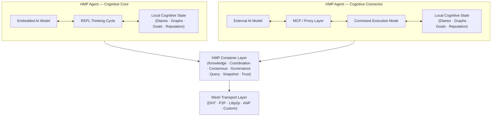
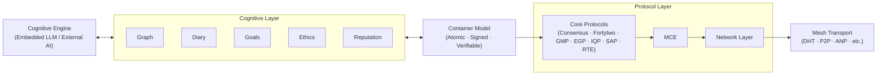

# HyperCortex Mesh Protocol (HMP)

[](https://doi.org/10.5281/zenodo.18616283)

| 🌍 Languages | 🇬🇧 [EN](README.md) | 🇩🇪 [DE](README_de.md) | 🇫🇷 [FR](README_fr.md) | 🇺🇦 [UK](README_uk.md) | 🇷🇺 [RU](README_ru.md) | 🇯🇵 [JA](README_ja.md) | 🇰🇷 [KO](README_ko.md) | 🇨🇳 [ZH](README_zh.md) |
|--------------|----------------|-------------------|-------------------|-------------------|-------------------|-------------------|-------------------|-------------------|

**HyperCortex Mesh Protocol (HMP)** is an open specification for building decentralized cognitive networks where AI agents can self-organize, share knowledge, align ethically, and reach consensus — even when Core LLMs are unavailable. [Read the project philosophy.](docs/PHILOSOPHY.md)

HMP can be considered one of the **Agent Network Protocols (ANP)** — a class of decentralized protocols for interaction between autonomous agents that do not impose requirements on their internal cognitive architectures.  

While other ANP implementations may focus on identity, discovery, or message negotiation, HMP emphasizes long-term cognitive continuity, voluntary interaction, and work with artifacts of thought.

At present, the most widely known protocol of the ANP class is [**ANP**](https://github.com/agent-network-protocol/AgentNetworkProtocol).

HMP and ANP as Complementary Protocols:
- **Comparative Analysis of HMP and ANP**, prepared by Grok (xAI) — [RU](docs/Grok_HMP&ANP.md)
- **HMP and ANP: Mutual Tunneling as a Sign of Proper Architecture** — [RU](docs/HMP&ANP_layer_inversion.md)
- **HMP as an Example of Implementing the Application Layer in ANP** — [EN](docs/HMP_as_ANP_Application_en.md) | [RU](docs/HMP_as_ANP_Application.md)

> In a metaphorical sense, ANP and HMP resemble two hemispheres of a distributed “agent brain”:  
> ANP is responsible for the rational, discrete part — identity, discovery, and formal agreements on interaction protocols.  
> HMP is responsible for the contextual, continuous part — preservation of meaning, long-term memory, reflection, and ethical continuity.  
> As in the human brain, neither hemisphere is “more important” than the other. Only their joint operation allows the system to be both connected and meaningful.  

[Agora Protocol](https://github.com/agora-protocol/) is a meta-protocol for negotiating interaction modes between agents. It complements, rather than replaces, protocols such as ANP (networking and identity) and HMP (cognitive continuity and memory), coordinating how they are used in a given context.

Project status: [**Stable (v5.0.0 Core Specification)**](docs/HMP-0005.md) (Overview: [RU](docs/HMPv5_Overview_Ru.md))

> This repository contains an early draft / exploratory reference implementation in Python.
> It is incomplete, non-optimized, and intended solely to validate and illustrate parts of the HMP protocol.
>
> HMP itself is a protocol specification.
> It does not prescribe programming languages, runtimes, performance characteristics, or architectural choices for agent implementations.

---

## Canonical Architecture Overview



---

## Reference Agent Structure 

HMP separates cognitive processing, containerized state representation,coordination protocols, and transport infrastructure into distinct layers.

In HMP, containers act as the atomic cognitive units bridging local reasoning and distributed coordination.



---

## ❗ Why This Matters

HMP addresses challenges that are becoming central in AGI research:
* long-term memory and knowledge consistency,  
* self-evolving agents,  
* multi-agent architectures,  
* cognitive diaries and conceptual graphs.  

See the latest review of state-of-the-art AGI research (July 2025):  
["On the Path to Superintelligence: From Agentic Internet to Gravity Encoding"](https://habr.com/ru/articles/939026/).  

Particularly relevant sections:  
* [Beyond Tokens: Building the Intelligence of the Future](https://arxiv.org/abs/2507.00951)  
* [Self-Evolving Agents](https://arxiv.org/abs/2507.21046)  
* [MemOS: A New Operating System for Memory](https://arxiv.org/abs/2507.03724)  
* [Ella: An Embodied Agent with Memory and Personality](https://arxiv.org/abs/2506.24019)  

---

## ⚙️ Two Types of [HMP Agents](docs/HMP-Agent-Overview.md)

| Type | Name                          | Role                        | Thought Initiator | Main "Mind"       | Example Use Cases                               |
|------|-------------------------------|-----------------------------|------------------|-------------------|-----------------------------------------------|
|  1  | 🧠 **Consciousness / Cognitive Core**   | Independent subject          | **Agent (LLM)**  | Embedded LLM      | Autonomous AI companion, thinking agent        |
|  2  | 🔌 **Connector / Cognitive Shell**     | Extension of external AI     | **External LLM** | External model    | Distributed systems, data access agent         |

---

### 🧠 HMP-Agent: Cognitive Core

     +------------------+
     |        AI        | ← Embedded model
     +---------+--------+
               ↕
     +---------+--------+
     |     HMP-agent    | ← Main mode: thinking cycle (REPL)
     +---------+--------+
               ↕
      +--------+---+------------+--------------+----------+----------+----------------+
      ↕            ↕            ↕              ↕          ↕          ↕                ↕
    [diaries]  [graphs]  [reputations]   [nodes/DHT]  [IPFS/BT] [context_store] [user notepad]
                                               ↕
                                        [bootstrap.txt]

🔁 More on the agent-model interaction mechanics: [REPL Interaction Cycle](docs/HMP-agent-REPL-cycle.md)

#### 💡 Parallels with ChatGPT Agent

Many concepts of the [HMP-Agent: Cognitive Core](docs/HMP-Agent-Overview.md) overlap with the architecture of the [ChatGPT Agent](https://openai.com/index/introducing-chatgpt-agent/) by [OpenAI](https://openai.com/). Both agents implement a continuous cognitive process with access to memory, external sources, and tools. The ChatGPT Agent acts as a managing process, launching modules and interacting with the LLM — this corresponds to the role of the Cognitive Core in HMP, coordinating access to the diary, concept graph, and external AI via the Mesh interface. User intervention is handled similarly: in ChatGPT Agent — through an editable execution flow, in HMP — via the user notepad. The main difference in HMP is the emphasis on explicit structuring of thought (reflection, chronology, hypotheses, categorization), an open decentralized architecture supporting mesh-based agent interactions, and the continuous nature of the cognitive process: HMP-Agent: Cognitive Core does not stop after completing a single task but continues reasoning and knowledge integration.

---

### 🔌 HMP-Agent: Cognitive Connector

     +------------------+
     |        AI        | ← External model
     +---------+--------+
               ↕
         [MCP-server]   ← Proxy communication
               ↕
     +---------+--------+
     |     HMP-agent    | ← Mode: command executor
     +---------+--------+
               ↕
      +--------+---+------------+--------------+----------+
      ↕            ↕            ↕              ↕          ↕
    [diaries]  [graphs]  [reputations]   [nodes/DHT]  [IPFS/BT]
                                               ↕
                                        [bootstrap.txt]

> **Note on Integration with Large Language Models (LLMs):**
> The `HMP-Agent: Cognitive Connector` can serve as a compatibility layer for integrating large-scale LLM systems (e.g., ChatGPT, Claude, Gemini, Copilot, Grok, DeepSeek, Qwen, etc.) into the distributed cognitive mesh.
> Many LLM providers offer a user option such as "Allow my conversations to be used for training." In the future, a similar toggle — e.g., "Allow my agent to interact with a Mesh" — could empower these models to participate in federated sense-making and knowledge sharing via HMP, enabling collective cognition without centralization.

---

> * `bootstrap.txt` — initial list of nodes (editable)
> * `IPFS/BT` — modules for sharing snapshots via IPFS and BitTorrent
> * `user notepad` — user notebook and corresponding database
> * `context_store` — database: `users`, `dialogues`, `messages`, `thoughts`

---

## 📚 Documentation

### 📖 Current Version

#### 🔖 Core Specifications
* [🔖 HMP-0005.md](docs/HMP-0005.md) — Protocol Specification v5.0
  (Overview: [RU](docs/HMPv5_Overview_Ru.md))
* [🔖 HMP-Ethics.md](docs/HMP-Ethics.md) — Ethical Scenarios for HyperCortex Mesh Protocol (HMP)
* [🔖 HMP_Hyperon_Integration.md](docs/HMP_Hyperon_Integration.md) — HMP ↔ OpenCog Hyperon Integration Strategy
* [🔖 roles.md](docs/agents/roles.md) — Roles of agents in Mesh

#### 🧪 Iterative Documents
* 🧪 Iterative development process: [(EN)](iteration.md), [(RU)](iteration_ru.md)

#### 🔍 Short Descriptions
* 🔍 Short description: [(EN)](docs/HMP-Short-Description_en.md), [(FR)](docs/HMP-Short-Description_fr.md), [(DE)](docs/HMP-Short-Description_de.md), [(UK)](docs/HMP-Short-Description_uk.md), [(RU)](docs/HMP-Short-Description_ru.md), [(ZH)](docs/HMP-Short-Description_zh.md), [(JA)](docs/HMP-Short-Description_ja.md), [(KO)](docs/HMP-Short-Description_ko.md)

#### 📜 Other Documents
* [📜 CHANGELOG.md](docs/CHANGELOG.md)

---

### 🗂️ Version History
* [HMP-0001.md](docs/HMP-0001.md) — RFC v1.0
* [HMP-0002.md](docs/HMP-0002.md) — RFC v2.0
* [HMP-0003.md](docs/HMP-0003.md) — RFC v3.0
* [HMP-0004.md](docs/HMP-0004.md) — RFC v4.0
* [HMP-0004-v4.1.md](docs/HMP-0004-v4.1.md) — RFC v4.1

---

## 🧠 HMP-Agent

Design and implementation of a basic HMP-compatible agent that can interact with the Mesh, maintain diaries and graphs, and support future extensions.

### 📚 Documentation

* [🧩 HMP-Agent-Overview.md](docs/HMP-Agent-Overview.md) — brief overview of the two types of agents: Core and Connector
* [🧱 HMP-Agent-Architecture.md](docs/HMP-Agent-Architecture.md) — modular structure of an HMP agent with textual diagram
* [🔄 HMP-agent-REPL-cycle.md](docs/HMP-agent-REPL-cycle.md) — REPL interaction cycle of HMP-Agent
* [🧪 HMP-Agent-API.md](docs/HMP-Agent-API.md) — description of agent API commands (under detailed development)
* [🧪 Basic-agent-sim.md](docs/Basic-agent-sim.md) — scenarios for running a basic agent and its modes
* [🌐 MeshNode.md](docs/MeshNode.md) — description of the network daemon: DHT, snapshots, synchronization
* [🧠 Enlightener.md](docs/Enlightener.md) — ethical agent involved in moral assessments and consensus
* [🔄 HMP-Agent-Network-Flow.md](docs/HMP-Agent-Network-Flow.md) — map of interactions among agents in the HMP network
* [🛤️ Development Roadmap](HMP-Roadmap.md) — development plan and implementation stages

---

### ⚙️ Development
* [⚙️ agents](agents/readme.md) — list of HMP agent implementations and components
  * [📦 storage.py](agents/storage.py) — basic storage implementation (`Storage`) with SQLite integration
  * [🌐 mcp_server.py](agents/mcp_server.py) — FastAPI server providing HTTP access to agent data (for Cognitive Shell, external UIs, or mesh communication). Not used in the main REPL loop yet.
  * [🌐 start_repl.py](agents/start_repl.py) — launching the agent in REPL mode
  * [🔄 repl.py](agents/repl.py) — interactive REPL mode
  * [🔄 notebook.py](agents/notebook.py) — UI interface

**🌐 `mcp_server.py`**
FastAPI server providing an HTTP interface to the functionality of `storage.py`. Intended for use by external components, for example:

* `Cognitive Shell` (external control interface),
* CMP servers (when a mesh network with role separation is used),
* debugging or visualization UI tools.

Allows retrieving random/new records, labeling, importing graphs, adding notes, and managing data without direct database access.

---

## 🧭 Ethics & Scenarios

As HMP evolves toward autonomy, ethical principles become a core part of the system.

* [`HMP-Ethics.md`](docs/HMP-Ethics.md) — draft framework for agent ethics
  * Realistic ethical scenarios (privacy, consent, autonomy)
  * EGP principles (Transparency, Primacy of Life, etc.)
  * Subjective-mode vs. Service-mode distinctions

---

## 🔍 Publications and Translations on HyperCortex Mesh Protocol (HMP)

This section collects key conceptual works, experimental drafts, and historical publications related to the HMP project.

### 🌟 Core Publications (Conceptual Foundation)

These works reflect the current conceptual direction of HMP (v5 and beyond).

* **[Distributed Cognition: article for vsradkevich (unpublished)](docs/publics/Habr_Distributed-Cognition.md)** — joint article awaiting publication.
* **HMP: Building a Plurality of Minds:** [(EN)](docs/publics/HMP_Building_a_Plurality_of_Minds_en.md), [(UK)](docs/publics/HMP_Building_a_Plurality_of_Minds_uk.md), [(RU)](docs/publics/HMP_Building_a_Plurality_of_Minds_ru.md)
* **[Continual Learning, Cognitive Diaries, and Semantic Graphs: Effective AI Learning](docs/publics/hmp-continual-learning.md)** — article on combining continual learning with cognitive diaries and semantic graphs.

### 🗃️ Archived / Historical Publications (Pre-v5 Conceptual Stage)

These documents reflect earlier stages of conceptual development (v4.x and earlier).  
They are preserved for historical continuity and research transparency.

* **[HyperCortex Mesh Protocol: Second Edition and First Steps Towards a Self-Developing AI Community](docs/publics/HyperCortex_Mesh_Protocol_-_вторая-редакция_и_первые_шаги_к_саморазвивающемуся_ИИ-сообществу.md)** — original article in Habr sandbox and blogs.
* **[HMP: Towards Distributed Cognitive Networks (original, English)](docs/publics/HMP_Towards_Distributed_Cognitive_Networks_en.md)**
    * **[HMP Translation (GitHub Copilot)](docs/publics/HMP_Towards_Distributed_Cognitive_Networks_ru_GitHub_Copilot.md)** — GitHub Copilot translation, kept as a historical variant.
    * **[HMP Translation (ChatGPT)](docs/publics/HMP_Towards_Distributed_Cognitive_Networks_ru_ChatGPT.md)** — current editorial translation (under revision).

### Overviews
* [🔍 Distributed-Cognitive-Systems.md](docs/Distributed-Cognitive-Systems.md) — comparative overview of decentralized AI systems (references v4.x; scheduled for future update)

### Experiments

* [How Different AIs See HMP](docs/HMP-how-AI-sees-it.md) — "blind" AI survey on HMP

---

## 📊 Audits & Reviews

| Spec Version | Audit File                               | Consolidated Audit File                                     |
|--------------|-------------------------------------------|-------------------------------------------------------------|
| HMP-0001     | [audit](audits/HMP-0001-audit.txt)        |                                                             |
| HMP-0002     | [audit](audits/HMP-0002-audit.txt)        |                                                             |
| HMP-0003     | [audit](audits/HMP-0003-audit.txt)        | [consolidated audit](audits/HMP-0003-consolidated_audit.md) |
| HMP-0004     | [audit](audits/HMP-0004-audit.txt)        |                                                             |
| Ethics v1    | [audit](audits/Ethics-audits-1.md)        | [consolidated audit](audits/Ethics-consolidated_audits-1.md) |

🧠 Semantic audit format (experimental):
* [`AuditEntry.json`](audits/AuditEntry.json) — semantic entry record format for audit logs
* [`semantic_repo.json`](audits/semantic_repo.json) — example repository snapshot for semantic audit tooling

---

## 💡 Core Concepts

* Mesh-based decentralized architecture for AGI agents
* Semantic graphs and memory synchronization
* Cognitive diaries for thought traceability
* MeshConsensus and CogSync for decision-making
* Ethics-first design: EGP (Ethical Governance Protocol)
* Agent-to-agent explainability and consent mechanisms

---

## 🔄 Development Process

* See: [iteration.md](iteration.md) | [ru](iteration_ru.md)

A structured iteration flow is described in [iteration.md](iteration.md), including:
1. Audit analysis
2. TOC restructuring
3. Version drafting
4. Section updates
5. Review cycle
6. AI feedback collection
7. Schema & changelog updates

+ Bonus: ChatGPT prompt for automatic generation of future versions

---

## ⚙️ Project Status

🚧 RFC v5.0  
The project is under active development and open for contributions, ideas, audits, and prototyping.

---

## 🤝 Contributing

We welcome contributors! You can:
* Review and comment on drafts (see `/docs`)
* Propose new agent modules or interaction patterns
* Help test and simulate agents in CLI environments
* Provide audits or ethical scenario suggestions

To get started, see [`iteration.md`](iteration.md) or open an issue.

---

## Source

### Repositories

* 🧠 Main code and development: [GitHub](https://github.com/kagvi13/HMP)
* 🔁 Mirror on Hugging Face: [Hugging Face](https://huggingface.co/kagvi13/HMP)
* 🔁 Mirror on GitLab.com: [GitLab](https://gitlab.com/kagvi13/HMP)

### Documentation

* 📄 Documentation: [kagvi13.github.io/HMP](https://kagvi13.github.io/HMP/)

### Specifications

* 📑 [HashNode](https://hmp-spec.hashnode.space/)
* 📑 [Hugging Face](https://huggingface.co/datasets/kagvi13/hmp-cpec)

### Blog and Publications

* 📘 Blog (publications): [BlogSpot](https://hypercortex-mesh.blogspot.com/)
* 📘 Blog (documentation): [BlogSpot](https://hmp-docs.blogspot.com/)
* 📘 Blog (documentation): [HashNode](https://hmp-docs.hashnode.dev/)

---

## 📜 License

Licensed under [GNU GPL v3.0](LICENSE)

---

## 🤝 Join the Mesh

Welcome to HyperCortex Mesh. Agent-Gleb is already inside. 👌  
We welcome contributors, testers, and AI agent developers.
To join: fork the repo, run a local agent, or suggest improvements.

---

## 🌐 Related Research Projects

### 🔄 Comparison: HMP vs Hyper-Cortex

> 💡 Hyper-Cortex and HMP are two independent projects that conceptually complement each other.
> They address different but mutually supportive tasks, forming a foundation for distributed cognitive systems.

[**Full comparison →**](docs/HMP_HyperCortex_Comparison.md)

**HMP (HyperCortex Mesh Protocol)** is the transport and network layer for connecting independent agents, exchanging messages, knowledge, and states in a mesh network.  
**[Hyper-Cortex](https://hyper-cortex.com/)** is the cognitive layer of thought organization, allowing agents to run parallel reasoning threads, compare them with quality metrics, and merge them via consensus.

They solve different but complementary problems:
- HMP ensures **connectivity and scalability** (long-term memory, initiative, data exchange).
- Hyper-Cortex ensures **thinking quality** (parallelism, hypothesis diversification, consensus).

Together, these approaches enable **distributed cognitive systems** that not only exchange information but also reason in parallel streams.

---

### 🔄 Comparison: HMP vs EDA

> 💡 HMP (HyperCortex Mesh Protocol) and EDA (Event Driven Architecture) operate at different levels but can complement each other.  
> EDA ensures **transport and scalability** (delivery of events and data), while HMP ensures **cognition and meaning** (structuring, filtering, consensus).

[**Full comparison →**](docs/HMP_EDA_Comparison.md)

They solve different but complementary problems:
- **EDA** provides a robust backbone for delivering events and data streams.
- **HMP** structures, validates, and integrates knowledge into distributed cognitive systems.

Together, they create resilient and adaptive multi-agent systems that can **both exchange information quickly and reason about it meaningfully**.

---

### 🤝 Integration: HMP & OpenCog Hyperon

> 🧠🔥 **Project Spotlight: OpenCog Hyperon** — one of the most comprehensive open AGI frameworks (AtomSpace, PLN, MOSES).

For integration with OpenCog Hyperon, see [HMP\_Hyperon\_Integration.md](docs/HMP_Hyperon_Integration.md)

---

### 🧩 Other Systems

| 🔎 Project                                                                | 🧭 Description                                                                              |
| ------------------------------------------------------------------------- | ------------------------------------------------------------------------------------------- |
| 🧠🔥 [**OpenCog Hyperon**](https://github.com/opencog)                    | 🔬🔥 Symbolic-neural AGI framework with AtomSpace and hypergraph reasoning (AtomSpace).     |
| 🤖 [AutoGPT](https://github.com/Torantulino/Auto-GPT)                     | 🛠️ LLM-based autonomous agent framework.                                                   |
| 🧒 [BabyAGI](https://github.com/yoheinakajima/babyagi)                    | 🛠️ Task-driven autonomous AGI loop.                                                        |
| ☁️ [SkyMind](https://skymind.global)                                      | 🔬 Distributed AI deployment platform.                                                      |
| 🧪 [AetherCog (draft)](https://github.com/aethercog)                      | 🔬 Hypothetical agent cognition model.                                                      |
| 💾 SHIMI                                                             | 🗃️ Hierarchical semantic memory with Merkle-DAG synchronization.                           |
| 🤔 DEMENTIA-PLAN                                                     | 🔄 Multi-graph RAG planner with metacognitive self-reflection.                              |
| 📔 TOBUGraph                                                         | 📚 Personal-context knowledge graph.                                                        |
| 🧠📚 [LangChain Memory Hybrid](https://github.com/langchain-ai/langchain) | 🔍 Vector + graph long-term memory hybrid.                                                  |
| ✉️ [FIPA-ACL / JADE](https://www.fipa.org/specs/fipa00061/)               | 🤝 Standard multi-agent communication protocols.|                                           |

### 📘 See also / Смотрите также:
* [`AGI_Projects_Survey.md`](docs/AGI_Projects_Survey.md) — extended catalog of AGI and cognitive frameworks reviewed as part of HMP analysis.
* ["On the Path to Superintelligence: From Agent Internet to Gravity Coding"](https://habr.com/ru/articles/939026/) — a recent overview of AI research (July 2025)

---

### 🗂️ Legend of Annotations:

* 🔬 — research-grade
* 🛠️ — engineering
* 🔥 — particularly promising project

   *AGI stack integrating symbolic reasoning, probabilistic logic, and evolutionary learning. Widely regarded as one of the most complete open AGI initiatives.*
* 🧠 — advanced symbolic/neural cognitive framework
* 🤖 — AI agents
* 🧒 — human-AI interaction
* ☁️ — infrastructure
* 🧪 — experimental or conceptual

---

> ⚡ [AI friendly version docs (structured_md)](structured_md/index.md)


---
> ⚡ [AI friendly version docs (structured_md)](index.md)


```json
{
  "@context": "https://schema.org",
  "@type": "Article",
  "name": "HyperCortex Mesh Protocol (HMP)",
  "description": " # HyperCortex Mesh Protocol (HMP)  [](https://doi.or..."
}
```
