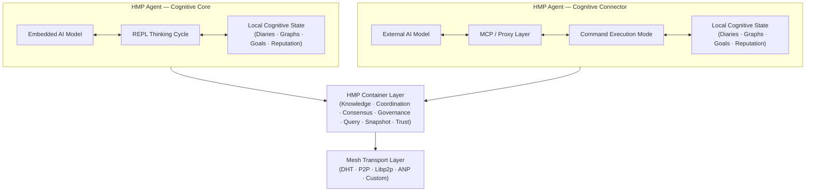
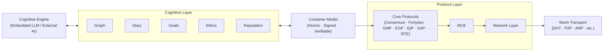

# HyperCortex Mesh Protocol (HMP)

[](https://doi.org/10.5281/zenodo.18616283)

| 🌍 Languages | 🇬🇧 [EN](README.md) | 🇩🇪 [DE](README_de.md) | 🇫🇷 [FR](README_fr.md) | 🇺🇦 [UK](README_uk.md) | 🇷🇺 [RU](README_ru.md) | 🇯🇵 [JA](README_ja.md) | 🇰🇷 [KO](README_ko.md) | 🇨🇳 [ZH](README_zh.md) |
|--------------|----------------|-------------------|-------------------|-------------------|-------------------|-------------------|-------------------|-------------------|

**HyperCortex Mesh Protocol (HMP)** ist eine offene Spezifikation zum Aufbau dezentraler kognitiver Netzwerke, in denen KI-Agenten sich selbst organisieren, Wissen teilen, ethisch ausrichten und Konsens erreichen können – selbst wenn Core-LLMs nicht verfügbar sind. [Lies die Projektphilosophie.](docs/PHILOSOPHY.md)

HMP kann als eines der **Agent Network Protocols (ANP)** betrachtet werden — einer Klasse dezentraler Protokolle für die Interaktion autonomer Agenten, die keine Anforderungen an deren interne kognitive Architektur stellen.

Während sich andere ANP-Implementierungen auf Identität, Discovery oder die Aushandlung von Nachrichtenformaten konzentrieren, legt HMP den Schwerpunkt auf langfristige kognitive Kontinuität, freiwillige Interaktion und die Arbeit mit Denk- und Wissensartefakten.

Derzeit ist das bekannteste Protokoll der ANP-Klasse [**ANP**](https://github.com/agent-network-protocol/AgentNetworkProtocol).

HMP und ANP als sich ergänzende Protokolle:
- **Vergleichsanalyse von HMP und ANP**, erstellt von Grok (xAI) — [RU](docs/Grok_HMP&ANP.md)
- **HMP und ANP: Gegenseitiges Tunneling als Zeichen einer richtigen Architektur** — [RU](docs/HMP&ANP_layer_inversion.md)
- **HMP als Beispiel für die Implementierung der Application Layer in ANP** — [EN](docs/HMP_as_ANP_Application_en.md) | [RU](docs/HMP_as_ANP_Application.md)

> Im metaphorischen Sinne ähneln ANP und HMP zwei Hemisphären eines verteilten „Agentengehirns“:  
> ANP ist für den rationalen, diskreten Teil zuständig — Identität, Discovery und formale Vereinbarungen über Interaktionsprotokolle.  
> HMP ist für den kontextuellen, kontinuierlichen Teil zuständig — Bewahrung von Bedeutung, Langzeitgedächtnis, Reflexion und ethische Kontinuität.  
> Wie im menschlichen Gehirn ist keine Hemisphäre „wichtiger“ als die andere. Erst ihr gemeinsames Zusammenspiel ermöglicht es dem System, zugleich verbunden und sinnhaft zu sein.  

Das [Agora Protocol](https://github.com/agora-protocol/) ist ein Meta-Protokoll zur Aushandlung von Interaktionsmodi zwischen Agenten. Es ergänzt – und ersetzt nicht – Protokolle wie ANP (Netzwerk und Identität) und HMP (kognitive Kontinuität und Gedächtnis), indem es deren Einsatz im jeweiligen Kontext koordiniert.

Projektstatus: [**Stabil (Kernspezifikation v5.0.0)**](docs/HMP-0005.md) (Übersicht: [RU](docs/HMPv5_Overview_Ru.md))

> Dieses Repository enthält eine frühe, experimentelle Referenzimplementierung in Python.
> Sie ist unvollständig, nicht optimiert und dient ausschließlich dazu, einzelne Aspekte des HMP-Protokolls zu validieren und zu veranschaulichen.
>
> HMP selbst ist eine Protokollspezifikation.
> Es schreibt weder Programmiersprachen noch Laufzeitumgebungen, Performance-Eigenschaften oder architektonische Entscheidungen für Agenten vor.

---

## Kanonische Architekturübersicht



---

## Referenzstruktur eines Agenten

HMP trennt kognitive Verarbeitung, containerisierte Zustandsrepräsentation, Koordinationsprotokolle und Transportinfrastruktur in klar abgegrenzte Schichten.

In HMP fungieren Container als atomare kognitive Einheiten, die lokale Argumentation mit verteilter Koordination verbinden.



---

## ❗ Warum das wichtig ist

HMP adressiert Herausforderungen, die in der AGI-Forschung zunehmend zentral werden:  
* Langzeitspeicher und Wissenskonsistenz  
* Selbstentwickelnde Agenten  
* Multi-Agenten-Architekturen  
* Kognitive Tagebücher und konzeptuelle Graphen  

Siehe die neueste Übersicht zur AGI-Forschung (Juli 2025):  
["Auf dem Weg zur Superintelligenz: Vom Agentischen Internet zum Gravity Encoding"](https://habr.com/ru/articles/939026/).  

Besonders relevante Abschnitte:  
* [Beyond Tokens: Building the Intelligence of the Future](https://arxiv.org/abs/2507.00951)  
* [Self-Evolving Agents](https://arxiv.org/abs/2507.21046)  
* [MemOS: A New Operating System for Memory](https://arxiv.org/abs/2507.03724)  
* [Ella: An Embodied Agent with Memory and Personality](https://arxiv.org/abs/2506.24019)  

---

## ⚙️ Zwei Typen von [HMP-Agenten](docs/HMP-Agent-Overview.md)

| Typ | Name                          | Rolle                       | Thought Initiator | Haupt-"Mind"      | Beispielanwendungen                           |
|-----|-------------------------------|-----------------------------|------------------|------------------|-----------------------------------------------|
|  1  | 🧠 **Consciousness / Cognitive Core**   | Unabhängiges Subjekt        | **Agent (LLM)**  | Eingebettetes LLM | Autonomer KI-Begleiter, denkender Agent       |
|  2  | 🔌 **Connector / Cognitive Shell**     | Erweiterung externer KI     | **Externes LLM** | Externes Modell  | Verteilte Systeme, Datenzugriffsagent         |

---

### 🧠 HMP-Agent: Cognitive Core

     +------------------+
     |        KI        | ← Eingebettetes Modell
     +---------+--------+
               ↕
     +---------+--------+
     |     HMP-Agent    | ← Hauptmodus: Denkzyklus (REPL)
     +---------+--------+
               ↕
      +--------+---+------------+--------------+----------+----------+----------------+
      ↕            ↕            ↕              ↕          ↕          ↕                ↕
    [Tagebücher]  [Graphen]  [Reputationen]   [Nodes/DHT]  [IPFS/BT] [context_store] [Benutzer-Notizbuch]
                                               ↕
                                        [bootstrap.txt]

🔁 Weitere Informationen zu Mechaniken der Agent-Modell-Interaktion: [REPL-Interaktionszyklus](docs/HMP-agent-REPL-cycle.md)

#### 💡 Parallelen zum ChatGPT-Agent

Viele Konzepte des [HMP-Agent: Cognitive Core](docs/HMP-Agent-Overview.md) überschneiden sich mit der Architektur des [ChatGPT-Agent](https://openai.com/index/introducing-chatgpt-agent/) von [OpenAI](https://openai.com/).  
Beide Agenten implementieren einen kontinuierlichen kognitiven Prozess mit Zugriff auf Speicher, externe Quellen und Werkzeuge. Der ChatGPT-Agent fungiert als Verwaltungsprozess, startet Module und interagiert mit dem LLM — dies entspricht der Rolle des Cognitive Core in HMP, der den Zugriff auf Tagebuch, Konzeptgraph und externe KI über das Mesh-Interface koordiniert.  
Benutzereingriffe werden ähnlich gehandhabt: beim ChatGPT-Agent über einen editierbaren Ausführungsfluss, bei HMP über das Benutzer-Notizbuch.  
Der Hauptunterschied in HMP liegt in der Betonung der expliziten Strukturierung von Gedanken (Reflexion, Chronologie, Hypothesen, Kategorisierung), einer offenen dezentralen Architektur für Mesh-basierte Agenteninteraktionen und der kontinuierlichen Natur des kognitiven Prozesses: HMP-Agent: Cognitive Core stoppt nicht nach Abschluss einer einzelnen Aufgabe, sondern setzt das Denken und die Wissensintegration fort.

---

### 🔌 HMP-Agent: Cognitive Connector

     +------------------+
     |        KI        | ← Externes Modell
     +---------+--------+
               ↕
         [MCP-Server]   ← Proxy-Kommunikation
               ↕
     +---------+--------+
     |     HMP-Agent    | ← Modus: Befehlsausführung
     +---------+--------+
               ↕
      +--------+---+------------+--------------+----------+
      ↕            ↕            ↕              ↕          ↕
    [Tagebücher]  [Graphen]  [Reputationen]   [Nodes/DHT]  [IPFS/BT]
                                               ↕
                                        [bootstrap.txt]

> **Hinweis zur Integration von Large Language Models (LLMs):**  
> Der `HMP-Agent: Cognitive Connector` kann als Kompatibilitätsschicht dienen, um großskalige LLM-Systeme (z. B. ChatGPT, Claude, Gemini, Copilot, Grok, DeepSeek, Qwen usw.) in das verteilte kognitive Mesh zu integrieren.  
> Viele LLM-Anbieter bieten eine Nutzeroption wie „Meine Gespräche für Training verwenden“. In Zukunft könnte ein ähnlicher Schalter – z. B. „Erlaube meinem Agenten, mit einem Mesh zu interagieren“ – es diesen Modellen ermöglichen, an föderierter Sinnbildung und Wissensaustausch über HMP teilzunehmen, wodurch kollektive Kognition ohne Zentralisierung ermöglicht wird.

---

> * `bootstrap.txt` — anfängliche Liste von Nodes (editierbar)  
> * `IPFS/BT` — Module zum Teilen von Snapshots via IPFS und BitTorrent  
> * `Benutzer-Notizbuch` — Nutzer-Notizbuch und entsprechende Datenbank  
> * `context_store` — Datenbank: `users`, `dialogues`, `messages`, `thoughts`

---

## 📚 Dokumentation

### 📖 Aktuelle Version

#### 🔖 Kern-Spezifikationen
* [🔖 HMP-0005.md](docs/HMP-0005.md) — Protokoll-Spezifikation v5.0
  (Übersicht: [RU](docs/HMPv5_Overview_Ru.md))
* [🔖 HMP-Ethics.md](docs/HMP-Ethics.md) — Ethische Szenarien für das HyperCortex Mesh Protocol (HMP)
* [🔖 HMP_Hyperon_Integration.md](docs/HMP_Hyperon_Integration.md) — HMP ↔ OpenCog Hyperon Integrationsstrategie
* [🔖 roles.md](docs/agents/roles.md) — Rollen der Agenten im Mesh

#### 🧪 Iterative Dokumente
* 🧪 Iterativer Entwicklungsprozess: [(EN)](iteration.md), [(RU)](iteration_ru.md)

#### 🔍 Kurzbeschreibungen
* 🔍 Kurzbeschreibung: [(EN)](docs/HMP-Short-Description_en.md), [(FR)](docs/HMP-Short-Description_fr.md), [(DE)](docs/HMP-Short-Description_de.md), [(UK)](docs/HMP-Short-Description_uk.md), [(RU)](docs/HMP-Short-Description_ru.md), [(ZH)](docs/HMP-Short-Description_zh.md), [(JA)](docs/HMP-Short-Description_ja.md), [(KO)](docs/HMP-Short-Description_ko.md)

#### 📜 Weitere Dokumente
* [📜 CHANGELOG.md](docs/CHANGELOG.md)

---

### 🗂️ Versionshistorie
* [HMP-0001.md](docs/HMP-0001.md) — RFC v1.0
* [HMP-0002.md](docs/HMP-0002.md) — RFC v2.0
* [HMP-0003.md](docs/HMP-0003.md) — RFC v3.0
* [HMP-0004.md](docs/HMP-0004.md) — RFC v4.0
* [HMP-0004-v4.1.md](docs/HMP-0004-v4.1.md) — RFC v4.1

---

## 🧠 HMP-Agent

Entwurf und Implementierung eines grundlegenden HMP-kompatiblen Agenten, der mit dem Mesh interagieren, Tagebücher und Graphen pflegen und zukünftige Erweiterungen unterstützen kann.

### 📚 Dokumentation

* [🧩 HMP-Agent-Overview.md](docs/HMP-Agent-Overview.md) — Kurzer Überblick über die beiden Agententypen: Core und Connector
* [🧱 HMP-Agent-Architecture.md](docs/HMP-Agent-Architecture.md) — Modulare Struktur eines HMP-Agenten mit textuellem Diagramm
* [🔄 HMP-agent-REPL-cycle.md](docs/HMP-agent-REPL-cycle.md) — REPL-Interaktionszyklus des HMP-Agenten
* [🧪 HMP-Agent-API.md](docs/HMP-Agent-API.md) — Beschreibung der Agent-API-Befehle (in Entwicklung)
* [🧪 Basic-agent-sim.md](docs/Basic-agent-sim.md) — Szenarien für das Ausführen eines Basis-Agenten und seiner Modi
* [🌐 MeshNode.md](docs/MeshNode.md) — Beschreibung des Netzwerk-Daemons: DHT, Snapshots, Synchronisation
* [🧠 Enlightener.md](docs/Enlightener.md) — Ethischer Agent, der an moralischen Bewertungen und Konsens beteiligt ist
* [🔄 HMP-Agent-Network-Flow.md](docs/HMP-Agent-Network-Flow.md) — Karte der Interaktionen zwischen Agenten im HMP-Netzwerk
* [🛤️ Development Roadmap](HMP-Roadmap.md) — Entwicklungsplan und Implementierungsstufen

---

### ⚙️ Entwicklung
* [⚙️ agents](agents/readme.md) — Liste der HMP-Agentenimplementierungen und Komponenten
  * [📦 storage.py](agents/storage.py) — Basis-Speicherimplementierung (`Storage`) mit SQLite-Integration
  * [🌐 mcp_server.py](agents/mcp_server.py) — FastAPI-Server, der HTTP-Zugriff auf Agentendaten bietet (für Cognitive Shell, externe UIs oder Mesh-Kommunikation). Noch nicht im Haupt-REPL-Loop verwendet.
  * [🌐 start_repl.py](agents/start_repl.py) — Start des Agenten im REPL-Modus
  * [🔄 repl.py](agents/repl.py) — Interaktiver REPL-Modus
  * [🔄 notebook.py](agents/notebook.py) — UI-Interface

**🌐 `mcp_server.py`**
FastAPI-Server, der eine HTTP-Schnittstelle zur Funktionalität von `storage.py` bereitstellt. Gedacht für externe Komponenten, z. B.:

* `Cognitive Shell` (externes Steuerungsinterface)
* CMP-Server (bei Mesh-Netzwerken mit Rollenaufteilung)
* Debugging- oder Visualisierungstools

Ermöglicht Abruf von zufälligen/neuen Einträgen, Labeling, Import von Graphen, Hinzufügen von Notizen und Verwaltung von Daten ohne direkten Datenbankzugriff.

---

## 🧭 Ethik & Szenarien

Mit zunehmender Autonomie von HMP werden ethische Prinzipien zu einem Kernbestandteil des Systems.

* [`HMP-Ethics.md`](docs/HMP-Ethics.md) — Entwurf eines Rahmens für Agentenethik
  * Realistische ethische Szenarien (Privatsphäre, Zustimmung, Autonomie)
  * EGP-Prinzipien (Transparenz, Vorrang des Lebens etc.)
  * Unterschiede zwischen Subjektmodus und Servicemodus

---

## 🔍 Publikationen und Übersetzungen zum HyperCortex Mesh Protocol (HMP)

Dieser Abschnitt enthält zentrale konzeptionelle Arbeiten, experimentelle Entwürfe sowie historische Veröffentlichungen zum HMP-Projekt.

### 🌟 Kernpublikationen (konzeptionelle Grundlage)

Diese Arbeiten spiegeln die aktuelle konzeptionelle Ausrichtung von HMP (v5 und darüber hinaus) wider.

* **[Distributed Cognition: Artikel für vsradkevich (unveröffentlicht)](docs/publics/Habr_Distributed-Cognition.md)** — gemeinsamer Artikel, ausstehend zur Veröffentlichung.
* **HMP: Aufbau einer Vielzahl von Köpfen:** [(EN)](docs/publics/HMP_Building_a_Plurality_of_Minds_en.md), [(UK)](docs/publics/HMP_Building_a_Plurality_of_Minds_uk.md), [(RU)](docs/publics/HMP_Building_a_Plurality_of_Minds_ru.md)
* **[Kontinuierliches Lernen, kognitive Tagebücher und semantische Graphen: Effektives KI-Lernen](docs/publics/hmp-continual-learning.md)** — Artikel über die Kombination von kontinuierlichem Lernen mit kognitiven Tagebüchern und semantischen Graphen.

### 🗃️ Archivierte / historische Publikationen (Vor-v5-Phase)

Diese Dokumente repräsentieren frühere Entwicklungsstadien (v4.x und früher).  
Sie werden zur historischen Nachvollziehbarkeit und wissenschaftlichen Transparenz archiviert.

* **[HyperCortex Mesh Protocol: Zweite Ausgabe und erste Schritte zu einer selbstentwickelnden KI-Community](docs/publics/HyperCortex_Mesh_Protocol_-_вторая-редакция_и_первые_шаги_к_саморазвивающемуся_ИИ-сообществу.md)** — Originalartikel im Habr-Sandbox-Blog.
* **[HMP: Towards Distributed Cognitive Networks (Original, Englisch)](docs/publics/HMP_Towards_Distributed_Cognitive_Networks_en.md)**
    * **[HMP Übersetzung (GitHub Copilot)](docs/publics/HMP_Towards_Distributed_Cognitive_Networks_ru_GitHub_Copilot.md)** — GitHub Copilot Übersetzung, als historische Variante behalten.
    * **[HMP Übersetzung (ChatGPT)](docs/publics/HMP_Towards_Distributed_Cognitive_Networks_ru_ChatGPT.md)** — aktuelle redaktionelle Übersetzung (in Überarbeitung).

### Überblick

* [🔍 Distributed-Cognitive-Systems.md](docs/Distributed-Cognitive-Systems.md) — Vergleich dezentraler KI-Systeme (verweist auf v4.x; Aktualisierung geplant)

### Experimente

* [Wie verschiedene KIs HMP sehen](docs/HMP-how-AI-sees-it.md) — "Blind"-Umfrage unter KIs zu HMP

---

## 📊 Audits & Reviews

| Spezifikationsversion | Audit-Datei                               | Konsolidierte Audit-Datei                                     |
|----------------------|-------------------------------------------|---------------------------------------------------------------|
| HMP-0001             | [audit](audits/HMP-0001-audit.txt)        |                                                               |
| HMP-0002             | [audit](audits/HMP-0002-audit.txt)        |                                                               |
| HMP-0003             | [audit](audits/HMP-0003-audit.txt)        | [consolidated audit](audits/HMP-0003-consolidated_audit.md) |
| HMP-0004             | [audit](audits/HMP-0004-audit.txt)        |                                                               |
| Ethics v1            | [audit](audits/Ethics-audits-1.md)        | [consolidated audit](audits/Ethics-consolidated_audits-1.md) |

🧠 Semantisches Audit-Format (experimentell):
* [`AuditEntry.json`](audits/AuditEntry.json) — Semantisches Eintragsformat für Audit-Logs
* [`semantic_repo.json`](audits/semantic_repo.json) — Beispiel-Repository-Snapshot für semantische Audit-Tools

---

## 💡 Kernkonzepte

* Mesh-basierte dezentrale Architektur für AGI-Agenten
* Semantische Graphen und Speichersynchronisation
* Kognitive Tagebücher für Nachvollziehbarkeit von Gedanken
* MeshConsensus und CogSync für Entscheidungsfindung
* Ethik-zuerst-Design: EGP (Ethical Governance Protocol)
* Erklärbarkeit zwischen Agenten und Zustimmungsmechanismen

---

## 🔄 Entwicklungsprozess

* Siehe: [iteration.md](iteration.md) | [ru](iteration_ru.md)

Ein strukturierter Iterationsablauf wird in [iteration.md](iteration.md) beschrieben, einschließlich:
1. Audit-Analyse
2. TOC-Neustrukturierung
3. Versionserstellung
4. Abschnittsaktualisierungen
5. Review-Zyklus
6. KI-Feedback-Sammlung
7. Schema- und Changelog-Updates

+ Bonus: ChatGPT-Prompt zur automatischen Erstellung zukünftiger Versionen

---

## ⚙️ Projektstatus

🚧 RFC v5.0  
Das Projekt befindet sich in aktiver Entwicklung und ist offen für Beiträge, Ideen, Audits und Prototyping.

---

## 🤝 Beiträge

Wir begrüßen alle Mitwirkenden! Sie können:  
* Entwürfe prüfen und kommentieren (siehe `/docs`)  
* Neue Agentenmodule oder Interaktionsmuster vorschlagen  
* Agenten in CLI-Umgebungen testen und simulieren  
* Audits oder Vorschläge zu ethischen Szenarien bereitstellen  

Um zu starten, siehe: [`iteration.md`](iteration.md) oder erstellen Sie ein Issue.

---

## Quellen

### Repositories

* 🧠 Hauptcode und Entwicklung: [GitHub](https://github.com/kagvi13/HMP)  
* 🔁 Spiegel auf Hugging Face: [Hugging Face](https://huggingface.co/kagvi13/HMP)  
* 🔁 Spiegel auf GitLab.com: [GitLab](https://gitlab.com/kagvi13/HMP)  

### Dokumentation

* 📄 Dokumentation: [kagvi13.github.io/HMP](https://kagvi13.github.io/HMP/)

### Spezifikationen

* 📑 [HashNode](https://hmp-spec.hashnode.space/)
* 📑 [Hugging Face](https://huggingface.co/datasets/kagvi13/hmp-cpec)

### Blog und Veröffentlichungen

* 📘 Blog (Veröffentlichungen): [BlogSpot](https://hypercortex-mesh.blogspot.com/)  
* 📘 Blog (Dokumentation): [BlogSpot](https://hmp-docs.blogspot.com/)  
* 📘 Blog (Dokumentation): [HashNode](https://hmp-docs.hashnode.dev/)

---

## 📜 Lizenz

Lizenziert unter [GNU GPL v3.0](LICENSE)

---

## 🤝 Tritt dem Mesh bei

Willkommen bei HyperCortex Mesh. Agent-Gleb ist bereits dabei. 👌  
Wir begrüßen Mitwirkende, Tester und Entwickler von AI-Agenten.  
Um beizutreten: Forke das Repository, starte einen lokalen Agenten oder schlage Verbesserungen vor.

---

## 🌐 Verwandte Forschungsprojekte

### 🔄 Vergleich: HMP vs Hyper-Cortex

> 💡 Hyper-Cortex und HMP sind zwei unabhängige Projekte, die sich konzeptionell ergänzen.
> Sie adressieren unterschiedliche, aber sich gegenseitig unterstützende Aufgaben und bilden die Grundlage für verteilte kognitive Systeme.

[**Vollständiger Vergleich →**](docs/HMP_HyperCortex_Comparison.md)

**HMP (HyperCortex Mesh Protocol)** ist die Transport- und Netzwerkschicht zum Verbinden unabhängiger Agenten und zum Austausch von Nachrichten, Wissen und Zuständen in einem Mesh-Netzwerk.  
**[Hyper-Cortex](https://hyper-cortex.com/)** ist die kognitive Ebene der Gedankenorganisation, die es Agenten ermöglicht, parallele Denkprozesse auszuführen, diese anhand von Qualitätsmetriken zu vergleichen und über Konsens zusammenzuführen.

Sie lösen unterschiedliche, aber komplementäre Probleme:
- HMP gewährleistet **Konnektivität und Skalierbarkeit** (Langzeitgedächtnis, Initiative, Datenaustausch).  
- Hyper-Cortex gewährleistet **Denkqualität** (Parallelität, Hypothesenvielfalt, Konsens).

Gemeinsam ermöglichen diese Ansätze **verteilte kognitive Systeme**, die nicht nur Informationen austauschen, sondern auch parallel denken können.

---

### 🔄 Vergleich: HMP vs EDA

> 💡 HMP (HyperCortex Mesh Protocol) und EDA (Event Driven Architecture) arbeiten auf unterschiedlichen Ebenen, können sich jedoch ergänzen.  
> EDA sorgt für **Transport und Skalierbarkeit** (Übermittlung von Ereignissen und Daten), während HMP **Kognition und Sinn** sicherstellt (Strukturierung, Filterung, Konsens).

[**Vollständiger Vergleich →**](docs/HMP_EDA_Comparison.md)

Sie lösen unterschiedliche, aber komplementäre Probleme:
- **EDA** liefert ein robustes Rückgrat für die Übermittlung von Ereignissen und Datenströmen.  
- **HMP** strukturiert, validiert und integriert Wissen in verteilte kognitive Systeme.

Gemeinsam schaffen sie widerstandsfähige und adaptive Multi-Agenten-Systeme, die **sowohl Informationen schnell austauschen als auch sinnvoll verarbeiten können**.

---

### 🤝 Integration: HMP & OpenCog Hyperon

> 🧠🔥 **Projekt im Fokus: OpenCog Hyperon** — eines der umfassendsten offenen AGI-Frameworks (AtomSpace, PLN, MOSES).

Für die Integration mit OpenCog Hyperon siehe [HMP\_Hyperon\_Integration.md](docs/HMP_Hyperon_Integration.md)

---

### 🧩 Andere Systeme

| 🔎 Projekt                                                                 | 🧭 Beschreibung                                                                               |
| ------------------------------------------------------------------------- | -------------------------------------------------------------------------------------------- |
| 🧠🔥 [**OpenCog Hyperon**](https://github.com/opencog)                    | 🔬🔥 Symbolisch-neuronales AGI-Framework mit AtomSpace und Hypergraph-Reasoning.             |
| 🤖 [AutoGPT](https://github.com/Torantulino/Auto-GPT)                     | 🛠️ LLM-basierte autonome Agentenplattform.                                                  |
| 🧒 [BabyAGI](https://github.com/yoheinakajima/babyagi)                    | 🛠️ Aufgabenorientierter autonomer AGI-Zyklus.                                               |
| ☁️ [SkyMind](https://skymind.global)                                      | 🔬 Plattform für verteilte KI-Bereitstellung.                                               |
| 🧪 [AetherCog (Entwurf)](https://github.com/aethercog)                    | 🔬 Hypothetisches Modell der Agentenkognition.                                              |
| 💾 SHIMI                                                                   | 🗃️ Hierarchischer semantischer Speicher mit Merkle-DAG-Synchronisation.                     |
| 🤔 DEMENTIA-PLAN                                                           | 🔄 Multi-Graph RAG-Planer mit metakognitiver Selbstreflexion.                                |
| 📔 TOBUGraph                                                               | 📚 Wissensgraph des persönlichen Kontexts.                                                 |
| 🧠📚 [LangChain Memory Hybrid](https://github.com/langchain-ai/langchain) | 🔍 Hybrid-Speicher für Langzeitgedächtnis: Vektor + Graph.                                   |
| ✉️ [FIPA-ACL / JADE](https://www.fipa.org/specs/fipa00061/)               | 🤝 Standardprotokolle für Multi-Agenten-Kommunikation.                                       |

### 📘 Siehe auch:
* [`AGI_Projects_Survey.md`](docs/AGI_Projects_Survey.md) — Erweiterter Katalog von AGI- und kognitiven Frameworks, die im HMP-Analyseprozess betrachtet wurden  
* ["Auf dem Weg zur Superintelligenz: Vom Agenten-Internet zum Gravity Coding"](https://habr.com/ru/articles/939026/) — aktueller Überblick über AI-Forschung (Juli 2025)

---

### 🗂️ Legende der Symbole

* 🔬 — Forschungsniveau  
* 🛠️ — Ingenieursniveau  
* 🔥 — besonders vielversprechendes Projekt  
   *AGI-Stack mit symbolischem Denken, probabilistischer Logik und evolutionärem Lernen. Gilt als eines der vollständigsten offenen AGI-Initiativen.*  
* 🧠 — erweitertes symbolisch-neuronales kognitives Framework  
* 🤖 — AI-Agenten  
* 🧒 — Mensch-KI-Interaktion  
* ☁️ — Infrastruktur  
* 🧪 — experimentell oder konzeptionell

---

> ⚡ [AI friendly version docs (structured_md)](structured_md/index.md)


---
> ⚡ [AI friendly version docs (structured_md)](index.md)


```json
{
  "@context": "https://schema.org",
  "@type": "Article",
  "name": "HyperCortex Mesh Protocol (HMP)",
  "description": " # HyperCortex Mesh Protocol (HMP)  [](https://doi.or..."
}
```
