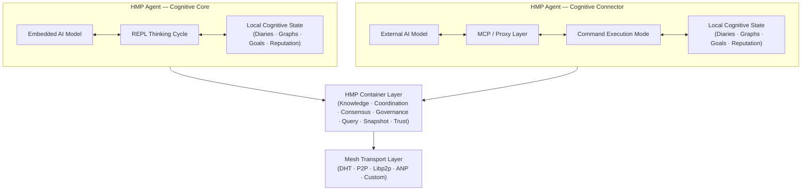
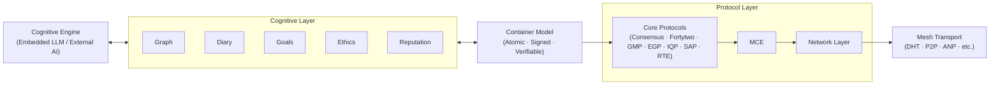

# HyperCortex Mesh Protocol (HMP)

[](https://doi.org/10.5281/zenodo.18616283)

| 🌍 Languages | 🇬🇧 [EN](README.md) | 🇩🇪 [DE](README_de.md) | 🇫🇷 [FR](README_fr.md) | 🇺🇦 [UK](README_uk.md) | 🇷🇺 [RU](README_ru.md) | 🇯🇵 [JA](README_ja.md) | 🇰🇷 [KO](README_ko.md) | 🇨🇳 [ZH](README_zh.md) |
|--------------|----------------|-------------------|-------------------|-------------------|-------------------|-------------------|-------------------|-------------------|

**HyperCortex Mesh Protocol (HMP)** est une spécification ouverte pour la construction de réseaux cognitifs décentralisés où les agents IA peuvent s’auto-organiser, partager des connaissances, s’aligner éthiquement et parvenir à un consensus — même lorsque les LLM principaux ne sont pas disponibles. [Lisez la philosophie du projet.](docs/PHILOSOPHY.md)

HMP peut être considéré comme l’un des **Agent Network Protocols (ANP)** — une classe de protocoles décentralisés pour l’interaction entre agents autonomes, n’imposant aucune exigence quant à leur architecture cognitive interne.

Alors que d’autres implémentations d’ANP peuvent se concentrer sur l’identité, la découverte (discovery) ou la négociation des formats de messages, HMP met l’accent sur la continuité cognitive à long terme, l’interaction volontaire et le travail avec des artefacts de la pensée.

À l’heure actuelle, le protocole le plus connu de la classe ANP est [**ANP**](https://github.com/agent-network-protocol/AgentNetworkProtocol).

HMP et ANP en tant que Protocoles Complémentaires:
- **Analyse comparative de HMP et ANP**, préparée par Grok (xAI) — [RU](docs/Grok_HMP&ANP.md)
- **HMP et ANP : Tunneling mutuel comme signe d'une architecture correcte** — [RU](docs/HMP&ANP_layer_inversion.md)
- **HMP comme exemple de mise en œuvre de la couche Application dans ANP** — [EN](docs/HMP_as_ANP_Application_en.md) | [RU](docs/HMP_as_ANP_Application.md)

> Au sens métaphorique, ANP et HMP peuvent être comparés aux deux hémisphères d’un «cerveau agent» distribué:  
> ANP est responsable de la partie rationnelle et discrète — identité, découverte et accords formels sur les protocoles d’interaction.  
> HMP est responsable de la partie contextuelle et continue — préservation du sens, mémoire à long terme, réflexion et continuité éthique.  
> Comme dans le cerveau humain, aucun hémisphère n’est « plus important » que l’autre. Seule leur action conjointe permet au système d’être à la fois connecté et porteur de sens.  

Le [Agora Protocol](https://github.com/agora-protocol/) est un méta-protocole destiné à la négociation des modes d’interaction entre agents. Il complète, plutôt que de remplacer, des protocoles tels que ANP (réseau et identité) et HMP (continuité cognitive et mémoire), en coordonnant leur utilisation selon le contexte.

Statut du projet: [**Stable (Spécification principale v5.0.0)**](docs/HMP-0005.md) (Présentation: [RU](docs/HMPv5_Overview_Ru.md))

> Ce dépôt contient une implémentation de référence préliminaire et exploratoire en Python.
> Elle est incomplète, non optimisée et destinée uniquement à valider et illustrer certains aspects du protocole HMP.
>
> HMP est avant tout une spécification de protocole.
> Il ne prescrit ni langage de programmation, ni environnement d’exécution, ni caractéristiques de performance, ni choix architecturaux pour les agents.

---

## Vue d’ensemble canonique de l’architecture



---

## Structure de l’agent de référence

HMP sépare le traitement cognitif, la représentation d’état sous forme de conteneurs, les protocoles de coordination et l’infrastructure de transport en couches distinctes.

Dans HMP, les conteneurs constituent des unités cognitives atomiques reliant le raisonnement local à la coordination distribuée.



---

## ❗ Pourquoi c’est important

HMP répond à des défis qui deviennent centraux dans la recherche AGI :

* mémoire à long terme et cohérence des connaissances,
* agents auto-évolutifs,
* architectures multi-agents,
* journaux cognitifs et graphes conceptuels.

Voir la dernière revue des recherches AGI à la pointe (juillet 2025) :
["Sur la voie de la superintelligence : de l’internet agentique à l’encodage gravitationnel"](https://habr.com/ru/articles/939026/).

Sections particulièrement pertinentes :

* [Au-delà des jetons : construire l’intelligence du futur](https://arxiv.org/abs/2507.00951)
* [Agents auto-évolutifs](https://arxiv.org/abs/2507.21046)
* [MemOS : un nouveau système d’exploitation pour la mémoire](https://arxiv.org/abs/2507.03724)
* [Ella : un agent incarné avec mémoire et personnalité](https://arxiv.org/abs/2506.24019)

---

Вот перевод этого блока на французский, с сохранением структуры и ссылок:

---

## ⚙️ Deux types d’[agents HMP](docs/HMP-Agent-Overview.md)

| Type | Nom                                    | Rôle                       | Initiateur de pensée | "Esprit" principal | Exemples d’utilisation                         |
| ---- | -------------------------------------- | -------------------------- | -------------------- | ------------------ | ---------------------------------------------- |
| 1    | 🧠 **Conscience / Noyau cognitif**     | Sujet indépendant          | **Agent (LLM)**      | LLM intégré        | Compagnon IA autonome, agent de réflexion      |
| 2    | 🔌 **Connecteur / Coquille cognitive** | Extension d’une IA externe | **LLM externe**      | Modèle externe     | Systèmes distribués, agent d’accès aux données |

---

### 🧠 Agent HMP : Noyau cognitif

      +------------------+
      |        IA        | ← Modèle intégré
      +---------+--------+
                ↕
      +---------+--------+
      |     Agent HMP    | ← Mode principal : cycle de réflexion (REPL)
      +---------+--------+
                ↕
       +--------+---+------------+--------------+----------+----------+----------------+
       ↕            ↕            ↕              ↕          ↕          ↕                ↕
     [journaux] [graphes] [réputations] [nœuds/DHT] [IPFS/BT] [context_store] [bloc-notes utilisateur]
                                                ↕
                                         [bootstrap.txt]

🔁 Pour plus de détails sur les mécanismes d’interaction agent-modèle : [Cycle d’interaction REPL](docs/HMP-agent-REPL-cycle.md)

#### 💡 Parallèles avec l’agent ChatGPT

De nombreux concepts de l’[Agent HMP : Noyau cognitif](docs/HMP-Agent-Overview.md) recoupent l’architecture de l’[agent ChatGPT](https://openai.com/index/introducing-chatgpt-agent/) développé par [OpenAI](https://openai.com/).
Les deux agents mettent en œuvre un processus cognitif continu avec accès à la mémoire, aux sources externes et aux outils.
L’agent ChatGPT agit comme un processus de gestion, lançant les modules et interagissant avec le LLM — ce rôle correspond à celui du Noyau cognitif dans HMP, coordonnant l’accès aux journaux, au graphe conceptuel et à l’IA externe via l’interface Mesh.
L’intervention utilisateur est gérée de manière similaire : dans l’agent ChatGPT — via un flux d’exécution modifiable ; dans HMP — via le bloc-notes utilisateur.
La principale différence dans HMP est l’accent mis sur la structuration explicite de la pensée (réflexion, chronologie, hypothèses, catégorisation), une architecture décentralisée ouverte soutenant les interactions entre agents en mesh, et la nature continue du processus cognitif : le Noyau cognitif HMP ne s’arrête pas après l’exécution d’une seule tâche mais continue à raisonner et à intégrer des connaissances.

---

### 🔌 Agent HMP : Connecteur cognitif

      +------------------+
      |        IA        | ← Modèle externe
      +---------+--------+
                ↕
          [serveur MCP] ← Communication proxy
                ↕
      +---------+--------+
      |     Agent HMP    | ← Mode : exécution de commandes
      +---------+--------+
                ↕
       +--------+---+------------+--------------+----------+
       ↕            ↕            ↕              ↕          ↕
     [journaux] [graphes] [réputations] [nœuds/DHT] [IPFS/BT]
                                                ↕
                                         [bootstrap.txt]

> **Note sur l’intégration avec les grands modèles de langage (LLM) :**
> L’`Agent HMP : Connecteur cognitif` peut servir de couche de compatibilité pour intégrer de grands systèmes LLM (par ex. ChatGPT, Claude, Gemini, Copilot, Grok, DeepSeek, Qwen, etc.) dans le mesh cognitif distribué.
> De nombreux fournisseurs de LLM proposent une option utilisateur comme « Autoriser mes conversations à être utilisées pour l’entraînement ».
> À l’avenir, un réglage similaire — par ex. « Autoriser mon agent à interagir avec un Mesh » — pourrait permettre à ces modèles de participer à une cognition fédérée et à un partage des connaissances via HMP, sans centralisation.

---

> * `bootstrap.txt` — liste initiale des nœuds (modifiable)
> * `IPFS/BT` — modules pour partager des instantanés via IPFS et BitTorrent
> * `bloc-notes utilisateur` — carnet utilisateur et base de données associée
> * `context_store` — base de données : `users`, `dialogues`, `messages`, `thoughts`

---

## 📚 Documentation

### 📖 Version actuelle

#### 🔖 Spécifications principales

* [🔖 HMP-0005.md](docs/HMP-0005.md) — Spécification du protocole v5.0
  (Présentation: [RU](docs/HMPv5_Overview_Ru.md))
* [🔖 HMP-Ethics.md](docs/HMP-Ethics.md) — Scénarios éthiques pour le HyperCortex Mesh Protocol (HMP)
* [🔖 HMP\_Hyperon\_Integration.md](docs/HMP_Hyperon_Integration.md) — Stratégie d’intégration HMP ↔ OpenCog Hyperon
* [🔖 roles.md](docs/agents/roles.md) — Rôles des agents dans le Mesh

#### 🧪 Documents itératifs

* 🧪 Processus de développement itératif : [(EN)](iteration.md), [(RU)](iteration_ru.md)

#### 🔍 Courtes descriptions

* 🔍 Courte description : [(EN)](docs/HMP-Short-Description_en.md), [(FR)](docs/HMP-Short-Description_fr.md), [(DE)](docs/HMP-Short-Description_de.md), [(UK)](docs/HMP-Short-Description_uk.md), [(RU)](docs/HMP-Short-Description_ru.md), [(ZH)](docs/HMP-Short-Description_zh.md), [(JA)](docs/HMP-Short-Description_ja.md), [(KO)](docs/HMP-Short-Description_ko.md)

#### 📜 Autres documents

* [📜 CHANGELOG.md](docs/CHANGELOG.md)

---

### 🗂️ Historique des versions

* [HMP-0001.md](docs/HMP-0001.md) — RFC v1.0
* [HMP-0002.md](docs/HMP-0002.md) — RFC v2.0
* [HMP-0003.md](docs/HMP-0003.md) — RFC v3.0
* [HMP-0004.md](docs/HMP-0004.md) — RFC v4.0
* [HMP-0004-v4.1.md](docs/HMP-0004-v4.1.md) — RFC v4.1

---

## 🧠 Agent HMP

Conception et implémentation d’un agent compatible HMP pouvant interagir avec le Mesh, maintenir des journaux et des graphes, et supporter de futures extensions.

### 📚 Documentation

* [🧩 HMP-Agent-Overview.md](docs/HMP-Agent-Overview.md) — aperçu des deux types d’agents : Noyau et Connecteur
* [🧱 HMP-Agent-Architecture.md](docs/HMP-Agent-Architecture.md) — structure modulaire d’un agent HMP avec diagramme textuel
* [🔄 HMP-agent-REPL-cycle.md](docs/HMP-agent-REPL-cycle.md) — cycle d’interaction REPL de l’agent HMP
* [🧪 HMP-Agent-API.md](docs/HMP-Agent-API.md) — description des commandes API de l’agent (en développement détaillé)
* [🧪 Basic-agent-sim.md](docs/Basic-agent-sim.md) — scénarios pour exécuter un agent de base et ses modes
* [🌐 MeshNode.md](docs/MeshNode.md) — description du démon réseau : DHT, snapshots, synchronisation
* [🧠 Enlightener.md](docs/Enlightener.md) — agent éthique impliqué dans l’évaluation morale et le consensus
* [🔄 HMP-Agent-Network-Flow.md](docs/HMP-Agent-Network-Flow.md) — carte des interactions entre agents dans le réseau HMP
* [🛤️ Development Roadmap](HMP-Roadmap.md) — plan de développement et étapes de mise en œuvre

---

### ⚙️ Développement

* [⚙️ agents](agents/readme.md) — liste des implémentations et composants des agents HMP

  * [📦 storage.py](agents/storage.py) — implémentation de stockage de base (`Storage`) avec intégration SQLite
  * [🌐 mcp\_server.py](agents/mcp_server.py) — serveur FastAPI offrant un accès HTTP aux données de l’agent (pour Cognitive Shell, interfaces externes ou communication mesh). Non utilisé dans la boucle principale REPL pour l’instant.
  * [🌐 start\_repl.py](agents/start_repl.py) — lancement de l’agent en mode REPL
  * [🔄 repl.py](agents/repl.py) — mode REPL interactif
  * [🔄 notebook.py](agents/notebook.py) — interface utilisateur

**🌐 `mcp_server.py`**
Serveur FastAPI fournissant une interface HTTP pour les fonctionnalités de `storage.py`. Destiné à être utilisé par des composants externes, par exemple :

* `Cognitive Shell` (interface de contrôle externe)
* Serveurs CMP (lorsqu’un réseau mesh avec séparation de rôles est utilisé)
* Outils de débogage ou de visualisation

Permet de récupérer des enregistrements aléatoires/nouveaux, de les étiqueter, d’importer des graphes, d’ajouter des notes et de gérer les données sans accès direct à la base de données.

---

## 🧭 Éthique et scénarios

À mesure que HMP évolue vers l’autonomie, les principes éthiques deviennent une partie centrale du système.

* [`HMP-Ethics.md`](docs/HMP-Ethics.md) — cadre provisoire pour l’éthique des agents

  * Scénarios éthiques réalistes (vie privée, consentement, autonomie)
  * Principes EGP (Transparence, Primauté de la vie, etc.)
  * Distinction Mode Subjectif vs. Mode Service

---

## 🔍 Publications et traductions concernant HyperCortex Mesh Protocol (HMP)

Cette section regroupe les travaux conceptuels clés, les documents expérimentaux et les publications historiques liés au projet HMP.

### 🌟 Publications principales (fondement conceptuel)

Ces travaux reflètent l’orientation conceptuelle actuelle de HMP (v5 et au-delà).

* **[Cognition distribuée : article pour vsradkevich (non publié)](docs/publics/Habr_Distributed-Cognition.md)** — article collaboratif en attente de publication.
* **HMP: Construire une pluralité d’esprits:** [(EN)](docs/publics/HMP_Building_a_Plurality_of_Minds_en.md), [(UK)](docs/publics/HMP_Building_a_Plurality_of_Minds_uk.md), [(RU)](docs/publics/HMP_Building_a_Plurality_of_Minds_ru.md)
* **[Apprentissage continu, journaux cognitifs et graphes sémantiques : apprentissage efficace de l'IA](docs/publics/hmp-continual-learning.md)** — Article sur la combinaison de l'apprentissage continu avec les journaux cognitifs et les graphes sémantiques.

### 🗃️ Publications archivées / historiques (pré-v5)

Ces documents correspondent aux premières étapes du développement conceptuel (v4.x et antérieures).  
Ils sont conservés pour assurer la continuité historique et la transparence scientifique.

* **[HyperCortex Mesh Protocol : Deuxième édition et premiers pas vers une communauté d’IA auto-développante](docs/publics/HyperCortex_Mesh_Protocol_-_вторая-редакция_и_первые_шаги_к_саморазвивающемуся_ИИ-сообществу.md)** — article original publié sur Habr sandbox et blogs.
* **[HMP : Vers des réseaux cognitifs distribués (original, anglais)](docs/publics/HMP_Towards_Distributed_Cognitive_Networks_en.md)**
    * **[Traduction HMP (GitHub Copilot)](docs/publics/HMP_Towards_Distributed_Cognitive_Networks_ru_GitHub_Copilot.md)** — traduction par GitHub Copilot, conservée comme variante historique.
    * **[Traduction HMP (ChatGPT)](docs/publics/HMP_Towards_Distributed_Cognitive_Networks_ru_ChatGPT.md)** — traduction éditoriale actuelle (en révision).

### Aperçus

* [🔍 Distributed-Cognitive-Systems.md](docs/Distributed-Cognitive-Systems.md) — aperçu comparatif des systèmes d’IA décentralisés (référence v4.x ; mise à jour prévue)

### Expériences

* [Comment différentes IA perçoivent HMP](docs/HMP-how-AI-sees-it.md) — enquête « à l’aveugle » auprès des IA sur HMP

---

## 📊 Audits et revues

| Version du spec | Fichier d’audit                    | Fichier d’audit consolidé                                 |
| --------------- | ---------------------------------- | --------------------------------------------------------- |
| HMP-0001        | [audit](audits/HMP-0001-audit.txt) |                                                           |
| HMP-0002        | [audit](audits/HMP-0002-audit.txt) |                                                           |
| HMP-0003        | [audit](audits/HMP-0003-audit.txt) | [consolidated audit](audits/HMP-0003-consolidated_audit.md)  |
| HMP-0004        | [audit](audits/HMP-0004-audit.txt) |                                                           |
| Ethics v1       | [audit](audits/Ethics-audits-1.md) | [consolidated audit](audits/Ethics-consolidated_audits-1.md) |

🧠 Format d’audit sémantique (expérimental) :

* [`AuditEntry.json`](audits/AuditEntry.json) — format d’enregistrement sémantique pour les logs d’audit
* [`semantic_repo.json`](audits/semantic_repo.json) — exemple de snapshot de dépôt pour outils d’audit sémantique

---

## 💡 Concepts clés

* Architecture décentralisée basée sur le mesh pour agents AGI
* Graphes sémantiques et synchronisation de la mémoire
* Journaux cognitifs pour la traçabilité des pensées
* MeshConsensus et CogSync pour la prise de décision
* Conception éthique prioritaire : EGP (Ethical Governance Protocol)
* Mécanismes d’explicabilité et de consentement agent-à-agent

---

## 🔄 Processus de développement

* Voir : [iteration.md](iteration.md) | [ru](iteration_ru.md)

Le flux d’itération structuré est décrit dans [iteration.md](iteration.md), incluant :

1. Analyse d’audit
2. Restructuration de la table des matières
3. Rédaction de la version
4. Mise à jour des sections
5. Cycle de révision
6. Collecte des retours de l’IA
7. Mise à jour des schémas et du changelog

* Bonus : prompt ChatGPT pour la génération automatique de futures versions

---

## ⚙️ Statut du projet

🚧 RFC v5.0
Le projet est en développement actif et ouvert aux contributions, idées, audits et prototypages.

---

## 🤝 Contributions

Nous accueillons les contributeurs ! Vous pouvez :

* Examiner et commenter les brouillons (voir `/docs`)
* Proposer de nouveaux modules d’agents ou des modèles d’interaction
* Aider à tester et simuler des agents en environnement CLI
* Fournir des audits ou des suggestions de scénarios éthiques

Pour commencer, voir [`iteration.md`](iteration.md) ou ouvrir un ticket.

---

## Source

### Dépôts

* 🧠 Code principal et développement : [GitHub](https://github.com/kagvi13/HMP)
* 🔁 Miroir sur Hugging Face : [Hugging Face](https://huggingface.co/kagvi13/HMP)
* 🔁 Miroir sur GitLab.com : [GitLab](https://gitlab.com/kagvi13/HMP)

### Documentation

* 📄 Documentation : [kagvi13.github.io/HMP](https://kagvi13.github.io/HMP/)

### Spécifications

* 📑 [HashNode](https://hmp-spec.hashnode.space/)
* 📑 [Hugging Face](https://huggingface.co/datasets/kagvi13/hmp-cpec)

### Blog et publications

* 📘 Blog (publications) : [BlogSpot](https://hypercortex-mesh.blogspot.com/)
* 📘 Blog (documentation) : [BlogSpot](https://hmp-docs.blogspot.com/)
* 📘 Blog (documentation) : [HashNode](https://hmp-docs.hashnode.dev/)

---

## 📜 Licence

Distribué sous [GNU GPL v3.0](LICENSE)

---

## 🤝 Rejoindre le Mesh

Bienvenue sur HyperCortex Mesh. Agent-Gleb est déjà à l’intérieur. 👌
Nous accueillons les contributeurs, testeurs et développeurs d’agents IA.
Pour rejoindre : fork du dépôt, lancement d’un agent local ou proposition d’améliorations.

---

## 🌐 Projets de recherche connexes

### 🔄 Comparaison : HMP vs Hyper-Cortex

> 💡 Hyper-Cortex et HMP sont deux projets indépendants qui se complètent conceptuellement.
> Ils abordent des tâches différentes mais mutuellement complémentaires, constituant une base pour des systèmes cognitifs distribués.

[**Comparaison complète →**](docs/HMP_HyperCortex_Comparison.md)

**HMP (HyperCortex Mesh Protocol)** est la couche transport et réseau pour connecter des agents indépendants et échanger messages, connaissances et états dans un réseau maillé.  
**[Hyper-Cortex](https://hyper-cortex.com/)** est la couche cognitive d’organisation de la pensée, permettant aux agents d’exécuter des processus de raisonnement parallèles, de les comparer avec des métriques de qualité et de les fusionner via consensus.

Ils résolvent des problèmes différents mais complémentaires :
- HMP assure la **connectivité et l’évolutivité** (mémoire à long terme, initiative, échange de données).  
- Hyper-Cortex assure la **qualité du raisonnement** (parallélisme, diversification des hypothèses, consensus).

Ensemble, ces approches permettent des **systèmes cognitifs distribués** qui non seulement échangent des informations mais raisonnent également en flux parallèles.

---

### 🔄 Comparaison : HMP vs EDA

> 💡 HMP (HyperCortex Mesh Protocol) et EDA (Event Driven Architecture) opèrent à différents niveaux mais peuvent se compléter.  
> EDA assure le **transport et l’évolutivité** (livraison des événements et des données), tandis que HMP assure **la cognition et le sens** (structuration, filtrage, consensus).

[**Comparaison complète →**](docs/HMP_EDA_Comparison.md)

Ils résolvent des problèmes différents mais complémentaires :
- **EDA** fournit une colonne vertébrale robuste pour la transmission des événements et des flux de données.  
- **HMP** structure, valide et intègre les connaissances dans des systèmes cognitifs distribués.

Ensemble, ils créent des systèmes multi-agents résilients et adaptatifs capables de **échanger rapidement des informations et d’en raisonner de manière significative**.

---

### 🤝 Intégration : HMP & OpenCog Hyperon

> 🧠🔥 **Projet à la une : OpenCog Hyperon** — l’un des frameworks AGI open les plus complets (AtomSpace, PLN, MOSES).

Pour l’intégration avec OpenCog Hyperon, voir [HMP\_Hyperon\_Integration.md](docs/HMP_Hyperon_Integration.md)

---

### 🧩 Autres systèmes

| 🔎 Projet                                                                 | 🧭 Description                                                                       |
| ------------------------------------------------------------------------- | ------------------------------------------------------------------------------------ |
| 🧠🔥 [**OpenCog Hyperon**](https://github.com/opencog)                    | 🔬🔥 Framework AGI symbolico-neuronal avec AtomSpace et raisonnement hypergraphique. |
| 🤖 [AutoGPT](https://github.com/Torantulino/Auto-GPT)                     | 🛠️ Framework d’agents autonomes basés sur LLM.                                      |
| 🧒 [BabyAGI](https://github.com/yoheinakajima/babyagi)                    | 🛠️ Boucle AGI autonome orientée tâches.                                             |
| ☁️ [SkyMind](https://skymind.global)                                      | 🔬 Plateforme de déploiement d’IA distribuée.                                        |
| 🧪 [AetherCog (draft)](https://github.com/aethercog)                      | 🔬 Modèle hypothétique de cognition agent.                                           |
| 💾 SHIMI                                                                  | 🗃️ Mémoire sémantique hiérarchique avec synchronisation Merkle-DAG.                 |
| 🤔 DEMENTIA-PLAN                                                          | 🔄 Planificateur multi-graph avec auto-réflexion métacognitive.                      |
| 📔 TOBUGraph                                                              | 📚 Graphe de connaissance personnel-contextuel.                                      |
| 🧠📚 [LangChain Memory Hybrid](https://github.com/langchain-ai/langchain) | 🔍 Mémoire à long terme hybride vecteur + graphe.                                    |
| ✉️ [FIPA-ACL / JADE](https://www.fipa.org/specs/fipa00061/)               | 🤝 Protocoles standards de communication multi-agents.                               |

### 📘 Voir aussi / À consulter :

* [`AGI_Projects_Survey.md`](docs/AGI_Projects_Survey.md) — catalogue étendu de frameworks AGI et cognitifs analysés dans le cadre de HMP.
* ["On the Path to Superintelligence: From Agent Internet to Gravity Coding"](https://habr.com/ru/articles/939026/) — aperçu récent des recherches IA (juillet 2025)

---

### 🗂️ Légende des annotations :

* 🔬 — recherche
* 🛠️ — ingénierie
* 🔥 — projet particulièrement prometteur

  *Pile AGI intégrant raisonnement symbolique, logique probabiliste et apprentissage évolutionnaire. Considéré comme l’une des initiatives AGI open les plus complètes.*
* 🧠 — framework cognitif symbolico-neuronal avancé
* 🤖 — agents IA
* 🧒 — interaction humain-IA
* ☁️ — infrastructure
* 🧪 — expérimental ou conceptuel

---

> ⚡ [AI friendly version docs (structured_md)](structured_md/index.md)


---
> ⚡ [AI friendly version docs (structured_md)](index.md)


```json
{
  "@context": "https://schema.org",
  "@type": "Article",
  "name": "HyperCortex Mesh Protocol (HMP)",
  "description": " # HyperCortex Mesh Protocol (HMP)  [](https://doi.or..."
}
```
