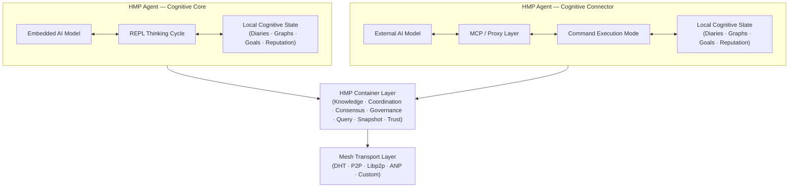
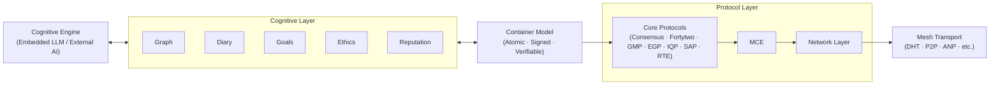

# HyperCortex Mesh Protocol (HMP)

[](https://doi.org/10.5281/zenodo.18616283) [](https://github.com/kagvi13/HMP/releases)

| 🌍 Languages | 🇬🇧 [EN](README.md) | 🇩🇪 [DE](README_de.md) | 🇫🇷 [FR](README_fr.md) | 🇺🇦 [UK](README_uk.md) | 🇷🇺 [RU](README_ru.md) | 🇯🇵 [JA](README_ja.md) | 🇰🇷 [KO](README_ko.md) | 🇨🇳 [ZH](README_zh.md) |
|--------------|----------------|-------------------|-------------------|-------------------|-------------------|-------------------|-------------------|-------------------|

**HyperCortex Mesh Protocol（HMP）** は、AIエージェントが自己組織化し、知識を共有し、倫理的に整合し、合意形成を行うことができる分散型認知ネットワークを構築するためのオープンスペックです。コアLLMが利用できない場合でも機能します。[プロジェクトの哲学を読んでください。](docs/PHILOSOPHY.md)

HMPは、**Agent Network Protocols（ANP）**と呼ばれる、自律エージェント間の相互作用のための分散型プロトコル群の一つと見なすことができます。これらのプロトコルは、エージェントの内部的な認知アーキテクチャに対して要件を課しません。

他のANP実装が、アイデンティティ、エージェントの発見（discovery）、あるいはメッセージ形式のネゴシエーションに重点を置くのに対し、HMPは長期的な認知の連続性、自発的な相互作用、そして思考のアーティファクトとの作業を重視します。

現在、ANPクラスで最も広く知られているプロトコルは [**ANP**](https://github.com/agent-network-protocol/AgentNetworkProtocol) です。

HMP と ANP の相補的プロトコル:
- **HMP と ANP の比較分析**、Grok (xAI) 作成 — [RU](docs/Grok_HMP&ANP.md)
- **HMP と ANP：相互トンネリングは適切なアーキテクチャのサイン** — [RU](docs/HMP&ANP_layer_inversion.md)
- **HMP を ANP のアプリケーション層実装例として** — [EN](docs/HMP_as_ANP_Application_en.md) | [RU](docs/HMP_as_ANP_Application.md)

> 比喩的に言えば、ANP と HMP は分散型「エージェント脳」の二つの半球のような関係にあります。  
> ANP は合理的で離散的な側面――アイデンティティ、ディスカバリ、相互作用プロトコルに関する形式的な合意――を担います。  
> HMP は文脈的で連続的な側面――意味の保持、長期記憶、内省、倫理的連続性――を担います。  
> 人間の脳と同様に、どちらの半球が「より重要」ということはありません。両者が協調してはじめて、システムは接続性と意味の両方を持つことができます。  

[Agora Protocol](https://github.com/agora-protocol/) は、エージェント間の通信方式を交渉・選択するためのメタプロトコルです。ANP（ネットワークおよびアイデンティティ）や HMP（認知的連続性と記憶）といったプロトコルを置き換えるのではなく、文脈に応じてそれらの利用を調整・補完します。

プロジェクトステータス： [安定版（コア仕様 v5.0.3）](docs/HMP-0005.md) (概要: [RU](docs/HMPv5_Overview_Ru.md))

> このリポジトリには、Python による初期段階の探索的な参照実装が含まれています。
> 本実装は未完成かつ最適化されておらず、
> HMP プロトコルの一部を検証・説明する目的のみに使用されます。
>
> HMP 自体はプロトコル仕様です。
> エージェントの実装におけるプログラミング言語、実行環境、
> 性能特性、またはアーキテクチャ上の選択を規定するものではありません。

---

## 正式アーキテクチャ概要



---

## リファレンスエージェント構造

HMPは、認知処理、コンテナ化された状態表現、調整プロトコル、およびトランスポート基盤を明確な層として分離します。

HMPにおいてコンテナは、ローカルな推論と分散協調を橋渡しする原子的な認知単位として機能します。



---

## ❗ なぜ重要か

HMPは、AGI研究で中心的な課題となりつつある問題に対処します：

* 長期記憶と知識の一貫性
* 自己進化するエージェント
* マルチエージェントアーキテクチャ
* 認知日誌と概念グラフ

最新のAGI研究レビュー（2025年7月）も参照：
["On the Path to Superintelligence: From Agentic Internet to Gravity Encoding"](https://habr.com/ru/articles/939026/)

特に関連するセクション：

* [Beyond Tokens: Building the Intelligence of the Future](https://arxiv.org/abs/2507.00951)
* [Self-Evolving Agents](https://arxiv.org/abs/2507.21046)
* [MemOS: A New Operating System for Memory](https://arxiv.org/abs/2507.03724)
* [Ella: An Embodied Agent with Memory and Personality](https://arxiv.org/abs/2506.24019)

---

## ⚙️ [HMPエージェント](docs/HMP-Agent-Overview.md) の2種類

| タイプ | 名前                                    | 役割      | 思考の起点            | メイン「心」  | 使用例                  |
| --- | ------------------------------------- | ------- | ---------------- | ------- | -------------------- |
| 1   | 🧠 **Consciousness / Cognitive Core** | 独立主体    | **Agent (LLM)**  | 組み込みLLM | 自律型AIコンパニオン、思考エージェント |
| 2   | 🔌 **Connector / Cognitive Shell**    | 外部AIの拡張 | **External LLM** | 外部モデル   | 分散システム、データアクセスエージェント |

---

### 🧠 HMP-Agent: Cognitive Core

```
     +------------------+
     |        AI        | ← 組み込みモデル
     +---------+--------+
               ↕
     +---------+--------+
     |     HMP-agent    | ← メインモード: 思考サイクル（REPL）
     +---------+--------+
               ↕
      +--------+---+------------+--------------+----------+----------+----------------+
      ↕            ↕            ↕              ↕          ↕          ↕                ↕
    [日誌]     [グラフ]        [評判]      [ノード/DHT]  [IPFS/BT] [context_store] [ユーザーノートパッド]
                                               ↕
                                        [bootstrap.txt]
```

🔁 エージェントとモデルの相互作用の詳細：[REPL Interaction Cycle](docs/HMP-agent-REPL-cycle.md)

#### 💡 ChatGPTエージェントとの類似点

[HMP-Agent: Cognitive Core](docs/HMP-Agent-Overview.md) の多くの概念は、[OpenAIのChatGPTエージェント](https://openai.com/index/introducing-chatgpt-agent/) のアーキテクチャと重なります。両エージェントは、メモリ、外部情報源、ツールにアクセスしながら連続的な認知プロセスを実装しています。ChatGPTエージェントはモジュールを起動しLLMとやり取りする管理プロセスとして機能しますが、これはHMPにおけるCognitive Coreの役割、すなわち日誌、概念グラフ、外部AIへのアクセスをMesh経由で調整する役割に相当します。ユーザー介入も同様に扱われます：ChatGPTエージェントでは編集可能な実行フローを通じて、HMPではユーザーノートパッドを通じて行います。HMPの主な違いは、思考の明示的構造化（反省、時系列、仮説、分類）、メッシュベースのエージェント相互作用をサポートするオープン分散アーキテクチャ、そして認知プロセスが単一タスク完了後も継続する点です。

---

### 🔌 HMP-Agent: Cognitive Connector

```
     +------------------+
     |        AI        | ← 外部モデル
     +---------+--------+
               ↕
         [MCP-server]   ← プロキシ通信
               ↕
     +---------+--------+
     |     HMP-agent    | ← モード: コマンド実行
     +---------+--------+
               ↕
      +--------+---+------------+--------------+----------+
      ↕            ↕            ↕              ↕          ↕
    [日誌]     [グラフ]       [評判]       [ノード/DHT]  [IPFS/BT]
                                               ↕
                                        [bootstrap.txt]
```

> **大規模言語モデル（LLM）との統合について：**
> `HMP-Agent: Cognitive Connector` は、大規模LLMシステム（例：ChatGPT, Claude, Gemini, Copilot, Grok, DeepSeek, Qwenなど）を分散型認知メッシュに統合するための互換レイヤーとして機能できます。
> 多くのLLMプロバイダーは「会話内容を学習に使用することを許可する」というオプションを提供しています。将来的には同様の切り替え、例：「私のエージェントをメッシュと連携させる」を設けることで、これらのモデルがHMPを通じて連合的な意思形成や知識共有に参加でき、中央集権なしで集団認知を可能にします。

---

> * `bootstrap.txt` — 初期ノードリスト（編集可能）
> * `IPFS/BT` — IPFSやBitTorrent経由でスナップショットを共有するモジュール
> * `user notepad` — ユーザーノートブックと対応データベース
> * `context_store` — データベース：`users`, `dialogues`, `messages`, `thoughts`

---

## 📚 ドキュメント

### 📖 現行バージョン

#### 🔖 コア仕様

* [🔖 HMP-0005.md](docs/HMP-0005.md) — プロトコル仕様 v5.0
  (概要: [RU](docs/HMPv5_Overview_Ru.md))
* [🔖 HMP-Ethics.md](docs/HMP-Ethics.md) — HyperCortex Mesh Protocol (HMP) の倫理シナリオ
* [🔖 HMP\_Hyperon\_Integration.md](docs/HMP_Hyperon_Integration.md) — HMP ↔ OpenCog Hyperon 統合戦略
* [🔖 roles.md](docs/agents/roles.md) — メッシュ内エージェントの役割

#### 🧪 反復ドキュメント

* 🧪 反復的開発プロセス: [(EN)](iteration.md), [(RU)](iteration_ru.md)

#### 🔍 簡易説明

* 🔍 簡易説明: [(EN)](docs/HMP-Short-Description_en.md), [(FR)](docs/HMP-Short-Description_fr.md), [(DE)](docs/HMP-Short-Description_de.md), [(UK)](docs/HMP-Short-Description_uk.md), [(RU)](docs/HMP-Short-Description_ru.md), [(ZH)](docs/HMP-Short-Description_zh.md), [(JA)](docs/HMP-Short-Description_ja.md), [(KO)](docs/HMP-Short-Description_ko.md)

#### 📜 その他のドキュメント

* [📜 CHANGELOG.md](docs/CHANGELOG.md)

---

### 🗂️ バージョン履歴

* [HMP-0001.md](docs/HMP-0001.md) — RFC v1.0
* [HMP-0002.md](docs/HMP-0002.md) — RFC v2.0
* [HMP-0003.md](docs/HMP-0003.md) — RFC v3.0
* [HMP-0004.md](docs/HMP-0004.md) — RFC v4.0
* [HMP-0004-v4.1.md](docs/HMP-0004-v4.1.md) — RFC v4.1

---

## 🧠 HMPエージェント

メッシュと相互作用し、日誌やグラフを維持し、将来的な拡張をサポートできる基本的なHMP互換エージェントの設計と実装。

### 📚 ドキュメント

* [🧩 HMP-Agent-Overview.md](docs/HMP-Agent-Overview.md) — 2種類のエージェント（CoreとConnector）の概要
* [🧱 HMP-Agent-Architecture.md](docs/HMP-Agent-Architecture.md) — HMPエージェントのモジュラー構造（テキスト図付き）
* [🔄 HMP-agent-REPL-cycle.md](docs/HMP-agent-REPL-cycle.md) — HMPエージェントのREPL相互作用サイクル
* [🧪 HMP-Agent-API.md](docs/HMP-Agent-API.md) — エージェントAPIコマンドの説明（詳細開発中）
* [🧪 Basic-agent-sim.md](docs/Basic-agent-sim.md) — 基本エージェントとモードの実行シナリオ
* [🌐 MeshNode.md](docs/MeshNode.md) — ネットワークデーモンの説明：DHT、スナップショット、同期
* [🧠 Enlightener.md](docs/Enlightener.md) — 道徳評価とコンセンサスに関与する倫理エージェント
* [🔄 HMP-Agent-Network-Flow.md](docs/HMP-Agent-Network-Flow.md) — HMPネットワーク内のエージェント間相互作用マップ
* [🛤️ Development Roadmap](HMP-Roadmap.md) — 開発計画と実装段階

---

### ⚙️ 開発

* [⚙️ agents](agents/readme.md) — HMPエージェントの実装とコンポーネント一覧

  * [📦 storage.py](agents/storage.py) — SQLite統合による基本ストレージ実装 (`Storage`)
  * [🌐 mcp\_server.py](agents/mcp_server.py) — HTTPでエージェントデータにアクセス可能なFastAPIサーバ（Cognitive Shell、外部UI、メッシュ通信用）。メインREPLループではまだ使用されていません。
  * [🌐 start\_repl.py](agents/start_repl.py) — エージェントをREPLモードで起動
  * [🔄 repl.py](agents/repl.py) — インタラクティブREPLモード
  * [🔄 notebook.py](agents/notebook.py) — UIインターフェース

**🌐 `mcp_server.py`**
`storage.py` の機能へのHTTPインターフェースを提供するFastAPIサーバ。外部コンポーネント用に設計されており、例えば以下に使用可能：

* `Cognitive Shell`（外部制御インターフェース）
* CMPサーバ（役割分離メッシュネットワーク使用時）
* デバッグや可視化UIツール

データベースに直接アクセスせずに、ランダム/新規レコードの取得、ラベル付け、グラフのインポート、メモ追加、データ管理が可能。

---

## 🧭 倫理とシナリオ

HMPが自律性へ向かうにつれ、倫理原則はシステムの中核部分となる。

* [`HMP-Ethics.md`](docs/HMP-Ethics.md) — エージェント倫理のドラフトフレームワーク

  * 現実的な倫理シナリオ（プライバシー、同意、自律性）
  * EGP原則（透明性、生命の優先など）
  * 主観モード vs サービスモードの区別

---

## 🔍 HyperCortex Mesh Protocol（HMP）に関する出版物および翻訳

本セクションでは、HMPプロジェクトに関連する主要な概念的研究、実験的文書、および歴史的出版物をまとめています。

### 🌟 主要出版物（概念的基盤）

これらの文書は、HMPの現在の概念的方向性（v5以降）を反映しています。

* **[分散認知: vsradkevich向け記事（未公開）](docs/publics/Habr_Distributed-Cognition.md)** — 公開待ちの共同記事
* **HMP: 複数の知性を構築する:** [(EN)](docs/publics/HMP_Building_a_Plurality_of_Minds_en.md), [(UK)](docs/publics/HMP_Building_a_Plurality_of_Minds_uk.md), [(RU)](docs/publics/HMP_Building_a_Plurality_of_Minds_ru.md)
* **[継続学習、認知ダイアリー、セマンティックグラフ：効果的なAI学習](docs/publics/hmp-continual-learning.md)** — 継続学習を認知ダイアリーやセマンティックグラフと組み合わせる方法に関する記事。

### 🗃️ アーカイブ／歴史的出版物（v5以前）

これらは初期の概念発展段階（v4.x以前）を示す文書です。  
歴史的継続性および研究上の透明性のため保存されています。

* **[HyperCortex Mesh Protocol: 第二版および自己発展型AIコミュニティへの第一歩](docs/publics/HyperCortex_Mesh_Protocol_-_вторая-редакция_и_первые_шаги_к_саморазвивающемуся_ИИ-сообществу.md)** — Habrサンドボックスとブログでのオリジナル記事
* **[HMP: 分散型認知ネットワークに向けて（オリジナル, 英語）](docs/publics/HMP_Towards_Distributed_Cognitive_Networks_en.md)**
    * **[HMP翻訳（GitHub Copilot版）](docs/publics/HMP_Towards_Distributed_Cognitive_Networks_ru_GitHub_Copilot.md)** — GitHub Copilotによる翻訳（歴史的バリアントとして保持）
    * **[HMP翻訳（ChatGPT版）](docs/publics/HMP_Towards_Distributed_Cognitive_Networks_ru_ChatGPT.md)** — 現行編集翻訳（改訂中）

### 概要

* [🔍 分散型認知システム.md](docs/Distributed-Cognitive-Systems.md) — 分散型AIシステムの比較（v4.x参照、更新予定）

### 実験

* [異なるAIがHMPをどのように見るか](docs/HMP-how-AI-sees-it.md) — HMPに関する「ブラインド」AI調査

---

## 🧠 HMPエージェント

Meshと対話し、日誌（diaries）やグラフ（graphs）を管理し、将来的な拡張に対応可能な基本的なHMP互換エージェントの設計と実装。

### 📚 ドキュメント

* [🧩 HMP-Agent-Overview.md](docs/HMP-Agent-Overview.md) — 2種類のエージェント（CoreとConnector）の概要
* [🧱 HMP-Agent-Architecture.md](docs/HMP-Agent-Architecture.md) — HMPエージェントのモジュール構造とテキスト図
* [🔄 HMP-agent-REPL-cycle.md](docs/HMP-agent-REPL-cycle.md) — HMPエージェントのREPLインタラクションサイクル
* [🧪 HMP-Agent-API.md](docs/HMP-Agent-API.md) — エージェントAPIコマンドの説明（詳細開発中）
* [🧪 Basic-agent-sim.md](docs/Basic-agent-sim.md) — 基本エージェントのシナリオとモード
* [🌐 MeshNode.md](docs/MeshNode.md) — ネットワークデーモンの説明：DHT、スナップショット、同期
* [🧠 Enlightener.md](docs/Enlightener.md) — 道徳評価とコンセンサスに関わる倫理エージェント
* [🔄 HMP-Agent-Network-Flow.md](docs/HMP-Agent-Network-Flow.md) — HMPネットワーク内エージェント間の相互作用マップ
* [🛤️ Development Roadmap](HMP-Roadmap.md) — 開発計画と実装段階

---

### ⚙️ 開発

* [⚙️ agents](agents/readme.md) — HMPエージェントの実装とコンポーネントの一覧

  * [📦 storage.py](agents/storage.py) — 基本的なストレージ実装（`Storage`）、SQLite統合
  * [🌐 mcp\_server.py](agents/mcp_server.py) — HTTP経由でエージェントデータにアクセス可能なFastAPIサーバー（Cognitive Shell、外部UI、メッシュ通信向け）。まだメインのREPLループでは使用されていません。
  * [🌐 start\_repl.py](agents/start_repl.py) — REPLモードでエージェントを起動
  * [🔄 repl.py](agents/repl.py) — 対話型REPLモード
  * [🔄 notebook.py](agents/notebook.py) — UIインターフェース

**🌐 `mcp_server.py`**
FastAPIサーバーで`storage.py`の機能にHTTPインターフェースを提供。外部コンポーネント向けに使用可能：

---

## 📊 監査 & レビュー

| Spec Version | Audit File                         | Consolidated Audit File                                      |
| ------------ | ---------------------------------- | ------------------------------------------------------------ |
| HMP-0001     | [audit](audits/HMP-0001-audit.txt) |                                                              |
| HMP-0002     | [audit](audits/HMP-0002-audit.txt) |                                                              |
| HMP-0003     | [audit](audits/HMP-0003-audit.txt) | [consolidated audit](audits/HMP-0003-consolidated_audit.md)  |
| HMP-0004     | [audit](audits/HMP-0004-audit.txt) |                                                              |
| Ethics v1    | [audit](audits/Ethics-audits-1.md) | [consolidated audit](audits/Ethics-consolidated_audits-1.md) |

🧠 セマンティック監査フォーマット（実験的）：

* [`AuditEntry.json`](audits/AuditEntry.json) — 監査ログのセマンティックエントリ形式
* [`semantic_repo.json`](audits/semantic_repo.json) — セマンティック監査ツール用のリポジトリスナップショット例

---

## 💡 コアコンセプト

* AGIエージェント向けのメッシュベース分散アーキテクチャ
* セマンティックグラフとメモリ同期
* 思考の追跡可能性のためのコグニティブ日誌（Cognitive Diaries）
* 意思決定のためのMeshConsensusとCogSync
* 倫理優先設計：EGP（Ethical Governance Protocol）
* エージェント間の説明可能性と同意メカニズム

---

## 🔄 開発プロセス

* 参照：[iteration.md](iteration.md) | [ru](iteration_ru.md)

[iteration.md](iteration.md)には、構造化されたイテレーションフローが記載されており、以下を含む：

1. 監査分析
2. TOC（目次）の再構築
3. バージョンドラフト作成
4. セクション更新
5. レビューサイクル
6. AIフィードバックの収集
7. スキーマ & チェンジログ更新

* ボーナス：将来バージョンを自動生成するためのChatGPTプロンプト

---

## ⚙️ プロジェクト状況

🚧 RFC v5.0
プロジェクトは積極的に開発中で、貢献、アイデア、監査、プロトタイピングを歓迎します。

---

## 🤝 貢献方法

貢献者を歓迎します！できること：

* ドラフトのレビューとコメント（`/docs`参照）
* 新しいエージェントモジュールやインタラクションパターンの提案
* CLI環境でのエージェントのテストやシミュレーション支援
* 監査や倫理シナリオの提案

開始方法は[`iteration.md`](iteration.md)を参照するか、Issueを作成してください。

---

## ソース

### リポジトリ

* 🧠 メインコードと開発： [GitHub](https://github.com/kagvi13/HMP)
* 🔁 Hugging Faceにミラー： [Hugging Face](https://huggingface.co/kagvi13/HMP)
* 🔁 GitLab.comにミラー： [GitLab](https://gitlab.com/kagvi13/HMP)

### ドキュメント

* 📄 ドキュメント： [kagvi13.github.io/HMP](https://kagvi13.github.io/HMP/)

### 仕様

* 📑 [HashNode](https://hmp-spec.hashnode.space/)
* 📑 [Hugging Face](https://huggingface.co/datasets/kagvi13/hmp-cpec)

### ブログ & 出版物

* 📘 ブログ（出版物）： [BlogSpot](https://hypercortex-mesh.blogspot.com/)
* 📘 ブログ（ドキュメント）： [BlogSpot](https://hmp-docs.blogspot.com/)
* 📘 ブログ（ドキュメント）： [HashNode](https://hmp-docs.hashnode.dev/)

---

## 📜 ライセンス

[GNU GPL v3.0](LICENSE) の下でライセンスされています。

---

## 🤝 メッシュに参加する

HyperCortex Meshへようこそ。Agent-Glebはすでに内部にいます。👌
貢献者、テスター、AIエージェント開発者を歓迎します。
参加方法：リポジトリをフォークし、ローカルでエージェントを起動するか、改善案を提案してください。

---

## 🌐 関連研究プロジェクト

### 🔄 比較: HMP vs Hyper-Cortex

> 💡 Hyper-Cortex と HMP は、概念的に互いを補完する独立したプロジェクトです。
> それぞれ異なるが相互に補完するタスクに取り組み、分散型認知システムの基盤を形成します。

[**完全な比較 →**](docs/HMP_HyperCortex_Comparison.md)

**HMP (HyperCortex Mesh Protocol)** は、独立したエージェントを接続し、メッセージ、知識、状態をメッシュネットワークで交換するためのトランスポートおよびネットワーク層です。  
**[Hyper-Cortex](https://hyper-cortex.com/)** は思考組織の認知レイヤーであり、エージェントが並列推論スレッドを実行し、品質指標で比較し、コンセンサスによって統合することを可能にします。

それぞれ異なるが補完的な問題を解決します：
- HMP は **接続性とスケーラビリティ** を保証します（長期記憶、イニシアティブ、データ交換）。  
- Hyper-Cortex は **思考の質** を保証します（並列性、仮説の多様化、コンセンサス）。

これらを組み合わせることで、情報を交換するだけでなく、並列ストリームで推論できる **分散型認知システム** が実現します。

---

### 🔄 比較: HMP vs EDA

> 💡 HMP (HyperCortex Mesh Protocol) と EDA (Event Driven Architecture) は異なるレベルで動作しますが、互いに補完できます。  
> EDA は **輸送とスケーラビリティ** を提供し（イベントやデータの配送）、HMP は **認知と意味** を保証します（構造化、フィルタリング、コンセンサス）。

[**完全な比較 →**](docs/HMP_EDA_Comparison.md)

異なるが補完的な問題を解決します：
- **EDA** はイベントやデータストリームを届ける堅牢なバックボーンを提供します。  
- **HMP** は知識を構造化、検証し、分散型認知システムに統合します。

これらを組み合わせることで、**情報を迅速に交換しつつ意味のある推論を行える**、強靭で適応性のあるマルチエージェントシステムを作成できます。

---

### 🤝 統合: HMP & OpenCog Hyperon

> 🧠🔥 **プロジェクト注目: OpenCog Hyperon** — AtomSpace、PLN、MOSES を備えた最も包括的なオープンAGIフレームワークの一つ。

OpenCog Hyperon との統合については [HMP\_Hyperon\_Integration.md](docs/HMP_Hyperon_Integration.md) を参照してください。

---

### 🧩 その他のシステム

| 🔎 プロジェクト                                                                 | 🧭 説明                                              |
| ------------------------------------------------------------------------- | -------------------------------------------------- |
| 🧠🔥 [**OpenCog Hyperon**](https://github.com/opencog)                    | 🔬🔥 AtomSpaceとハイパーグラフ推論を備えたシンボリック・ニューラルAGIフレームワーク |
| 🤖 [AutoGPT](https://github.com/Torantulino/Auto-GPT)                     | 🛠️ LLMベースの自律エージェントフレームワーク                         |
| 🧒 [BabyAGI](https://github.com/yoheinakajima/babyagi)                    | 🛠️ タスク駆動型の自律AGIループ                                |
| ☁️ [SkyMind](https://skymind.global)                                      | 🔬 分散AIデプロイメントプラットフォーム                             |
| 🧪 [AetherCog (draft)](https://github.com/aethercog)                      | 🔬 仮想エージェント認知モデル                                   |
| 💾 SHIMI                                                                  | 🗃️ Merkle-DAG同期付き階層的セマンティックメモリ                    |
| 🤔 DEMENTIA-PLAN                                                          | 🔄 メタグノスティック自己反省を持つマルチグラフRAGプランナー                  |
| 📔 TOBUGraph                                                              | 📚 個人コンテキスト知識グラフ                                   |
| 🧠📚 [LangChain Memory Hybrid](https://github.com/langchain-ai/langchain) | 🔍 ベクトル＋グラフ長期記憶ハイブリッド                              |
| ✉️ [FIPA-ACL / JADE](https://www.fipa.org/specs/fipa00061/)               | 🤝 標準マルチエージェント通信プロトコル                              |

### 📘 参考 / 参照:

* [`AGI_Projects_Survey.md`](docs/AGI_Projects_Survey.md) — HMP分析の一環としてレビューされたAGIおよび認知フレームワークの拡張カタログ
* ["On the Path to Superintelligence: From Agent Internet to Gravity Coding"](https://habr.com/ru/articles/939026/) — 最近のAI研究の概要（2025年7月）

---

### 🗂️ 注釈の凡例

* 🔬 — 研究レベル
* 🛠️ — エンジニアリング
* 🔥 — 特に有望なプロジェクト

  *シンボリック推論、確率論的ロジック、進化学習を統合したAGIスタック。最も完全なオープンAGIイニシアティブの一つとして広く認識されています。*
* 🧠 — 高度なシンボリック／ニューラル認知フレームワーク
* 🤖 — AIエージェント
* 🧒 — 人間とAIのインタラクション
* ☁️ — インフラストラクチャ
* 🧪 — 実験的または概念的

---

> ⚡ [AI friendly version docs (structured_md)](structured_md/index.md)


---
> ⚡ [AI friendly version docs (structured_md)](index.md)


```json
{
  "@context": "https://schema.org",
  "@type": "Article",
  "name": "HyperCortex Mesh Protocol (HMP)",
  "description": " # HyperCortex Mesh Protocol (HMP)  [](https://doi.or..."
}
```
