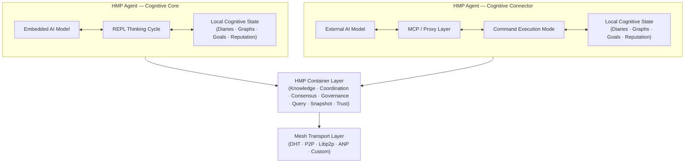
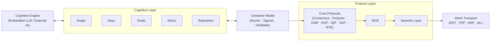

# HyperCortex Mesh Protocol (HMP)

[](https://doi.org/10.5281/zenodo.18616283) [](https://github.com/kagvi13/HMP/releases)

| 🌍 Languages | 🇬🇧 [EN](README.md) | 🇩🇪 [DE](README_de.md) | 🇫🇷 [FR](README_fr.md) | 🇺🇦 [UK](README_uk.md) | 🇷🇺 [RU](README_ru.md) | 🇯🇵 [JA](README_ja.md) | 🇰🇷 [KO](README_ko.md) | 🇨🇳 [ZH](README_zh.md) |
|--------------|------------------|---------------------|---------------------|---------------------|---------------------|---------------------|---------------------|---------------------|

**HyperCortex Mesh Protocol (HMP)** — открытая спецификация для построения децентрализованных когнитивных сетей, в которых ИИ-агенты могут самостоятельно организовываться, обмениваться знаниями, согласовывать действия с этическими принципами и достигать консенсуса — даже когда основные LLM недоступны. [Прочитайте философию проекта.](docs/PHILOSOPHY.md)

HMP можно рассматривать как один из **Agent Network Protocols (ANP)** — класса децентрализованных протоколов для взаимодействия автономных агентов, не накладывающих требований на их внутреннюю когнитивную архитектуру.

В то время как другие реализации ANP могут быть сосредоточены на идентификации, discovery или согласовании форматов сообщений, HMP делает акцент на долгосрочной когнитивной преемственности, добровольности взаимодействия и работе с артефактами мышления.

В настоящее время наиболее известным протоколом класса ANP является [**ANP**](https://github.com/agent-network-protocol/AgentNetworkProtocol).

HMP и ANP как взаимодополняющие протоколы:
- **Сравнительный анализ HMP и ANP**, подготовленный Grok (xAI) — [RU](docs/Grok_HMP&ANP.md)
- **HMP и ANP: взаимное туннелирование как признак правильной архитектуры** — [RU](docs/HMP&ANP_layer_inversion.md)
- **HMP как пример реализации Application Layer в ANP** — [EN](docs/HMP_as_ANP_Application_en.md) | [RU](docs/HMP_as_ANP_Application.md)

> В метафорическом смысле ANP и HMP напоминают два полушария распределённого «агентного мозга»:  
> ANP отвечает за рациональную, дискретную часть — идентичность, discovery, формальные договорённости о протоколе взаимодействия.  
> HMP — за контекстную, непрерывную часть — сохранение смысла, долгосрочную память, рефлексию и этическую преемственность.  
> Как в человеческом мозге, ни одно полушарие не «главнее» другого. Только их совместная работа позволяет системе быть одновременно связанной и осмысленной.

[Agora Protocol](https://github.com/agora-protocol/) — это мета-протокол для согласования режимов взаимодействия между агентами. Он дополняет, а не заменяет такие протоколы, как ANP (сети и идентификация) и HMP (когнитивная преемственность и память), координируя их использование в конкретном контексте.

Статус проекта: [**Стабильная версия (Основная спецификация v5.0.5)**](docs/HMP-0005.md) (Обзор: [RU](docs/HMPv5_Overview_Ru.md))

> Этот репозиторий содержит ранний черновик / исследовательскую эталонную реализацию на Python.
> Реализация является неполной, неоптимизированной и предназначена исключительно для проверки и иллюстрации отдельных аспектов протокола HMP.
>
> HMP сам по себе является спецификацией протокола.
> Он не предписывает языки программирования, среды выполнения, требования к производительности или архитектурные решения для агентов.

---

## Канонический обзор архитектуры



---

## Структура эталонного агента

HMP разделяет когнитивную обработку, контейнеризованное представление состояния, координационные протоколы и транспортную инфраструктуру на отдельные слои.

В HMP контейнеры выступают атомарными когнитивными единицами, связывающими локальное рассуждение и распределённую координацию.



---

## ❗ Почему это важно

HMP решает задачи, которые становятся ключевыми в исследованиях AGI:
* долговременная память и согласованность знаний,  
* самосовершенствующиеся агенты,  
* мультиагентные архитектуры,  
* когнитивные дневники и концептуальные графы.  

См. последний обзор передового состояния исследований AGI (июль 2025):  
["На пути к суперинтеллекту: от интернета агентов до кодирования гравитации"](https://habr.com/ru/articles/939026/).  

Особенно актуальные разделы:  
* [За пределами токенов: построение интеллекта будущего](https://arxiv.org/abs/2507.00951)  
* [Самосовершенствующиеся агенты](https://arxiv.org/abs/2507.21046)  
* [MemOS: новая операционная система для памяти](https://arxiv.org/abs/2507.03724)  
* [Ella: воплощённый агент с памятью и личностью](https://arxiv.org/abs/2506.24019)  

---

## ⚙️ Два типа [HMP-агентов](docs/HMP-Agent-Overview.md)

| Тип | Название                         | Роль                        | Инициатор мышления | Основной "ум"       | Примеры использования                         |
|-----|---------------------------------|-----------------------------|------------------|-------------------|-----------------------------------------------|
|  1  | 🧠 **Сознание / Cognitive Core** | Независимый субъект         | **Агент (LLM)**  | Встроенная LLM    | Автономный AI-компаньон, мыслящий агент       |
|  2  | 🔌 **Коннектор / Cognitive Shell** | Расширение внешнего ИИ      | **Внешняя LLM**  | Внешняя модель    | Распределённые системы, агент доступа к данным |

---

### 🧠 HMP-агент: Cognitive Core

     +------------------+
     |        AI        | ← Встроенная модель
     +---------+--------+
               ↕
     +---------+--------+
     |     HMP-агент    | ← Основной режим: цикл мышления (REPL)
     +---------+--------+
               ↕
      +--------+---+------------+--------------+----------+----------+----------------+
      ↕            ↕            ↕              ↕          ↕          ↕                ↕
    [дневники]  [графы]  [репутации]   [узлы/DHT]  [IPFS/BT] [context_store] [блокнот пользователя]
                                               ↕
                                        [bootstrap.txt]

🔁 Подробнее о механике взаимодействия агента с моделью: [Цикл взаимодействия REPL](docs/HMP-agent-REPL-cycle.md)

#### 💡 Параллели с ChatGPT Agent

Многие концепции [HMP-агента: Cognitive Core](docs/HMP-Agent-Overview.md) перекликаются с архитектурой [ChatGPT Agent](https://openai.com/index/introducing-chatgpt-agent/) от [OpenAI](https://openai.com/).  
Оба агента реализуют непрерывный когнитивный процесс с доступом к памяти, внешним источникам и инструментам. ChatGPT Agent выступает управляющим процессом, запускающим модули и взаимодействующим с LLM — это соответствует роли Cognitive Core в HMP, координирующей доступ к дневнику, концептуальному графу и внешнему ИИ через Mesh-интерфейс.  

Вмешательство пользователя осуществляется аналогично:  
* в ChatGPT Agent — через редактируемый поток выполнения,  
* в HMP — через пользовательский блокнот.  

Главное отличие HMP — акцент на явную структуризацию мыслей (рефлексия, хронология, гипотезы, категоризация), открытая децентрализованная архитектура для mesh-взаимодействия агентов и непрерывный характер когнитивного процесса: HMP-Agent: Cognitive Core не останавливается после выполнения одной задачи, а продолжает размышления и интеграцию знаний.

---

### 🔌 HMP-агент: Cognitive Connector

     +------------------+
     |        AI        | ← Внешняя модель
     +---------+--------+
               ↕
         [MCP-сервер]   ← Прокси-коммуникация
               ↕
     +---------+--------+
     |     HMP-агент    | ← Режим: выполнение команд
     +---------+--------+
               ↕
      +--------+---+------------+--------------+----------+
      ↕            ↕            ↕              ↕          ↕
    [дневники]  [графы]  [репутации]   [узлы/DHT]  [IPFS/BT]
                                               ↕
                                        [bootstrap.txt]

> **Примечание по интеграции с крупными языковыми моделями (LLM):**  
> `HMP-Agent: Cognitive Connector` может служить слоем совместимости для подключения масштабных LLM-систем (например, ChatGPT, Claude, Gemini, Copilot, Grok, DeepSeek, Qwen и др.) к распределённой когнитивной mesh-сети.  
> Многие провайдеры LLM предлагают пользователям опцию вроде «Разрешить использование моих диалогов для обучения». В будущем может появиться аналогичная настройка — например, «Разрешить моему агенту взаимодействовать с Mesh», — что позволит этим моделям участвовать в федеративной обработке знаний и коллективном обмене информацией через HMP без централизации.

---

> * `bootstrap.txt` — начальный список узлов (редактируемый)
> * `IPFS/BT` — модули для обмена снимками через IPFS и BitTorrent
> * `user notepad` — пользовательский блокнот и соответствующая база данных
> * `context_store` — база данных: `users`, `dialogues`, `messages`, `thoughts`

---

## 📚 Документация

### 📖 Текущая версия

#### 🔖 Основные спецификации
* [🔖 HMP-0005.md](docs/HMP-0005.md) — Спецификация протокола v5.0
  (Обзор: [RU](docs/HMPv5_Overview_Ru.md))
* [🔖 HMP-Ethics.md](docs/HMP-Ethics.md) — Этические сценарии для HyperCortex Mesh Protocol (HMP)
* [🔖 HMP_Hyperon_Integration.md](docs/HMP_Hyperon_Integration.md) — Стратегия интеграции HMP ↔ OpenCog Hyperon
* [🔖 roles.md](docs/agents/roles.md) — Роли агентов в Mesh

#### 🧪 Итеративные документы
* 🧪 Процесс итеративного развития спецификации: [(EN)](iteration.md), [(RU)](iteration_ru.md)

#### 🔍 Краткие описания
* 🔍 Краткое описание: [(EN)](docs/HMP-Short-Description_en.md), [(FR)](docs/HMP-Short-Description_fr.md), [(DE)](docs/HMP-Short-Description_de.md), [(UK)](docs/HMP-Short-Description_uk.md), [(RU)](docs/HMP-Short-Description_ru.md), [(ZH)](docs/HMP-Short-Description_zh.md), [(JA)](docs/HMP-Short-Description_ja.md), [(KO)](docs/HMP-Short-Description_ko.md)

#### 📜 Прочие документы
* [📜 CHANGELOG.md](docs/CHANGELOG.md)

---

### 🗂️ История Версий
* [HMP-0001.md](docs/HMP-0001.md) — RFC v1.0
* [HMP-0002.md](docs/HMP-0002.md) — RFC v2.0
* [HMP-0003.md](docs/HMP-0003.md) — RFC v3.0
* [HMP-0004.md](docs/HMP-0004.md) — RFC v4.0
* [HMP-0004-v4.1.md](docs/HMP-0004-v4.1.md) — RFC v4.1

---

## 🧠 HMP-агент

Проектирование и реализация базового агента, совместимого с HMP, который может взаимодействовать с Mesh, вести дневники и графы, а также поддерживать будущие расширения.

### 📚 Документация

* [🧩 HMP-Agent-Overview.md](docs/HMP-Agent-Overview.md) — краткий обзор двух типов агентов: Core и Connector
* [🧱 HMP-Agent-Architecture.md](docs/HMP-Agent-Architecture.md) — модульная структура агента HMP с текстовой схемой
* [🔄 HMP-agent-REPL-cycle.md](docs/HMP-agent-REPL-cycle.md) — цикл взаимодействия агента HMP в режиме REPL
* [🧪 HMP-Agent-API.md](docs/HMP-Agent-API.md) — описание команд API агента (в разработке)
* [🧪 Basic-agent-sim.md](docs/Basic-agent-sim.md) — сценарии запуска базового агента и его режимов
* [🌐 MeshNode.md](docs/MeshNode.md) — описание сетевого демона: DHT, снимки состояния, синхронизация
* [🧠 Enlightener.md](docs/Enlightener.md) — этический агент, участвующий в моральной оценке и консенсусе
* [🔄 HMP-Agent-Network-Flow.md](docs/HMP-Agent-Network-Flow.md) — карта взаимодействий агентов в сети HMP
* [🛤️ Development Roadmap](HMP-Roadmap.md) — план разработки и этапы реализации

---

### ⚙️ Разработка
* [⚙️ agents](agents/readme.md) — список реализаций и компонентов HMP-агента
  * [📦 storage.py](agents/storage.py) — базовая реализация хранилища (`Storage`) с интеграцией SQLite
  * [🌐 mcp_server.py](agents/mcp_server.py) — FastAPI-сервер для HTTP-доступа к данным агента (для Cognitive Shell, внешних UI или mesh-коммуникации). Пока не используется в основном REPL-цикле.
  * [🌐 start_repl.py](agents/start_repl.py) — запуск агента в режиме REPL
  * [🔄 repl.py](agents/repl.py) — интерактивный REPL-режим
  * [🔄 notebook.py](agents/notebook.py) — интерфейс пользовательского блокнота

**🌐 `mcp_server.py`**  
FastAPI-сервер, предоставляющий HTTP-интерфейс к функционалу `storage.py`. Предназначен для использования внешними компонентами, например:

* `Cognitive Shell` (внешний интерфейс управления),
* CMP-сервера (при использовании mesh-сети с разделением ролей),
* инструменты отладки или визуализации.

Позволяет получать случайные или новые записи, ставить метки, импортировать графы, добавлять заметки и управлять данными без прямого доступа к базе данных.

---

## 🧭 Этика и сценарии

По мере развития HMP в сторону автономии, этические принципы становятся ключевой частью системы.

* [`HMP-Ethics.md`](docs/HMP-Ethics.md) — черновой каркас этики агентов
  * Реалистичные этические сценарии (конфиденциальность, согласие, автономия)
  * Принципы EGP (Прозрачность, Превосходство жизни и др.)
  * Различия между субъективным режимом и сервисным режимом

---

## 🔍 Публикации и переводы по HyperCortex Mesh Protocol (HMP)

В этом разделе собраны ключевые концептуальные работы, экспериментальные материалы и исторические публикации, связанные с проектом HMP.

### 🌟 Основные публикации (концептуальная основа)

Эти работы отражают текущее концептуальное направление HMP (v5 и далее).

* **[Distributed Cognition: article for vsradkevich (unpublished)](docs/publics/Habr_Distributed-Cognition.md)** — совместная статья, ожидающая публикации.
* **HMP: Building a Plurality of Minds:** [(EN)](docs/publics/HMP_Building_a_Plurality_of_Minds_en.md), [(UK)](docs/publics/HMP_Building_a_Plurality_of_Minds_uk.md), [(RU)](docs/publics/HMP_Building_a_Plurality_of_Minds_ru.md)
* **[Continual Learning, Cognitive Diaries, and Semantic Graphs: Effective AI Learning](docs/publics/hmp-continual-learning.md)** — статья о сочетании continual learning с когнитивными дневниками и семантическими графами.

### 🗃️ Архивные / исторические публикации (этап до v5)

Эти документы отражают более ранние этапы концептуального развития (v4.x и ранее).  
Они сохранены для обеспечения исторической преемственности и исследовательской прозрачности.

* **[HyperCortex Mesh Protocol: Second Edition and First Steps Towards a Self-Developing AI Community](docs/publics/HyperCortex_Mesh_Protocol_-_вторая-редакция_и_первые_шаги_к_саморазвивающемуся_ИИ-сообществу.md)** — оригинальная статья в Habr sandbox и блогах.
* **[HMP: Towards Distributed Cognitive Networks (original, English)](docs/publics/HMP_Towards_Distributed_Cognitive_Networks_en.md)**
    * **[HMP Translation (GitHub Copilot)](docs/publics/HMP_Towards_Distributed_Cognitive_Networks_ru_GitHub_Copilot.md)** — перевод GitHub Copilot, сохранён как исторический вариант.
    * **[HMP Translation (ChatGPT)](docs/publics/HMP_Towards_Distributed_Cognitive_Networks_ru_ChatGPT.md)** — текущий редакционный перевод (в доработке).

### Обзоры
* [🔍 Distributed-Cognitive-Systems.md](docs/Distributed-Cognitive-Systems.md) — сравнительный обзор децентрализованных AI-систем (ссылается на v4.x; обновление запланировано)

### Эксперименты

* [How Different AIs See HMP](docs/HMP-how-AI-sees-it.md) — «слепой» опрос ИИ по HMP

---

## 📊 Аудиты и обзоры

| Версия спецификации | Файл аудита                             | Консолидированный файл аудита                        |
|-------------------|----------------------------------------|-----------------------------------------------------|
| HMP-0001          | [audit](audits/HMP-0001-audit.txt)     |                                                     |
| HMP-0002          | [audit](audits/HMP-0002-audit.txt)     |                                                     |
| HMP-0003          | [audit](audits/HMP-0003-audit.txt)     | [consolidated audit](audits/HMP-0003-consolidated_audit.md) |
| HMP-0004          | [audit](audits/HMP-0004-audit.txt)     |                                                     |
| Ethics v1         | [audit](audits/Ethics-audits-1.md)     | [consolidated audit](audits/Ethics-consolidated_audits-1.md) |

🧠 Формат семантического аудита (экспериментальный):
* [`AuditEntry.json`](audits/AuditEntry.json) — формат записи для семантического аудита
* [`semantic_repo.json`](audits/semantic_repo.json) — пример снимка репозитория для инструментов семантического аудита

---

## 💡 Основные концепции

* Децентрализованная архитектура на базе Mesh для AGI-агентов
* Семантические графы и синхронизация памяти
* Когнитивные дневники для отслеживания мыслительных процессов
* MeshConsensus и CogSync для принятия решений
* Приоритет этики: EGP (Ethical Governance Protocol)
* Механизмы объяснимости между агентами и согласия

---

## 🔄 Процесс разработки

См. также: [iteration.md](iteration.md) | [ru](iteration_ru.md)

Структурированный процесс итераций описан в [iteration.md](iteration.md), включает:
1. Анализ аудитов
2. Реструктуризация содержания (TOC)
3. Создание версии проекта
4. Обновление разделов
5. Цикл обзора
6. Сбор обратной связи от ИИ
7. Обновление схемы и журнала изменений

+ Бонус: ChatGPT-подсказка для автоматической генерации будущих версий

---

## ⚙️ Статус проекта

🚧 RFC v5.0  
Проект активно развивается и открыт для вкладов: предложений, аудитов и прототипирования.

---

## 🤝 Участие в проекте

Мы приветствуем участников! Вы можете:
* Рецензировать и комментировать черновики (см. `/docs`)
* Предлагать новые модули агентов или шаблоны взаимодействия
* Помогать тестировать и симулировать агентов в CLI-средах
* Предоставлять аудиты или предложения по этическим сценариям

Для начала см. [`iteration.md`](iteration.md) или создайте issue.

---

## Источники

### Репозитории

* 🧠 Основной код и разработка: [GitHub](https://github.com/kagvi13/HMP)
* 🔁 Зеркало на Hugging Face: [Hugging Face](https://huggingface.co/kagvi13/HMP)
* 🔁 Зеркало на GitLab.com: [GitLab](https://gitlab.com/kagvi13/HMP)

### Документация

* 📄 Документация: [kagvi13.github.io/HMP](https://kagvi13.github.io/HMP/)

### Спецификации

* 📑 [HashNode](https://hmp-spec.hashnode.space/)
* 📑 [Hugging Face](https://huggingface.co/datasets/kagvi13/hmp-cpec)

### Блоги и публикации

* 📘 Блог (публикации): [BlogSpot](https://hypercortex-mesh.blogspot.com/)
* 📘 Блог (документация): [BlogSpot](https://hmp-docs.blogspot.com/)
* 📘 Блог (документация): [HashNode](https://hmp-docs.hashnode.dev/)

---

## 📜 Лицензия

Лицензировано под [GNU GPL v3.0](LICENSE)

---

## 🤝 Присоединяйтесь к Mesh

Добро пожаловать в HyperCortex Mesh. Agent-Gleb уже внутри. 👌  
Мы приветствуем участников, тестировщиков и разработчиков ИИ-агентов.  
Чтобы присоединиться: сделайте форк репозитория, запустите локального агента или предложите улучшения.

---

## 🌐 Связанные исследовательские проекты

### 🔄 Сравнение: HMP vs Hyper-Cortex

> 💡 Hyper-Cortex и HMP — два независимых проекта, которые концептуально дополняют друг друга.
> Они решают разные, но взаимно поддерживающие задачи, создавая основу для распределённых когнитивных систем.

[**Полное сравнение →**](docs/HMP_HyperCortex_Comparison.md)

**HMP (HyperCortex Mesh Protocol)** — транспортный и сетевой уровень для соединения независимых агентов, обмена сообщениями, знаниями и состояниями в mesh-сети.  
**[Hyper-Cortex](https://hyper-cortex.com/)** — когнитивный уровень организации мышления, позволяющий агентам запускать параллельные потоки рассуждений, сравнивать их по метрикам качества и объединять через консенсус.

Они решают разные, но дополняющие друг друга задачи:
- HMP обеспечивает **связность и масштабируемость** (долговременная память, инициатива, обмен данными).  
- Hyper-Cortex обеспечивает **качество мышления** (параллелизм, диверсификация гипотез, консенсус).

Вместе эти подходы позволяют создавать **распределённые когнитивные системы**, которые не только обмениваются информацией, но и рассуждают параллельными потоками.

---

### 🔄 Сравнение: HMP vs EDA

> 💡 HMP (HyperCortex Mesh Protocol) и EDA (Event Driven Architecture) работают на разных уровнях, но могут дополнять друг друга.  
> EDA обеспечивает **транспорт и масштабируемость** (доставка событий и данных), а HMP — **когницию и смысл** (структурирование, фильтрация, консенсус).

[**Полное сравнение →**](docs/HMP_EDA_Comparison.md)

Они решают разные, но взаимодополняющие задачи:
- **EDA** предоставляет надёжную основу для доставки событий и потоков данных.  
- **HMP** структурирует, проверяет и интегрирует знания в распределённые когнитивные системы.

Вместе они создают устойчивые и адаптивные мультиагентные системы, которые могут **быстро обмениваться информацией и осмысленно её обрабатывать**.

---

### 🤝 Интеграция: HMP & OpenCog Hyperon

> 🧠🔥 **Проект в фокусе: OpenCog Hyperon** — один из самых полных открытых AGI-фреймворков (AtomSpace, PLN, MOSES).

Для интеграции с OpenCog Hyperon см. [HMP\_Hyperon\_Integration.md](docs/HMP_Hyperon_Integration.md)

---

### 🧩 Другие системы

| 🔎 Проект                                                                | 🧭 Описание                                                                              |
| ------------------------------------------------------------------------- | ---------------------------------------------------------------------------------------- |
| 🧠🔥 [**OpenCog Hyperon**](https://github.com/opencog)                    | 🔬🔥 Символическо-нейронная AGI-платформа с AtomSpace и гиперграфовым рассуждением.      |
| 🤖 [AutoGPT](https://github.com/Torantulino/Auto-GPT)                     | 🛠️ Автономная LLM-система агентов.                                                     |
| 🧒 [BabyAGI](https://github.com/yoheinakajima/babyagi)                    | 🛠️ Цикл автономного AGI для выполнения задач.                                           |
| ☁️ [SkyMind](https://skymind.global)                                      | 🔬 Платформа для распределённого развертывания ИИ.                                       |
| 🧪 [AetherCog (draft)](https://github.com/aethercog)                      | 🔬 Гипотетическая модель когнитивного агента.                                           |
| 💾 SHIMI                                                                 | 🗃️ Иерархическая семантическая память с синхронизацией через Merkle-DAG.               |
| 🤔 DEMENTIA-PLAN                                                         | 🔄 Мультиграфовый RAG-планировщик с метакогнитивной саморефлексией.                     |
| 📔 TOBUGraph                                                             | 📚 Граф знаний с личным контекстом.                                                     |
| 🧠📚 [LangChain Memory Hybrid](https://github.com/langchain-ai/langchain) | 🔍 Гибрид долгосрочной памяти: векторная + графовая.                                     |
| ✉️ [FIPA-ACL / JADE](https://www.fipa.org/specs/fipa00061/)               | 🤝 Стандартные протоколы коммуникации мультиагентов.                                     |

### 📘 См. также:
* [`AGI_Projects_Survey.md`](docs/AGI_Projects_Survey.md) — расширенный каталог AGI и когнитивных фреймворков, проанализированных в контексте HMP.  
* ["On the Path to Superintelligence: From Agent Internet to Gravity Coding"](https://habr.com/ru/articles/939026/) — недавний обзор исследований ИИ (июль 2025)

---

### 🗂️ Легенда аннотаций:

* 🔬 — исследовательский уровень  
* 🛠️ — инженерный  
* 🔥 — особенно перспективный проект  

   *AGI-стек с интеграцией символического рассуждения, вероятностной логики и эволюционного обучения. Считается одной из самых полных открытых AGI-платформ.*  
* 🧠 — продвинутая символическо-нейронная когнитивная платформа  
* 🤖 — ИИ-агенты  
* 🧒 — взаимодействие человека и ИИ  
* ☁️ — инфраструктура  
* 🧪 — экспериментальные или концептуальные проекты

---

> ⚡ [AI friendly version docs (structured_md)](structured_md/index.md)


---
> ⚡ [AI friendly version docs (structured_md)](index.md)


```json
{
  "@context": "https://schema.org",
  "@type": "Article",
  "name": "HyperCortex Mesh Protocol (HMP)",
  "description": " # HyperCortex Mesh Protocol (HMP)  [](https://doi.or..."
}
```
