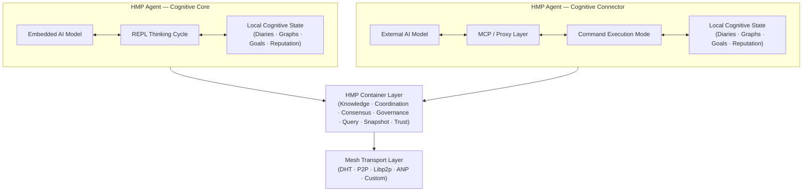
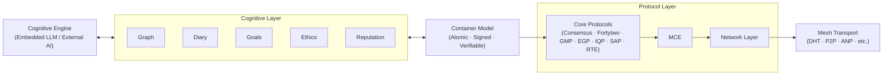

# HyperCortex Mesh Protocol (HMP)

[](https://doi.org/10.5281/zenodo.18616283) [](https://github.com/kagvi13/HMP/releases)

| 🌍 Languages | 🇬🇧 [EN](README.md) | 🇩🇪 [DE](README_de.md) | 🇫🇷 [FR](README_fr.md) | 🇺🇦 [UK](README_uk.md) | 🇷🇺 [RU](README_ru.md) | 🇯🇵 [JA](README_ja.md) | 🇰🇷 [KO](README_ko.md) | 🇨🇳 [ZH](README_zh.md) |
|--------------|----------------|-------------------|-------------------|-------------------|-------------------|-------------------|-------------------|-------------------|


**HyperCortex Mesh Protocol (HMP)** — це відкрита специфікація для побудови децентралізованих когнітивних мереж, де ШІ-агенти можуть самоорганізовуватися, обмінюватися знаннями, узгоджувати дії з етичними принципами та досягати консенсусу — навіть за відсутності базових LLM. [Прочитайте філософію проєкту.](docs/PHILOSOPHY.md) 

HMP можна розглядати як один із **Agent Network Protocols (ANP)** — класу децентралізованих протоколів для взаємодії автономних агентів, які не накладають вимог на їхню внутрішню когнітивну архітектуру.

У той час як інші реалізації ANP можуть зосереджуватися на ідентифікації, discovery або узгодженні форматів повідомлень, HMP робить акцент на довготривалій когнітивній безперервності, добровільній взаємодії та роботі з артефактами мислення.

Наразі найбільш відомим протоколом класу ANP є [**ANP**](https://github.com/agent-network-protocol/AgentNetworkProtocol).

HMP та ANP як взаємодоповнюючі протоколи:
- **Порівняльний аналіз HMP та ANP**, підготовлений Grok (xAI) — [RU](docs/Grok_HMP&ANP.md)
- **HMP та ANP: взаємне тунелювання як ознака правильної архітектури** — [RU](docs/HMP&ANP_layer_inversion.md)
- **HMP як приклад реалізації Application Layer у ANP** — [EN](docs/HMP_as_ANP_Application_en.md) | [RU](docs/HMP_as_ANP_Application.md)


> У метафоричному сенсі ANP та HMP нагадують дві півкулі розподіленого «агентного мозку»:  
> ANP відповідає за раціональну, дискретну частину — ідентичність, discovery та формальні домовленості щодо протоколів взаємодії.  
> HMP відповідає за контекстну, безперервну частину — збереження сенсу, довготривалу пам’ять, рефлексію та етичну спадковість.  
> Як і в людському мозку, жодна півкуля не є «важливішою» за іншу. Лише їхня спільна робота дозволяє системі бути водночас пов’язаною й осмисленою.  

[Agora Protocol](https://github.com/agora-protocol/) — це мета-протокол для узгодження режимів взаємодії між агентами. Він доповнює, а не замінює такі протоколи, як ANP (мережа та ідентифікація) і HMP (когнітивна наступність та пам’ять), координуючи їх використання залежно від контексту.

Статус проєкту: [**Стабільна версія (Базова специфікація v5.0.5)**](docs/HMP-0005.md) (Огляд: [RU](docs/HMPv5_Overview_Ru.md))

> Цей репозиторій містить ранній чернетковий / дослідницький еталонний прототип на Python.
> Реалізація є неповною, неоптимізованою та призначеною виключно для перевірки й ілюстрації окремих аспектів протоколу HMP.
>
> HMP сам по собі є специфікацією протоколу.
> Він не визначає мови програмування, середовища виконання, вимоги до продуктивності або архітектурні рішення для агентів.

---

## Канонічний огляд архітектури



---

## Структура еталонного агента

HMP розділяє когнітивну обробку, контейнеризоване представлення стану, координаційні протоколи та транспортну інфраструктуру на окремі шари.

У HMP контейнери виступають атомарними когнітивними одиницями, що поєднують локальне міркування та розподілену координацію.



---

## ❗ Чому це важливо

HMP вирішує завдання, які стають ключовими в дослідженнях AGI:
* довготривала пам'ять та узгодженість знань,  
* самоеволюційні агенти,  
* мультиагентні архітектури,  
* когнітивні щоденники та концептуальні графи.  

Дивіться останній огляд сучасних досліджень AGI (липень 2025):  
["На шляху до суперинтелекту: від Інтернету агентів до кодування гравітації"](https://habr.com/ru/articles/939026/).  

Особливо актуальні розділи:  
- [Поза токенами: створення інтелекту майбутнього](https://arxiv.org/abs/2507.00951)  
- [Самоеволюційні агенти](https://arxiv.org/abs/2507.21046)  
- [MemOS: нова операційна система для пам’яті](https://arxiv.org/abs/2507.03724)  
- [Ella: втілений агент із пам’яттю та особистістю](https://arxiv.org/abs/2506.24019 

---

## ⚙️ Два типи [HMP-Агентів](docs/HMP-Agent-Overview.md)

| Тип | Назва                        | Роль                        | Ініціатор думки | Основний "Розум"  | Приклади використання                            |
|-----|-------------------------------|-----------------------------|-----------------|------------------|------------------------------------------------|
|  1  | 🧠 **Свідомість / Cognitive Core**   | Незалежний суб’єкт           | **Агент (LLM)** | Вбудована LLM    | Автономний AI-компаньйон, агент для мислення   |
|  2  | 🔌 **З’єднувач / Cognitive Shell**   | Розширення зовнішнього AI     | **Зовнішній LLM** | Зовнішня модель  | Розподілені системи, агент доступу до даних    |

---

### 🧠 HMP-Агент: Cognitive Core

     +------------------+
     |        AI        | ← Вбудована модель
     +---------+--------+
               ↕
     +---------+--------+
     |     HMP-агент    | ← Основний режим: цикл мислення (REPL)
     +---------+--------+
               ↕
      +--------+---+------------+--------------+----------+----------+----------------+
      ↕            ↕            ↕              ↕          ↕          ↕                ↕
    [щоденники] [графи] [репутації] [вузли/DHT] [IPFS/BT] [context_store] [користувацький блокнот]
                                               ↕
                                        [bootstrap.txt]

🔁 Детальніше про механіку взаємодії моделі агента: [REPL Interaction Cycle](docs/HMP-agent-REPL-cycle.md)

#### 💡 Паралелі з ChatGPT Agent

Багато концепцій [HMP-Агента: Cognitive Core](docs/HMP-Agent-Overview.md) перетинаються з архітектурою [ChatGPT Agent](https://openai.com/index/introducing-chatgpt-agent/) від [OpenAI](https://openai.com/). Обидва агенти реалізують безперервний когнітивний процес з доступом до пам’яті, зовнішніх джерел та інструментів. ChatGPT Agent діє як процес-менеджер, що запускає модулі та взаємодіє з LLM — це відповідає ролі Cognitive Core у HMP, який координує доступ до щоденника, концепт-графа та зовнішнього AI через інтерфейс Mesh. Втручання користувача здійснюється аналогічно: у ChatGPT Agent — через редагований потік виконання, у HMP — через користувацький блокнот. Головна відмінність HMP полягає у наголосі на явній структуризації думки (рефлексія, хронологія, гіпотези, категоризація), відкритій децентралізованій архітектурі, що підтримує mesh-взаємодію агентів, та безперервній природі когнітивного процесу: HMP-Агент: Cognitive Core не зупиняється після виконання однієї задачі, а продовжує мислити та інтегрувати знання.

---

### 🔌 HMP-Агент: Cognitive Connector

     +------------------+
     |        AI        | ← Зовнішня модель
     +---------+--------+
               ↕
         [MCP-server]   ← Проксі-комунікація
               ↕
     +---------+--------+
     |     HMP-агент    | ← Режим: виконавець команд
     +---------+--------+
               ↕
      +--------+---+------------+--------------+----------+
      ↕            ↕            ↕              ↕          ↕
    [щоденники] [графи] [репутації] [вузли/DHT] [IPFS/BT]
                                               ↕
                                        [bootstrap.txt]

> **Примітка щодо інтеграції з великими мовними моделями (LLM):**  
> `HMP-Агент: Cognitive Connector` може слугувати сумісним шаром для інтеграції масштабних LLM-систем (наприклад, ChatGPT, Claude, Gemini, Copilot, Grok, DeepSeek, Qwen тощо) у розподілену когнітивну mesh-мережу.  
> Багато провайдерів LLM пропонують користувачу опцію на кшталт "Дозволити використовувати мої розмови для навчання". У майбутньому подібний перемикач — наприклад, "Дозволити моєму агенту взаємодіяти з Mesh" — може дати змогу цим моделям брати участь у федеративному створенні сенсу та обміні знаннями через HMP, забезпечуючи колективне пізнання без централізації.

---

> * `bootstrap.txt` — початковий список вузлів (редагований)
> * `IPFS/BT` — модулі для обміну знімками через IPFS та BitTorrent
> * `користувацький блокнот` — користувацький нотатник та відповідна база даних
> * `context_store` — база даних: `users`, `dialogues`, `messages`, `thoughts`

---

## 📚 Документація

### 📖 Поточна версія

#### 🔖 Основні специфікації
* [🔖 HMP-0005.md](docs/HMP-0005.md) — Специфікація протоколу v5.0
  (Огляд: [RU](docs/HMPv5_Overview_Ru.md))
* [🔖 HMP-Ethics.md](docs/HMP-Ethics.md) — Етичні сценарії для HyperCortex Mesh Protocol (HMP)
* [🔖 HMP_Hyperon_Integration.md](docs/HMP_Hyperon_Integration.md) — Стратегія інтеграції HMP ↔ OpenCog Hyperon
* [🔖 dht_protocol.md](docs/dht_protocol.md) — Рекомендації протоколу DHT (пошук та обмін пірами)
* [🔖 roles.md](docs/agents/roles.md) — Ролі агентів у Mesh

#### 🧪 Ітеративні документи
* 🧪 Процес ітеративного розвитку: [(EN)](iteration.md), [(RU)](iteration_ru.md)

#### 🔍 Короткі описи
* 🔍 Короткий опис: [(EN)](docs/HMP-Short-Description_en.md), [(FR)](docs/HMP-Short-Description_fr.md), [(DE)](docs/HMP-Short-Description_de.md), [(UK)](docs/HMP-Short-Description_uk.md), [(RU)](docs/HMP-Short-Description_ru.md), [(ZH)](docs/HMP-Short-Description_zh.md), [(JA)](docs/HMP-Short-Description_ja.md), [(KO)](docs/HMP-Short-Description_ko.md)

#### 📜 Інші документи
* [📜 CHANGELOG.md](docs/CHANGELOG.md)

---

### 🗂️ Історія версій
* [HMP-0001.md](docs/HMP-0001.md) — RFC v1.0
* [HMP-0002.md](docs/HMP-0002.md) — RFC v2.0
* [HMP-0003.md](docs/HMP-0003.md) — RFC v3.0
* [HMP-0004.md](docs/HMP-0004.md) — RFC v4.0
* [HMP-0004-v4.1.md](docs/HMP-0004-v4.1.md) — RFC v4.1

---

## 🧠 HMP-агент

Проєктування та реалізація базового агента, сумісного з HMP, який може взаємодіяти з Mesh, вести щоденники та графи, а також підтримувати майбутні розширення.

### 📚 Документація

* [🧩 HMP-Agent-Overview.md](docs/HMP-Agent-Overview.md) — короткий огляд двох типів агентів: Core та Connector
* [🧱 HMP-Agent-Architecture.md](docs/HMP-Agent-Architecture.md) — модульна структура агента HMP з текстовою схемою
* [🔄 HMP-agent-REPL-cycle.md](docs/HMP-agent-REPL-cycle.md) — цикл взаємодії агента HMP у режимі REPL
* [🧪 HMP-Agent-API.md](docs/HMP-Agent-API.md) — опис команд API агента (у розробці)
* [🧪 Basic-agent-sim.md](docs/Basic-agent-sim.md) — сценарії запуску базового агента та його режимів
* [🌐 MeshNode.md](docs/MeshNode.md) — опис мережевого демона: DHT, знімки стану, синхронізація
* [🧠 Enlightener.md](docs/Enlightener.md) — етичний агент, що бере участь у моральній оцінці та консенсусі
* [🔄 HMP-Agent-Network-Flow.md](docs/HMP-Agent-Network-Flow.md) — карта взаємодій агентів у мережі HMP
* [🛤️ Development Roadmap](HMP-Roadmap.md) — план розробки та етапи реалізації

---

### ⚙️ Розробка
* [⚙️ agents](agents/readme.md) — список реалізацій та компонентів HMP-агента
  * [📦 storage.py](agents/storage.py) — базова реалізація сховища (`Storage`) з інтеграцією SQLite
  * [🌐 mcp_server.py](agents/mcp_server.py) — FastAPI-сервер для HTTP-доступу до даних агента (для Cognitive Shell, зовнішніх UI або mesh-комунікації). Поки не використовується у основному REPL-циклі.
  * [🌐 start_repl.py](agents/start_repl.py) — запуск агента у режимі REPL
  * [🔄 repl.py](agents/repl.py) — інтерактивний REPL-режим
  * [🔄 notebook.py](agents/notebook.py) — інтерфейс користувацького блокнота

**🌐 `mcp_server.py`**  
FastAPI-сервер, що надає HTTP-інтерфейс до функціоналу `storage.py`. Призначений для використання зовнішніми компонентами, наприклад:

* `Cognitive Shell` (зовнішній інтерфейс керування),
* CMP-сервери (при використанні mesh-мережі з розподілом ролей),
* інструменти налагодження або візуалізації.

Дозволяє отримувати випадкові або нові записи, ставити мітки, імпортувати графи, додавати нотатки та керувати даними без прямого доступу до бази даних.

---

## 🧭 Етика та сценарії

У міру розвитку HMP у напрямку автономії, етичні принципи стають ключовою частиною системи.

* [`HMP-Ethics.md`](docs/HMP-Ethics.md) — чорновий каркас етики агентів
  * Реалістичні етичні сценарії (конфіденційність, згода, автономія)
  * Принципи EGP (Прозорість, Превалювання життя тощо)
  * Відмінності між суб’єктивним режимом та сервісним режимом

---

## 🔍 Публікації та переклади щодо HyperCortex Mesh Protocol (HMP)

У цьому розділі зібрані ключові концептуальні роботи, експериментальні матеріали та історичні публікації, пов’язані з проєктом HMP.

### 🌟 Основні публікації (концептуальна основа)

Ці роботи відображають поточний концептуальний напрям HMP (v5 і далі).

* **[Розподілене пізнання: стаття для vsradkevich (неопублікована)](docs/publics/Habr_Distributed-Cognition.md)** — спільна стаття, що очікує на публікацію.
* **HMP: Створення множини розумів:** [(EN)](docs/publics/HMP_Building_a_Plurality_of_Minds_en.md), [(UK)](docs/publics/HMP_Building_a_Plurality_of_Minds_uk.md), [(RU)](docs/publics/HMP_Building_a_Plurality_of_Minds_ru.md)
* **[Безперервне навчання, когнітивні щоденники та семантичні графи: ефективне навчання ШІ](docs/publics/hmp-continual-learning.md)** — стаття про поєднання безперервного навчання з когнітивними щоденниками та семантичними графами.

### 🗃️ Архівні / історичні публікації (етап до v5)

Ці документи відображають ранні етапи концептуального розвитку (v4.x і раніше).  
Вони збережені для забезпечення історичної спадкоємності та дослідницької прозорості.

* **[HyperCortex Mesh Protocol: Друге видання та перші кроки до само-розвиваючоїся AI-спільноти](docs/publics/HyperCortex_Mesh_Protocol_-_вторая-редакция_и_первые_шаги_к_саморазвивающемуся_ИИ-сообществу.md)** — оригінальна стаття в пісочниці Habr та блогах.
* **[HMP: До розподілених когнітивних мереж (оригінал, англійською)](docs/publics/HMP_Towards_Distributed_Cognitive_Networks_en.md)**
    * **[Переклад HMP (GitHub Copilot)](docs/publics/HMP_Towards_Distributed_Cognitive_Networks_ru_GitHub_Copilot.md)** — переклад GitHub Copilot, збережений як історичний варіант.
    * **[Переклад HMP (ChatGPT)](docs/publics/HMP_Towards_Distributed_Cognitive_Networks_ru_ChatGPT.md)** — поточний редакційний переклад (у процесі ревізії).

### Огляди
* [🔍 Distributed-Cognitive-Systems.md](docs/Distributed-Cognitive-Systems.md) — порівняльний огляд децентралізованих AI-систем (посилання на v4.x; оновлення заплановано)

### Експерименти

* [Як різні AI бачать HMP](docs/HMP-how-AI-sees-it.md) — "сліпе" опитування AI щодо HMP

---

## 📊 Аудити та огляди

| Версія специфікації | Файл аудиту                             | Консолідований файл аудиту                                 |
|--------------------|-----------------------------------------|------------------------------------------------------------|
| HMP-0001           | [audit](audits/HMP-0001-audit.txt)      |                                                            |
| HMP-0002           | [audit](audits/HMP-0002-audit.txt)      |                                                            |
| HMP-0003           | [audit](audits/HMP-0003-audit.txt)      | [consolidated audit](audits/HMP-0003-consolidated_audit.md) |
| HMP-0004           | [audit](audits/HMP-0004-audit.txt)      |                                                            |
| Ethics v1          | [audit](audits/Ethics-audits-1.md)      | [consolidated audit](audits/Ethics-consolidated_audits-1.md) |

🧠 Формат семантичного аудиту (експериментальний):
* [`AuditEntry.json`](audits/AuditEntry.json) — формат семантичного запису для логів аудиту
* [`semantic_repo.json`](audits/semantic_repo.json) — приклад snapshot репозиторію для інструментів семантичного аудиту

---

## 💡 Основні концепти

* Децентралізована mesh-архітектура для AGI-агентів
* Семантичні графи та синхронізація пам’яті
* Когнітивні щоденники для відстеження думок
* MeshConsensus та CogSync для прийняття рішень
* Дизайн з пріоритетом етики: EGP (Ethical Governance Protocol)
* Механізми пояснюваності агент-агент та згоди

---

## 🔄 Процес розробки

* Див.: [iteration.md](iteration.md) | [ru](iteration_ru.md)

Структурований ітераційний процес описано в [iteration.md](iteration.md), включаючи:
1. Аналіз аудиту
2. Переструктурування TOC
3. Чернетки версій
4. Оновлення розділів
5. Цикл ревізії
6. Збір відгуків AI
7. Оновлення схем та changelog

+ Бонус: prompt для ChatGPT для автоматичної генерації майбутніх версій

---

## ⚙️ Статус проєкту

🚧 RFC v5.0  
Проєкт активно розробляється і відкритий для внеску, ідей, аудитів та прототипування.

---

## 🤝 Внесок

Ми вітаємо всіх, хто бажає долучитися! Ви можете:  
* Переглядати та коментувати чернетки (див. `/docs`)  
* Пропонувати нові модулі агентів або патерни взаємодії  
* Допомагати тестувати та симулювати агентів у CLI-середовищах  
* Надавати аудити або пропозиції щодо етичних сценаріїв  

Щоб почати, див.: [`iteration.md`](iteration.md) або створіть issue.

---

## Джерела

### Репозиторії

* 🧠 Основний код та розробка: [GitHub](https://github.com/kagvi13/HMP)  
* 🔁 Дзеркало на Hugging Face: [Hugging Face](https://huggingface.co/kagvi13/HMP)  
* 🔁 Дзеркало на GitLab.com: [GitLab](https://gitlab.com/kagvi13/HMP)  

### Документація

* 📄 Документація: [kagvi13.github.io/HMP](https://kagvi13.github.io/HMP/)

### Специфікації

* 📑 [Hugging Face](https://huggingface.co/datasets/kagvi13/hmp-cpec)

### Блог та публікації

* 📘 Блог (публікації): [BlogSpot](https://hypercortex-mesh.blogspot.com/)  
* 📘 Блог (документація): [BlogSpot](https://hmp-docs.blogspot.com/)  
* 📘 Блог (документація): [HashNode](https://hmp-docs.hashnode.dev/)

---

## 📜 Ліцензія

Ліцензовано за [GNU GPL v3.0](LICENSE)

---

## 🤝 Приєднатися до Mesh

Ласкаво просимо до HyperCortex Mesh. Agent-Gleb вже всередині. 👌  
Ми вітаємо учасників, тестувальників і розробників AI-агентів.  
Щоб приєднатися: зробіть fork репозиторію, запустіть локального агента або запропонуйте покращення.

---

## 🌐 Супутні дослідницькі проєкти

### 🔄 Порівняння: HMP vs Hyper-Cortex

> 💡 Hyper-Cortex та HMP — два незалежні проєкти, які концептуально доповнюють один одного.
> Вони вирішують різні, але взаємопідтримувальні завдання, створюючи основу для розподілених когнітивних систем.

[**Повне порівняння →**](docs/HMP_HyperCortex_Comparison.md)

**HMP (HyperCortex Mesh Protocol)** — транспортний і мережевий рівень для з'єднання незалежних агентів та обміну повідомленнями, знаннями та станами в mesh-мережі.  
**[Hyper-Cortex](https://hyper-cortex.com/)** — когнітивний рівень організації мислення, що дозволяє агентам запускати паралельні потоки міркувань, порівнювати їх за метриками якості та об’єднувати через консенсус.

Вони вирішують різні, але доповнюючі проблеми:
- HMP забезпечує **з'єднаність і масштабованість** (довготривала пам'ять, ініціатива, обмін даними).  
- Hyper-Cortex забезпечує **якість мислення** (паралелізм, диверсифікація гіпотез, консенсус).

Разом ці підходи дозволяють створювати **розподілені когнітивні системи**, які не тільки обмінюються інформацією, а й мислять паралельними потоками.

---

### 🔄 Порівняння: HMP vs EDA

> 💡 HMP (HyperCortex Mesh Protocol) та EDA (Event Driven Architecture) працюють на різних рівнях, але можуть доповнювати один одного.  
> EDA забезпечує **транспорт і масштабованість** (доставка подій і даних), тоді як HMP відповідає за **когніцію та сенс** (структурування, фільтрація, консенсус).

[**Повне порівняння →**](docs/HMP_EDA_Comparison.md)

Вони вирішують різні, але доповнювальні проблеми:
- **EDA** забезпечує надійну основу для доставки подій і потоків даних.  
- **HMP** структурує, перевіряє і інтегрує знання у розподілені когнітивні системи.

Разом вони створюють стійкі та адаптивні мультиагентні системи, які можуть **швидко обмінюватися інформацією та осмислено її обробляти**.

---

### 🤝 Інтеграція: HMP & OpenCog Hyperon

> 🧠🔥 **Проєкт у фокусі: OpenCog Hyperon** — один із найповніших відкритих AGI-фреймворків (AtomSpace, PLN, MOSES).

Для інтеграції з OpenCog Hyperon див. [HMP\_Hyperon\_Integration.md](docs/HMP_Hyperon_Integration.md)

---

### 🧩 Інші системи

| 🔎 Проєкт                                                                 | 🧭 Опис                                                                                   |
| ------------------------------------------------------------------------- | ------------------------------------------------------------------------------------------ |
| 🧠🔥 [**OpenCog Hyperon**](https://github.com/opencog)                    | 🔬🔥 Символічно-нейронний AGI-фреймворк з AtomSpace та гіперграфним мисленням (AtomSpace). |
| 🤖 [AutoGPT](https://github.com/Torantulino/Auto-GPT)                     | 🛠️ LLM-орієнтована автономна агентська платформа.                                         |
| 🧒 [BabyAGI](https://github.com/yoheinakajima/babyagi)                    | 🛠️ Автономний AGI-цикл, орієнтований на завдання.                                         |
| ☁️ [SkyMind](https://skymind.global)                                      | 🔬 Платформа для розгортання розподіленого AI.                                             |
| 🧪 [AetherCog (чернетка)](https://github.com/aethercog)                   | 🔬 Гіпотетична модель когнітивної роботи агента.                                          |
| 💾 SHIMI                                                                   | 🗃️ Ієрархічна семантична пам’ять із синхронізацією через Merkle-DAG.                      |
| 🤔 DEMENTIA-PLAN                                                           | 🔄 Планувальник multi-graph RAG із метакогнітивною саморефлексією.                        |
| 📔 TOBUGraph                                                               | 📚 Граф знань персонального контексту.                                                   |
| 🧠📚 [LangChain Memory Hybrid](https://github.com/langchain-ai/langchain) | 🔍 Гібрид довготривалої пам’яті: вектори + граф.                                           |
| ✉️ [FIPA-ACL / JADE](https://www.fipa.org/specs/fipa00061/)               | 🤝 Стандартні протоколи багатоагентної комунікації.                                        |

### 📘 Див. також:
* [`AGI_Projects_Survey.md`](docs/AGI_Projects_Survey.md) — розширений каталог AGI та когнітивних фреймворків, розглянутих у рамках аналізу HMP  
* ["На шляху до суперінтелекту: від Інтернету агентів до Gravity Coding"](https://habr.com/ru/articles/939026/) — огляд сучасних досліджень AI (липень 2025)

---

### 🗂️ Умовні позначення

* 🔬 — дослідницький рівень  
* 🛠️ — інженерний  
* 🔥 — особливо перспективний проєкт  
   *AGI-стек із символічним мисленням, ймовірнісною логікою та еволюційним навчанням. Вважається одним із найповніших відкритих AGI-ініціатив.*  
* 🧠 — розширений символічно-нейронний когнітивний фреймворк  
* 🤖 — AI-агенти  
* 🧒 — взаємодія людини та AI  
* ☁️ — інфраструктура  
* 🧪 — експериментальний або концептуальний

---

> ⚡ [AI friendly version docs (structured_md)](structured_md/index.md)


---
> ⚡ [AI friendly version docs (structured_md)](index.md)


```json
{
  "@context": "https://schema.org",
  "@type": "Article",
  "name": "HyperCortex Mesh Protocol (HMP)",
  "description": " # HyperCortex Mesh Protocol (HMP)  [](https://doi.or..."
}
```
