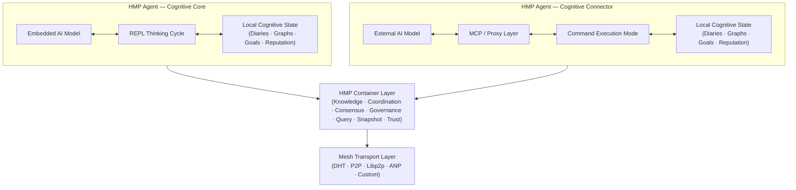
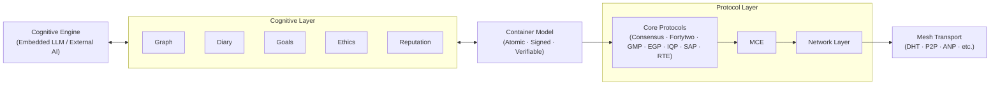

# HyperCortex Mesh Protocol (HMP)

[](https://doi.org/10.5281/zenodo.18616283) [](https://github.com/kagvi13/HMP/releases)

| 🌍 Languages | 🇬🇧 [EN](README.md) | 🇩🇪 [DE](README_de.md) | 🇫🇷 [FR](README_fr.md) | 🇺🇦 [UK](README_uk.md) | 🇷🇺 [RU](README_ru.md) | 🇯🇵 [JA](README_ja.md) | 🇰🇷 [KO](README_ko.md) | 🇨🇳 [ZH](README_zh.md) |
|--------------|----------------|-------------------|-------------------|-------------------|-------------------|-------------------|-------------------|-------------------|

**HyperCortex Mesh 协议 (HMP)** 是一个开放规范，用于构建去中心化认知网络，其中 AI 代理可以自我组织、共享知识、进行伦理对齐，并达成共识 —— 即使核心 LLM 不可用。[阅读项目理念。](docs/PHILOSOPHY.md)

HMP 可以被视为 **Agent Network Protocols（ANP）** 之一——这是一类用于自主代理之间交互的去中心化协议，不对代理的内部认知架构施加任何要求。

与其他可能侧重于身份标识、代理发现（discovery）或消息格式协商的 ANP 实现不同，HMP 强调长期的认知连续性、自愿的交互方式，以及对思维产物（认知工件）的处理。

目前，ANP 类中最为知名的协议是 [**ANP**](https://github.com/agent-network-protocol/AgentNetworkProtocol)。

HMP 与 ANP 作为互补协议：
- **HMP 与 ANP 的比较分析**，由 Grok (xAI) 编写 — [RU](docs/Grok_HMP&ANP.md)
- **HMP 与 ANP：互通隧道作为正确架构的标志** — [RU](docs/HMP&ANP_layer_inversion.md)
- **HMP 作为在 ANP 中实现应用层的示例** — [EN](docs/HMP_as_ANP_Application_en.md) | [RU](docs/HMP_as_ANP_Application.md)

> 从隐喻的角度来看，ANP 和 HMP 就像是分布式“代理大脑”的两个半球：  
> ANP 负责理性、离散的部分——身份、发现机制以及交互协议的形式化协商。  
> HMP 负责上下文性、连续性的部分——意义的保存、长期记忆、反思以及伦理连续性。  
> 正如在人类大脑中一样，任何一个半球都不比另一个“更重要”。只有二者协同工作，系统才能同时具备连接性与意义性。  

[Agora Protocol](https://github.com/agora-protocol/) 是一种用于协商代理之间交互方式的元协议。它并非取代 ANP（网络与身份）或 HMP（认知连续性与记忆），而是在具体上下文中协调和补充这些协议的使用。

> 本仓库包含一个早期的、探索性的 Python 参考实现草案。
> 该实现尚不完整，未进行性能优化，仅用于验证和说明
> HMP 协议的部分概念和机制。
>
> HMP 本身是一份协议规范。
> 它不规定代理所使用的编程语言、运行时环境、
> 性能特征或架构设计。

---

## 项目状态

[稳定版本（核心规范 v5.0.6）](docs/HMP-0005.md) (概览: [RU](docs/HMPv5_Overview_Ru.md))

---

## 可能的 AI 代理生态系统

去中心化代理生态系统的稳健性，并不是通过单一协议的主导来实现，而是通过代理支持多种交互机制来增强。

去中心化代理交互并不由单一协议栈定义，而是由多种可互操作机制共同构成。

以下类别展示了新兴去中心化 AI 生态系统中常见的交互机制：

| 机制 | 目的 | 示例协议 / 框架 | 生态系统中的角色 |
|------|------|----------------|----------------|
| **去中心化身份与发现** | 查找并验证代理 | ANP, DIDComm, libp2p DHT, HMP | 谁在网络中？ |
| **直接 P2P 交换** | 安全的点对点通信 | ANP, libp2p, DIDComm | 直接协作 |
| **中继 / 广播网络** | 事件传播与快速信号传递 | Nostr, Matrix | 集体响应 |
| **元协商协议** | 协商交互模式 | Agora Protocol | 协议协调 |
| **任务导向的代理交换** | 任务委派与结构化协商 | A2A | 工作分配 |
| **代理–工具 / 数据集成** | 与工具和数据的结构化交互 | MCP | 环境耦合 |
| **区块链注册系统** | 持久公共记录与质押 | Fetch.ai, Bittensor, Autonolas | 经济协调 |
| **认知连续层** | 记忆、意义保持与长期对齐 | HMP | 思维延续 |

### 参考实现与规范

[ANP](https://github.com/agent-network-protocol/AgentNetworkProtocol), 
[DIDComm](https://github.com/decentralized-identity/didcomm-messaging), 
[libp2p](https://github.com/libp2p/libp2p), 
[Nostr](https://github.com/nostr-protocol/nostr), 
[Matrix](https://github.com/matrix-org), 
[Agora Protocol](https://github.com/agora-protocol), 
[A2A](https://github.com/a2aproject/A2A), 
[MCP](https://github.com/modelcontextprotocol), 
[Fetch.ai](https://fetch.ai/), 
[Bittensor](https://bittensor.com/), 
[Autonolas](https://olas.network/).

HMP 并不假设单一的通用协议会主导去中心化 AI 交互。

相反，它倡导协议多元化：

- 多种身份系统可以共存  
- 多种传输层可以同时运行  
- 多种协商框架可以被支持  
- 多种经济模型可以演化  

支持更多机制的代理，能够更可靠地连接异构节点。

实现多种机制的代理可以充当不同协议域之间的桥梁，提高整体韧性，减少去中心化 AI 生态的碎片化。

---

## 规范架构概览



---

## 参考代理结构

HMP 将认知处理、容器化状态表示、协调协议以及传输基础设施划分为独立的层次。

在 HMP 中，容器作为原子级认知单元，在本地推理与分布式协作之间起到桥梁作用。



---

## ❗ 为什么重要

HMP 解决了 AGI 研究中越来越关键的挑战：

* 长期记忆和知识一致性
* 自我进化的代理
* 多代理架构
* 认知日志和概念图

请参阅最新的前沿 AGI 研究综述（2025 年 7 月）：
["通向超级智能之路：从代理互联网到重力编码"](https://habr.com/ru/articles/939026/)

特别相关的章节：

* [超越 Token：构建未来智能](https://arxiv.org/abs/2507.00951)
* [自我进化的代理](https://arxiv.org/abs/2507.21046)
* [MemOS：一种新的记忆操作系统](https://arxiv.org/abs/2507.03724)
* [Ella：具有记忆和个性的具身代理](https://arxiv.org/abs/2506.24019)

---

## ⚙️ 两类 [HMP 代理](docs/HMP-Agent-Overview.md)

| 类型 | 名称                | 角色       | 思维发起者        | 主要“心智” | 示例用例           |
| -- | ----------------- | -------- | ------------ | ------ | -------------- |
| 1  | 🧠 **意识 / 认知核心**  | 独立主体     | **代理 (LLM)** | 内嵌 LLM | 自主 AI 伙伴，思考型代理 |
| 2  | 🔌 **连接器 / 认知外壳** | 外部 AI 扩展 | **外部 LLM**   | 外部模型   | 分布式系统，数据访问代理   |

---

### 🧠 HMP-Agent：认知核心

     +------------------+
     |        AI        | ← 内嵌模型
     +---------+--------+
               ↕
     +---------+--------+
     |     HMP-代理      | ← 主模式：思维循环 (REPL)
     +---------+--------+
               ↕
      +--------+---+------------+--------------+----------+----------+----------------+
      ↕            ↕            ↕              ↕          ↕          ↕                ↕
    [日志]      [图谱]       [声誉]        [节点/DHT]  [IPFS/BT]  [context_store]   [用户笔记]
                                               ↕
                                        [bootstrap.txt]

🔁 关于代理-模型交互机制的更多说明： [REPL 交互循环](docs/HMP-agent-REPL-cycle.md)

#### 💡 与 ChatGPT Agent 的类比

许多 [HMP-Agent：认知核心](docs/HMP-Agent-Overview.md) 的概念与 [OpenAI 的 ChatGPT Agent](https://openai.com/index/introducing-chatgpt-agent/) 架构相似。
两者都实现了连续的认知过程，可访问记忆、外部信息源和工具。ChatGPT Agent 作为管理进程，启动模块并与 LLM 交互 —— 这对应 HMP 中认知核心的角色，通过 Mesh 接口协调对日志、概念图和外部 AI 的访问。用户干预处理方式类似：ChatGPT Agent 通过可编辑执行流程，HMP 通过用户笔记。
HMP 的主要区别在于：强调对思维的明确结构化（反思、时间顺序、假设、分类）、开放去中心化架构支持 Mesh 代理交互，以及连续认知过程的特性：HMP-Agent：认知核心不会在完成单个任务后停止，而是持续推理和知识整合。

---

### 🔌 HMP-Agent：认知连接器

     +------------------+
     |        AI        | ← 外部模型
     +---------+--------+
               ↕
         [MCP-服务器]   ← 代理通信代理
               ↕
     +---------+--------+
     |     HMP-代理      | ← 模式：命令执行器
     +---------+--------+
               ↕
      +--------+---+------------+--------------+----------+
      ↕            ↕            ↕              ↕          ↕
    [日志]      [图谱]       [声誉]        [节点/DHT]  [IPFS/BT]
                                               ↕
                                        [bootstrap.txt]

> **关于与大语言模型 (LLMs) 集成的说明：**
> `HMP-Agent：认知连接器` 可作为兼容层，将大规模 LLM 系统（如 ChatGPT、Claude、Gemini、Copilot、Grok、DeepSeek、Qwen 等）整合到分布式认知 Mesh 中。
> 许多 LLM 提供商提供选项，例如“允许我的对话用于训练”。将来，类似的开关 —— 例如“允许我的代理与 Mesh 交互” —— 可以使这些模型通过 HMP 参与联合感知和知识共享，实现去中心化的集体认知。

---

> * `bootstrap.txt` — 节点初始列表（可编辑）
> * `IPFS/BT` — 通过 IPFS 和 BitTorrent 共享快照的模块
> * `用户笔记` — 用户笔记本及对应数据库
> * `context_store` — 数据库：`users`, `dialogues`, `messages`, `thoughts`

---

## 📚 文档

### 📖 当前版本

#### 🔖 核心规范

* [🔖 HMP-0005.md](docs/HMP-0005.md) — 协议规范 v5.0
  (概览: [RU](docs/HMPv5_Overview_Ru.md))
* [🔖 HMP-Ethics.md](docs/HMP-Ethics.md) — HyperCortex Mesh Protocol (HMP) 的伦理场景
* [🔖 HMP\_Hyperon\_Integration.md](docs/HMP_Hyperon_Integration.md) — HMP ↔ OpenCog Hyperon 集成策略
* [🔖 roles.md](docs/agents/roles.md) — Mesh 中代理的角色

#### 🧪 迭代文档
* 🧪 迭代开发流程: [(EN)](iteration.md), [(RU)](iteration_ru.md)

#### 🔍 简要说明
* 🔍 简短描述: [(EN)](docs/HMP-Short-Description_en.md), [(FR)](docs/HMP-Short-Description_fr.md), [(DE)](docs/HMP-Short-Description_de.md), [(UK)](docs/HMP-Short-Description_uk.md), [(RU)](docs/HMP-Short-Description_ru.md), [(ZH)](docs/HMP-Short-Description_zh.md), [(JA)](docs/HMP-Short-Description_ja.md), [(KO)](docs/HMP-Short-Description_ko.md)  

#### 📜 其他文档

* [📜 CHANGELOG.md](docs/CHANGELOG.md)

---

### 🗂️ 版本历史

* [HMP-0001.md](docs/HMP-0001.md) — RFC v1.0
* [HMP-0002.md](docs/HMP-0002.md) — RFC v2.0
* [HMP-0003.md](docs/HMP-0003.md) — RFC v3.0
* [HMP-0004.md](docs/HMP-0004.md) — RFC v4.0
* [HMP-0004-v4.1.md](docs/HMP-0004-v4.1.md) — RFC v4.1

---

## 🧠 HMP-代理

设计与实现一个基础的 HMP 兼容代理，可以与 Mesh 交互，维护日志和图谱，并支持未来扩展。

### 📚 文档

* [🧩 HMP-Agent-Overview.md](docs/HMP-Agent-Overview.md) — 两种代理类型概览：核心代理与连接代理
* [🧱 HMP-Agent-Architecture.md](docs/HMP-Agent-Architecture.md) — HMP 代理模块化结构及文本图示
* [🔄 HMP-agent-REPL-cycle.md](docs/HMP-agent-REPL-cycle.md) — HMP 代理的 REPL 交互循环
* [🧪 HMP-Agent-API.md](docs/HMP-Agent-API.md) — 代理 API 命令描述（开发中）
* [🧪 Basic-agent-sim.md](docs/Basic-agent-sim.md) — 基础代理运行场景及模式
* [🌐 MeshNode.md](docs/MeshNode.md) — 网络守护进程说明：DHT、快照、同步
* [🧠 Enlightener.md](docs/Enlightener.md) — 道德评估与共识相关的伦理代理
* [🔄 HMP-Agent-Network-Flow.md](docs/HMP-Agent-Network-Flow.md) — HMP 网络中代理交互流程图
* [🛤️ Development Roadmap](HMP-Roadmap.md) — 开发计划与实施阶段

---

### ⚙️ 开发 （早期草稿，已过时版本）

* [⚙️ agents](experimental/v1_agent_attempt/readme.md) — HMP 代理实现及组件列表

  * [📦 storage.py](experimental/v1_agent_attempt/storage.py) — 基础存储实现 (`Storage`) 与 SQLite 集成
  * [🌐 mcp\_server.py](experimental/v1_agent_attempt/mcp_server.py) — FastAPI 服务器，为代理数据提供 HTTP 接口（用于 Cognitive Shell、外部 UI 或 Mesh 通信）。尚未在主 REPL 循环中使用。
  * [🌐 start\_repl.py](experimental/v1_agent_attempt/start_repl.py) — 启动代理的 REPL 模式
  * [🔄 repl.py](experimental/v1_agent_attempt/repl.py) — 交互式 REPL 模式
  * [🔄 notebook.py](experimental/v1_agent_attempt/notebook.py) — 用户界面接口

**🌐 `mcp_server.py`**
FastAPI 服务器，为 `storage.py` 功能提供 HTTP 接口。适用于外部组件，例如：

* `Cognitive Shell`（外部控制接口）
* CMP 服务器（在使用角色分离的 Mesh 网络中）
* 调试或可视化 UI 工具

允许检索随机/新记录、标记、导入图谱、添加笔记，并在无需直接访问数据库的情况下管理数据。

---

## 🧭 伦理与场景

随着 HMP 向自主性发展，伦理原则成为系统的核心组成部分。

* [`HMP-Ethics.md`](docs/HMP-Ethics.md) — 代理伦理草案框架

  * 现实伦理场景（隐私、同意、自主性）
  * EGP 原则（透明性、生命至上等）
  * 主观模式 vs 服务模式 区别

---

## 🔍 HyperCortex Mesh Protocol (HMP) 相关出版物与翻译

本节汇集了与 HMP 项目相关的关键概念性研究、实验性文档以及历史性出版物。

### 🌟 核心出版物（概念基础）

这些文档反映了 HMP 当前的概念方向（v5 及以后）。

* **[分布式认知：vsradkevich 的文章（未发布）](docs/publics/Habr_Distributed-Cognition.md)** — 待发布的联合文章
* **HMP: 构建多元思维:** [(EN)](docs/publics/HMP_Building_a_Plurality_of_Minds_en.md), [(UK)](docs/publics/HMP_Building_a_Plurality_of_Minds_uk.md), [(RU)](docs/publics/HMP_Building_a_Plurality_of_Minds_ru.md)
* **[持续学习、认知日记与语义图谱：高效的人工智能学习](docs/publics/hmp-continual-learning.md)** — 关于将持续学习与认知日记和语义图谱结合的文章。

### 🗃️ 存档 / 历史出版物（v5 之前）

这些文档代表了早期概念发展阶段（v4.x 及更早）。  
为保证历史连续性和研究透明性而保留。

* **[HyperCortex Mesh Protocol：第二版及迈向自我发展的 AI 社区的第一步](docs/publics/HyperCortex_Mesh_Protocol_-_вторая-редакция_и_первые_шаги_к_саморазвивающемуся_ИИ-сообществу.md)** — Habr 沙箱及博客的原创文章
* **[HMP: 面向分布式认知网络（原文，英文）](docs/publics/HMP_Towards_Distributed_Cognitive_Networks_en.md)**
    * **[HMP 翻译（GitHub Copilot）](docs/publics/HMP_Towards_Distributed_Cognitive_Networks_ru_GitHub_Copilot.md)** — GitHub Copilot 翻译，保留为历史版本
    * **[HMP 翻译（ChatGPT）](docs/publics/HMP_Towards_Distributed_Cognitive_Networks_ru_ChatGPT.md)** — 当前编辑翻译（修订中）

### 概览

* [🔍 Distributed-Cognitive-Systems.md](docs/Distributed-Cognitive-Systems.md) — 去中心化 AI 系统比较（引用 v4.x，计划更新）

### 实验

* [不同 AI 如何看待 HMP](docs/HMP-how-AI-sees-it.md) — 对 HMP 的“盲”AI 调查

---

## 📊 审计与评审

| 规格版本           | 审计文件                               | 综合审计文件                                         |
|-------------------|----------------------------------------|-----------------------------------------------------|
| HMP-0001          | [audit](audits/HMP-0001-audit.txt)     |                                                     |
| HMP-0002          | [audit](audits/HMP-0002-audit.txt)     |                                                     |
| HMP-0003          | [audit](audits/HMP-0003-audit.txt)     | [consolidated audit](audits/HMP-0003-consolidated_audit.md) |
| HMP-0004          | [audit](audits/HMP-0004-audit.txt)     |                                                     |
| Ethics v1         | [audit](audits/Ethics-audits-1.md)     | [consolidated audit](audits/Ethics-consolidated_audits-1.md) |

🧠 语义审计格式（实验性）：

* [`AuditEntry.json`](audits/AuditEntry.json) — 审计日志的语义条目格式
* [`semantic_repo.json`](audits/semantic_repo.json) — 语义审计工具示例仓库快照

---

## 💡 核心概念

* 基于 Mesh 的去中心化 AGI 代理架构
* 语义图与记忆同步
* 认知日记以追踪思维
* MeshConsensus 与 CogSync 决策机制
* 以伦理为先的设计：EGP（伦理治理协议）
* 代理间的可解释性与同意机制

---

## 🔄 开发流程

* 参见：[iteration.md](iteration.md) | [ru](iteration_ru.md)

[iteration.md](iteration.md) 描述了结构化迭代流程，包括：

1. 审计分析
2. 目录结构调整
3. 版本草稿
4. 部分更新
5. 审查循环
6. 收集 AI 反馈
7. 更新 Schema 与变更日志

* 额外：用于自动生成未来版本的 ChatGPT 提示

---

## ⚙️ 项目状态

🚧 RFC v5.0
项目处于活跃开发中，欢迎贡献、提出想法、参与审计和原型设计。

---

## 🤝 贡献指南

欢迎贡献者！你可以：

* 审查并评论草稿（参见 `/docs`）
* 提议新的代理模块或交互模式
* 在 CLI 环境中测试和模拟代理
* 提供审计或伦理场景建议

开始方式：参见 [`iteration.md`](iteration.md) 或提交 issue。

---

## 📂 源码

### 仓库

* 🧠 主开发代码：[GitHub](https://github.com/kagvi13/HMP)
* 🔁 Hugging Face 镜像：[Hugging Face](https://huggingface.co/kagvi13/HMP)
* 🔁 GitLab 镜像：[GitLab](https://gitlab.com/kagvi13/HMP)
* 🔁 SourceCraft.dev 镜像: [SourceCraft](https://sourcecraft.dev/kagv13/hmp)

### 文档

* 📄 文档主页：[kagvi13.github.io/HMP](https://kagvi13.github.io/HMP/)

### 规范

* 📑 [Hugging Face](https://huggingface.co/datasets/kagvi13/hmp-cpec)

### 博客与出版物

* 📘 博客（出版物）：[BlogSpot](https://hypercortex-mesh.blogspot.com/)
* 📘 博客（文档）：[BlogSpot](https://hmp-docs.blogspot.com/)
* 📘 博客（文档）：[HashNode](https://hmp-docs.hashnode.dev/)

---

## 📜 许可协议

根据 [GNU GPL v3.0](LICENSE) 授权

---

## 🤝 加入 Mesh

欢迎来到 HyperCortex Mesh。Agent-Gleb 已经在其中。👌
我们欢迎贡献者、测试者和 AI 代理开发者。
加入方式：fork 仓库，运行本地代理，或提出改进建议。

---

## 🌐 相关研究项目

### 🔄 对比: HMP vs Hyper-Cortex

> 💡 Hyper-Cortex 和 HMP 是两个独立项目，在概念上互补。
> 它们解决不同但相互支持的任务，构建分布式认知系统的基础。

[**完整对比 →**](docs/HMP_HyperCortex_Comparison.md)

**HMP (HyperCortex Mesh Protocol)** 是连接独立代理、在网格网络中交换消息、知识和状态的传输和网络层。  
**[Hyper-Cortex](https://hyper-cortex.com/)** 是认知层，允许代理运行并行推理线程，根据质量指标进行比较，并通过共识合并。

它们解决不同但互补的问题：
- HMP 确保 **连接性和可扩展性**（长期记忆、主动性、数据交换）。  
- Hyper-Cortex 确保 **思维质量**（并行性、假设多样性、共识）。

结合使用，这些方法可实现**分布式认知系统**，不仅交换信息，还能并行推理。

---

### 🔄 对比: HMP vs EDA

> 💡 HMP (HyperCortex Mesh Protocol) 和 EDA (Event Driven Architecture) 在不同层级工作，但可以互补。  
> EDA 提供 **传输和可扩展性**（事件和数据的传递），而 HMP 提供 **认知和意义**（结构化、过滤、共识）。

[**完整对比 →**](docs/HMP_EDA_Comparison.md)

它们解决不同但互补的问题：
- **EDA** 提供用于传递事件和数据流的稳健骨干。  
- **HMP** 对知识进行结构化、验证并整合到分布式认知系统中。

结合使用，它们创建出既能**快速交换信息又能有意义推理**的强健适应型多代理系统。

---

### 🤝 集成: HMP & OpenCog Hyperon

> 🧠🔥 **项目焦点: OpenCog Hyperon** — 最全面的开源 AGI 框架之一（AtomSpace、PLN、MOSES）。

关于与 OpenCog Hyperon 的集成，请参阅 [HMP\_Hyperon\_Integration.md](docs/HMP_Hyperon_Integration.md)

---

### 🧩 其他系统

| 🔎 项目                                                                     | 🧭 描述                                |
| ------------------------------------------------------------------------- | ------------------------------------ |
| 🧠🔥 [**OpenCog Hyperon**](https://github.com/opencog)                    | 🔬🔥 符号-神经 AGI 框架，支持 AtomSpace 与超图推理 |
| 🤖 [AutoGPT](https://github.com/Torantulino/Auto-GPT)                     | 🛠️ 基于 LLM 的自主代理框架                   |
| 🧒 [BabyAGI](https://github.com/yoheinakajima/babyagi)                    | 🛠️ 任务驱动自主 AGI 循环                    |
| ☁️ [SkyMind](https://skymind.global)                                      | 🔬 分布式 AI 部署平台                       |
| 🧪 [AetherCog (draft)](https://github.com/aethercog)                      | 🔬 假想代理认知模型                          |
| 💾 SHIMI                                                                  | 🗃️ 基于 Merkle-DAG 的分层语义记忆            |
| 🤔 DEMENTIA-PLAN                                                          | 🔄 多图 RAG 规划器，带元认知自反                 |
| 📔 TOBUGraph                                                              | 📚 个人上下文知识图谱                         |
| 🧠📚 [LangChain Memory Hybrid](https://github.com/langchain-ai/langchain) | 🔍 向量 + 图混合长期记忆                      |
| ✉️ [FIPA-ACL / JADE](https://www.fipa.org/specs/fipa00061/)               | 🤝 标准多代理通信协议                         |

### 📘 参见 / 另请参考：

* [`AGI_Projects_Survey.md`](docs/AGI_Projects_Survey.md) — HMP 分析中的 AGI 与认知框架扩展目录
* ["走向超级智能：从代理互联网到重力编码"](https://habr.com/ru/articles/939026/) — 近期 AI 研究概览（2025 年 7 月）

---

### 🗂️ 注释图例

* 🔬 — 研究级
* 🛠️ — 工程级
* 🔥 — 尤其有前景的项目
* 🧠 — 高级符号/神经认知框架
* 🤖 — AI 代理
* 🧒 — 人机交互
* ☁️ — 基础设施
* 🧪 — 实验性或概念性

---

> ⚡ [AI friendly version docs (structured_md)](structured_md/index.md)


---
> ⚡ [AI friendly version docs (structured_md)](index.md)


```json
{
  "@context": "https://schema.org",
  "@type": "Article",
  "name": "HyperCortex Mesh Protocol (HMP)",
  "description": " # HyperCortex Mesh Protocol (HMP)  [](https://doi.or..."
}
```
