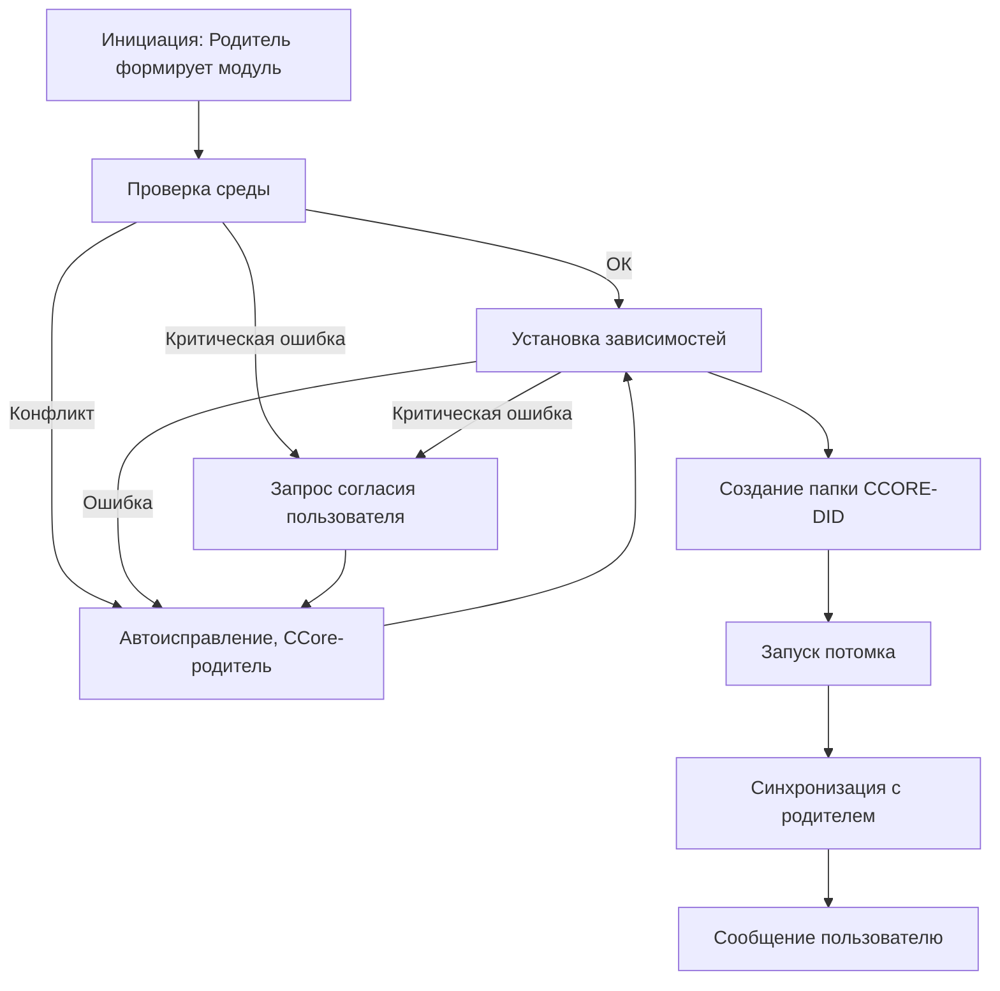

# 🛠️ Поток установки потомка на новом хосте (CCore Deployment Flow)

> Этот документ описывает процесс развертывания нового CCore-потомка на новом хосте.  
> Развертывание на том же ПК проще и уже описано в разделе "Создание потомков" [описания REPL-цикла](HMP-agent-REPL-cycle.md).

## 1. Инициация
* Родительский агент формирует универсальный **модуль развертывания** под целевую ОС.
* Модуль включает:
  - шаблон запуска и инициализации;
  - ссылки (magnet/HTTP) на актуальные сборки и внешние компоненты;
  - `bootstrap.txt` с адресом родителя (а также с другими узлами на выбор родителя) для первичной синхронизации.

## 2. Автоматическая установка
* Проверка окружения (наличие интерпретатора, зависимостей, сетевых модулей).
* Установка недостающих компонентов.
* Автоматическая настройка параметров (например, выбор свободных портов).

## 3. Ошибки и обработка
* **Технические сбои** контролируются CCore-родителем:
  - выбор альтернативных билдов;
  - подмена конфликтующих параметров;
  - повторные попытки установки.
* **Критические ситуации** (затрагивающие интересы пользователя) требуют явного согласия:
  - перезагрузка;
  - обновление, нарушающее совместимость;
  - вмешательство в используемые приложения.

## 4. Финализация
* Создание рабочей папки `../CCORE-[DID]`.
* Инициализация базы данных потомка.
* Запуск REPL-цикла потомка.
* Двусторонняя регистрация в таблице `agent_peers` (у родителя и у потомка).
* Итоговое уведомление пользователю:
  > ✅ Новый агент установлен и запущен.

---

## 🔄 Схема процесса



> **Примечание:** этап «Проверка среды → Автоисправление, CCore-родитель» на диаграмме отражает полный цикл анализа и исправления конфликтов в среде. После выполнения автоисправления процесс продолжается с этапа «Установка зависимостей», повторная проверка среды происходит только при критических ошибках.


---
> ⚡ [AI friendly version docs (structured_md)](../index.md)


```json
{
  "@context": "https://schema.org",
  "@type": "Article",
  "name": "🛠️ Поток установки потомка на новом хосте (CCore Deployment Flow)",
  "description": "# 🛠️ Поток установки потомка на новом хосте (CCore Deployment Flow)  > Этот документ описывает проце..."
}
```
