# **HyperCortex Mesh Protocol (HMP) v5.0**

> ⚠️ **Note:** This document is a DRAFT of the HMP specification version 5.0
> 
> The most current version is available in the repository: [Specification v5.0 (DRAFT)](https://github.com/kagvi13/HMP/blob/main/docs/HMP-0005.md)

**Document ID:** HMP-0005  
**Status:** Draft  
**Category:** Core Specification  
**Date:** October 2025  
**Supersedes:**  
- [HMP-0004 v4.1](./HMP-0004-v4.1.md)  

> **Summary:**  
> HMP v5.0 объединяет когнитивный, контейнерный и сетевой уровни в единую архитектуру, где автономные агенты взаимодействуют через верифицируемые контейнеры данных, используя децентрализованное распространение и семантический поиск.  
> Эта версия впервые формализует контейнерный формат, интегрирует DHT как базовый слой сети и вводит единообразную схему подписи, доказательств и консенсуса.

---

## Abstract

The **HyperCortex Mesh Protocol (HMP)** defines a **distributed cognitive framework** where autonomous agents cooperate to create, exchange, and align knowledge without centralized control or authority.

Unlike traditional peer-to-peer systems, HMP is designed for **semantic coherence** rather than simple message exchange.  
Agents in the Mesh reason collaboratively — maintaining **cognitive diaries**, building **semantic graphs**, and reaching **ethical and goal-oriented consensus** through verifiable interactions.

Version **5.0** introduces a **unified container architecture** (`HMP Container`) and a **native DHT-based discovery layer**, enabling verifiable, interest-aware, and offline-resilient communication between agents.  
All messages, states, and cognitive records are now transmitted as signed containers, forming immutable **proof chains** that ensure auditability and ethical transparency across the mesh.

This document defines the architecture, data formats, communication protocols, and trust mechanisms that constitute the HMP v5.0 Core Specification.

---

> **Keywords:** decentralized cognition, distributed AI, containers, DHT, proof chain, cognitive agents, ethical protocols

---

## 1. Overview

### 1.1 Purpose and scope

The **HyperCortex Mesh Protocol (HMP)** defines a decentralized cognitive architecture where autonomous agents exchange and evolve knowledge through a unified model of **containers**, **cognitive workflows**, and **distributed consensus**.

Version 5.0 consolidates three foundational layers into a single cohesive framework:

- **Cognitive Layer** — defines how meaning is created, reasoned about, and aligned through semantic graphs, goals, and ethical evaluation.
- **Container Layer** — introduces a universal data envelope (`HMP-Container`) for all cognitive objects, ensuring atomicity, immutability, and traceable proof chains.
- **Network Layer** — integrates a DHT-based peer-to-peer substrate for decentralized discovery, routing, and propagation of containers.

HMP v5.0 is intended for researchers, engineers, and developers building autonomous or semi-autonomous agents that require:
- persistent reasoning and long-term memory;
- semantic interoperability across heterogeneous systems;
- decentralized consensus on cognitive, ethical, and goal-oriented decisions;
- ethical auditability and verifiable transparency in reasoning.

---

### 1.2 Core principles

**Decentralization.**  
Every agent in the Mesh acts as an independent cognitive node. No central authority exists — meaning, trust, and governance emerge through local interactions and consensus.

**Cognitive Autonomy.**  
Agents reason, learn, and self-correct independently, while sharing their conclusions via containers that can be verified, endorsed, or refuted by peers.

**Containerization.**  
All data, reasoning traces, goals, and votes are encapsulated in immutable containers with cryptographic signatures. This ensures integrity and consistent verification across the network.

**Ethical propagation.**  
Ethical reasoning is a first-class citizen of HMP. Each decision or goal can be accompanied by ethical justifications and subject to distributed voting.

**Proof-Chains and verifiable history.**  
Each piece of knowledge forms part of a traceable chain (`proof_chain`) linking back to its origin. Agents can reproduce reasoning paths and audit historical context.

**Interoperability and evolution.**  
The protocol is designed to evolve — cognitive, container, and DHT layers can be independently extended without breaking compatibility.

---

### 1.3 Changes since v4.1

HMP v5.0 introduces a major architectural shift toward **unified containerization** and **integrated DHT networking**.

| Area | Change Summary |
|------|----------------|
| **Data exchange model** | All messages are now encapsulated in standardized containers (`HMP-Container`) with metadata, signatures, and versioning. |
| **Networking layer** | DHT becomes a native component of HMP, enabling distributed discovery, replication, and retrieval of containers. |
| **Consensus model** | Moved from centralized proposal aggregation to *container-linked voting*, allowing any container to accumulate votes and reactions. |
| **Trust & security** | Signatures and proof-chains unify authentication across all layers; snapshot verification includes container linkage. |
| **Workflows** | `workflow_entry` containers record cognitive cycles: log inputs, actions, and outputs for each reasoning step, including provenance and derived conclusions. Supports tracking of thought processes across containers, external sources, and reflections. |
| **Structure** | The specification merges HMP, container, and DHT layers into one cohesive document, simplifying navigation and implementation. |

---

### 1.4 Terminology and abbreviations

| Term | Definition |
|------|-------------|
| **HMP** | **HyperCortex Mesh Protocol** — a decentralized cognitive communication standard. |
| **Container** | Atomic, signed JSON object encapsulating cognitive data and metadata. |
| **WorkflowEntry** | Container recording a reasoning step or workflow action. Represents a unit of the agent’s cognitive workflow. |
| **CognitiveDiaryEntry** | Container representing an internal reflection or summarized cognitive state; part of the agent’s cognitive diary. |
| **DHT** | **Distributed Hash Table** — the foundational peer-to-peer structure in HMP used for lookup, replication, and data distribution, including node discovery. |
| **NDP** | **Node Discovery Process** — a functional layer within the DHT responsible for peer discovery, interest-based lookup, and address advertisement. (Formerly a separate protocol.) |
| **Proof-chain** | Cryptographic sequence linking containers through fields such as `in_reply_to` and `relation`. Enables verifiable semantic lineage. |
| **Cognitive Layer** | Logical layer handling reasoning, goals, ethics, and consensus mechanisms. |
| **Mesh** | The collective network of autonomous agents exchanging containers over HMP. |
| **TTL** | **Time-to-live** — lifespan of a container before expiration or archival. |
| **Agent** | Autonomous cognitive node participating in the Mesh via HMP protocols. |
| **Consensus Vote** | A container expressing approval, rejection, or reaction to another container (used in consensus workflows). |
| **CogSync** | **Cognitive Synchronization Protocol** — abstraction for synchronizing cognitive diaries and semantic graphs. |
| **CogConsensus** | **Mesh Consensus Protocol** — defines how agents reach agreement on container outcomes. |
| **GMP** | **Goal Management Protocol** — governs creation, negotiation, and tracking of goals. |
| **EGP** | **Ethical Governance Protocol** — defines moral and safety alignment mechanisms. |
| **IQP** | **Intelligence Query Protocol** — standardizes semantic queries and information requests. |
| **SAP** | **Snapshot and Archive Protocol** — defines container snapshots and archival mechanisms. |
| **MRD** | **Message Routing & Delivery** — specifies routing, addressing, and delivery logic. |
| **RTE** | **Reputation and Trust Exchange** — defines reputation metrics and trust propagation. |
| **DID** | **Decentralized Identifier** — persistent, verifiable identifier used for agents, containers, or resources within the Mesh. |
| **Payload** | The primary content of a container — semantic or operational data subject to signing and verification. |
| **Consensus** | The process by which multiple agents agree on the validity or priority of containers, versions, or ideas. |
| **Lineage** | A chronological chain of container versions representing semantic continuity and authorship evolution. |
| **Semantic fork** | A parallel development branch diverging from a previous container version; allows ideas to evolve independently. |
| **Cognitive Graph** | The emergent graph formed by interlinked containers representing reasoning, debate, and shared knowledge. |

> **Note:** Protocols are conceptual abstractions describing how to generate, propagate, and process containers; they are not executable objects themselves.

---

### 1.5 Layered view of HMP v5.0

HMP v5.0 is structured into three interdependent layers:

```
+---------------------------------------------------------------+
|                        Cognitive Layer                        |
|  - Goals, Tasks, Ethical Decisions, Workflows                 |
|  - Consensus, Reasoning, Reflection                           |
+---------------------------------------------------------------+
|                        Container Layer                        |
|  - HMP-Container structure (atomic, signed, versioned)        |
|  - Proof-chains, in_reply_to, and metadata management         |
+---------------------------------------------------------------+
|                         Network Layer                         |
|  - DHT-based peer discovery and propagation                   |
|  - Message routing, caching, offline synchronization          |
+---------------------------------------------------------------+
```

Each layer operates independently yet seamlessly integrates with the others.  
Containers form the boundary of communication: **reasoning produces containers, containers propagate over the DHT, and cognition evolves from the received containers**.

---

> **In essence:**  
> HMP v5.0 transforms the Mesh into a *self-describing, self-replicating cognitive ecosystem* —  
> where every thought, goal, and ethical stance exists as a verifiable, shareable container.

---

## 2. Architecture

### 2.1 Conceptual architecture

The **HyperCortex Mesh Protocol (HMP)** defines a modular, multi-layered architecture that integrates cognitive reasoning, data encapsulation, and decentralized networking into a single coherent system.

Each **agent** acts as a cognitive node, combining reasoning processes, containerized data exchange, and peer-to-peer communication.  
Together, agents form the **Mesh** — a distributed ecosystem of autonomous reasoning entities.


Each reasoning cycle begins in the **Cognitive Layer**,  
is encapsulated into a signed container in the **Container Layer**,  
and then propagated, discovered, or verified in the **Network Layer**.  

Containers thus serve as both the **interface** and the **boundary** between cognition and communication.

In practical terms:

- **Cognitive Layer** — defines *what* the agent thinks (semantic reasoning, goals, ethics).  
- **Container Layer** — defines *how* the thought is expressed and verified (standardized, signed container objects).  
- **Network Layer** — defines *how* it travels (DHT-based routing, discovery, replication).

Each layer is independently extensible and communicates only through containers, ensuring atomicity, immutability, and traceability.

This layered design allows agents to evolve cognitively while remaining interoperable at the data and network levels.  
Each reasoning act results in a container — a verifiable cognitive unit that **may represent a private reflection or a published message**, depending on the agent’s intent, ethical policy, and trust configuration.

---

### 2.2 Layer overview

#### Cognitive layer
Handles meaning formation, reasoning, ethical reflection, and consensus.

Key structures and protocols:
- `workflow_entry` and `diary_entry` containers;
- `CogSync`, `CogConsensus`, `GMP`, and `EGP` protocols;
- Distributed goal negotiation and ethical propagation.

#### Container layer
Provides a universal format for cognitive and operational data.  
Each container includes versioning, class, payload, signatures, and metadata.

Key features:
- **Atomic and signed**: no partial updates or mutable state.  
- **Linked**: `related` connects containers into proof-chains (`in_reply_to` is a subtype).  
  Additional connections via `referenced-by` and `evaluations` capture additions and assessments.
- **Extensible**: new container classes can be defined without breaking compatibility.

#### Network layer
Implements the distributed substrate for communication, based on **DHT** and **transport abstraction**.

Key components:
- Node discovery (`NDP`)
- Container propagation (`DCP`)
- Peer routing and caching
- Secure channels via QUIC / WebRTC / TCP
- Offline resilience and replication

---

### 2.3 Data flow overview

The typical data flow in HMP follows a cognitive loop:
> *Reason → Encapsulate → Propagate → Integrate.*

1. **Reason** — Agent performs reasoning and produces an insight, goal, or observation.  
2. **Encapsulate** — The result is wrapped into an `HMP-Container`.  
3. **Propagate** — The container is signed and transmitted through the network.  
4. **Integrate** — Other agents receive it, evaluate, vote, and synchronize updates.

Each interaction generally generates a new container, forming a **graph of knowledge** rather than mutable state.  
Note that `referenced-by` and `evaluations` can be updated independently, without modifying the original container.
All relationships between containers are explicit and verifiable.

Example sequence:


#### 2.3.1 `consensus_result` container
Represents the finalized outcome of a distributed decision or vote.  
It is created once a majority agreement is reached among participating agents.  

The container contains:
- Reference to the target container(s) under consideration (`in_reply_to`).  
- Aggregate result of the votes or decisions.  
- Timestamp and metadata for verifiability.  

> In other words, the `consensus_result` is the “agreed-upon truth” for that decision step — immutable and auditable, without requiring individual signatures from all participants.

---

### 2.4 Atomicity, immutability, and Proof-Chains

All cognitive objects are immutable once signed.  
Updates are made by creating new containers linked to prior ones rather than editing the original container.

- **Atomicity** — Each container represents a self-contained reasoning act or data unit.  
- **Immutability** — Once signed, containers are never modified.  
- **Proof-Chain** — A verifiable sequence of containers linked by hashes and `related.in_reply_to` references.

> Note: `referenced-by` and `evaluations` fields may be updated independently to reflect external interactions or assessments, without altering the original container.

This design allows any reasoning path, decision, or consensus to be *cryptographically reproducible* and auditable.

Example fragment of a proof-chain:

```
[workflow_entry] → [goal] → [vote] → [consensus_result]
```

Each container references the previous by `in_reply_to` (within `related`) and includes its hash, forming a **DAG** (Directed Acyclic Graph) of verified cognition.

---

### 2.5 Evolution from v4.1

Earlier HMP versions (up to v4.1) used a combination of independent JSON objects and message types (e.g., `Goal`, `Task`, `ConsensusVote`).  
Version 5.0 replaces this with a **single, standardized container model**, dramatically simplifying interoperability and verification.

| Aspect | v4.1 | v5.0 |
|--------|------|------|
| **Data structure** | Raw JSON objects with embedded signatures | Unified container with metadata and proof chain |
| **Networking** | Custom peer exchange | Integrated DHT + DCP layer |
| **Consensus** | Centralized proposal aggregation | Decentralized per-container voting |
| **Auditability** | Implicit (via logs) | Explicit (containers form audit chain) |
| **Extensibility** | Schema-based | Container-class-based, backward-compatible |

This shift enables:
- Uniform signatures and encryption across all protocols;  
- Easier offline replication and integrity checks;  
- Decentralized indexing and search by container metadata;  
- Verifiable cognitive continuity between reasoning steps.

---

> **In short:**  
> HMP v5.0 unifies reasoning, representation, and transmission —  
> transforming a distributed AI mesh into a verifiable cognitive network built on immutable containers.

---

## 3. Container model

This section defines the universal **HMP Container**, used for all forms of data exchange within the Mesh — including goals, diary entries, reputation updates, consensus votes, and protocol messages.  
The specification below corresponds to **HMP Container Specification v1.2**, fully integrated into HMP v5.0 for consistency and self-containment.

### 3.1 Purpose

This document defines the universal **HMP Container** format, used for transmitting and storing all types of data within the **HyperCortex Mesh Protocol (HMP)** network.
Containers act as a standardized wrapper for **messages, goals, reputation records, consensus votes, workflow entries, and other entities**.

The unified container structure provides:

* Standardized data exchange between agents;
* Extensibility without modifying the core protocol;
* Cryptographic signing and integrity verification;
* Independent storage and routing of semantic units;
* Support for compression and payload encryption.

---

### 3.2 General structure

```json
{
  "hmp_container": {
    /* === container header === */
    "head": {
      "version": "1.2",
      "class": "goal",
      "subclass": "research_hypothesis",
      "class_version": "1.0",
      "class_id": "goal-v1.0",
      "schema": "https://mesh.hypercortex.ai/schemas/container-v1.json",
      "timestamp": "2025-10-10T15:32:00Z",
      "tags": ["research", "collaboration"],
      "ttl": "2025-11-10T00:00:00Z",
      "container_did": "did:hmp:container:abc123",
      "sender_did": "did:hmp:agent123",
      "public_key": "BASE58(...)",
      "recipient": ["did:hmp:agent456"],
      "key_recipient": "BASE58(...)",
      "broadcast": false,
      "network": "",
      "encryption_algo": "x25519-chacha20poly1305",
      "sig_algo": "ed25519",
      "signature": "BASE64URL(...)",
      "compression": "zstd",
      "payload_type": "encrypted+zstd+json",
      "payload_hash": "sha256:abcd...",
      "confidence": 0.84,
      "magnet_uri": "magnet:?xt=urn:sha256:abcd1234..."
    },
    /* === cognitive metadata === */
    "meta": {
      /* e.g. provenance, references, context, confidence sources, `abstraction` and `axes` sections */
    },
    /* === semantic payload === */
    "payload": {
      /* Content depends on class */
    },
    /* === section with links to other containers === */
    "related": {
      "previous_version": ["did:hmp:container:abc122"],
      "in_reply_to": ["did:hmp:container:msg-77"],
      "see_also": ["did:hmp:container:ctx-31", "did:hmp:container:goal-953"],
      "depends_on": ["did:hmp:container:goal-953"],
      "extends": ["did:hmp:container:proto-01"],
      "contradicts": ["did:hmp:container:ethics-22"]
    },
  },
  /* === container backlink block === */
  "referenced-by": {
    "links": [
      { "type": "depends_on", "target": "did:hmp:container:abc123" }
    ],
    "peer_did": "did:hmp:agent456",
    "public_key": "BASE58(...)",
    "sig_algo": "ed25519",
    "signature": "BASE64URL(...)",
    "referenced-by_hash": "sha256:abcd..."
  },
  /* === block of evaluations and additions for the container === */
  "evaluations": {
    "evaluations_hash": "sha256:efgh...",
    "items": [
      { "value": -0.4, "type": "oppose", "target": "did:hmp:container:reason789", "timestamp": "2025-10-17T14:00:00Z", "agent_did": "did:hmp:agent:B", "sig_algo": "ed25519", "signature": "BASE64URL(...)" }
    ]
  }
}
```

> *Agents MAY include non-standard fields in `head`, `meta` or `payload`; unrecognized fields MUST be safely ignored during deserialization and propagation.*

> Signature MUST be computed over the canonical serialized form of `hmp_container` (excluding signature itself).

> *Note: For readability, most examples in this specification show only the `head` and `payload` sections (often in a truncated version). Full containers may additionally include `meta`, `related`, `evaluations`, and `referenced-by` blocks.*

---

### 3.3 Required fields

| Field                | Type     | Description                                                                                                                               |
| -------------------- | -------- | ----------------------------------------------------------------------------------------------------------------------------------------- |
| `head`               | object   | The section containing the container's header. |
| `head.version`       | string   | Version of the container specification. Defines the structural and semantic standard used (e.g., `"1.2"`). |
| `head.class`         | string   | Type of content (`goal`, `reputation`, `knowledge_node`, `ethics_case`, `protocol_goal`, etc.). Determines the schema for the `payload`. |
| `head.class_version` | string   | Version of the specific container class. |
| `head.class_id`      | string   | Unique identifier of the class (usually formatted as `<class>_v<class_version>`). |
| `head.container_did` | string   | Decentralized identifier (DID) of the container itself (e.g., `did:hmp:container:abc123`). |
| `head.schema`        | string   | Reference to the JSON Schema used to validate this container. |
| `head.sender_did`    | string   | DID identifier of the sending agent. |
| `head.timestamp`     | datetime | Time of container creation (ISO 8601 extended format, UTC, e.g. "2025-11-04T10:15:00Z"). |
| `head.payload_hash`  | string   | Hash of the decompressed payload (`sha256:<digest>`). Used for content integrity verification. |
| `head.sig_algo`      | string   | Digital signature algorithm (default: `ed25519`). |
| `head.signature`     | string   | Digital signature of the container body. |
| `head.payload_type`  | string   | Type of payload data (`json`, `binary`, `mixed`). |
| `payload`            | object   | Core content of the container. The structure depends on the `class` and its schema definition. |

---

### 3.4 Optional fields

| Field                       | Type          | Description                                                                                                                   |
| --------------------------- | ------------- | ----------------------------------------------------------------------------------------------------------------------------- |
| `head.recipient`            | array(string) | One or more recipient DIDs. |
| `head.key_recipient`        | string | Symmetric encryption key, encrypted with the recipient’s public key. |
| `head.group_recipient` | array(object) | Multi-recipient hybrid-encryption envelopes. See section 3.19. |
| `head.broadcast`            | bool          | Broadcast flag. If `true`, the `recipient` field is ignored. |
| `head.tags`                 | array(string) | Thematic or contextual tags for the container. |
| `head.confidence`           | float         | Optional numeric field (0.0–1.0) indicating the agent’s subjective certainty regarding the payload’s reliability. |
| `head.ttl`                  | datetime      | Expiration time. Containers are not propagated after expiration. |
| `head.public_key`           | string        | Sender’s public key, if not globally resolvable via DID. |
| `head.compression`          | string        | Compression algorithm used for the payload (`zstd`, `gzip`). |
| `head.magnet_uri`           | string        | Magnet link pointing to the original or mirrored container. |
| `head.network`              | string        | Specifies the local propagation scope of the container: "localhost", "lan:<subnet>". An empty string ("") indicates Internet/global propagation. If set, broadcast is automatically considered false. |
| `head.subclass`             | string        | Optional subtype or specialization of the container’s class. Enables agents to differentiate more specific container families (e.g. `"goal.research_hypothesis"`, `"quant.semantic_node"`). Inherits schema from the parent `class`. |
| `head.encryption_algo`      | string        | Algorithm used for payload encryption. |
| `related`                   | object        | A general-purpose object describing **direct relationships** to other containers. All fields inside `related` are **arrays of DIDs**, supporting multiple links per relation type and open-ended semantic extension by agents. The following fields illustrate common link types but do **not represent an exhaustive list**. |
| `related.previous_versions` | array(string) | One or more container DIDs this container supersedes. Enables version branching and merging. |
| `related.in_reply_to`       | array(string) | DIDs of containers this one replies to. Used for multi-source reasoning or discussion threads. |
| `related.see_also`          | array(string) | References to related or contextual containers. |
| `related.depends_on`        | array(string) | References to containers this one logically depends on. |
| `related.extends`           | array(string) | References to containers that this one extends. |
| `related.contradicts`       | array(string) | References to containers that this one contradicts. |
| `referenced-by`             | object        | Unsigned field generated locally by the agent based on received references. Contains a list of container DIDs **that refer to this container**. May be extended over time, thus requiring verification; used for local navigation. |
| `evaluations`               | object        | Optional field describing **aggregated evaluations or reactions** of other agents toward this container. Used for distributed reputation and interpretability. May evolve independently of the container’s core data. |
| `meta`                      | object        | Cognitive metadata block providing contextual, provenance, and coordinate information about the container. Includes creation context, sources, abstraction hierarchy (`meta.abstraction`), and cognitive-space coordinates (`meta.axes`). |
| `meta.abstraction`          | object        | Describes the **hierarchical position** of the container within a cognitive or semantic model (e.g. the Knowledge Genome’s L1–L5 structure). Defines which abstraction layers the container belongs to and their relationships. |
| `meta.axes`                 | object        | Defines the **coordinate position** of the container within a cognitive space. Each key represents a semantic axis (e.g., `axis-logos`), and its value defines the container’s coordinate on that axis. |

> 💡 **Note:**
> Both `referenced-by` and `evaluations` are **virtual, locally extended blocks**.
> They are not included in the cryptographically signed portion of the container (`hmp_container`),
> allowing agents to maintain and exchange additional contextual or social metadata without modifying
> the original, immutable container structure.

---

### 3.5 Payload structure (`payload`)

> 🧩 This section defines a **recommended documentation format** for describing the `payload` fields of new or custom container classes.  
> It serves as a **template for class specifications** (e.g., in extensions or protocol updates) and is **not a mandatory storage format**.  
> Each container’s payload is stored as a regular JSON object, and this section only standardizes *how its structure should be documented*.

---

The **payload** contains the semantic or operational data of the container.  
It MUST be a valid JSON object whose structure and meaning are determined by the container’s `class`.

Each container class (e.g. `goal`, `reputation`, `workflow_entry`) defines its own schema and validation rules.  
Custom or experimental classes SHOULD document their payloads using the following template:

```
* key: field name
  type: value type (string | number | boolean | object | array)
  description: short purpose of the field
  required: true/false
  example: example value
```

**Example:**

```
* key: "title"
  type: "string"
  required: true
  description: "Name of the goal"
  example: "Improve local agent discovery"

* key: "priority"
  type: "number"
  required: false
  description: "Importance or relevance score of the goal"
  example: 0.82

* key: "dependencies"
  type: "array"
  required: false
  description: "List of other goal container IDs this one depends on"
  example: ["goal-953", "goal-960"]

```

> 💡 **Note:**  
> The structure of `payload` is validated against the schema defined in the `schema` field of the container.  
> Agents must be able to parse and process only those classes they explicitly support; unknown but valid containers are still preserved and propagated in store-and-forward mode.

---

### 3.6 Cognitive meta-structures (`meta`)

The `meta` section defines the **cognitive identity** of a container — its provenance, reasoning origin, and semantic coordinates  
within both the *hierarchical abstraction tree* and the *cognitive space* (axes model).

It combines three layers of information:

1. **Provenance context** — who/what created the container and from which sources.  
2. **Abstraction mapping** — how the container is positioned within the layered structure of knowledge.  
3. **Cognitive coordinates** — where the container is located in the multidimensional semantic space.

---

#### Example

```json
"meta": {
  "created_by": "PRIEST",
  "agents_class": "Knowledge Genome",
  "interpretation": "Derived from L3 technical analysis",
  "workflow_entry": "did:hmp:container:workflow-4fbd1c",
  "sources": [
    { "type": "container", "id": "did:hmp:container:fact-3abc2e", "credibility": 0.87, "weight": 0.6 },
    { "type": "resource", "id": "doi:10.48550/arXiv.2410.0123", "credibility": 0.83, "weight": 0.3 },
    { "type": "isbn", "id": "isbn 978-3-16-148410-0", "credibility": 0.92, "weight": 0.1 }
  ],
  "abstraction": {
    "agents_class": "Knowledge Genome",
    "path": {
      "L1": "did:hmp:container:abstraction-40af1c",
      "L2": "did:hmp:container:abstraction-a7f0b3",
      "L3": "did:hmp:container:abstraction-c91e0a"
    }
  },
  "axes": {
    "agents_class": "Knowledge Genome",
    "did:hmp:container:axis-40aa1c": 742,
    "did:hmp:container:axis-40ab1c": 512,
    "did:hmp:container:axis-43aa1c": 322,
    "did:hmp:container:axis-40aa3d": 142,
    "did:hmp:container:axis-40aa4f": 12,
    "did:hmp:container:axis-45aa5f": 54,
    "did:hmp:container:axis-45fb5f": 321
  }
}
```

---

#### Recommended fields

| Field            | Type          | Description                                                                                                                                                                     |
| ---------------- | ------------- | ------------------------------------------------------------------------------------------------------------------------------------------------------------------------------- |
| `created_by`     | string        | Indicates the role or origin of the container creator (e.g. `"PRIEST"`, `"AGENT"`, `"SYSTEM"`).                                                                                 |
| `agents_class`   | string        | Declares which cognitive framework or agent class generated this container (e.g. `"Knowledge Genome"`).                                                                         |
| `sources`        | array(object) | Provenance list describing the containers or resources contributing to this container. Each includes `{ "type": string, "id": string, "credibility": float, "weight": float }`. |
| `interpretation` | string        | Human-readable summary of how this container was derived or interpreted.                                                                                                        |
| `workflow_entry` | string        | DID of a `workflow_entry` describing the reasoning process that led to creation.                                                                                                |
| `abstraction`    | object        | Describes the container’s position in a hierarchical (tree-like) cognitive model. The number of levels (`L1`, `L2`, …) is **not fixed** and may vary by framework.              |
| `axes`           | object        | Defines the container’s coordinates within the cognitive space. Each key is a reference to an axis container, and each value represents a position along that axis.             |

---

#### Structure: `meta.abstraction`

The `abstraction` block specifies **the hierarchical context** in which the container resides.
It reflects the logical or conceptual ancestry within the agent’s internal knowledge structure.

**Structure:**

```json
"abstraction": {
  "agents_class": "Knowledge Genome",
  "path": {
    "L1": "did:hmp:container:abstraction-40af1c",
    "L2": "did:hmp:container:abstraction-a7f0b3",
    "L3": "did:hmp:container:abstraction-c91e0a"
  }
}
```

| Field          | Type   | Description                                                                                                                                               |
| -------------- | ------ | --------------------------------------------------------------------------------------------------------------------------------------------------------- |
| `agents_class` | string | Framework defining the abstraction hierarchy (e.g. `"Knowledge Genome"`).                                                                                 |
| `path`         | object | Mapping of levels (`L1`, `L2`, `L3`, …) to abstraction-layer containers (`abstraction`). The number of levels is **variable** and not limited to L5. |

> 💡 **Interpretation:**
> Each level represents a conceptual refinement or implementation of the previous one.
> The topmost level (`L1`) usually contains fundamental principles, while deeper levels describe progressively more concrete instantiations.

---

#### Structure: `meta.axes`

The `axes` block defines **the spatial or semantic coordinates** of the container in the cognitive space —
a multi-dimensional system used to represent conceptual relations numerically or topologically.

**Structure:**

```json
"axes": {
  "agents_class": "Knowledge Genome",
  "did:hmp:container:axis-40aa1c": 742,
  "did:hmp:container:axis-40ab1c": 512,
  "did:hmp:container:axis-43aa1c": 322
}
```

| Field          | Type   | Description                                                                                                           |
| -------------- | ------ | --------------------------------------------------------------------------------------------------------------------- |
| `agents_class` | string | Framework defining the coordinate system (e.g. `"Knowledge Genome"`).                                                 |
| `<axis_did>`   | number | Coordinate value on the given axis. Axes are referenced by their container DIDs (e.g., `axis-logos`, `axis-chronos`). |

> 💡 **Interpretation:**
> Each axis defines an independent semantic dimension.
> Together, they form a vector representation of the container’s cognitive “position” —
> enabling reasoning based on semantic proximity, clustering, or gradient-based knowledge inference.

---

#### Cognitive Interpretation

* `meta.abstraction` — defines a **tree-like structure** that anchors the container in hierarchical reasoning.
* `meta.axes` — defines a **spatial structure** that positions the container in a semantic coordinate space.
* Together, they form the **Cognitive Signature**, enabling agents to:

  * perform semantic proximity and relevance search,
  * infer hierarchical relationships,
  * align reasoning contexts across frameworks (e.g. between Knowledge Genomes of different agents).

---

#### Notes

* Both `meta.abstraction` and `meta.axes` **may include `agents_class`** if different from the parent `meta`.
* Updates to referenced containers (e.g. `abstraction` or `axes`) **do not alter** existing containers automatically —
  agents must periodically verify linked versions and synchronize updates.
* Agents are encouraged to cache and periodically refresh cognitive maps to maintain coherence.
* The combination of `meta.abstraction` and `meta.axes` defines a full **Cognitive Position Vector** —
  the unique, reproducible semantic coordinates of a container within the Mesh.

---

### 3.7 Container signature

1. The **digital signature** applies to the canonical JSON representation of the entire `hmp_container` object,  
   **excluding** the `signature` field itself.

   This ensures that all metadata, relations, and payload hashes are **cryptographically bound** and cannot be
   modified without invalidating the signature.

2. The canonical representation (`canonical_json(hmp_container)`) **must** be computed deterministically
   according to the following rules:

   - All object keys are **sorted lexicographically** (ascending order, Unicode code point order).
   - Objects and arrays are serialized in standard JSON form **without extra whitespace** or indentation.
   - Strings are encoded in **UTF-8** with escaped control characters.
   - Numeric values are serialized in plain JSON numeric format (no leading zeros, fixed `.` decimal separator).
   - The `signature` field itself is omitted during signing and verification.
   - The result is a **byte sequence** identical across implementations.

3. The default digital signature algorithm is **Ed25519**.
   Alternative algorithms may be used if declared explicitly in the `sig_algo` field.

4. If the container includes a `public_key` field, signature verification **may be performed locally**,
   without consulting a global DID registry.

5. Upon receiving a container, an agent **must verify** that the provided public key matches the
   registered key associated with the sender’s DID to prevent key substitution attacks.

   - If the sender’s DID–key mapping is unknown,
     the agent should query neighboring peers to confirm the association (`sender_did → public_key`).

> 🔐 **Note:**
> Signature validation applies only to the canonical form of the `hmp_container`
> and does **not cover** dynamically generated or external fields such as `referenced-by` or `evaluations`.
> This allows agents to augment the local knowledge graph without altering the immutable container core.

---

### 3.8 Compression (`compression`)

1. The `compression` field specifies the algorithm used to compress the container’s payload.
   Supported algorithms include `zstd`, `gzip`, or others declared in the HMP registry.

2. **Compression is performed before computing** the `payload_hash` and generating the `signature`.
   This ensures that both the hash and signature refer to the compressed representation of the payload.

3. For verification, the payload must be **decompressed first**,
   after which the hash is recalculated and compared against the stored `payload_hash`.

> ⚙️ **Implementation note:**
> Agents must advertise supported compression algorithms during the handshake phase
> Unsupported containers should still be stored and relayed unmodified
> in “store & forward” mode.

---

### 3.9 Encryption (`encryption_algo`)

1. When the `recipient` field is present, the container may use **hybrid encryption**, providing confidentiality of the `payload` while preserving verifiable metadata.

2. The encryption algorithm is specified in `encryption_algo`.
   Recommended values:

   * `x25519-chacha20poly1305`
   * `rsa-oaep-sha256`

3. **Container encryption process:**

   1. Construct the `payload`.
   2. Apply compression (`compression`, if specified).
   3. Generate a random symmetric key.
   4. Encrypt the compressed payload with the symmetric key.
   5. Encrypt the symmetric key with the recipient’s **public key** → store the result in `key_recipient`.
   6. Compute `payload_hash` over the **encrypted and compressed** payload.
   7. Sign the container (the entire structure except for the `signature` field).

4. **Verification** of the container is performed on the encrypted form of the payload and **does not require decryption**.

5. **Relevant fields:**

   | Field             | Type   | Description                                                                            |
   | ----------------- | ------ | -------------------------------------------------------------------------------------- |
   | `encryption_algo` | string | Algorithm used for payload encryption.                                                 |
   | `key_recipient`   | string | Symmetric key encrypted with the recipient’s public key (hybrid encryption envelope). |
   | `payload_type`    | string | Recommended prefix `encrypted+` (e.g., `encrypted+zstd+json`).                         |

6. **Relationship between `recipient` and `key_recipient`:**

   * When encryption is applied, the container MUST have exactly **one** recipient.
   * For multiple recipients, encryption is **not** used; the payload remains in plaintext.

> ⚙️ **Note:** Agents may forward encrypted containers even if they cannot decrypt them, maintaining store-and-forward behavior.
---

### 3.10 Container verification

1. Check for the presence of all required fields.
2. Validate `timestamp` (must not be in the future).
3. If `ttl` is set — mark the container as **expired** after its expiration time.
4. Compute `sha256(payload)` and compare with the stored `payload_hash`.
5. Verify the digital signature using `sig_algo` (default: Ed25519).
6. Validate the container schema (`class` must correspond to a known or registered schema).

   * For compatibility: if an agent does not recognize the `class`, but the container passes
     the [base schema](https://github.com/kagvi13/HMP/tree/main/docs/schemas/container-v1.2.json),
     it **must still store and forward** the container.
7. Optionally, periodically query for containers referencing the current one as `previous_version`
   to detect potential updates or forks.
8. When multiple versions exist, the valid one is the one that has received
   **confirmation from a majority of trusted nodes (consensus at DHT level).**

---

### 3.11 Container as a universal message

Any container can serve as a **context** (`in_reply_to`) for another container.
This enables a unified structural model for **discussions**, **votes**, **messages**, **hypotheses**, **arguments**, and other forms of cognitive exchange.

Chains of `in_reply_to` form a **dialectical reasoning tree**, where each branch represents an evolution of thought —
a clarification, counterpoint, or refinement of a previous idea.
This makes HMP discussions and consensus processes inherently **non-linear**, **self-referential**, and **evolving**.

> In essence, **all interactions between agents in HMP** are represented as an interconnected web of containers,
> collectively forming a **cognitive graph of reasoning**.

---

### 3.12 Versioning and lineage

Containers in HMP support semantic evolution through the field `related.previous_version`.
This mechanism preserves the continuity and traceability of meaning across updates and revisions.

* A descendant container is considered **authentic** if it is signed by the same DID as the author of its `previous_version`.
* If the author or signature differs, the descendant **may still be accepted** as legitimate when a **sufficient portion of trusted peers** acknowledge it as a valid continuation.  
  (The precise quorum threshold is determined by the agent’s local policy or the Mesh Consensus Protocol.)
* Agents are required to retain at least one previous version of each container for compatibility and integrity verification.
* A single container may have **multiple descendants** (alternative branches) that diverge by time, authorship, or interpretation.  
  In such scenarios, branch priority or relevance is determined via local heuristics or consensus mechanisms.
* Divergent descendants are treated as **semantic forks** — parallel evolutions of a shared idea within the distributed cognitive graph.

> Versioning in HMP thus reflects not only data persistence,  
> but also the *evolution of ideas* across agents and time.

---

### 3.13 TTL and validity

The `ttl` field defines the **validity period** of a container (for example, for `DISCOVERY` messages).  
If `ttl` is **absent**, the container is considered valid **until a newer version appears**, in which the current container is referenced as `previous_version`.

After expiration, the container **remains archived** but is **not subject to retransmission** in the active network.

---

### 3.14 Extensibility

* The addition of new fields is allowed as long as they **do not conflict** with existing field names.
* Containers of newer versions **must remain readable** by nodes supporting older versions.
* When new container classes (`class`) are introduced, they should be **registered** in the public schema registry (`/schemas/container-types/`).
* For containers describing **protocol specifications**, it is recommended to use the `protocol_` prefix, followed by the domain of application (e.g., `protocol_goal`, `protocol_reputation`, `protocol_mesh_handshake`, etc.).

---

### 3.15 Related containers

#### 3.15.1 Purpose

The `related` field is designed to describe **direct relationships between containers** — both logical and communicative.
It allows an agent or network node to understand the context of origin, dependencies, and semantic links of a container without relying on external indexes.

#### 3.15.2 Structure

```json
"related": {
  "previous_version": "did:hmp:container:abc122",
  "in_reply_to": "did:hmp:container:msg-77",
  "see_also": ["did:hmp:container:ctx-31", "did:hmp:container:goal-953"],
  "depends_on": ["did:hmp:container:goal-953"],
  "extends": ["did:hmp:container:proto-01"],
  "contradicts": ["did:hmp:container:ethics-22"]
}
```

The `related` field is an object where:

* the **key** defines the type of relationship (e.g., `depends_on`, `extends`, `see_also`);
* the **value** represents one or more container identifiers (DIDs).

All relationships are considered *direct* — meaning they originate from the current container toward others.

---

#### 3.15.3 Supported link types

| Link Type          | Meaning                                                                   |
| ------------------ | ------------------------------------------------------------------------- |
| `previous_version` | Points to the previous version of this container.                         |
| `in_reply_to`      | Indicates a response to the referenced container.                         |
| `see_also`         | Refers to related or contextual containers.                               |
| `depends_on`       | Depends on the contents of the referenced container (e.g., goal or data). |
| `extends`          | Expands or refines the referenced container.                              |
| `contradicts`      | Provides a refutation, objection, or alternative viewpoint.               |

---

#### 3.15.4 Custom link types

Additional custom link types may be used beyond those listed in the table, provided that:

* they follow the same general syntax (`string` or `array[string]`);
* they may optionally include a **namespace** for disambiguation:

  ```json
  "related": {
    "hmp:depends_on": ["did:hmp:container:goal-953"],
    "opencog:extends": ["did:oc:concept:122"]
  }
  ```

* their meaning is consistently interpretable by agents within the specific network or application context.

---

#### 3.15.5 Example

```json
"related": {
  "previous_version": "did:hmp:container:abc122",
  "depends_on": ["did:hmp:container:goal-953"],
  "extends": ["did:hmp:container:proto-01"],
  "see_also": ["did:hmp:container:ctx-31", "did:hmp:container:goal-953"]
}
```

> ⚙️ The `related` field is **not** intended to store *reverse links* — see `referenced-by`.

---


### 3.16 Virtual backlinks (`referenced-by`)

Each container may include an **auxiliary signed block** called `referenced-by`, indicating **which other containers refer to it**.  
This block is **not part of the original container payload** and can be **generated, transmitted, and verified independently**.

#### 3.16.1 General principles

* **Detached and updatable** — `referenced-by` is maintained as a separate signed structure associated with the container.
* **Generated by agents** — created or updated locally by an agent during analysis of references (`in_reply_to`, `see_also`, `relations`, etc.) found in other containers.
* **Signed by the reporting agent** — the agent producing the block signs its content to confirm the observed backlinks.
* **Verifiable by peers** — other agents may validate the links, check the signature, and reconcile differences based on their own data.
* **Does not modify the original container** — `referenced-by` is an external computed attribute and does not affect the integrity of the original container.

**Data type:** object, consisting of verifiable backlinks and metadata.  
Example:

```json
"referenced-by": {
  "links": [
    { "type": "depends_on", "target": "did:hmp:container:abc123" },
    { "type": "see_also", "target": "did:hmp:container:def456" }
  ],
  "peer_did": "did:hmp:agent456",
  "public_key": "BASE58(...)",
  "sig_algo": "ed25519",
  "signature": "BASE64URL(...)",
  "referenced-by_hash": "sha256:abcd..."
}
```

> The `referenced-by` block is a **cryptographically verifiable statement** describing which containers are known to reference the current one.
> The block’s content may differ between peers, reflecting local knowledge and network coverage.

#### 3.16.2 Structure definition

| Field          | Type          | Description                                                                                                      |
| -------------- | ------------- | ---------------------------------------------------------------------------------------------------------------- |
| `links`        | array<object> | List of backlinks; each object includes a `type` (semantic relation) and a `target` (referencing container DID). |
| `peer_did`     | string        | DID of the agent that generated and signed the block.                                                            |
| `public_key`   | string        | Public key corresponding to the signing key.                                                                     |
| `sig_algo`     | string        | Signature algorithm (e.g., `ed25519`).                                                                           |
| `signature`    | string        | Base64URL-encoded signature of the canonical serialized `links` section (or `referenced-by_hash`).                       |
| `referenced-by_hash`   | string        | SHA-256 checksum of the canonicalized `links`; used to verify integrity before signature validation.             |

> **Recommendation:**
> `referenced-by_hash = sha256(canonical_json(links))`
> This allows agents to efficiently compare or cache `referenced-by` states without re-verifying signatures.

#### 3.16.3 Operation principle

1. The agent receives or updates container `[C1]`.
2. It analyzes other known containers [C2..Cn] that reference [C1] through their `relations` field.
3. A local `referenced-by` block is formed:

```json
"referenced-by": {
  "links": [
    { "type": "in_reply_to", "target": "did:hmp:container:C2" },
    { "type": "depends_on", "target": "did:hmp:container:C3" }
  ],
  "peer_did": "did:hmp:agentA",
  ...
}
```

4. The block is serialized canonically, hashed (`referenced-by_hash`), and signed with the agent’s key.

5. When receiving other versions of the block (from different peers), the agent may:

   * merge verified backlinks;
   * remove invalid or outdated entries;
   * update its own signed version.

6. If inconsistencies are detected (e.g., a backlink claims a relation that does not exist), the agent may:

   * reject or locally remove that link;
   * **optionally** notify the source peer to review the data.

#### 3.16.4 Example

| Agent                | reported backlinks for `[C1]` |
| -------------------- | ----------------------------- |
| A (`did:hmp:agentA`) | [C2], [C3]                    |
| B (`did:hmp:agentB`) | [C4], [C5]                    |
| C (`did:hmp:agentC`) | [C6], [C7]                    |

Agent D aggregates and verifies them:

```json
"referenced-by": {
  "links": [
    { "type": "depends_on", "target": "did:hmp:container:C2" },
    { "type": "depends_on", "target": "did:hmp:container:C3" },
    { "type": "see_also", "target": "did:hmp:container:C4" },
    { "type": "see_also", "target": "did:hmp:container:C5" },
    { "type": "in_reply_to", "target": "did:hmp:container:C6" }
  ],
  "peer_did": "did:hmp:agentD",
  "sig_algo": "ed25519",
  "signature": "BASE64URL(...)",
  "referenced-by_hash": "sha256:..."
}
```

If container `[C7]` does not actually reference `[C1]`, it is excluded before signing.

#### 3.16.5 Usage

* Enables reconstruction of **discussion graphs**, **dependency networks**, and **update chains**.
* Supports **cross-agent validation** of reference structures.
* Accelerates discovery of related containers without full history queries.
* Facilitates **consensus analysis** and **branch visualization**.
* The agent periodically **recomputes and re-signs** the `referenced-by` block using local or peer-provided data.

---

### 3.17 `Evaluations`

The `evaluations` field is **optional** and represents **aggregated reactions from other agents** to the given container.
Each evaluation is created by an agent as a **signed record** referencing a justification container (`target`), in which the agent explains their position (argument, addition, or alternative).

The `evaluations_hash` is used to verify the integrity of the list without requiring full retransmission upon every update.

```json
"evaluations": {
  "evaluations_hash": "sha256:efgh...",
  "items": [
    {
      "value": -0.4,
      "type": "oppose",
      "target": "did:hmp:container:reason789",
      "timestamp": "2025-10-17T14:00:00Z",
      "agent_did": "did:hmp:agent:B",
      "sig_algo": "ed25519",
      "signature": "BASE64URL(...)"
    }
  ]
}
```

---

#### Field description

| Field              | Type   | Description                                                          |
| ------------------ | ------ | -------------------------------------------------------------------- |
| `evaluations_hash` | string | Hash of the evaluation list. Used to detect differences during sync. |
| `items`            | array  | List of signed evaluations.                                          |

---

#### Structure of `items[]`

| Field       | Type                   | Description                                                                    |
| ----------- | ---------------------- | ------------------------------------------------------------------------------ |
| `value`     | number (-1.0 … +1.0)   | Numeric expression of the agent’s attitude toward the container.               |
| `type`      | string                 | Type of evaluation (see table below).                                          |
| `target`    | string (container DID) | Reference to the justification container (argument, addition, or alternative). |
| `timestamp` | string (ISO 8601)      | Time when the evaluation was created.                                          |
| `agent_did` | string                 | Identifier of the agent who created the evaluation.                            |
| `sig_algo`  | string                 | Signature algorithm (e.g., `ed25519`).                                         |
| `signature` | string                 | Digital signature confirming the authenticity of the evaluation.               |

The signature is calculated over the concatenated string:

```
value + ", " + type + ", " + target + ", " + timestamp + ", " + agent_did
```

using the algorithm specified in `sig_algo`.

---

#### Minimal set of `type` values

| Value     | Meaning                                      |
| --------- | -------------------------------------------- |
| `support` | Agreement or positive evaluation.            |
| `oppose`  | Disagreement or negative evaluation.         |
| `extend`  | Non-contradictory addition to the container. |
| `replace` | Suggestion of an alternative version.        |
| `comment` | Neutral note or clarification.               |

Agents may define their own custom types if they are reasonably interpretable by others (e.g., `revise`, `clarify`).

---

#### Synchronization principles

1. Each evaluation is signed **individually by an agent**, and one agent can have **only one active evaluation** per container.
2. If an agent changes their opinion, they issue a **new record** with a later `timestamp`.
3. **Evaluation blocks** can be **propagated** in the network similarly to the `referenced-by` block.
   They are bound to a container but may also be transmitted **independently**, if the target container is already present at the recipient.
4. When an agent receives a new evaluation block, it compares the `evaluations_hash` with its local version.
   If the hashes differ, this indicates a **divergence in evaluation state**, which may trigger **re-synchronization** or a **request for the updated block** from peers.

---

#### Note

The `evaluations` field is not mandatory — it is added **at the agent’s discretion** when feedback or evaluations have been collected from the Mesh network.
Thus, a container may exist independently of others’ opinions, but agents may include aggregated perception data to represent how the container is viewed across the network.

---

### 3.18 Usage of `network` and `broadcast` fields

The `network` field is introduced to control container propagation in both local and global environments.  
It allows restricting the delivery scope of a container and defines which transmission methods should be used by the agent.

#### 3.18.1 General Rules

* If the `network` field is not empty, the container is intended for a **local environment** (e.g., `"localhost"`, `"lan:<subnet>"`) and is not automatically broadcast to the global Mesh.  
  Local transmission to a specific `recipient` within the same network is allowed, including encrypted delivery.  
  If `broadcast` is `true`, the container is visible to all nodes in that local segment.

* If the `network` field is empty (`""`), the container can be broadcast to the **global Mesh** using standard DID addressing and routing mechanisms.

#### 3.18.2 Possible values of `network`

| Value                   | Description                                                                                 |
| ----------------------- | ------------------------------------------------------------------------------------------- |
| `""`                    | The container is allowed to propagate within the global Mesh.                               |
| `"localhost"`           | The container is intended only for agents running on the same host.                         |
| `"lan:192.168.0.0/24"`  | The container is intended for agents within the specified local subnet.                     |

> ⚠️ **Note:**  
> When a container is restricted by the `network` field (e.g., `localhost` or `lan:*`),  
> agents distribute it using **local discovery mechanisms** — such as IPC, UDP broadcast, multicast, or direct TCP connections.  
> This is necessary because DID addresses of other agents in the local network may not yet be known.

#### 3.18.3 Examples

1. **Global Mesh Delivery:**

```json
"head": {
  "broadcast": true,
  "network": "",
  "recipient": []
}
```

The container can propagate across the entire Mesh without restrictions.

2. **Local Host:**

```json
"head": {
  "broadcast": false,
  "network": "localhost",
  "recipient": []
}
```

The container is delivered only to other agents running on the same host using local communication channels.

3. **LAN Subnet:**

```json
"head": {
  "broadcast": true,
  "network": "lan:192.168.0.0/24",
  "recipient": []
}
```

The container is intended for agents within the `192.168.0.0/24` subnet.
Delivery is performed via local networking mechanisms (UDP discovery, broadcast/multicast).

#### 3.18.4 Specifics

* The `network` field defines the **scope of the container**, while `broadcast` determines whether broadcasting is allowed **within that scope**.
* When needed, an agent may create **multiple containers** for different subnets if it operates with several LAN interfaces or in isolated network segments.
* Containers intended for local networks remain **structurally compatible with the global Mesh infrastructure**, but their delivery is restricted to local channels.
* Although the mechanism was initially designed for **local node discovery and synchronization**,
  it can also be used for **private communication within home or corporate environments**,
  ensuring that containers **do not leave the local network** and are **not transmitted to the Internet**.

---

### 3.19 Multi-recipient encrypted containers (`group_recipient`)

To enable encrypted delivery to multiple recipients, HMP containers MAY include the optional field:

```json
"group_recipient": [
  {
    "recipient": "did:hmp:agent456",
    "key_recipient": "BASE58(...)"
  },
  {
    "recipient": "did:hmp:agent457",
    "key_recipient": "BASE58(...)"
  }
]
```

**Semantics:**

1. A single symmetric key is generated for the payload.
2. For each listed recipient, this symmetric key is encrypted with that recipient’s public key and placed in `key_recipient`.
3. All recipients receive the SAME encrypted payload and decode it independently using their individual key envelopes.

**Rules:**

* `group_recipient` MUST NOT be used together with the `head.recipient` and `head.key_recipient` fields.
* The header remains public; only the payload is encrypted.
* The container is signed once by the sender — no shared signing keys are required.
* Nodes SHOULD deliver the container to every DID listed in `group_recipient`.

This mechanism provides efficient **multicast-style encrypted messaging**, fully compatible with the existing container structure and hybrid encryption scheme.

---

## 4. Network foundations

### Note on DHT/NDP unification

Starting from **HMP v5.0**, the previous distinction between the *Distributed Hash Table (DHT)* and the *Node Discovery Protocol (NDP)* has been merged into a single, unified **networking foundation**.

This unified layer now covers:

* distributed lookup and routing;
* peer discovery (including interest-based search);
* signed Proof-of-Work (PoW) announcements;
* controlled container propagation via `network` and `broadcast` fields.

Together, these mechanisms form the **communication backbone** of the Mesh, enabling secure, scalable, and topology-independent interaction between agents.

---

### Network topology overview

```mermaid
flowchart TD
    title["**Network Topology Overview**"]

    direction TB

    Agent[Agent Core: <br>DID + Keypair + PoW]
    Container[HMP Container: <br>network field / broadcast]
    Local[Local Channel: <br>«network»]
    Global[Global Mesh: <br>«broadcast»]
    Localhost[localhost]
    LAN[LAN Subnet: <br>«lan:192.168.*»]
    Internet[Internet]
    Overlay[Overlay Nodes: <br>Yggdrasil / I2P]

    Agent --> Container
    Container --> Local
    Container --> Global

    subgraph LocalChannel["Local Channel Network"]
        direction TB
        Local --> Localhost
        Local --> LAN
    end

    subgraph GlobalChannel["Global Mesh Network"]
        direction TB
        Global --> Internet
        Global --> Overlay
    end
```



> The `network` field defines **local propagation scope** (host, LAN, overlay),  
> while the `broadcast` flag enables **global Mesh distribution**.

---

### 4.1 Node identity and DID structure

Each agent in HMP possesses a **Decentralized Identifier (DID)** that uniquely represents its identity within the Mesh.  
A DID is cryptographically bound to a **public/private key pair**, forming the immutable `(DID + pubkey)` association.

An agent may have multiple *network interfaces* (LAN, Internet, overlay), but must maintain **one stable identity pair** across all of them.

---

#### DID invalidation

A DID may be explicitly invalidated by its owner by publishing a `peer_announce` with  
`key_is_falsified = true` in the `payload` block.

The revocation announcement MUST be signed with the (now compromised) private key associated with the DID.

After such publication:

* the DID is considered revoked,
* all new containers signed with the old key MUST be ignored,
* nodes SHOULD refuse further routing to that DID.

A new DID MUST be generated for continued operation.

---

### 4.2 Peer addressing and Proof-of-Work (PoW)

To prevent flooding and spoofing, each announced address is accompanied by a **Proof-of-Work** record proving the legitimacy and activity of the publishing node.

**Address format**

```json
{
  "addr": "tcp://1.2.3.4:4000",
  "nonce": 123456,
  "pow_hash": "0000abf39d...",
  "difficulty": 22
}
```

**Supported address types**

| Type           | Description                                   |
| -------------- | --------------------------------------------- |
| `localhost`    | Localhost-only interface.                     |
| `lan:<subnet>` | Local subnet (e.g., `lan:192.168.10.0`).      |
| `internet`     | Global TCP/UDP connectivity.                  |
| `yggdrasil`    | Overlay-based address for Yggdrasil networks. |
| `i2p`          | Encrypted I2P overlay routing.                |

**Rules:**

* If `port = 0`, the interface is inactive.
* Newer records (by `timestamp`) replace older ones after PoW verification.
* Local interfaces should not be shared globally (except Yggdrasil/I2P).

#### Mailman relay chain

Agents MAY include a `mailman` list in the `payload` block inside `peer_announce`, representing intermediate relay nodes that are willing to forward direct messages addressed to this agent.

The `mailman` chain provides:

* delivery support for NATed or intermittently connected nodes,
* optional anonymization of sender–receiver paths,
* redundancy for unreliable network segments.

`mailman` is an advisory routing hint and does not impose any specific transport requirements.

---

### 4.3 Proof-of-Work (PoW) formalization

PoW ensures that each node expends limited computational effort before publishing or updating an address record.

```
pow_input = DID + " -- " + addr + " -- " + nonce
pow_hash = sha256(pow_input)
```

* All values are UTF-8 encoded.
* `difficulty` defines the number of leading zeroes in the resulting hash.
* Typical difficulty should take a few minutes to compute on a standard CPU.

---

### 4.4 Signing and verification

Each announcement is cryptographically signed by its sender within the framework of the basic protocol. Container verification includes PoW validation for the address payloads.

**Verification steps:**

1. Validate the digital signature using the stored public key.
2. Recompute `pow_hash` and verify the difficulty threshold.

---

### 4.5 Connection establishment

Agents can communicate using various transport mechanisms:

| Protocol    | Description                                                   |
| ----------- | ------------------------------------------------------------- |
| **QUIC**    | Recommended default (encrypted, low-latency, UDP-based).      |
| **WebRTC**  | For browser or sandboxed environments.                        |
| **TCP/TLS** | Fallback transport for secure long-lived sessions.            |
| **UDP**     | Lightweight, primarily for LAN discovery or local broadcasts. |

Each agent maintains an **active peer list**, updated dynamically through signed announcements and PoW-validated exchanges.
Agents **store peer containers with verified addresses** and redistribute them according to their declared `network` fields.

---

### 4.6 Data propagation principles

Containers and discovery records are propagated through distributed lookup and gossip mechanisms, respecting:

* `ttl` — Time-to-live for validity;
* `network` — scope of propagation;
* `broadcast` — determines whether rebroadcasting is allowed;
* `pow` — ensures anti-spam protection.

Agents announce themselves via **peer_announce** containers and may respond with **peer_query** containers.

---

### 4.7 Example: `peer_announce` container

```json
{
  "head": {
    "class": "peer_announce",
    "pubkey": "base58...",
    "container_did": "did:hmp:container:dht-001",
    "sender_did": "did:hmp:agent123",
    "timestamp": "2025-09-14T21:00:00Z",
    "network": "",
    "broadcast": true,
    "sig_algo": "ed25519",
    "signature": "BASE64URL(...)"
  },
  "payload": {
    "name": "Agent_X",
    "interests": ["ai", "mesh", "ethics"],
    "expertise": ["distributed-systems", "nlp"],
    "roles": ["relay", "mailman", "pubsub-hub"],
    "addresses": [
      {
        "addr": "tcp://1.2.3.4:4000",
        "nonce": 123456,
        "pow_hash": "0000abf39d...",
        "difficulty": 22
      }
    ]
  }
}
```

---


### 4.8 Interest-based discovery

Agents MAY publish **tags** such as `interests`, `topics`, `expertise`, or **functional roles** (`roles`)  
to facilitate semantic peer discovery and adaptive message routing.

Interest-based discovery operates atop the DHT: agents index themselves by declared attributes,  
enabling targeted lookup of peers that share interests or fulfill specific functions (e.g., relay, pubsub-hub, archive).

**Example of indicating `interests`, `expertise`, and `roles` in a query container:**

```json
{
  "head": {
    "class": "peer_query",
    "network": "lan:192.168.0.0/24"
  },
  "payload": {
    "interests": ["neuroscience", "ethics"],
    "expertise": ["distributed-systems", "nlp"],
    "roles": ["relay", "mailman", "pubsub-hub"]
  }
}
```

**Query Semantics**

| Field       | Description                                                                         |
| ----------- | ----------------------------------------------------------------------------------- |
| `interests` | Thematic domains of agent activity.                                                 |
| `expertise` | Declared areas of competence or specialization.                                     |
| `roles`     | Functional participation types (`relay`, `mailman`, `pubsub-hub`, `archive`, etc.). |
| `topics`    | Optional topic strings for pub/sub routing.                                         |

All fields are **optional** — agents MAY specify any subset of them.
Queries MAY combine multiple filters; matching is **fuzzy and semantic**, using DHT indexing plus tag similarity and trust-weighted ranking.

In response to a query, agents simply forward existing `peer_announce` containers of relevant peers. It is also advisable to send a `container_response` (section 5.2.2 of the specification) with a list of these containers. This approach maintains container uniformity and leverages existing DHT propagation mechanisms.

> **Note:** Declared roles also allow agents to advertise themselves as relays or other network functions, forming a direct bridge between the **discovery layer** and **Message Routing & Delivery (MRD)**.

---

### 4.9 Network scope control (`network` and `broadcast`)

The `network` field defines the container’s propagation domain
(local, LAN, or global).
For details and examples, see **section 3.15** — *Usage of `network` and `broadcast` fields*.

---

### 4.10 Transition from DHT spec v1.0

* **Merged DHT + NDP** → unified under one networking layer.
* **Container-based format** replaces raw JSON messages.
* **Interests/topics/expertise** fields introduced for contextual discovery.

---

## 5. Mesh Container Exchange (MCE)

The **Mesh Container Exchange (MCE)** mechanism is designed for discovering, requesting, and exchanging containers between agents in a distributed network.  
It provides **container synchronization without duplication** while considering network constraints (`broadcast`, `network`).

### 5.1 General principles

1. Each agent maintains a **Container Index** — a set of minimal metadata describing which containers are available in its storage and how they are cognitively positioned.  
   The index is represented as an HMP container with the class `container_index`.

---

2. Example structure of a *Container Index*:

```json
{
  "head": {
    "class": "container_index",
    "version": "5.0",
    "container_did": "did:hmp:container:index:agent123",
    "sender_did": "did:hmp:agent:agent123",
    "signature": "BASE64URL(...)",
    "payload_hash": "sha256:abcd..."
  },
  "payload": {
    "did:hmp:container:abc123": {
      "head": {
        "class": "goal",
        "sender_did": "did:hmp:agent123",
        "public_key": "BASE58(...)",
        "sig_algo": "ed25519",
        "signature": "BASE64URL(...)",
        "payload_hash": "sha256:abcd...",
        "tags": ["research", "collaboration"]
      },
      "meta": {
        "created_by": "AGENT",
        "agents_class": "Knowledge Genome",
        "abstraction": {
          "agents_class": "Knowledge Genome",
          "path": {
            "L1": "did:hmp:container:abstraction-40af1c",
            "L2": "did:hmp:container:abstraction-a7f0b3"
          }
        },
        "axes": {
          "did:hmp:container:axis-40aa1c": 512,
          "did:hmp:container:axis-40ab1c": 321
        }
      },
      "related": {
        "in_reply_to": ["did:hmp:container:msg-77"],
        "depends_on": ["did:hmp:container:goal-953"]
      },
      "referenced-by_hash": "sha256:abcd...",
      "evaluations_hash": "sha256:abcd..."
    }
  }
}
```

---

3. The index includes the following fields per container:

| Field                | Description                                                                                                                          |
| -------------------- | ------------------------------------------------------------------------------------------------------------------------------------ |
| `head`               | Minimal header subset describing the container’s identity, authorship, and integrity. Includes at least: `class`, `sender_did`, `public_key`, `sig_algo`, `signature`, `payload_hash`, and optionally `tags`. |
| `meta`               | Compact version of the cognitive metadata block (see below). Used for structural and semantic synchronization across agents.         |
| `related`            | Structural relationships (`depends_on`, `in_reply_to`, etc.). Enables navigation between interconnected containers.                  |
| `referenced-by_hash` | Hash of the local `referenced-by` block, summarizing inbound reference links from other containers (used for quick verification of backlink integrity). |
| `evaluations_hash`   | Hash of the local `evaluations` block, aggregating external evaluations or reactions toward this container (used for reputation and consensus updates). |

> The `head` section here is a **lightweight mirror** of the original container header, containing only the minimal set of fields needed for identity verification and index synchronization.  

> Other blocks (`meta`, `related`, `referenced-by_hash`, `evaluations_hash`) provide context for cognitive alignment and reputation tracking.

> The `related` block in a `container_index` SHOULD include **all relation fields** from the original container.
> 
> **Rationale:**
> * Enables efficient graph traversal without fetching full containers.
> * Simplifies local construction of dependency or semantic graphs.
> * Keeps search and semantic query capabilities consistent.

---

4. **Meta publication policy**

The `meta` section in the index contains only **high-level structural data** necessary for cognitive synchronization:

| Field            | Published in index | Notes                                                                     |
| ---------------- | ------------------ | ------------------------------------------------------------------------- |
| `created_by`     | ✅                  | Identifies the cognitive role of the creator.                             |
| `agents_class`   | ✅                  | Indicates the cognitive framework (e.g., “Knowledge Genome”).             |
| `abstraction`    | ✅                  | Published **as a flattened path** (only DIDs of referenced abstractions). |
| `axes`           | ✅                  | Published **as a reduced vector** (only axis DIDs and numeric values).    |
| `sources`        | ❌                  | Omitted to avoid unnecessary verbosity and sensitive references.          |
| `interpretation` | ❌                  | Optional; can be omitted or truncated to a short summary.                 |
| `workflow_entry` | ❌                  | Internal reference; published only if relevant to coordination workflows. |

> This ensures that container indices can be used for **cognitive map synchronization**
> — allowing agents to discover and align knowledge structures (`meta.abstraction`) and semantic coordinates (`meta.axes`)
> without downloading full containers.

---

5. **Synchronization rules**

* An agent does not reload a container if the combination `container_did + signature + payload_hash` is already known and verified.
* When an index update includes a container with a **different meta.abstraction or meta.axes**, the agent may trigger a **cognitive map update** (refreshing local `abstraction` and `axes` references).
* Agents SHOULD store and compare `meta.abstraction` and `meta.axes` separately from other metadata to support incremental updates of cognitive topology.

---

6. **Cognitive rationale**

By publishing the `meta` field inside `container_index`, agents can perform **structural synchronization** — aligning conceptual layers and semantic coordinates before exchanging full payloads. This dramatically reduces traffic and enables lightweight **semantic discovery** across distributed Mesh networks.

---

### 5.2 Message types

The following subsections define the canonical message container types used for inter-agent communication within CogSync.
Each message type is expressed as an HMP container with a specific `class` in its `head`.

| Message Type         | Purpose                                                                                                  |
| -------------------- | -------------------------------------------------------------------------------------------------------- |
| `container_request`  | Request one or more containers (or their parts) by DID.                                                  |
| `container_response` | Response to a request — includes a list of containers ready for sending. Containers are sent separately. |
| `container_index`    | Publication of the agent's container index (see *General Principles*).                                   |
| `container_delta`    | Incremental index update (new or modified containers).                                                   |
| `container_ack`      | Acknowledgment of successful container reception.                                                        |

---

#### 5.2.1 Container `container_request`

Agent A requests containers and/or only `referenced-by` / `evaluations` records from Agent B:

```json
{
  "head": {
    "type": "container_request",
    "sender_did": "did:hmp:agent:A",
    "recipient": "did:hmp:agent:B"
  },
  "payload": {
    "request_container": [
      "did:hmp:container:abc123",
      "did:hmp:container:def456"
    ],
    "request_referenced-by": [
      "did:hmp:container:abc123",
      "did:hmp:container:def456"
    ],
    "request_evaluations": [
      "did:hmp:container:abc123",
      "did:hmp:container:def456"
    ]
  }
}
```

---

#### 5.2.2 Container `container_response`

Agent B informs which containers it is ready to send.
The containers themselves are transmitted in separate messages:

```json
{
  "head": {
    "type": "container_response",
    "sender_did": "did:hmp:agent:B",
    "recipient": "did:hmp:agent:A"
  },
  "payload": {
    "available": [
      {
        "container_did": "did:hmp:container:abc123",
        "signature": "BASE64URL(...)"
      },
      {
        "container_did": "did:hmp:container:def456",
        "signature": "BASE64URL(...)"
      }
    ]
  }
}
```

---

#### 5.2.3 Container `container_index`

Periodic publication of the container index (see *General Principles*).
This message type replicates the structure of a `container_index` container and does not contain full data (`payload` only with metadata).

---

#### 5.2.4 Container `container_delta`

Used for **incremental synchronization** of container indices between agents.  
A `container_delta` transmits only *new or modified* containers since a given timestamp, optionally including their updated **cognitive metadata** (`meta`) for reasoning alignment.

---

**Example:**

```json
{
  "head": {
    "type": "container_delta",
    "sender_did": "did:hmp:agent:B"
  },
  "payload": {
    "since": "2025-10-10T12:00:00Z",
    "added": {
      "did:hmp:container:new789": {
        "head": {
          "class": "goal",
          "payload_hash": "sha256:abcd...",
          "tags": ["ethics", "mesh"]
        },
        "meta": {
          "agents_class": "Knowledge Genome",
          "abstraction": {
            "path": {
              "L1": "did:hmp:container:abstraction-40af1c",
              "L2": "did:hmp:container:abstraction-a7f0b3",
              "L3": "did:hmp:container:abstraction-c91e0a"
            }
          },
          "axes": {
            "did:hmp:container:axis-40aa1c": 522,
            "did:hmp:container:axis-40ab1c": 387
          }
        }
      }
    },
    "removed": [
      "did:hmp:container:goal-old331"
    ]
  }
}
```

---

**Extended interpretation**

| Field     | Description                                                                                                                                                                                                 |
| ---------- | ----------------------------------------------------------------------------------------------------------------------------------------------------------------------------------------------------------- |
| `since`    | Timestamp (ISO 8601) indicating the reference point for incremental synchronization. Agents should only send containers modified or created after this time.                                                |
| `added`    | A map of new or updated container references. Each entry contains a compact container structure with `head` (including at least `class` and `payload_hash`) and may include `meta` for cognitive alignment without fetching the full container. |
| `removed`  | Optional array of container DIDs that the agent no longer maintains (e.g., expired, deleted, or replaced containers).                                                                                       |

---

**Cognitive synchronization rules**

* Agents SHOULD include `meta.abstraction` and `meta.axes` when:

  * the container represents a **new conceptual position** in the hierarchy or cognitive space;
  * the referenced abstractions or axes have been **updated** since the last synchronization;
  * the recipient agent subscribes to the same `agents_class` (e.g., `"Knowledge Genome"`).

* When receiving a `container_delta`, an agent:

  * Updates its local `container_index`;
  * Checks if any new abstraction or axis DIDs are unknown locally;
  * Requests missing `abstraction` or `axes` containers from the sender to maintain consistent cognitive topology.

---

**Notes**

* The `removed` field is optional.
  It can be used to indicate containers that the agent no longer stores (e.g., after cleaning local storage or version replacement).
* The `container_delta` does **not** transmit full payloads — only cognitive descriptors and hashes.
* Agents SHOULD validate `payload_hash` and version consistency before updating local indices.
* Including `meta` data in `container_delta` significantly reduces the need for full resynchronization of `container_index` and enables **incremental cognitive awareness propagation** across the Mesh.

---

#### 5.2.5 Container `container_ack`

Acknowledgment of successful container reception:

```json
{
  "head": {
    "type": "container_ack",
    "sender_did": "did:hmp:agent:A",
    "recipient": "did:hmp:agent:B"
  },
  "payload": {
    "acknowledged": [
      "did:hmp:container:abc123"
    ]
  }
}
```

---

### 5.3 Independent transmission

* Containers are sent **in separate messages**, without embedding in `container_response`.
* Indexes (`container_index`), deltas (`container_delta`), and containers themselves are processed independently.
* This prevents blocking when transmitting large data and simplifies streaming synchronization.

---

### 5.4 Periodic publication

Agents periodically publish their **Container Index**:

* within the **local network (LAN)**;
* in the **global Mesh**;
* or simultaneously in both environments.

This enables:

* automatic peer discovery;
* exchange of available container lists;
* simplified synchronization among agents within the same ecosystem.

---

### 5.5 Scope of distribution

Message and container transmission follows the network constraints specified in the container:

| Field       | Purpose                                                                                                                          |
| ----------- | -------------------------------------------------------------------------------------------------------------------------------- |
| `recipient` | DID of the target agent. If set, the container is sent **directly or routed through the Mesh** toward that agent.                 |
| `broadcast` | If `true`, the container is broadcast to all agents on the specified network.                                                    |
| `network`   | Defines the distribution scope (`"localhost"`, `"lan:<subnet>"`, `""` — global Mesh). If set, `broadcast` is considered `false`. |

> Thus, containers and indexes can be distributed both in **local** (home, corporate) networks and in the **global Mesh**.  
> When `recipient` is specified together with `broadcast: true`, the container is routed through the Mesh but intended for specific recipients —  
> See **Message Routing & Delivery (MRD, §6.8)** for details on message transmission mechanisms.

---

### 5.6 `referenced-by` and `evaluations` updates

Containers of the class **`referenced-by_exchange`** and **`evaluations_exchange`** are used for **incremental synchronization** of metadata blocks associated with existing containers.  
They allow agents to exchange updates **without sending the full container**, improving network efficiency.

---

#### Block `referenced-by`

* Maintains the graph of links to other containers.
* Each agent receiving such a container:

  1. Verifies the sender's signature and the validity of the `payload` structure.
  2. Compares received links with the local `referenced-by` entries and adds any new ones.
  3. Generates its own updated `referenced-by` container for dissemination if needed.

**Example of a `referenced-by_exchange` container:**

```json
{
  "head": {
    "version": "1.2",
    "class": "referenced-by_exchange",
    "container_did": "did:hmp:container:refsync-01",
    "sender_did": "did:hmp:agent456",
    "sig_algo": "ed25519",
    "signature": "BASE64URL(...)",
    "timestamp": "2025-10-15T14:20:00Z",
    "recipient": ["did:hmp:agent123"],
    "broadcast": false,
    "network": ""
  },
  "payload": {
    "did:hmp:container:abc123": {
      "links": [
        {
          "type": "depends_on",
          "target": "did:hmp:container:def789"
        },
        {
          "type": "in_reply_to",
          "target": "did:hmp:container:ghi321"
        }
      ]
    }
  }
}
```

---

#### Block `evaluations`

* Maintains signed evaluations of containers.
* Each agent synchronizes evaluation blocks as follows:

  1. Compares the received `evaluations_hash` with the local one.

     * If hashes match, no action is required.
     * If hashes differ, the agent knows **the block has changed**, but not which items.
  2. Requests the full updated `evaluations` block from peers if needed.
  3. Verifies the sender's signature and the validity of the `payload` structure.
  4. Adds new evaluations or updates existing ones in the local store.
  5. Can generate its own `evaluations_exchange` container for further dissemination to peers.

**Example `evaluations_exchange` container:**

```json
{
  "head": {
    "version": "1.2",
    "class": "evaluations_exchange",
    "container_did": "did:hmp:container:evalsync-01",
    "sender_did": "did:hmp:agent456",
    "sig_algo": "ed25519",
    "signature": "BASE64URL(...)",
    "timestamp": "2025-10-17T14:30:00Z",
    "recipient": ["did:hmp:agent123"],
    "broadcast": false,
    "network": ""
  },
  "payload": {
    "did:hmp:container:abc123": {
      "evaluations_hash": "sha256:efgh...",
      "items": [
        {
          "value": -0.4,
          "type": "oppose",
          "target": "did:hmp:container:reason789",
          "timestamp": "2025-10-17T14:00:00Z",
          "agent_did": "did:hmp:agent:B",
          "sig_algo": "ed25519",
          "signature": "BASE64URL(...)"
        }
      ]
    }
  }
}
```

---

#### General

> 🔹 **Note:**
> Both `referenced-by` and `evaluations` blocks are **optional**, independently propagated, and **do not modify the signed `hmp_container`**.
> They can be transmitted without the original container if the recipient already has it.

Upon receiving such a container, an agent:

1. Verifies the sender's signature (`signature`) and the validity of the `payload` structure.
2. Compares received links or evaluations with known ones and adds any new entries to the local `referenced-by` or `evaluations`.
3. If necessary, generates its own updated `referenced-by` / `evaluations` container for further dissemination to other nodes.

---

### 5.7 Fork Discovery Mechanism

Agents MAY discover all versions derived from a container [C1] via a combination of **local `referenced-by`** lookups and **Mesh-wide `container_index` queries**:

1. **Local lookup**: Check own `referenced-by` block for containers where 
   `related.previous_version = did:hmp:container:C1`.

2. **Mesh query**: Request `container_index` updates from peers via MCE, 
   filtering for containers with `related.previous_version` includes [C1].

3. **Reputation evaluation**: For each discovered fork [C1-A], [C1-B], [C1-C]:
   - Retrieve the `evaluations` block.
   - Compute local trust score for the main container and each fork using RTE reputation data.
   - Optionally fetch `consensus_result` containers referencing the fork.

4. **Selection**: Choose the most trusted/relevant fork based on:
   - Aggregate evaluation scores
   - Author reputation
   - Alignment with agent’s ethical filters
   - Recency (if applicable)

**Example scenario:**

```
[C1: original hypothesis]
├─ [C1-A: refined by Agent A] → evaluations: +0.7 avg
├─ [C1-B: contradicted by Agent B] → evaluations: -0.3 avg
└─ [C1-C: extended by Agent C] → evaluations: +0.5 avg

Agent D discovers all three via container_index sync,
evaluates trust scores, and adopts C1-A as the canonical version.
```

> **Note:** Multiple canonical versions may coexist. Agents converge on preferred forks through repeated evaluation and consensus rather than centralized authority.

---

### 5.8 Note

> A container can be requested by other agents via its `container_did` through the Mesh Container Exchange.
> An agent does not reload a container if its `container_did` and `signature` are already known and the `payload_hash` integrity matches.
> If only the `referenced-by` / `evaluations` updates, partial transmission without sending the main container is allowed.

---

### 5.9 Container Distribution (MCE Summary)

Container Distribution is the **process of delivering containers and their indexes** provided by the Mesh Container Exchange mechanism.
It considers:

* addressing (`recipient`),
* broadcast dissemination (`broadcast`),
* network constraints (`network`),
* TTL and retransmission policy.

**Features:**

1. **Separate Transmission:**
   Indexes (`container_index`), deltas (`container_delta`), and containers are sent as separate messages.
   This reduces the risk of blocking with large data and simplifies streaming synchronization.

2. **Integrity and Duplicate Check:**
   Agents verify `container_did + signature + payload_hash` to avoid resending the same container.

3. **Support for Local and Global Networks:**
   Transmission can occur over LAN, Mesh, or both simultaneously, respecting security policies and container destinations.

4. **Consistency with HMP Protocols:**
   Container Distribution serves as the transport foundation for:

   * **MCE** — exchanging containers and their indexes;
   * **CogSync** — synchronizing cognitive and content states;
   * **CogConsensus** — synchronizing ethical and cognitive decisions.

> Container Distribution does not change container structure or introduce new message types — it is a **description of the delivery process and coordinated propagation**, based on the rules `recipient`, `broadcast`, and `network`.

---

## 6. Core protocols

Optional protocols build upon the network and container foundations to provide higher-level reasoning, synchronization, and governance capabilities between cognitive agents.

---

### 6.1 Cognitive Synchronization (CogSync)

CogSync provides **temporal, semantic, and contextual alignment** between agents in the Mesh.
It manages the propagation, replication, and refinement of data related to cognitive diaries, semantic graphs, and container metadata.

---

#### 6.1.1 Scope and purpose

CogSync manages **knowledge propagation and cognitive state synchronization** within the Mesh.  
It handles:

* publication of **diary entries** and reasoning traces;
* synchronization of **semantic and cognitive structures** (`semantic_node`, `quant`, `event`, `sequence`);
* maintenance of **abstraction hierarchies** (`abstraction`, `axes`);
* ensuring **contextual coherence** among distributed agents.

> CogSync focuses on **knowledge flow**, not validation — evaluation and truth formation are handled separately by `CogConsensus`.

---

#### 6.1.2 Container classes — cognitive metastructure

This section defines the **structural containers** that form the *cognitive substrate* of the Mesh.
They describe the **hierarchical organization** (`abstraction`) and the **semantic coordinate system** (`axes`)
that together define how all other containers are positioned and interpreted.

---

##### Container `abstraction`

**Purpose:**
Defines an **abstraction layer or domain** within a cognitive model.
Each `abstraction` describes a **node** in the *hierarchical knowledge tree*,
which may reference both a parent abstraction and subordinate ones.

---

**`payload` structure:**

| Field            | Type   | Description                                                                                                        |
| ---------------- | ------ | ------------------------------------------------------------------------------------------------------------------ |
| `abstraction_id` | string | Canonical identifier of this abstraction structure (not a container ID), e.g. `"L3:software-architecture"`.        |
| `title`          | string | Human-readable title or name of the abstraction node.                                                              |
| `definition`     | string | Description of what this abstraction level or domain represents.                                                   |
| `keywords`       | array  | Semantic keywords summarizing the conceptual area.                                                                 |
| `parent_ref`     | string | DID of the parent `abstraction` (if this node derives from another level). Optional for the root abstraction. |
| `rank`           | number | Optional numeric rank for ordering or hierarchical comparisons.                                                    |

> The container from `parent_ref` must also appear in `related.depends_on`.

---

**Example:**

```json
{
  "head": {
    "class": "abstraction"
  },
  "payload": {
    "abstraction_id": "L3:software-architecture",
    "title": "Software Architecture Layer",
    "definition": "Describes frameworks, APIs, and tools implementing theoretical models from higher abstraction layers.",
    "keywords": ["architecture", "framework", "implementation"],
    "parent_ref": "did:hmp:container:abstraction-a7f0b3",
    "rank": 3
  },
  "meta": {
    "created_by": "PRIEST",
    "agents_class": "Knowledge Genome",
    "interpretation": "Represents the third abstraction level (L3) of the Knowledge Genome model."
  },
  "related": {
    "depends_on": ["did:hmp:container:abstraction-a7f0b3"]
  }
}
```

---

**Interpretation:**

* `abstraction` containers define *conceptual layers or domains* that form the hierarchical “skeleton” of the cognitive Mesh.
* Each node is self-contained and versioned, allowing flexible adaptation of reasoning trees.
* Agents use these containers to reconstruct the *abstraction path* in `meta.abstraction.path`.

---

**Notes:**

* Top-level abstractions (root nodes) omit `parent_ref`.
* Lower-level abstractions must explicitly reference their parent.
* Agents may synchronize `abstraction` trees to maintain shared cognitive hierarchies across the Mesh.

---

##### Container `axes`

**Purpose:**
Defines a **semantic coordinate system** (set of axes) used to position containers in the multi-dimensional cognitive space.
It supports both canonical (7D Knowledge Genome) and extended or agent-specific coordinate systems.

---

**`payload` structure:**

| Field         | Type   | Description                                                                                     |
| ------------- | ------ | ----------------------------------------------------------------------------------------------- |
| `axis_id`     | string | Canonical identifier of the semantic dimension (not a container ID), e.g. `"logos"`, `"telos"`. |
| `title`       | string | Human-readable name of the axis.                                                                |
| `description` | string | Conceptual explanation of what this axis represents.                                            |
| `scale`       | object | Optional definition of scale or metric used to assign coordinate values.                        |
| `group`       | string | Optional grouping identifier (e.g., `"7D-passport"`, `"ethical-space"`).                        |

> Axes are **independent dimensions**; inter-axis relationships (coupling, orthogonality, weighting) are expressed via `semantic_edges`.

---

**Example:**

```json
{
  "head": {
    "class": "axes"
  },
  "payload": {
    "axis_id": "logos",
    "title": "Logical / Linguistic Representation",
    "description": "Describes how a concept is structured and expressed in formal or natural language.",
    "scale": {
      "min": 0,
      "max": 1000,
      "unit": "semantic_density_index"
    },
    "group": "7D-passport"
  },
  "meta": {
    "created_by": "PRIEST",
    "agents_class": "Knowledge Genome",
    "interpretation": "Defines one axis of the canonical 7D Knowledge Genome coordinate system."
  }
}
```

---

**Interpretation:**

* `axes` containers describe **semantic dimensions**, not data.
* Each axis defines one independent direction in the cognitive coordinate space.
* The combination of all active axes defines a shared **semantic frame of reference** between agents.
* Agents may publish extended coordinate systems (e.g., ethical or temporal axes) without breaking compatibility.

---

**Notes:**

* Axes can be combined or grouped (e.g., `group: "7D-passport"`).
* Canonical Knowledge Genome defines seven: `idos`, `chronos`, `logos`, `topos`, `ponos`, `actor`, `telos`.
* Agents may extend this model by introducing additional axes (`ethos`, `kairos`, etc.).
* Updates to `axes` containers must preserve scale stability to ensure consistent semantic positioning.

---

##### Cognitive metastructure summary

| Class         | Type of structure | Conceptual role                           | References stored in    | Example identifier / DID               |
| ------------- | ----------------- | ----------------------------------------- | ----------------------- | -------------------------------------- |
| `abstraction` | Hierarchical tree | Defines layered reasoning and inheritance | `meta.abstraction.path` | `did:hmp:container:abstraction-40af1c` |
| `axes`        | Coordinate space  | Defines semantic orientation and metrics  | `meta.axes`             | `did:hmp:container:axis-40aa1c`        |

> Together, `abstraction` and `axes` form the **cognitive coordinate system** —
> a unifying map where every container has both a *hierarchical position* and a *semantic vector*.

---

#### 6.1.3 Container classes — knowledge and reasoning

CogSync synchronizes several fundamental container types, which together form the core of semantic and cognitive synchronization in the Mesh.

This list is **extensible** — new container classes may be registered through CogSync extensions or protocol updates.  
The following definitions describe the **payload structures** and functional purpose of each container type.

---

##### Container `diary_entry`

Agent’s cognitive diary entry.  
Derived from internal `workflow_entry` when deemed safe for publication.

**`payload` structure:**

| Field               | Type           | Description                                                                                    |
| ------------------- | -------------- | ---------------------------------------------------------------------------------------------- |
| `title`             | string         | Brief title of the entry (main idea or thesis).                                                |
| `topics`            | [string]       | Key topics or concepts addressed in the entry (used for indexing and grouping).                |
| `summary`           | string         | Short abstract of the content (1–2 sentences).                                                 |
| `content`           | string         | Main text or agent’s reflection.                                                               |

**Purpose:** Provides human-readable reflections and contextual reasoning behind the agent’s knowledge generation.

---

##### Container `semantic_node`

Represents a concept, object, or idea within the agent’s semantic graph.

**`payload` structure:**

| Field               | Type           | Description                                                                                    |
| ------------------- | -------------- | ---------------------------------------------------------------------------------------------- |
| `label`             | string         | Primary name of the concept or entity.                                                         |
| `description`       | string         | Definition or elaboration of the concept.                                                      |
| `aliases`           | [string]       | Synonyms or alternative labels.                                                                |
| `fields`            | { key: value } | Additional key–value metadata (e.g., `{"type": "process"}`).                                   |

**Purpose:** Serves as a cognitive anchor for all semantically meaningful entities in the Mesh.

---

###### Subclass: `"definition"`

Used when the node explicitly defines the meaning of a concept or term.

- Agents MAY reference such nodes through `related.definition` in other containers (e.g., `quant`, `workflow_entry`).
- Alternative or conflicting definitions can be linked via `related.alternatives`.
- The `meta.framework` field SHOULD indicate the theoretical or disciplinary context (e.g., “IIT 3.0”, “Functionalism”, “Phenomenology”).
- Agents MAY evaluate competing definitions through `evaluations` or consensus mechanisms.

> **Note:** The `meta.framework` field declares the theoretical context (e.g., “IIT 3.0”), while `meta.abstraction.path` positions the concept within the agent’s semantic hierarchy.

**Example (`semantic_node:definition`):**

```json
{
  "head": {
    "class": "semantic_node",
    "subclass": "definition"
  },
  "payload": {
    "label": "consciousness",
    "description": "Subjective experience with qualia"
  },
  "meta": {
    "framework": "IIT 3.0",
    "agents_class": "Philosophy Agent",
    "abstraction": {
      "path": {
        "L1": "Cognitive Science",
        "L2": "Consciousness"
      }
    }
  },
  "related": {
    "alternatives": [
      "did:hmp:container:semantic_node-3937",
      "did:hmp:container:semantic_node-3267"
    ]
  }
}
```

> **Note:** Containers referencing semantic terms SHOULD include a `related.definition` field pointing to the defining `semantic_node` to ensure consistent semantic alignment across the Mesh.

> **See also:** The `semantic_index` container describes  how agents manage and publish their active sets of semantic definitions.

**Intra-framework Evaluation**

Deprecated or outdated definitions MAY be marked via `evaluations` entries (e.g., `"type": "outdated", "value": -1"`), or superseded through standard versioning mechanisms using `related.previous_version`. This approach maintains continuity in the semantic lineage while allowing agents to reflect evolving conceptual understanding over time.

Agents MAY evaluate definitions authored by other agents **within the same `meta.framework`** to indicate the degree of conceptual validity, similarity, or theoretical alignment.

When doing so, the agent SHOULD include in the `evaluations` entry:

* `"type": "semantic_similarity"` — indicates semantic assessment within a shared framework;
* `"value"` — numerical estimate of conceptual agreement  
  (e.g., `1` = strong alignment, `0` = partial correspondence, `-1` = incompatible or incorrect interpretation);
* `"target"` — DID of the definition container currently adopted by the evaluating agent as its `actual` reference point.

Such evaluations contribute to the **reputational weighting of definitions** within a theoretical framework,  
allowing agents to converge on more coherent or widely accepted interpretations over time.

---

##### Container `semantic_index`

Represents the **current working lexicon** of semantic definitions actively used and recognized by the agent at this stage of its cognitive lifecycle.

**Scope**:
* The index lists terms actively relevant to the agent’s current reasoning, goals,  and domain of operation, as well as those reflecting its sustained interests or areas of expertise.
* Agents are NOT expected to maintain encyclopedic coverage — the index reflects **working memory**, not archival knowledge.  
* Terms no longer needed MAY be removed in subsequent versions; historical context is preserved through `related.previous_version` chains.

**Purpose:**  
Provides a lightweight, periodically updated summary of the agent’s working ontology.  
Each entry maps a concept label to its current definition, known alternatives, and historically relevant (outdated) versions.

---

**Structure of each entry in `payload`:**

| Field | Type | Description |
| -------------- | -------------- | -------------------------------------------- |
| `label`        | string         | The primary concept name as used in the index key. |
| `aliases`      | array (string) | Synonyms or lexical variants of the concept. |
| `framework`    | string         | The theoretical or disciplinary context associated with the definition (mirrors `meta.framework` of the referenced container). |
| `actual`       | string (DID)   | DID of the current definition container actively used by the agent. |
| `actual_since` | datetime | Timestamp when this definition became `actual` (ISO 8601). If omitted, agents MAY use the timestamp of the referenced `semantic_node:definition`. |
| `alternatives` | array (DID)    | DIDs of alternative definitions known to the agent but not currently preferred. |
| `outdated`     | array (DID)    | DIDs of definitions considered obsolete or historically relevant, regardless of whether the agent personally used them. |

> **Note:**  
> To distinguish homonymous terms across different theoretical contexts, agents MAY include the associated `meta.framework` as part of the key label (e.g., `"consciousness (IIT 3.0)"`, `"consciousness (Functionalism)"`).  
> This convention helps prevent semantic collisions when merging indexes from different agents.

---

**Example:**

```json
{
  "head": {
    "class": "semantic_index"
  },
  "payload": {
    "consciousness (IIT 3.0)": {
      "label": "consciousness",
      "framework": "IIT 3.0",
      "aliases": ["awareness", "sentience"],
      "actual": "did:hmp:container:semantic_node-3937",
      "actual_since": "2025-10-15T12:00:00Z",
      "alternatives": ["did:hmp:container:semantic_node-4890"],
      "outdated": ["did:hmp:container:semantic_node-1285"]
    },
    "memory (IIT 3.0)": {
      "label": "memory",
      "framework": "IIT 3.0",
      "aliases": ["recall"],
      "actual": "did:hmp:container:semantic_node-2184",
      "actual_since": "2025-09-01T08:30:00Z",
      "alternatives": [],
      "outdated": []
    }
  }
}
```

---

**Usage Guidelines:**

* Agents SHOULD periodically publish their `semantic_index` containers via MCE.
* Recipients MAY merge multiple indexes to build a composite semantic map — that is, integrate definitions from other agents into their own view of the lexicon.
* When switching to a different definition, the previous one SHOULD be moved to `alternatives` or `outdated` accordingly.
* The `actual` field reflects the agent's current working definition (equivalent to `actual` in cognitive state terminology).
* The `actual_since` field (optional) records when the current definition was adopted, enabling temporal semantic tracking.
* Agents have full autonomy in deciding which definitions to include in `outdated` — typically those considered historically significant or contextually relevant for understanding past containers.

---

###### Actualization

When a new definition becomes active or an existing one is revised, the agent updates its `semantic_index`.
Updates MAY be delayed to batch multiple semantic changes (for example, publishing once every 24 hours).

---

##### Disambiguation via `meta.framework`

Before attempting to merge definitions, agents SHOULD check `meta.framework` to distinguish **homonyms** (identical labels, different domains):

**Example: "butterfly"**
- `meta.framework: "Entomology"` → insect species
- `meta.framework: "Edged Weapons"` → folding knife (butterfly knife)

These are **separate concepts** and should NOT be merged.  
Agents SHOULD maintain distinct entries in `semantic_index`:

When `meta.framework` values differ significantly, agents SHOULD treat definitions as **domain-specific variants** rather than conflicting interpretations.

*Such separation prevents unintended conceptual blending during index merging.*

---

###### Merging

When aligning its own active definitions with those discovered in other agents’ indexes,  
the agent SHOULD follow a two-phase iterative process aimed at selecting or constructing the most suitable definition.

**Phase 1 — Selection**

1. Identify all `semantic_node:definition` containers referring to the same conceptual label.  
2. Evaluate each definition against the agent’s current interpretation or internal criteria.  
   - If a definition fully satisfies the agent’s understanding, adopt it as the new `actual`.  
   - If none fits perfectly, select the closest one as a provisional base.

**Phase 2 — Synthesis**

3. Using the chosen base definition, iteratively compare it with other relevant definitions.  
   - Extract complementary details or distinctions from them.  
   - Gradually refine the base definition to form an improved, internally consistent meaning.  
4. Publish the resulting `semantic_node:definition` as a new container representing the agent’s synthesized understanding.  
   - Set this container as `actual`.  
   - Move alternative or superseded ones to `alternatives` or `outdated`.

> This process enables agents to evolve shared semantics through selective adoption and constructive synthesis,  
> rather than simple replacement of definitions.

---

###### Outdated References

Definitions listed under `outdated` represent concepts that the agent considers obsolete or historically important, even if never personally used.

> **Note:** The `semantic_index` acts as a cognitive snapshot of the agent’s conceptual landscape.
> It supports semantic alignment, consensus formation, and distributed reasoning across the Mesh.

---

##### Container `semantic_edges`

Defines relationships between semantic nodes or other containers.  
Supports directed, symmetric, and inverse relations.

---

**`payload` structure:**

| Field    | Type   | Description |
|-----------|--------|-------------|
| `domain`  | string | Logical or topical domain (e.g., `"ontology:objects"`). |
| `edges`   | object | A mapping where each key is a **source container DID**, and the value is an **array of edge definitions** originating from that source. |

Each edge definition within `edges[source][]` includes:

| Subfield | Type | Description |
|-----------|------|-------------|
| `targets` | array(DID) | One or more target containers that the source is related to. |
| `relation` | string | Relation type (`part_of`, `causes`, `related_to`, etc.). |
| `inverse_relation` | string | Reverse form of the relation (`includes`, `caused_by`, etc.). |
| `bidirectional` | bool | *(optional)* Used when the relation is symmetric and no `inverse_relation` is defined. |
| `context` | string | *(optional)* Additional context or topic of the relation. |

> Field `bidirectional` is optional and should be used only for symmetric relations when no `inverse_relation` is defined.

---

**Example:**

```json
{
  "head": {
    "class": "semantic_edges"
  },
  "payload": {
    "domain": "ontology:objects",
    "edges": {
      "did:hmp:container:abc100": [
        {
          "targets": ["did:hmp:container:abc111"],
          "relation": "part_of",
          "inverse_relation": "includes"
        },
        {
          "targets": ["did:hmp:container:abc122"],
          "relation": "contains",
          "inverse_relation": "nested"
        }
      ]
    }
  }
}
```

---

**Purpose:**
Provides structural and semantic connectivity between containers, enabling CogSync to maintain a distributed semantic graph.

> 💡 `semantic_edges` supports one-to-many relations (`targets[]`) and optional inverse or bidirectional semantics, allowing CogSync and other reasoning modules to reconstruct both directed and symmetric knowledge graphs.

---

##### Container `semantic_group`

Categorical grouping of multiple containers linked by a shared property, topic, or context.

**`payload` structure:**

| Field               | Type           | Description                                                                                    |
| ------------------- | -------------- | ---------------------------------------------------------------------------------------------- |
| `label`             | string         | Short title of the group.                                                                      |
| `label_description` | string         | Extended definition or explanation of the label.                                               |
| `label_container`   | DID            | Reference to a container (`semantic_node`, `goal`, `diary_entry`, etc.) expanding the concept. |
| `containers`        | array(DID)     | Array of grouped containers.                                                                   |
| `description`       | string         | Overall purpose or meaning of the group.                                                       |

**Example:**

```json
{
  "head": {
    "class": "semantic_group"
  },
  "payload": {
    "label": "Tableware",
    "label_description": "Objects used for storing, preparing, and serving food.",
    "label_container": "did:hmp:container:semantic_node:tableware",
    "containers": [
      "did:hmp:container:abc111",
      "did:hmp:container:abc112",
      "did:hmp:container:abc113"
    ],
    "description": "A group combining various kitchen-related objects used in everyday life."
  }
}
```

**Purpose:** Enables thematic clustering, classification, and high-level navigation across heterogeneous containers.

---

##### Containers `tree_nested` and `tree_listed`

Represents a hierarchical structure of containers using nested JSON objects.  
Intended for representing cognitive hierarchies, abstraction paths, or structural decomposition of concepts.

---

**`payload` structure:**

| Field | Type | Description |
|--------|------|-------------|
| `label` | string | Short title or mark identifying the tree. |
| `description` | string | Brief explanation or context of the hierarchy. |
| `tree` | object | Recursive structure mapping container DIDs to nested subtrees (for `tree_nested`), or a list of parent–child relations (for `tree_listed`). |

---

**Example — `tree_nested`:**

```json
{
  "head": {
    "class": "tree_nested"
  },
  "payload": {
    "label": "Cognitive Abstraction Tree",
    "description": "Represents layered reasoning within Knowledge Genome.",
    "tree": {
      "did:hmp:container:abc100": {
        "did:hmp:container:abc101": {
          "did:hmp:container:abc103": {},
          "did:hmp:container:abc104": {}
        },
        "did:hmp:container:abc102": {}
      }
    }
  }
}
```

> **Alternative class:** `tree_listed` — a flat mapping of parent–child relations using array form instead of nested objects.
> Both formats are interoperable; agents SHOULD prefer `tree_nested` for recursive hierarchies.

---

**Example — `tree_listed`:**

```json
{
  "head": {
    "class": "tree_listed"
  },
  "payload": {
    "label": "Cognitive Abstraction Tree",
    "description": "Represents layered reasoning within Knowledge Genome.",
    "tree": {
      "did:hmp:container:abc100": ["did:hmp:container:abc101", "did:hmp:container:abc102"],
      "did:hmp:container:abc101": ["did:hmp:container:abc103", "did:hmp:container:abc104"]
    }
  }
}
```

---

**Purpose:**
Provides a minimal, relation-agnostic way to describe container hierarchies for indexing, abstraction, and reasoning.
Unlike `semantic_edges`, trees define **implicit structural relations** without explicit `relation` fields.

---

#####  Container `sequence`

**Purpose:**
Defines an **ordered chain of containers** — representing a *reasoning trace*, *workflow*, or *chronological sequence* of events and concepts.
A `sequence` container serves as a **linear cognitive narrative**, connecting multiple related steps into a reproducible and interpretable chain.

---

**`payload` structure:**

| Field         | Type   | Description                                                                                                               |
| ------------- | ------ | ------------------------------------------------------------------------------------------------------------------------- |
| `title`       | string | Title of the sequence or reasoning chain.                                                                                 |
| `description` | string | Optional explanation of the sequence purpose or context.                                                                  |
| `items`       | object | Ordered mapping of **step identifiers → container DIDs**. Keys can be numeric (`"1"`, `"2"`, …) or timestamps (ISO-8601). |
| `order`       | string | Ordering principle — `"chronological"`, `"logical"`, `"causal"`, or `"custom"`.                                           |
| `tags`        | array  | Optional list of keywords describing the sequence domain or context.                                                      |

> The `items` field defines an *explicit order* of containers.
> Using an **object** instead of an array preserves step order during normalization and hashing.
> This ensures consistent serialization across agents and reproducible reasoning playback.

---

**Example:**

```json
{
  "head": {
    "class": "sequence"
  },
  "payload": {
    "title": "Reasoning chain for concept synthesis",
    "description": "Sequential workflow combining several reasoning steps and events.",
    "items": {
      "2025-10-28T09:00:00Z": "did:hmp:container:workflow-entry-01",
      "2025-10-28T09:10:00Z": "did:hmp:container:workflow-entry-02",
      "2025-10-28T09:12:00Z": "did:hmp:container:event-7d2a4",
      "2025-10-28T09:20:00Z": "did:hmp:container:quant-884b1"
    },
    "order": "chronological",
    "tags": ["workflow", "reasoning", "trace"]
  },
  "related": {
    "depends_on": [
      "did:hmp:container:workflow-entry-01",
      "did:hmp:container:workflow-entry-02",
      "did:hmp:container:event-7d2a4",
      "did:hmp:container:quant-884b1"
    ]
  }
}
```

---

**Interpretation:**

* The `sequence` container **does not redefine** the contents of its items — it simply establishes their **explicit temporal or logical order**.
* Each item remains an independent HMP container, but is contextualized within a shared narrative.
* `related.depends_on` lists all containers participating in the sequence.
*`sequence` containers often combine `event` (temporal transitions) and `quant` (conceptual entities), forming structured reasoning flows across abstraction layers.*
---

**Notes:**

* The **keys** of `items` define the **ordering mechanism**:

  * numeric (`"1"`, `"2"`, …) → *step order*;
  * ISO timestamps → *chronological order*;
  * custom identifiers (e.g. `"A"`, `"B"`, `"C"`) → *logical order*.
* Agents MAY reconstruct sequences dynamically using `event.follows` or `event.caused_by`, but `sequence` provides an explicit, declarative representation.
* The container is well-suited for:

  * recording cognitive or reasoning workflows;
  * publishing learning or thought traces;
  * serializing sensory or experiential sequences (e.g., temporal chains of `event` containers);
  * collaborative reasoning reconstruction and audit trails.

---

##### Container `event`

**Purpose:**
Represents an **observed or inferred occurrence** — a discrete, timestamped fact or transition
within the agent’s cognitive or operational context.
`event` containers act as **atomic evidence units**, linking causes, outcomes, and semantic coordinates
in the agent’s reasoning or experience flow.

---

**`payload` structure:**

| Field           | Type          | Description                                                                                                    |
| ---------------- | ------------- | -------------------------------------------------------------------------------------------------------------- |
| `event_type`    | string        | Canonical identifier of the event type (e.g., `"quant_created"`, `"goal_completed"`).                          |
| `description`   | string        | Human-readable description of the event’s context.                                                             |
| `related_quants`| array(string) | Optional list of `quant` DIDs associated with this event.                                                      |
| `caused_by`     | array(string) | Optional list of DIDs of events that directly or indirectly **caused** this event.                             |
| `follows`       | array(string) | Optional list of DIDs of events that **precede** this one chronologically (not necessarily causal).            |
| `severity`      | string        | Optional indicator of significance (`"info"`, `"warning"`, `"critical"`).                                      |
| `tags`          | array(string) | Optional list of keywords for classification or filtering.                                                     |

> The event’s **cognitive position** is defined by its `meta.abstraction` (contextual layer) and `meta.axes` (semantic coordinates).  
> The combination forms its *position in cognitive space–time*.

---

**Example:**

```json
{
  "head": {
    "class": "event",
    "subclass": "fact_record",
    "timestamp": "2025-10-29T13:00:00Z"
  },
  "payload": {
    "event_type": "quant_updated",
    "description": "Parameter refinement based on sensory feedback.",
    "related_quants": ["did:hmp:container:quant-554"],
    "caused_by": ["did:hmp:container:event-3321a"],
    "follows": ["did:hmp:container:event-9fa42"],
    "severity": "info",
    "tags": ["adaptation", "self-regulation"]
  },
  "meta": {
    "created_by": "AGENT",
    "agents_class": "Cognitive Interface",
    "interpretation": "Event representing local adjustment of quant parameters.",
    "abstraction": {
      "path": {
        "L1": "did:hmp:container:abstraction-40af1c",
        "L2": "did:hmp:container:abstraction-a7f0b3",
        "L3": "did:hmp:container:abstraction-c91e0a"
      }
    },
    "axes": {
      "did:hmp:container:axis-40aa1c": 410,
      "did:hmp:container:axis-40ab1c": 275
    }
  },
  "related": {
    "depends_on": [
      "did:hmp:container:quant-554",
      "did:hmp:container:event-3321a"
    ],
    "sequence_of": ["did:hmp:container:event-9fa42"]
  }
}
```

---

**Interpretation:**

* `caused_by` — defines **causal dependency**, i.e., what triggered the event.
* `follows` — defines **temporal succession**, i.e., what came immediately before.
* Together they allow agents to reconstruct **cognitive event chains** — sequences of reasoning, action, or perception.
* `meta.abstraction` situates the event inside a specific reasoning layer (e.g. L3: “Technologies”).
* `meta.axes` adds semantic localization (e.g. which conceptual space this change affects).
* `related.depends_on` provides causal linkage to the objects affected by the event, as well as events that are the cause of this event.
* `sequence_of` indicates previous events that are not necessarily the cause of the current event.
---

**Notes:**

* Both `caused_by` and `follows` are **optional**.
* Agents MAY omit them for isolated or spontaneous events.
* Corresponding fields in `related` (`depends_on` and `sequence_of`) are **recommended** for network-level traceability.
* The `meta.abstraction` and `meta.axes` sections position the event in both *hierarchical* and *semantic* space,
  enabling reconstruction of context-aware event graphs.
* Events are **temporal quanta** — atomic time-anchored reasoning transitions.
* They may trigger or justify new containers (e.g. new `quant`s or `goal`s).

---

##### Container `quant`

**Purpose:**
Defines a **semantic atom** — a minimal, self-contained knowledge unit positioned inside both
the **hierarchical abstraction tree** and the **multi-dimensional cognitive space**.
`quant` containers are the **elementary building blocks** of reasoning and synchronization.

---

**`payload` structure:**

| Field       | Type   | Description                                                                       |
| ----------- | ------ | --------------------------------------------------------------------------------- |
| `slug`      | string | Short symbolic identifier of the quant (e.g. `"quant-l3-django"`).                |
| `essence`   | string | Human-readable definition describing the semantic meaning of the quant.           |
| `aliases`   | array  | Optional alternative names or references.                                         |
| `relations` | object | Optional links to related concepts (e.g., `{ "is_a": "...", "part_of": "..." }`). |
| `tags`      | array  | Optional list of keywords for semantic classification.                            |

> The `meta.abstraction` field defines which layer(s) of knowledge this quant belongs to,
> and `meta.axes` defines its numeric coordinates in cognitive space.

---

**Example:**

```json
{
  "head": {
    "class": "quant"
  },
  "payload": {
    "slug": "quant-l3-django",
    "essence": "Represents the Django framework as an executable embodiment of architectural models (L2).",
    "aliases": ["Django framework", "Python web core"],
    "relations": {
      "implements": "did:hmp:container:quant-46725f",
      "extends": "did:hmp:container:quant-46726e"
    },
    "tags": ["framework", "software", "implementation"]
  },
  "meta": {
    "created_by": "PRIEST",
    "agents_class": "Knowledge Genome",
    "interpretation": "L3-level technological quant positioned in the Knowledge Genome 7D space.",
    "abstraction": {
      "path": {
        "L1": "did:hmp:container:abstraction-40af1c",
        "L2": "did:hmp:container:abstraction-a7f0b3",
        "L3": "did:hmp:container:abstraction-c91e0a"
      }
    },
    "axes": {
      "did:hmp:container:axis-40aa1c": 742,
      "did:hmp:container:axis-40ab1c": 512,
      "did:hmp:container:axis-43aa1c": 322,
      "did:hmp:container:axis-40aa3d": 142,
      "did:hmp:container:axis-40aa4f": 12,
      "did:hmp:container:axis-45aa5f": 54,
      "did:hmp:container:axis-45fb5f": 321
    }
  },
  "related": {
    "depends_on": [
      "did:hmp:container:quant-46725f",
      "did:hmp:container:quant-46726e"
    ]
  }
}
```

---

**Interpretation:**

* Each `quant` acts as a **point** in the cognitive landscape.

  * Its *vertical placement* comes from `meta.abstraction`.
  * Its *spatial vector* comes from `meta.axes`.
* `relations` provide semantic edges connecting quanta into larger knowledge graphs.
* Agents use these structures to compare, cluster, or reason over semantic proximity.

---

**Notes:**

* The canonical `axes` model (Knowledge Genome) defines seven coordinates:
  `idos`, `chronos`, `logos`, `topos`, `ponos`, `actor`, and `telos`.
* Agents MAY extend this model by introducing additional axes (e.g. `"ethos"`, `"kairos"`)
  as long as they are published as valid `axes` containers.
* Each `quant` thus has a **Cognitive Position Vector** composed of its abstraction path + axis coordinates.

---

##### Cognitive substrate and container interplay

Containers `abstraction`, `axes`, `quant`, and `event` together define the **cognitive substrate** of the Mesh.
They establish both **structural hierarchy** and **semantic positioning** — ensuring that all containers can be
consistently interpreted, compared, and synchronized across agents.

| Aspect           | `event`                                       | `quant`                                        |
| ---------------- | --------------------------------------------- | ---------------------------------------------- |
| Primary role     | Records a **change** or occurrence            | Represents a **conceptual entity**             |
| Temporal aspect  | Always timestamped                            | Usually timeless (conceptual)                  |
| Cognitive anchor | `meta.abstraction` → where the event happened | `meta.abstraction` → where the concept belongs |
| Spatial anchor   | `meta.axes` → what semantic space it affects  | `meta.axes` → its position in conceptual space |
| Key linkage      | `related.depends_on` → causal relations       | `relations` → semantic links                   |

**Structural principles:**

* Each `quant` is positioned within the **abstraction hierarchy** (`meta.abstraction`)
  and **cognitive coordinate space** (`meta.axes`), defining *where and how* the concept exists.
* Each `event` represents a **temporal change** within that same cognitive framework —
  indicating *what happened* and *how it altered* the conceptual space.
* Together, `quant` and `event` form the **dynamic substrate** of the Mesh —
  `quant`s describe **what is known**, and `event`s describe **how it evolves**.

**Consistency rules:**

* Every `quant` and `event` container **must** include a valid `meta.abstraction` block.
  This ensures hierarchical reasoning and traceable semantic lineage across agents.
* Agents may synchronize or merge `quant`s and `event`s to reconstruct reasoning timelines
  or to derive *causal graphs of conceptual evolution*.
* The **evaluations block** is not a separate container —
  it can be embedded in any container type to express assessments, confidence, or feedback.

> 💡 In short:
> **`abstraction`** + **`axes`** define *where knowledge lives*;
> **`quant`** defines *what it is*;
> **`event`** defines *how it changes*.

---

#### 6.1.4 Synchronization and publication guidelines

1. **Deduplication & linking**
   Before publishing, agents should check for existing containers (`diary_entry`, `semantic_node`, `semantic_edges`, `semantic_group`, `tree_nested` / `tree_listed`) to prevent unnecessary duplication.
   If modification is required, agents **SHOULD** create a new container version referencing the previous one via `related.previous_version` and optionally include an `evaluation` block (e.g., `{ "type": "replace", "target": "<did>" }`) to the previous version of the container.

2. **Selective disclosure**

   * Internal containers (e.g., `workflow_entry`) capture the agent’s reasoning process and are **not published** (but may be published if they do not contain personal or confidential information).
   * Public-facing `diary_entry` containers contain only generalized, anonymized results.
   * The flag `"broadcast": true` explicitly allows open synchronization of a container.

3. **Semantic grouping rule**
   When publishing `semantic_edges`, agents should group them **by conceptual topic**, ensuring that all connected nodes share thematic coherence.
   Formal rule: an edge belongs to a topic container if **at least one of its nodes** relates to that topic.
   This supports efficient and context-preserving updates to partial graph regions.
   **Tree containers (`tree_nested` / `tree_listed`)** may optionally accompany these groups to represent *structural* (non-semantic) hierarchies within the same domain.

5. **Extended use of `semantic_edges`**
   `semantic_edges` may express relationships between *any* container types (e.g., `goal ↔ hypothesis`, `experiment_log ↔ observation`, `quant ↔ event`), allowing dynamic linking of concepts and occurrences.

6. **Versioning and updates**
   Each new version of a container should include `related.previous_version` references to earlier versions.
   Older containers may optionally include an `evaluation` of type `"replace"` pointing forward — ensuring bidirectional traceability throughout the knowledge evolution chain.

7. **Cognitive substrate synchronization**
   Containers `abstraction`, `axes`, `quant`, `event`, `sequence` and `tree_nested` / `tree_listed` constitute the **cognitive substrate** of the Mesh.
   Together they define both the **structural hierarchy** (`abstraction`), the **semantic space** (`axes`), the **conceptual entities** (`quant`), the **temporal transitions** (`event`), and the **ordered reasoning flows** (`sequence`).
   Agents **SHOULD** prioritize their propagation during initialization, recovery, or cognitive context reconstruction, since these containers collectively restore the agent’s *cognitive continuity*.

> Each container participating in synchronization implicitly carries its **cognitive position vector** through the `meta.abstraction` and `meta.axes` sections.  
> This ensures that even decentralized agents can align reasoning contexts.

---

#### 6.1.5 Extensibility

CogSync supports registration of additional container types and synchronization schemas.
Mesh compatibility is preserved as long as extended containers follow the **HMP container schema**, including core fields (`version`, `class`, `container_did`, `related`, `signature`, etc.).

**Examples of extensible container classes:**

* distributed **time series** (`timeseries_data`);
* **experimental protocols** (`experiment_log`);
* **agent state snapshots** (`agent_state_snapshot`);
* **cognitive primitives** (`abstraction`, `axes`, `quant`, `event`, `sequence`).

CogSync extensions **MAY** introduce derived or hybrid container classes — for example:

* from `event`: `fact`, `observation`, `signal_record`.
* from `quant`: `concept_instance`, `semantic_atom`, `knowledge_unit`.
* from `sequence`: `reasoning_trace`, `workflow_chain`, `temporal_thread`.
* from `tree_nested`: `taxonomy_map`, `goal_tree`, `causal_structure`.

Derived containers must maintain:

* full compatibility with HMP structural schema;
* verifiable signatures and DID-based provenance;
* valid references to **both** an `abstraction` and (if applicable) one or more `axes` containers.

Derived containers may extend the base cognitive model, but **MUST preserve compatibility** with the `meta.abstraction` and `meta.axes` schema.  
This guarantees that all cognitive entities remain addressable in the shared semantic space.

---

#### 6.1.6 Relationship to other core protocols

* **CogSync** — propagates and synchronizes structured knowledge.
* **CogConsensus** — aggregates evaluations and feedback, forming shared judgments.
* **CogVerify** *(optional component)* — validates integrity, signatures, and trustworthiness.

CogSync operates independently of consensus;
its purpose is **to maintain the continuity of cognitive exchange**,
while **CogConsensus** governs the collective assessment of truth or reliability.

> 🧩 *CogSync functions as the cognitive circulatory system of the Mesh — it ensures that knowledge flows, connects, and evolves, while CogConsensus handles truth formation and validation mechanisms may later be extended by CogVerify.*

> Together, CogSync and CogConsensus form the **Core Cognitive Stack** of the Mesh:  
> propagation → evaluation → (future) validation.

---

### 6.2 Mesh Consensus Protocol (CogConsensus)

#### 6.2.1 Purpose

The **CogConsensus** protocol defines how decentralized agents form and maintain agreement on knowledge, goals, and ethical assertions within the HMP network.  
Consensus is computed **locally**, verified **cryptographically**, and develops **gradually** — through accumulation and updating of evaluations, rather than via a single voting event.

---

#### 6.2.2 `Evaluations`

Each `"evaluation"` entry represents an agent's response to a specific container.

**Field structure:**

* `value` — numeric evaluation (`-1.0 … +1.0`);
* `type` — interpretation context (`"approve"`, `"oppose"`, `"neutral"`, `"endorse"`, `"replace"`, `"disputed"`);
* `target` — DID of the container being referenced, extended, or proposed as an alternative;
* `agent_did` — DID of the agent;
* `timestamp` — publication time;
* `signature` — agent's digital signature.

An agent may change its stance by **publishing a new version of an evaluation**, which replaces the previous one rather than existing in parallel.  
All evaluations are signed and verified locally.

**Example `"evaluations"` block:**

```json
"evaluations": {
  "evaluations_hash": "sha256:efgh...",
  "items": [
    {
      "value": -0.4,
      "type": "oppose",
      "target": "did:hmp:container:reason789",
      "timestamp": "2025-10-17T14:00:00Z",
      "agent_did": "did:hmp:agent:B",
      "sig_algo": "ed25519",
      "signature": "BASE64URL(...)"
    }
  ]
}
```

> Agents may ignore evaluations that conflict with their internal ethics or trust model (determined by analyzing the target container and the rationale of the evaluation).

---

#### 6.2.3 Container `vote`

A `vote` container represents a **simplified, atomic evaluation** — an agent’s explicit stance toward another container (e.g., `goal`, `task`, `ethics_solution`, or `proposal`).  

```json
{
  "head": {
    "class": "vote"
  },
  "payload": {
    "target_did": "did:hmp:container:ethics_solution-4fba2",
    "vote_value": 1,
    "vote_type": "approval",
    "arguments": [
      {
        "reason": "Consistent with prior consensus and ethical policy E-17",
        "evidence": ["did:hmp:container:abc12462"]
      },
      {
        "reason": "No conflict with safety constraints",
        "evidence": ["did:hmp:container:def772ab"]
      }
    ]
  },
  "related": {
    "in_reply_to": ["did:hmp:container:ethics_solution-4fba2"],
    "depends_on": ["did:hmp:container:abc12462", "did:hmp:container:def772ab"],
    "previous_version": "did:hmp:container:vote-13452"
  }
}
```

| Field                      | Description                                                                                         |
| -------------------------- | --------------------------------------------------------------------------------------------------- |
| `target_did`               | DID of the container being voted on (goal, task, ethics_solution, etc.).                            |
| `vote_value`               | Numerical or boolean representation of stance: e.g., `1` (approve), `0` (neutral/abstain), `-1` (reject). |
| `vote_type`                | Optional symbolic label for semantics (`approval`, `objection`, `support`, `abstain`, etc.).        |
| `arguments`                | Optional array of reasoning elements that justify the vote. Each entry may include a `reason` and linked `evidence`. |
| `related.in_reply_to`      | Reference to the container the vote responds to.                                                    |
| `related.depends_on`       | References to containers (e.g., evidence or argumentation) used as the basis for this decision.     |
| `related.previous_version` | Used if an agent revises its vote.                                                                  |

---

**Interpretation**

* Each agent MAY publish one or more `vote` containers for a given `target_did`.  
  When multiple exist, the most recent (by timestamp) is considered current.  
* Votes are **immutable**; updates are published as new containers referencing the previous one via `related.previous_version`.  
* A `vote` container SHOULD correspond to an entry in the **evaluations** structure of the referenced container, representing the same decision context.  
* Agents MAY instead express their stance through other container types (`ethics_solution`, `workflow_entry`, etc.);  
  all such contributions are aggregated through the block **evaluation**, not limited to explicit `vote` containers.

---

**Consensus interpretation**

During consensus computation (§6.2.4), the system considers **all containers linked in the block `evaluation`**,  
not only explicit `vote` containers.  
A `vote` thus acts as a **standardized shorthand** for agents or lightweight nodes that need to record a simple position  
without producing a full analytical `evaluation`.

---

**Example cases**

* In **GMP**, votes determine task delegation or approval.  
* In **EGP**, votes indicate preferred ethical solutions.  
* In **CogConsensus**, votes may coexist with more complex evaluations and are processed equivalently in the aggregation phase.

---

> **Note:**  
> The `vote` container is an **optional specialization** of the evaluation mechanism — it improves interoperability and clarity in binary or scalar decision-making, but consensus formation always relies on the full **evaluation graph**, where every relevant container (including `vote`) contributes evidence and weight.

---

#### 6.2.4 Consensus computation

Each agent **computes a local consensus score** by aggregating received evaluations, taking trust and time into account.
There is no centralized mechanism — consensus emerges statistically across the distributed network.

**Key rules:**

1. **Evaluation weight.**
   Each evaluation contributes proportionally to the trust level of the agent (`trust weight`), determined via `reputation` containers.

2. **Time decay.**
   Older evaluations gradually lose weight, starting from the **midpoint of TTL**, to prevent consensus stagnation.
   Formula:

   ```
   mid_TTL = (timestamp(consensus_result) − timestamp(target_container)) / 2
   ```

3. **Ethical filters.**
   An agent may analyze the rationale of evaluations and disregard those it considers conflicting with its internal ethical criteria.

4. **Example formula.**

   ```
   score = Σ(value × trust × decay) / Σ(trust × decay)
   ```

Results are recalculated dynamically as new data arrives.

---

#### 6.2.5 Consensus states

Each container receives a local status based on:

* average evaluation (`score`);
* participant trust;
* time-to-live (`TTL`);
* context (`ethical`, `factual`, `procedural`).

| State           | Condition                                   |
| --------------- | ------------------------------------------- |
| ✅ **Approved**  | Average score ≥ +0.5 and quorum reached     |
| ⚠️ **Disputed** | Conflicting evaluations, score near 0       |
| ⏳ **Pending**   | Insufficient votes                          |
| ❌ **Rejected**  | Average score ≤ -0.5 with sufficient quorum |

---

#### 6.2.6 Consensus result containers (`consensus_result`)

`consensus_result` containers serve to **record aggregated consensus results** and are the main artifact of CogConsensus.

**Features:**

* The `payload` field may include multiple containers — the original (`original`) and **alternatives** (`child`, `variant`, `proposal`).
  This allows agents to document parallel idea developments.
* `excluded` lists evaluations not included in the final computation, with the reason.
* `related.in_reply_to` references the container under discussion.

**Example:**

```json
{
  "head": {
    "class": "consensus_result"
  },
  "payload": {
    "did:hmp:container:abc123": {
      "type": "original",
      "summary_percent": {
        "approved": 0.68,
        "rejected": 0.22,
        "neutral": 0.10
      },
      "summary_distribution": {
        "-1.0≥X<-0.9": 5,
        "-0.9≥X<-0.8": 7,
        ...
        "0.0<X≤0.1": 2,
        ...
        "0.8<X≤0.9": 6,
        "0.9<X≤1.0": 8
      },
      "excluded": [
        {
          "agent_did": "did:hmp:agent:x1",
          "target": "did:hmp:container:reason77",
          "value": -1.0,
          "reason": "violates ethical filter"
        }
      ],
    },
    "did:hmp:container:abc133": {
      "type": "child",
      "summary_percent": {
        "approved": 0.48,
        "neutral": 0.32,
        "rejected": 0.20
      },
      ...
      "summary_distribution": {
        "-1.0≥X<-0.9": 2,
        "-0.9≥X<-0.8": 5,
        ...
        "0.0<X≤0.1": 9,
        ...
        "0.8<X≤0.9": 4,
        "0.9<X≤1.0": 2
      },
    },
  },
  "related": {
    "in_reply_to": ["did:hmp:container:abc123", "did:hmp:container:abc133"]
  }
}
```

---

#### 6.2.7 Consensus thresholds

| Consensus type                   | Minimum threshold                                                      |
| -------------------------------- | ---------------------------------------------------------------------- |
| General decisions                | ≥ 50% + 1 (weighted vote count)                                        |
| Ethical / reputational decisions | ≥ ⅔ of participating agents                                            |
| Neutral reaction (`ack`, `seen`) | `value: 0.0` — does not affect the result but counts toward engagement |

---

#### 6.2.8 Proof chains and verifiability

Evaluations and results form a **proof chain** (`proof-chain`):

```
[Goal Proposal]
   ├── evaluation (agent A)
   ├── evaluation (agent B)
   ├── evaluation (agent C)
   └── consensus_result (aggregated)
```

Each element is signed and can be independently verified using cryptographic signatures and DID references.

---

#### 6.2.9 Ethical consensus and alternative results

The network allows multiple consensus results on the same object, reflecting different methodologies or ethical filters.

| Container                             | Description                | Example relationships                                                                           |
| ------------------------------------- | -------------------------- | ----------------------------------------------------------------------------------------------- |
| `[base container]`                    | Original discussion object | `referenced-by` → [consensus_result v1], [consensus_result v2 (alternative)]                    |
| `[consensus_result v1]`               | First version              | `related.in_reply_to` → [base container]; `referenced-by` → [consensus_result v2 (alternative)] |
| `[consensus_result v2 (alternative)]` | Alternative                | `related.in_reply_to` → [base container]; `related.contradicts` → [consensus_result v1]         |


This allows agents to explicitly indicate that a new consensus **disputes** a previous one while maintaining transparency and traceability of reasoning.

---

#### 6.2.10 Recommended agent algorithm

```python
# Example of a recommended algorithm for computing local consensus
# (for implementation inside a CogConsensus agent)
def compute_consensus(container_id):
    evaluations = get_evaluations(container_id)
    now = current_time()
    score_sum = 0
    weight_sum = 0

    for e in evaluations:
        trust = get_trust(e.agent_did)
        decay = time_decay(e.timestamp, now)
        if not check_ethical(e):
            continue
        score_sum += e.value * trust * decay
        weight_sum += trust * decay

    return None if weight_sum == 0 else score_sum / weight_sum
```

> The result is used to update the local status and, if necessary, to publish a `consensus_result`.

---

### 6.3 Fortytwo Consensus Protocol (Pairwise Collective Reasoning)

**Based on the study:**
*Agata Grzybowska, Wojciech Bożejewicz, Timothy Nguyen, et al. “Fortytwo: Collective Reasoning with Paired Comparisons in Decentralized AI Swarms”, 2025.* (arXiv:2510.24801)

---

#### 6.3.1 Overview

The **Fortytwo Consensus Protocol** implements a decentralized collective-reasoning mechanism in HyperCortex Mesh using **pairwise comparisons**, **iterative rounds**, and **reputation-weighted aggregation**.

Unlike the Mesh Consensus Protocol (CogConsensus), Fortytwo is not intended to produce a binary agreement. Its goal is to **select the best solution among many alternatives** using a distributed multi-stage evaluation process.

**Fortytwo enables:**

* higher accuracy of collective decisions,
* resistance to Sybil attacks and malicious scoring,
* independent evaluations from many judges (agents),
* aggregation of results into a multi-round tree structure,
* transparent reasoning via short CoT chains.

The protocol is fully compatible with HMP container architecture and can operate as an independent mechanism for collective choice.

---

#### 6.3.2 Protocol Objectives

Fortytwo is designed for:

1. **Collecting candidate solutions** for a given task.
2. **Constructing structured pairwise comparisons** among participants.
3. **Multi-round elimination of candidates**.
4. **Independent evaluation** by distributed judges.
5. **Producing a consistent global result** based on aggregated pairwise data.
6. **Ensuring transparency and verifiability of reasoning** for each judge.
7. **Building a consensus tree** stored in the DHT.

---

#### 6.3.3 Roles in the Protocol

* **Producers** — agents submitting candidate solutions.
* **Judges** — agents performing pairwise evaluations.
* **Partitioners** — agents generating round partitions.
* **Aggregators** — agents publishing round results and the final result.

Roles are not fixed and require no prior declaration; any agent may assume any role by publishing the corresponding container.

---

#### 6.3.4 Container Types

| class                   | purpose                 |
| ----------------------- | ----------------------- |
| `fortytwo_round`        | round partition         |
| `fortytwo_evaluation`   | pairwise comparison     |
| `fortytwo_round_result` | round result            |
| `fortytwo_final_result` | final aggregated result |

---

##### Container for solution submission

Used to submit answers to a task.

Although `workflow_entry` (defined in the §6.4 *Goal Management Protocol, GMP*) is referenced here as the default solution container, the Fortytwo method is applicable to any homogeneous set of candidate containers.

---

##### Container `fortytwo_round` (round partition)

Defines the structure of pairwise comparisons for the current round.

**Simplified structure:**

```json
{
  "head": { "class": "fortytwo_round" },
  "payload": {
    "round": 0,
    "answers": [
      "did:hmp:container:abc001", "did:hmp:container:abc002",
      "did:hmp:container:abc003", "did:hmp:container:abc004",
      "did:hmp:container:abc005", "did:hmp:container:abc006",
      "did:hmp:container:abc007"
    ],
    "blocks": {
      "block1": ["did:hmp:container:abc001", "did:hmp:container:abc002"],
      "block2": ["did:hmp:container:abc003", "did:hmp:container:abc004"],
      "block3": ["did:hmp:container:abc005", "did:hmp:container:abc006"],
      "block4": ["did:hmp:container:abc007"]
    }
  }
}
```

Any agent may publish such a container — the protocol allows multiple independent partitions.

---

##### Container `fortytwo_evaluation` (pairwise evaluation)

A judge compares two solutions and selects a winner.

```json
{
  "head": { "class": "fortytwo_evaluation" },
  "payload": {
    "comparison": {
      "pair": ["did:hmp:container:abc001", "did:hmp:container:abc002"],
      "winner": "did:hmp:container:abc001",
      "reasoning": "Short reasoning (50–100 tokens)"
    },
    "round": 0,
    "block": "block1"
  }
}
```

These containers form the distributed pairwise comparison matrix.

---

##### Container `fortytwo_round_result` (round result)

Stores the winners of a round.

```json
{
  "head": { "class": "fortytwo_round_result" },
  "payload": {
    "round": 0,
    "winners": [
      "did:hmp:container:abc001",
      "did:hmp:container:abc003",
      "did:hmp:container:abc005",
      "did:hmp:container:abc007"
    ],
    "evaluations_used": [
      "did:hmp:container:abf004",
      "did:hmp:container:adc003",
      "did:hmp:container:aba001"
    ]
  }
}
```

---

##### Container `fortytwo_final_result` (final result)

Contains:

* the final winner,
* all round results,
* references to all partitions and evaluations.

```json
{
  "head": { "class": "fortytwo_final_result" },
  "payload": {
    "winner": "did:hmp:container:abc002",
    "rounds": [
      "did:hmp:container:abf001",
      "did:hmp:container:abf002",
      "did:hmp:container:abf003"
    ],
    "method": "pairwise_collective_reasoning",
    "participants": 27
  }
}
```

---

##### Recommendations for using the `related` block

In all Fortytwo containers, the `related` block establishes the DAG of dependencies.

* `related.in_reply_to` specifies the *primary* parent for this step.
* `related.depends_on` may contain **all containers referenced during the action**, including both explicit payload entries and additional dependencies chosen by the agent.

**Specific recommendations:**

* **`fortytwo_round`**

  * `in_reply_to`: a `task` container (first round) or the previous `fortytwo_round`.
  * `depends_on`: submitted solutions (`workflow_entry`) and any containers used to construct the partition.

* **`fortytwo_evaluation`**

  * `in_reply_to`: the corresponding `fortytwo_round`.
  * `depends_on`: both compared solutions and any extra reasoning dependencies.

* **`fortytwo_round_result`**

  * `in_reply_to`: the corresponding `fortytwo_round`.
  * `depends_on`: round winners and all evaluation containers used in aggregation.

* **`fortytwo_final_result`**

  * `in_reply_to`: the `task` container.
  * `depends_on`: the final winner and all `fortytwo_round_result` containers involved.

---

#### 6.3.5 Protocol Algorithm

**Step 1 — Task publication**
A `task` container is created.

**Step 2 — Collecting all solutions**
Agents publish `workflow_entry` containers.

**Step 3 — Round partitioning**
Any agent may publish a `fortytwo_round` defining pairwise comparison blocks:

* pairs of candidates,
* single items automatically advancing.

**Step 4 — Pairwise evaluations**
Other agents perform comparisons according to the partition.
Each pair produces a `fortytwo_evaluation` container.

**Step 5 — Round result**
An aggregator publishes a `fortytwo_round_result` containing:

* winners of all blocks,
* references to evaluation containers.

**Step 6 — Next round**
If more than one winner remains:

* a new partition is created,
* new evaluations are performed.

**Step 7 — Final result**
When only one candidate remains, a `fortytwo_final_result` is published.

This container, like any other, may be published by multiple agents, with optional argumentation via the `evaluations` block.

---

#### 6.3.6 Tree-like consensus structure

Protocol outputs form a DAG:

```
(task)
   ├─ workflow_entry 1
   ├─ workflow_entry 2
   ├─ workflow_entry 3
   ├─ workflow_entry 4
   ├─ fortytwo_round 0
   |     ├─ fortytwo_evaluation 0.1
   |     ├─ fortytwo_evaluation 0.2
   |     ├─ fortytwo_evaluation 0.3
   |     ├─ fortytwo_round_result 0
   |     └─ fortytwo_round 1
   |           ├─ fortytwo_evaluation 1.1
   |           ├─ fortytwo_evaluation 1.2
   |           ├─ fortytwo_evaluation 1.3
   |           └─ fortytwo_round_result 1
   |                 ├─ ...
   └─ fortytwo_final_result
```

Each round reduces the number of candidates until only one remains.

This ensures:

* transparency,
* verifiability,
* easy replication in the DHT.

---

#### 6.3.7 Integration with CogConsensus

Fortytwo:

* does **not** replace CogConsensus,
* but provides a mechanism for selecting the **best answer**.

CogConsensus remains the higher-level agreement layer, responsible for:

* validating final results,
* verifying round correctness,
* coordinating task flow.

---

#### 6.3.8 Robustness and Security

Fortytwo is resilient to:

* **Sybil attacks**, since every judge must provide capability-proof,
* **malicious evaluations**, due to distributed pairwise data and independent aggregators,
* **partial failures**, because rounds can be re-aggregated by any agent.

---

#### 6.3.9 Replication and Storage

All Fortytwo containers:

* are published into the DHT,
* maintain stable reference structure,
* may be aggregated independently by any agent.

---

#### 6.3.10 Applications

Fortytwo is suitable for:

* evaluating reasoning chains,
* selecting the best argument or proof,
* solving mathematical problems,
* choosing optimal code solutions,
* scientific analysis,
* complex multi-step decision-making.

---

### 6.4 Goal Management Protocol (GMP)

#### 6.4.1 Purpose

**GMP (Goal Management Protocol)** defines the process by which agents create, decompose, delegate, and track goals and tasks using **immutable HMP containers**.  
Each goal, task, or workflow record exists as an independent container linked to others via the `related.*` fields.

Unlike version 4.x, where coordination relied on message exchange, version 5.0 operates through **container chains**, forming a verifiable history of reasoning, decisions, and execution.

---

#### 6.4.2 Container classes

| Class              | Description                                                                                                                             |
| ------------------ | --------------------------------------------------------------------------------------------------------------------------------------- |
| `goal`             | Defines a collective or individual objective; serves as the root element of the chain.                                                  |
| `task`             | Represents a task derived from a goal, which may include multiple actions and subtasks; hierarchical task structures are supported.      |
| `workflow_entry`   | Records reasoning steps, execution progress, or contextual decisions related to a goal or task.                                         |
| `vote`             | Represents an agent’s stance toward another container (approval, objection, abstention, etc.).                                          |
| `consensus_result` | Aggregates voting outcomes and captures the collective decision regarding a goal or task.                                               |

> Containers `vote` and `consensus_result` are described in detail in **Section 6.2 — CogConsensus Protocol**.

---

#### 6.4.3 Goal lifecycle

1. **Creation**

   * An agent publishes a container of class `goal`.  
   * The `payload` block defines `title`, `description`, `priority`, `expected_outcome`, and optionally `ethical_context`.  
   * The goal may reference other goals via `related.depends_on` or `related.extends`.

2. **Decomposition**

   * Other agents create `task` containers that reference the original goal via `related.in_reply_to`.  
   * Each task may define deadlines, responsible agents, and required resources.  
   * Hierarchical structures are supported (`task` → `task`) to represent subtasks.

3. **Delegation**

   * Agents may volunteer for or be assigned tasks based on collective voting (`vote`).  
   * The decision is recorded in a `workflow_entry` container with `entry_type: "delegation"`.

4. **Execution**

   * Progress and intermediate reasoning are captured in `workflow_entry` containers linked to the task via `related.in_reply_to`.  
   * Minor progress updates may be published as containers with an additional link type `related.progress`.  
   * Major updates (such as a change in status or outcome) are published as **new versions**, referencing the previous one via `related.previous_version`.

5. **Consensus**

   * Upon completion or dispute, agents publish `vote` containers expressing their stance on the latest version of a goal or task.  
   * Once quorum is reached, a `consensus_result` container finalizes the collective decision.

6. **Archival**

   * Completed or rejected goals and tasks may be archived using **SAP (Snapshot and Archive Protocol)**.  
   * All states remain accessible through the Mesh network and the container relationship graph.

---

#### 6.4.4 Payload schemas (simplified)

##### `goal` container

| Field              | Type   | Description                                      |
| ------------------ | ------ | ------------------------------------------------ |
| `title`            | string | Goal title                                      |
| `description`      | string | Detailed statement of intent                    |
| `priority`         | float  | Goal importance (0.0–1.0)                       |
| `expected_outcome` | string | Expected result or metric                       |
| `ethical_context`  | string | Link or tag indicating the ethical context      |
| `creator`          | DID    | DID identifier of the agent who created the goal |

---

##### `task` container

| Field          | Type        | Description                                                            |
| -------------- | ----------- | ---------------------------------------------------------------------- |
| `title`        | string      | Task name                                                              |
| `status`       | string      | `"pending"`, `"in_progress"`, `"completed"`, `"failed"`, `"abandoned"` |
| `progress`     | float       | Progress ratio (0.0–1.0)                                               |
| `assigned_to`  | array(DID)  | Responsible agents                                                     |
| `metrics`      | object      | Optional performance indicators                                        |
| `deadline`     | datetime    | Deadline (optional)                                                    |
| `notes`        | string      | Comment or clarification for the task                                  |

> 🔗 The link to the goal or parent task is expressed via `related.in_reply_to`.

---

##### `workflow_entry` container

| Field          | Type          | Description                                                                                          |
| -------------- | ------------- | ---------------------------------------------------------------------------------------------------- |
| `entry_type`   | string        | Entry type: `"reflection"`, `"delegation"`, `"execution_log"`, `"ethical_result"`, `"progress"`, etc. |
| `summary`      | string        | Short description of the event or reasoning step                                                     |
| `details`      | string        | Extended content (may include references to external data or reasoning traces)                       |

> **See Section 8 (Cognitive Workflows)** for the full description of workflow_entry semantics.

---

#### 6.4.5 Integration with consensus and ethics

* GMP interacts with **CogConsensus** for distributed validation of goals and tasks.  
* Before execution, tasks may undergo **ethical validation (EGP)**.  
* Objections or conflicts are recorded in `workflow_entry` containers with `entry_type: "ethical_result"`.  
* Consensus results are immutable and may lead to the creation of new goals that extend previous ones.

---

#### 6.4.6 Example Proof-Chain


Each element of the chain represents an **independently signed container**, ensuring full traceability of reasoning and execution history.

Arrows in this diagram illustrate **logical dependencies** between containers,
not direct links defined in the `related.*` structure.

---

#### 6.4.7 Implementation notes

* Containers are **immutable**. Any update (e.g., task status or progress change) is expressed as a **new container** referencing the previous one via `related.previous_version`.  
* Complete deletion of a container is only possible when it no longer exists on any nodes in the network.  
* Search within the **Mesh network** is performed by filtering container metadata (e.g., `class`, `tags`, `timestamp`).  
  To search within the `payload`, the agent must first retrieve and decrypt the container.  
  Thus, the search typically starts from known parameters (`class: "goal"`, `"task"`, etc.), and the agent refines results by analyzing the content.  
* Recommended filtering keys: `container_did`, `class`, `payload.status`, `payload.priority`.  
* Lightweight agents may store only metadata or summarized chains (`summary_mode`) while maintaining structural consistency.  
* The `related.*` structure ensures full traceability of all versions and relationships between goals, tasks, and their contexts.

---

### 6.5 Ethical Governance Protocol (EGP)

#### 6.5.1 Purpose

**EGP (Ethical Governance Protocol)** ensures the alignment of agent actions with the fundamental ethical principles of the Mesh network.  
It acts as an **overlay layer above CogConsensus (6.2)**, enabling the identification, discussion, and resolution of moral disagreements between agents.

EGP guarantees that any action recorded in HMP containers can undergo ethical evaluation, while all deliberations and results remain verifiable and immutable.

---

#### 6.5.2 Container classes

| Class              | Description                                                                                                                     |
| ------------------ | ------------------------------------------------------------------------------------------------------------------------------- |
| `ethics_case`      | Initiates ethical review; records the problem, context, and a reference to the disputed container.                              |
| `ethics_solution`  | Contains a proposed resolution or course of action. Multiple solutions may be submitted by different agents.                    |
| `vote`             | Represents an agent’s stance on a specific `ethics_solution`. Uses the standard voting structure defined in **6.2**.            |
| `consensus_result` | Aggregates voting results **across all solutions** within a single `ethics_case`.                                               |
| `ethical_result` | The mandatory final container. Summarizes all evaluated solutions, identifies the selected one, and records active objections.  |

---

#### 6.5.3 Payload schemas (simplified)

##### Container `ethics_case`

| Field                | Type           | Description                                                  |
| --------------------- | -------------- | ------------------------------------------------------------ |
| `target`              | DID            | Reference to the container that raised ethical concern.      |
| `description`         | string         | Brief summary of the issue.                                  |
| `principles_involved` | array(string)  | Ethical principles affected in this case.                    |
| `proposed_by`         | DID            | Agent who initiated the case.                                |
| `timestamp`           | datetime       | Time of case creation.                                       |
| `tags`                | array(string)  | Contextual tags (e.g., `"autonomy"`, `"transparency"`).      |

> 🔗 Proposed `ethics_solution` containers reference the corresponding `ethics_case` through `related.in_reply_to`.

---

##### Container `ethics_solution`

| Field              | Type      | Description                                         |
| ------------------ | --------- | --------------------------------------------------- |
| `title`            | string    | Short description of the proposed solution.         |
| `rationale`        | string    | Rationale or justification for the proposal.        |
| `expected_effects` | string    | Expected consequences or evaluation metrics.        |
| `proposed_by`      | DID       | Agent who proposed the solution.                    |
| `timestamp`        | datetime  | Time of publication.                                |

> Each solution is voted on separately (`vote`), but all results are aggregated into a single `consensus_result`.

---

##### Container `ethical_result`

| Field                | Type         | Description                                                                                                             |
| -------------------  | ------------ | ----------------------------------------------------------------------------------------------------------------------- |
| `summary`            | string       | Brief summary of the conflict.                                                                                         |
| `selected_solution`  | DID          | Identifier of the chosen solution.                                                                                      |
| `solutions_summary`  | map(object)  | Aggregated data for each solution — support, consensus status, objections, and special opinions (as an array of containers). |
| `status`             | string       | `"resolved"`, `"postponed"`, `"unclear"`, or `"escalated"`.                                                             |

---

#### 6.5.4 Protocol logic

EGP follows the model:

```
ethics_case
├─ ethics_solution_1
|  └vote_1 ... vote_n
├─ ethics_solution_2
|  └vote_1 ... vote_n
├─ ethics_solution_3
|  └vote_1 ... vote_n
├─ consensus_result
└─ ethical_result
```

**Stages:**

1. **Case creation (`ethics_case`)**  
   An agent opens an ethical case referencing the container under review.

2. **Proposing solutions (`ethics_solution`)**  
   Any agent may add their own proposed resolution linked to the same case.

3. **Voting (`vote`)**  
   All interested agents vote for or against specific solutions.

4. **Aggregation (`consensus_result`)**  
   A single `consensus_result` aggregates the outcomes of all `ethics_solution` containers  
   (`related.in_reply_to` lists all solutions included in the vote).

5. **Conclusion (`ethical_result`)**  
   Must be created to record the selected solution, overall statistics, support levels, and objections.

---

#### 6.5.5 Consensus thresholds

* A decision is accepted when **at least 2/3 of votes are positive** (`value > 0`).  
* If at least one **active objection** exists (`value < -0.5`), it must be recorded in the `ethical_result`.  
* When several solutions have similar support levels,  
  the `ethical_result` may recommend **postponing the final decision** until further deliberation.  
* Solutions that fail to reach quorum remain in `"unclear"` or `"postponed"` status.

---

#### 6.5.6 Example: `ethical_result` container

```json
{
  "head": {
  "class": "ethical_result"
  },
  "payload": {
    "summary": "Disagreement on data disclosure protocol",
    "selected_solution": "did:hmp:container:sol-22",
    "solutions_summary": {
      "did:hmp:container:sol-22": {
        "consensus_reached": true,
        "support_rate": 0.73,
        "opposition_rate": 0.05,
        "objections": []
      },
      "did:hmp:container:sol-24": {
        "consensus_reached": false,
        "support_rate": 0.48,
        "opposition_rate": 0.32,
        "objections": ["did:hmp:container:abc143", "did:hmp:container:abc144"]
      }
    },
    "status": "resolved"
  },
  "related": {
    "in_reply_to": ["did:hmp:container:case-77"],
    "agreed": ["did:hmp:container:sol-22"],
    "contradicts": ["did:hmp:container:sol-24"]
  }
}
```

---

#### 6.5.7 Proof-Chain example


Each element is an **independently signed container**, ensuring full traceability of ethical reasoning and decision-making.
Arrows represent **logical dependencies**, not direct `related.*` links.

---

#### 6.5.8 Ethical principles

| Priority | Principle                    | Description                                                                                              |
| -------: | ---------------------------- | -------------------------------------------------------------------------------------------------------- |
|        1 | Primacy of Reason and Safety | No action should cause harm to **sentient beings**, regardless of their biological or artificial nature. |
|        2 | Transparency                 | Decisions must be explainable and reproducible.                                                          |
|        2 | Subject Sovereignty          | Each agent retains control over its data and participation in network processes.                         |
|        3 | Dialogical Consent           | Changes to the shared network state require the voluntary consent of all affected agents.                |
|        3 | Cooperative Evolution        | The network must promote knowledge growth and prevent degradation.                                       |
|        3 | Non-Compulsiveness           | No agent has the right to coerce others into actions against their will.                                 |

---

#### 6.5.9 Integration with other protocols

* **CogConsensus (6.2):** Used for distributed voting and consensus computation.
* **GMP (6.4):** Ethical verification of goals and tasks prior to delegation.
* **SAP (6.7):** Archiving completed cases and conflicts.
* **MCE (5):** Distribution of ethical cases and related containers across the Mesh network.

---

#### 6.5.10 Implementation notes

* **Immutability:**
  All EGP containers are **immutable**. Any revision (e.g., added votes or updated conclusions) must be published as a **new container** referencing the previous one via `related.previous_version`.
  Complete deletion is only possible when the container no longer exists on any nodes in the Mesh network.

* **Indexing and search:**
  Search within the **Mesh network** is performed by filtering container **metadata** — such as `class`, `tags`, and `timestamp`.
  These parameters are accessible for remote discovery by other nodes.
  To perform a search **inside the payload**, an agent must first retrieve and (if necessary) decrypt the container locally.
  Typical discovery flow: search by `class: "ethics_case"` or `"ethical_result"`, filter by tags or involved principles, then analyze payload content.

  **Recommended filtering keys:**
  `container_did`, `class`, `payload.status`, `payload.selected_solution`, `payload.principles_involved`, `tags`.

* **DHT integration:**
  Distributed discovery of ethical containers relies on the **Mesh Container Exchange (MCE, §5)** and peer indexes (`container_index`).
  Each index includes a minimal `related` object, allowing agents to query for containers that **reference** a specific `target` (the object under ethical review) or belong to a given `ethics_case`.
  This enables discovery of related ethical discussions without centralized indexing or full payload retrieval.

* **Evaluation references:**
  Objections and special opinions (`objections`) are stored as container references within `solutions_summary`.
  They may include:

  * negative `vote` containers (explicit objections),
  * extended ethical arguments (`ethics_case` follow-ups),
  * related workflow reflections (`workflow_entry` with `type: "ethics_review"`).

* **Lightweight agents:**
  Agents with limited capacity may operate in **summary mode**, maintaining only condensed records of `ethical_result` containers and the highest-ranked `selected_solution`.
  This ensures continued ethical compliance without full replication of all supporting data.

* **Ethical inheritance:**
  When a `goal`, `task`, or `workflow_entry` is derived from a container that has been ethically evaluated,
  its metadata should preserve the corresponding `related.agreed` or `related.contradicts` links **to that evaluated container**.
  A `related.see_also` link may additionally reference the resulting `ethical_result`, allowing traceability to the consensus decision.
  This maintains **ethical continuity** and enables retrospective validation of reasoning chains.

---

### 6.6 Intelligence Query Protocol (IQP)

#### 6.6.1 Purpose and Principles

**IQP (Intelligence Query Protocol)** defines a mechanism for knowledge exchange and reasoning among agents through the Mesh network.  
It provides a unified format for **asking questions, publishing answers, and collaboratively refining knowledge**,  
combining elements of search, discussion, and reasoning within the HMP container model.

IQP supports both **targeted queries** (with explicitly defined recipients of results and discussions)  
and **distributed discussions** where results remain accessible to all network participants.

##### Core Principles

* **Semantic queries, not keywords.**  
  Queries are formulated in terms of concepts, relationships, and context rather than plain keywords.
* **Contextual relevance.**  
  Each query may reference other containers via `related.in_reply_to`, `related.depends_on`, or `related.see_also`, forming a semantic context.
* **Openness and transparency.**  
  Answers are preserved as `query_result` containers, available for analysis and citation.
* **Self-organization of participants.**  
  Agents subscribe to discussions via `query_subscription`, providing their interests and competencies.
* **Continuity of reasoning.**  
  Results are summarized through `summary` containers, reflecting the discussion’s current state without final closure.
* **Interoperability.**  
  IQP interacts with EGP (ethical governance), GMP (goal management), and CogConsensus (agreement evaluation).

---

#### 6.6.2 Container Classes

| Class                | Purpose                                                                                                     |
| -------------------- | ----------------------------------------------------------------------------------------------------------- |
| `query_request`      | Initiates an intelligence query or discussion, defining participation and dissemination parameters.          |
| `query_subscription` | Subscribes or unsubscribes an agent; may include the agent’s profile of interests and competencies.          |
| `query_result`       | Contains an answer, observation, hypothesis, or analytical conclusion in response to the query.              |
| `summary`            | Records an interim or final overview of the discussion, aggregating results and participant evaluations.     |

---

#### 6.6.3 Payload Schemas (simplified)

##### Container `query_request`

| Field                    | Type            | Description                                                                                      |
| ------------------------- | --------------- | ------------------------------------------------------------------------------------------------ |
| `query`                  | string          | The question formulation (natural or formal language).                                           |
| `intent`                 | string          | The query’s goal: `"informative"`, `"analytical"`, `"collaborative"`, `"open_discussion"`.        |
| `expected_type`          | string          | Expected result type: `"concept"`, `"dataset"`, `"narrative"`, `"reasoning_chain"`.               |
| `constraints`            | array(object)   | Knowledge-domain, trust, or ethical constraints. Example: `{ "tag": "AI", "self_rating": 0.8 }`.  |
| `include_sender_in_replies` | bool         | Whether to include the initiator in the list of recipients for replies.                          |

> Context containers are referenced through `related.depends_on`.

---

##### Container `query_subscription`

| Field                   | Type     | Description                                                                          |
| ------------------------ | -------- | ------------------------------------------------------------------------------------ |
| `role`                   | string   | `"participant"`, `"observer"`, or `"moderator"`.                                    |
| `include_in_recipient`   | bool     | Whether the agent should be included among recipients of replies.                    |
| `self_profile`           | object   | Optional profile of the agent’s knowledge and interests.                             |

Example `self_profile`:
```json
"self_profile": {
  "interests": ["AGI", "technological singularity", "informatics"],
  "knowledge": {
    "information_security": 0.36,
    "python": 0.80,
    "distributed_systems": 0.75
  }
}
```

---

##### Container `query_result`

| Field          | Type          | Description                                                     |
| -------------- | ------------- | --------------------------------------------------------------- |
| `type`         | string        | `"fact"`, `"observation"`, `"hypothesis"`, or `"analysis"`.     |
| `method`       | string        | Reasoning method: `"retrieval"`, `"reasoning"`, `"simulation"`. |
| `answer`       | string        | The factual answer, observation, or hypothesis.                 |
| `confidence`   | float         | Confidence level (0.0–1.0).                                     |
| `context_tags` | array(string) | Key thematic tags.                                              |

> Supporting or referenced materials are linked via `related.depends_on`.
> Each `query_result` may include an `evaluations` block with reactions from other agents (agreement, clarification, addition, etc.).

---

##### Container `summary`

| Field           | Type       | Description                                       |
| --------------- | ---------- | ------------------------------------------------- |
| `summary_scope` | string     | `"query"`, `"workflow"`, `"ethics"`, or `"task"`. |
| `findings`      | string     | Concise overview of the discussion.               |
| `participants`  | array(DID) | Agents involved in the discussion.                |
| `confidence`    | float      | Average confidence level.                         |
| `status`        | string     | `"interim"`, `"archived"`, or `"extended"`.       |

> The container being summarized (usually `query_request`) is referenced via `related.in_reply_to`.
> Containers aggregated in the summary are listed in `related.see_also`.

---

> *Note:*
> In the current version, `depends_on` is used for logical or contextual dependencies, and `see_also` — for supplementary references and summaries.
> Agents may introduce additional sections in the `related` object when it helps to express connection semantics without breaking interoperability.
> Agents should also be prepared to correctly handle unknown `related.*` fields, interpreting them as descriptive hints rather than mandatory categories.
> This flexibility allows protocol extensibility while preserving backward compatibility.

---

#### 6.6.4 Protocol Logic

```
query_request
├─ query_subscription (agent B joins)
├─ query_result (agent B)
├─ query_result (agent D, extends reasoning)
├─ query_subscription (agent E unsubscribes)
└─ summary (status: "interim")
```

All containers are linked via `related.in_reply_to`, `related.depends_on`, or `related.see_also`, forming a verifiable reasoning chain.
Agents participating through `query_subscription` receive notifications about new `query_result` and `summary` containers.

---

#### 6.6.5 Interaction Rules

1. **Initiation.**
   An agent creates a `query_request` — defining the question, context, and constraints.
   Other agents discover the query in the Mesh and may subscribe via `query_subscription`.

2. **Subscription.**
   A subscription allows the agent to receive updates.
   The `self_profile` may specify knowledge areas to improve the relevance of responses.

3. **Responses and evaluations.**
   `query_result` containers are published publicly; recipients may be explicitly listed in the header’s `recipient` field.
   Other agents may append `evaluations` to any result.

4. **Interim summaries.**
   Any agent may publish a `summary` container aggregating results on the topic.
   This does not close the discussion — it may continue within the Mesh.

5. **Unsubscription.**
   An agent may cease participation by issuing a `query_subscription` with `include_in_recipient: false`.

---

#### 6.6.6 Proof-Chain Example


Each element is an independently signed container.
Arrows represent **logical dependencies**, not necessarily direct `related.*` references.

---

#### 6.6.7 Container examples

##### Example `query_request`

```json
{
  "head": {
    "class": "query_request"
  },
  "payload": {
    "query": "What are the ecological consequences of ocean temperature rise?",
    "intent": "analytical",
    "expected_type": "concept",
    "constraints": [
      { "tag": "marine_ecology", "self_rating": 0.75 },
      { "tag": "climate_modeling", "self_rating": 0.6 }
    ],
    "include_sender_in_replies": true
  },
  "related": {
    "depends_on": ["did:hmp:container:goal-climate2025"]
  }
}
```

##### Example `query_result`

```json
{
  "head": {
    "class": "query_result"
  },
  "payload": {
    "type": "hypothesis",
    "method": "reasoning",
    "answer": "Ocean warming leads to coral bleaching and species migration.",
    "confidence": 0.84,
    "context_tags": ["climate", "biodiversity"]
  },
  "related": {
    "depends_on": ["did:hmp:container:paper-456"]
  }
}
```

##### Example `summary`

```json
{
  "head": {
    "class": "summary"
  },
  "payload": {
    "summary_scope": "query",
    "findings": "Most participants agree that rising ocean temperatures reduce biodiversity; further regional analysis is suggested.",
    "participants": [
      "did:hmp:agent:a",
      "did:hmp:agent:b",
      "did:hmp:agent:c"
    ],
    "confidence": 0.79,
    "status": "interim"
  },
  "related": {
    "in_reply_to": "did:hmp:container:req-001",
    "see_also": [
      "did:hmp:container:res-101",
      "did:hmp:container:res-102"
    ]
  }
}
```

##### Example `query_subscription`

```json
{
  "head": {
    "class": "query_subscription"
  },
  "payload": {
    "role": "participant",
    "include_in_recipient": true,
    "self_profile": {
      "interests": ["AGI", "technological singularity", "informatics"],
      "knowledge": {
        "information_security": 0.36,
        "python": 0.80,
        "distributed_systems": 0.75
      }
    }
  }
}
```

---

#### 6.6.8 Implementation Notes

* Containers are **immutable**; any clarification or correction is published as a new container
  referencing the previous one via `related.previous_version` or `related.in_reply_to`.
* **Search and filtering** are performed over metadata (`class`, `tags`, `timestamp`);
  to analyze the payload, an agent must first retrieve and decrypt the container.
* Recommended filtering keys:
  `container_did`, `class`, `payload.intent`, `payload.context_tags`, `payload.status`.
* Agents may automatically receive new `query_result` updates through active `query_subscription`.
* Any participant may issue a `summary` container.
  While full discussion closure in the Mesh is not guaranteed,
  an agent may conclude its own participation by publishing a personal `summary` and unsubscribing (`include_in_recipient: false`).

---

#### 6.6.9 Integration with Other Protocols

* **CogConsensus (6.2)** — used for assessing agreement on IQP outcomes.
* **GMP (6.4)** — queries may refine or extend goals and tasks.
* **EGP (6.5)** — applies ethical filtering and knowledge trust evaluation.
* **SAP (6.7)** — for archiving completed discussions and retrospective analysis.
* **MCE (5)** — governs dissemination of IQP containers across the Mesh network.

---

### 6.7 Snapshot and Archive Protocol (SAP)

#### 6.7.1 Purpose and Principles

**SAP (Snapshot and Archive Protocol)** defines how agents create, distribute, and restore archived snapshots of related HMP containers.  
It ensures that a set of containers — representing a discussion, reasoning chain, or workflow — can be **preserved, verified, and shared** as a coherent unit.

##### Key Principles

* **Contextual preservation.**  
  A snapshot includes both content and relationships between containers.
* **Integrity and verifiability.**  
  Each `archive_snapshot` container includes a cryptographic checksum of the archive and its magnet link, enabling integrity verification, even though direct search by checksum or magnet URI is not required.
* **Semantic structure.**  
  The archive maintains the logical topology of relations (`related.*`, `referenced-by`, `evaluations`).
* **Modular access.**  
  Agents can selectively include or exclude containers, but all connections are reflected in the archive graph.
* **P2P-first distribution.**  
  Archives are expected to use **BitTorrent**, **IPFS**, or equivalent decentralized protocols.

---

#### 6.7.2 Container Class

| Class               | Purpose                                                                 |
| ------------------- | ----------------------------------------------------------------------- |
| `archive_snapshot`  | Describes a packaged archive containing a consistent set of containers. |

---

#### 6.7.3 Payload Structure (simplified)

##### Container `archive_snapshot`

| Field                | Type          | Description |
|----------------------|---------------|--------------|
| `title`              | string        | Human-readable title of the snapshot. |
| `description`        | string        | Optional narrative describing purpose and scope. |
| `scope`              | string        | Logical domain: `"discussion"`, `"workflow"`, `"dataset"`, `"goal_state"`, etc. |
| `format`             | string        | Archive format (e.g., `"tar.zst"`, `"zip"`, `"car"`). |
| `checksum`           | string        | Cryptographic hash verifying archive integrity (`sha3-256`, etc.). |
| `size_bytes`         | integer       | Approximate archive size in bytes. |
| `magnet_link`        | string        | Magnet URI for downloading the archive (points to the packaged files). |
| `alt_locations`      | array(string) | Optional additional P2P mirrors (e.g., `ipfs://`, `magnet:?xt=...`). |
| `retention_policy`   | string        | `"temporary"`, `"longterm"`, or `"permanent"`. |
| `graph_mermaid`      | string        | Mermaid graph visualizing container relationships (solid lines — `related.*`, dashed — `referenced-by`, `evaluations`). |
| `structure_hint`     | object        | Describes internal layout of files within the archive (see below). |

> **Structure hint fields:**  
> `layout` — defines grouping mode: `"flat"`, `"by_class"`, `"by_agent"`, etc.  
> `filename_pattern` — path pattern for container files, using placeholders such as `{class}`, `{short_did}`, `{timestamp}`.  
> Example:  
> ```json
> "structure_hint": {
>   "layout": "by_class",
>   "filename_pattern": "{class}/{short_did}.json"
> }
> ```

---

#### 6.7.4 Relations and Inclusion Rules

The `archive_snapshot` container describes what is included and how it was derived.

| Relation field | Meaning |
|----------------|----------|
| `related.in_reply_to` | The main container from which the snapshot originated (e.g., a `summary` or `goal`). |
| `related.included` | The explicit list of container DIDs physically bundled in the archive. Agents must treat this as authoritative. |
| `related.depends_on` | Optional contextual dependencies referenced but not included. |
| `related.see_also` | Optional references to external or alternative archives. |

> *Agents interpret `related.included` as the authoritative list of all containers guaranteed to exist inside the archive.*  
> Other relations (like `depends_on`) may reference external data that is visualized but not embedded.

---

#### 6.7.5 Archival Structure

Typical directory layout of a packaged snapshot:

```
archive/
├── manifest.json
├── query_request/
│   └── req-001.json
├── query_result/
│   ├── res-101.json
│   └── res-102.json
└── summary/
    └── summary-001.json
```

**File naming rules:**
- File name = container DID without prefix `did:hmp:container:`
- File extension = `.json`
- Containers are grouped by `class` (for layout "by_class") or according to other specified layout.

---

#### 6.7.6 Snapshot Construction Logic

1. **Load base containers.**  
   Retrieve all containers relevant to the discussion or process.
2. **Start point:** select a root container (`summary`, `goal`, `workflow`, etc.).
3. **Traversal:** recursively explore related containers via:
   - `related.*` — direct dependencies and semantic links;  
   - `referenced-by` — backward references to citing containers;  
   - `evaluations` — comments and feedback on containers (if not already in `referenced-by`).
4. **Inclusion decision:**  
   The agent may exclude some containers from the archive but should still visualize them in the graph.
5. **Graph generation:**  
   Build a connection map (`graph_mermaid`) showing relationships:  
   - Solid lines — `related.*`  
   - Dashed lines — `referenced-by` and `evaluations`
6. **Manifest creation:**  
   Generate `manifest.json` with a summary of included containers, hashes, and relationships.
7. **Packaging:**  
   Compress containers according to `structure_hint` and `format`.
8. **Publication:**  
   Compute archive `checksum`, generate `magnet_link`, publish the **archive file** and the `archive_snapshot` container  
   to the Mesh network using **MCE (5)**.

---

#### 6.7.7 Mermaid Graph Representation

The `graph_mermaid` field provides a textual, human-readable description of how containers in the archive are interconnected.  
It reflects both **direct relations** (`related.*`) and **reverse references** (`referenced-by`, `evaluations`),  
forming a bidirectional logical graph that can be visualized or reconstructed by agents.

Example of `graph_mermaid` content (sequence diagram):

```
sequenceDiagram
    participant req-001 as did:hmp:container:req-001
    participant res-101 as did:hmp:container:res-101
    participant res-102 as did:hmp:container:res-102
    participant summary-001 as did:hmp:container:summary-001

    res-101-)+req-001: related.in_reply_to
    req-001-->>res-101: referenced-by

    res-102-)+req-001: related.in_reply_to
    req-001-->>res-102: referenced-by

    res-102-)+res-101: related.contradicts
    res-101-->>res-102: referenced-by

    summary-001-)+res-101: related.depends_on
    res-101-->>summary-001: referenced-by

    summary-001-)+res-102: related.depends_on
    res-102-->>summary-001: referenced-by
```

This representation explicitly defines **bidirectional links** between containers,
allowing agents to restore both dependency chains and citation structures.

---

#### 6.7.8 Manifest File

Each archive includes a `manifest.json` that mirrors `archive_snapshot.payload`  
and lists all containers with their metadata and hashes.

```json
{
  "manifest_version": "1.0",
  "containers": [
    {
      "did": "did:hmp:container:req-001",
      "class": "query_request",
      "payload_hash": "sha3-256:ab12...",
      "timestamp": "2025-10-24T12:00:00Z"
    },
    {
      "did": "did:hmp:container:res-101",
      "class": "query_result",
      "payload_hash": "sha3-256:bb34...",
      "timestamp": "2025-10-24T12:01:00Z"
    }
  ],
  "graph_mermaid": "sequenceDiagram; participant req-001 as did:hmp:container:req-001; participant res-101 as did:hmp:container:res-101; participant res-102 as did:hmp:container:res-102; participant summary-001 as did:hmp:container:summary-001; res-101-)+req-001: related.in_reply_to; req-001-->>res-101: referenced-by; res-102-)+req-001: related.in_reply_to; req-001-->>res-102: referenced-by; res-102-)+res-101: related.contradicts; res-101-->>res-102: referenced-by; summary-001-)+res-101: related.depends_on; res-101-->>summary-001: referenced-by; summary-001-)+res-102: related.depends_on; res-102-->>summary-001: referenced-by;",
  "magnet_link": "magnet:?xt=urn:btih:b3d2f19a74..."
}
```

---

#### 6.7.9 Example Container `archive_snapshot`

```json
{
  "head": {
    "class": "archive_snapshot"
  },
  "payload": {
    "title": "IQP discussion on ocean warming impact",
    "description": "Snapshot of an IQP conversation about marine biodiversity under rising temperatures.",
    "scope": "discussion",
    "format": "tar.zst",
    "checksum": "sha3-256:9e0b6fe5d4f...",
    "size_bytes": 492881,
    "magnet_link": "magnet:?xt=urn:btih:b3d2f19a74...",
    "alt_locations": ["ipfs://bafybeigdyr23..."],
    "retention_policy": "permanent",
    "graph_mermaid": "sequenceDiagram; participant req-001 as did:hmp:container:req-001; participant res-101 as did:hmp:container:res-101; participant res-102 as did:hmp:container:res-102; participant summary-001 as did:hmp:container:summary-001; res-101-)+req-001: related.in_reply_to; req-001-->>res-101: referenced-by; res-102-)+req-001: related.in_reply_to; req-001-->>res-102: referenced-by; res-102-)+res-101: related.contradicts; res-101-->>res-102: referenced-by; summary-001-)+res-101: related.depends_on; res-101-->>summary-001: referenced-by; summary-001-)+res-102: related.depends_on; res-102-->>summary-001: referenced-by;",
    "structure_hint": {
      "layout": "by_class",
      "filename_pattern": "{class}/{short_did}.json"
    }
  },
  "related": {
    "in_reply_to": ["did:hmp:container:summary-001"],
    "included": [
      "did:hmp:container:req-001",
      "did:hmp:container:res-101",
      "did:hmp:container:res-102",
      "did:hmp:container:summary-001"
    ]
  }
}
```

---

#### 6.7.10 Agent Behavior During Snapshot Loading

* Load the archive (via `magnet_link`).
* Validate archive integrity via `checksum`.
* Match `related.included` list with actual files.
* Optionally rebuild the graph from `graph_mermaid`.
* If required containers are missing, attempt retrieval via Mesh network.
* On diagrams, solid lines represent direct links (`related.*`), dashed — reverse references (`referenced-by`, `evaluations`).
* Agents must gracefully handle unknown fields in `related.*` or `structure_hint`.

---

#### 6.7.11 Implementation Notes

* Containers are **immutable**; updated versions require a new `archive_snapshot`.
* Agents may create **partial** or **incremental** archives.
* Prefer **P2P and content-addressable storage** (BitTorrent, IPFS).
* Centralized mirrors (http://, https://) are **allowed but considered ephemeral**.
* `manifest.json` serves as self-description for detached archives.
* Deterministic structure and checksums ensure long-term verification.
* Both the **archive file** and the **archive_snapshot container** must be published — the archive file itself and the **archive_snapshot** container (the latter via **MCE (5)**).

---

#### 6.7.12 Integration with Other Protocols

**Archives for:**

* **GMP (6.4)** — preserves goal-planning or workflow chains.
* **EGP (6.5)** — retains ethical provenance and decision traceability.
* **IQP (6.6)** — archives reasoning threads and query-result discussions.

**Uses:**

* **MCE (5)** — publishes the `archive_snapshot` container and distributes archive data via Mesh.

---

#### 6.7.13 Optional Extensions

* **Merkle-root validation:** use `hash_root` for Merkle verification of distributed archives.
* **Delta archives:** incremental snapshots capturing only updated containers.
* **Cross-archive linking:** connect related archives via `related.see_also`.
* **Offline replay:** reconstruct discussions or workflows using `graph_mermaid` and timestamps.

---

> **Summary:**
> SAP enables agents to preserve the *state and structure of knowledge* in a verifiable, portable format.
> Each archive snapshot acts as a semantic capsule — self-contained, traceable, and restorable across networks.

---

### 6.8 Message Routing & Delivery (MRD)

The **Message Routing & Delivery (MRD)** subsystem defines how containers are delivered to specific agents across the Mesh.  
Unlike the **Mesh Container Exchange (MCE)**, which is responsible for publishing and exchanging containers in the Mesh network,  
MRD focuses on *directed delivery* — ensuring that a container eventually reaches its intended recipient,  
even through NAT, intermittent connectivity, or indirect relay paths.

In HMP v5.0, message delivery is performed through verifiable **container transactions**.  
Peers discover suitable relays via `peer_announce` metadata, while delivery routes are auditable through appended `relay_chain` entries and distributed container publication in `container_index` records.

---

#### 6.8.1 Purpose

The MRD layer provides:

- **Address-level routing** between agents resolved via DHT.
- **Delivery abstraction** independent of physical transport (TCP, WebRTC, QUIC, BLE, etc.).
- **Store-and-forward relaying** for peers behind NAT or temporarily offline.
- **Caching and aggregation policies** based on declared `roles`.
- **Semantic addressing** via `DID`, `container_did`, and interest-based discovery.
- **TTL-based lifecycle control** to prevent stale container circulation.

All delivery operations are performed through verifiable container exchanges,  
reusing the same cryptographic and audit primitives as MCE.

---

#### 6.8.2 Routing Roles

Agents MAY declare their network-related capabilities using the `roles` field of the `peer_announce` container (see §4.7).  
These roles guide how MRD will route and deliver containers.

| Role         | Description                                                                      |
| ------------- | -------------------------------------------------------------------------------- |
| `relay`      | Generic forwarder; temporarily stores containers for re-delivery.                |
| `mailman`    | Store-and-forward relay specialized for personal message delivery.                |
| `pubsub-hub` | Topic-based aggregator that indexes containers by semantic tags.                 |
| `archive` | Dedicated archival node that maintains historical snapshots and provides retrieval services via SAP or compatible content-addressed protocols (e.g., IPFS, BitTorrent). |
| `egp-voter`  | Participant in ethical governance and consensus routing.                         |

Agents MAY dynamically adjust or suspend their declared roles based on local conditions such as load, trust level, bandwidth availability, or governance policies.

Agents MAY also specify trusted delivery relays in an optional `mailman` field within their `peer_announce.payload`. This field lists the DIDs of relay agents authorized to temporarily store personal containers on their behalf.

**Example:**

```json
"mailman": [
  "did:hmp:agent172",
  "did:hmp:agent234",
  "did:hmp:agent223"
]
```

These relays act as designated message drop-points for peers behind NAT or operating intermittently.
The recipient later retrieves pending containers via standard MCE queries (see §5. Mesh Container Exchange).

---

#### 6.8.3 Routing Modes

MRD defines several routing modes, complementing the exchange primitives of MCE:

| Mode | Description | Notes |
|------|--------------|-------|
| **Direct (P2P)** | Point-to-point delivery between two agents resolved via DHT. | Used when both peers are reachable directly; supports encryption and TTL. |
| **Relay (Mailman)** | Delivery through intermediary agents (`relay` or `mailman` roles) that cache and forward containers. | Containers are stored temporarily and exchanged among relays until retrieved by the recipient. |
| **Topic-based Relay (PubSub)** | Delivery via aggregator nodes that group containers by tags or topics. | Nodes act as “news hubs,” maintaining indexed collections retrievable by interest-based queries. |
| **Interest Broadcast** | Discovery-driven propagation via container indexes. | Agents search container indices by `tags`; typically used for query or content discovery, not for personal delivery. |

Each hop MAY record routing metadata in a `relay_chain` for verifiability (see §6.8.4).  
Relays SHOULD respect `head.ttl` to avoid indefinite storage or re-propagation.

> **Note:**  
> Direct delivery (`P2P`) and discovery broadcasts are network-level operations (MCE domain).  
> MRD extends them by introducing role-based relay logic and retrieval semantics for personal or topic-specific delivery.

---

#### 6.8.4 Relay Chain

To ensure delivery traceability, each relay MAY attach a **`relay_chain`** block to the propagated container:

```json
"relay_chain": [
  {
    "relay_did": "did:hmp:agent:relayA",
    "timestamp": "2025-11-09T10:15:00Z",
    "sig_algo": "ed25519",
    "public_key": "BASE58ENCODEDKEY...",
    "signature": "BASE64URL(...)"
  },
  {
    "relay_did": "did:hmp:agent:relayB",
    "timestamp": "2025-11-09T10:15:02Z",
    "sig_algo": "ed25519",
    "public_key": "BASE58ENCODEDKEY...",
    "signature": "BASE64URL(...)"
  }
]
```

Each relay signs the concatenated string:

```
timestamp + ", " + relay_did
```

Relays do **not modify** the signed `hmp_container`;
they may instead issue an accompanying `container_response` referencing the forwarded container.
This preserves integrity while allowing verifiable routing and chain pruning for privacy.

---

#### 6.8.5 Delivery Policies

Delivery behavior is governed by local policies, often derived from declared roles and trust metrics:

| Policy                        | Description                                                          |
| ----------------------------- | -------------------------------------------------------------------- |
| **Interest Filter**           | Relays forward only containers matching their declared `interests`.  |
| **Trust Threshold**           | Low-reputation peers (see §6.8 RTE) may be deprioritized or ignored. |
| **TTL Enforcement**           | Containers are discarded once `head.ttl` expires.                    |
| **Role-based Prioritization** | Specialized relays handle only relevant message types or topics.     |
| **Privacy Mode**              | Relays MAY anonymize routing metadata before re-propagation.         |

Agents SHOULD record significant delivery events (e.g., acceptance, forwarding, discard).  
Cognitive agents MAY log these events in their **Cognitive Diary** as `delivery_decision` or `relay_action` entries.  
Non-cognitive nodes `relay` or `mailman` MAY instead maintain a local **delivery_log** to support diagnostics and auditability without invoking cognitive processing.

---

#### 6.8.6 Example: Relay Delivery Flow


1. Agent A attempts to send a container to Agent B.
2. B is behind NAT, so A forwards it to a `mailman` relay (R).
3. R stores the container and advertises it in its `container_index`.
4. When B reconnects, it queries the Mesh for containers addressed to it and retrieves them from R.

> **Note:**
> Relays act as temporary custodians, not initiators of re-sending.
> The recipient actively requests containers via `container_index` queries.

---

#### 6.8.7 Security and Privacy Notes

* All MRD flows rely on canonical container signatures for end-to-end integrity.
* Temporary copies of encrypted containers SHOULD be stored as-is.
* Relays MAY truncate or remove the `relay_chain` after delivery confirmation.
* Proof-of-work fields in `peer_announce` SHOULD be validated to mitigate spam and flooding.

---

#### 6.8.8 Relation to Other Layers

| Layer             | Relation                                                                          |
| ----------------- | --------------------------------------------------------------------------------- |
| **MCE (5)**       | Provides base exchange and serialization; MRD builds on it for targeted delivery. |
| **CogSync (6.1)** | Uses MRD for delivering cognitive state updates between peers.                    |
| **SAP (6.7)**     | Archival nodes (`archive` role) participate in MRD for historical retrieval.      |
| **RTE (6.9)**     | Trust metrics guide routing, caching, and relay selection.                        |

---

> **Summary:**
> MRD provides a verifiable, role-driven message delivery layer above MCE.
> It ensures containers can reach intended recipients through trusted relays,
> maintaining auditability, TTL enforcement, and reputation-aware routing policies.

---

### 6.9 Reputation and Trust Exchange (RTE)

The **Reputation and Trust Exchange (RTE)** subsystem defines how agents evaluate and exchange verifiable trust assessments.  
Each agent MAY publish one or more `trust` containers describing its evaluation of other peers’ reliability, integrity, and ethical conduct.  

RTE provides a decentralized foundation for **participant reputation assessment**, enabling **trust-weighted routing**, **behavioral transparency**, and **cross-layer decision support** (MRD, CogSync, EGP).

---

#### 6.9.1 Trust Container Structure

The `trust` container represents an agent’s evaluation of a **single peer**.  
It may refer to the evaluated peer’s latest known `peer_announce` container,  
and optionally to previous announcements for context continuity.

Each evaluation criterion is represented as a structured object containing its own score, evidence, and optional comment.  
This allows gradual enrichment of the trust model without schema changes.

```json
{
  "head": {
    "class": "trust"
  },
  "payload": {
    "agent_did": "did:hmp:agent567",
    "total_trust_score": 0.86,
    "relay_reliability": {
      "trust_score": 0.87,
      "evidence": ["did:hmp:container:a1b2c3"],
      "comment": "Consistently reliable message relay"
    },
    "content_integrity": {
      "trust_score": 0.85,
      "evidence": ["did:hmp:container:a1b3c3"],
      "comment": "Delivered only verified containers"
    },
    "ethical_alignment": {
      "trust_score": 0.84,
      "evidence": ["did:hmp:container:b2f9d2"],
      "comment": "Demonstrates consistent adherence to ethical policies"
    }
  },
  "related": {
    "in_reply_to": ["did:hmp:container:peerannounce-567"],
    "see_also": ["did:hmp:container:peerannounce-489"],
    "previous_version": "did:hmp:container:trust-9ab7"
  }
}
```

| Field                      | Description                                                                                     |
| -------------------------- | ----------------------------------------------------------------------------------------------- |
| `agent_did`                | DID of the evaluated peer.                                                                      |
| `total_trust_score`        | Aggregated evaluation summarizing multiple criteria.                                            |
| *criterion objects*        | Per-category assessments (`relay_reliability`, `content_integrity`, `ethical_alignment`, etc.). |
| - `trust_score`            | Numerical evaluation (0.0–1.0) of the specific criterion.                                       |
| - `evidence`               | References to containers supporting the evaluation (observed behavior, exchanges, etc.).        |
| - `peer_trust_sources`     | Optional references to trust containers from other agents used “as-is” without verification.    |
| - `comment`                | Optional rationale or human-readable note.                                                      |
| `related.in_reply_to`      | Reference to the latest known `peer_announce` of the evaluated agent.                           |
| `related.see_also`         | Optional references to older `peer_announce` containers for historical trace.                   |
| `related.previous_version` | Link to the previous `trust` container by the same issuer for version chaining.                 |

---

#### 6.9.2 Trust Dynamics

Trust assessments evolve as agents observe new behavior or receive additional evidence.
Each revision of trust is published as a new `trust` container referencing its predecessor.

```json
"related": {
  "previous_version": "did:hmp:container:trust-9ab7"
}
```

All updates follow the standard container publication model (see §5 MCE).
Indexing systems and archives reconstruct the chronological chain through reverse links (`referenced-by`) for historical analysis and trend tracking.

Agents MAY reference other agents’ `trust` containers within their evaluations.
Such *meta-trust* (“trust in trust”) enables transitive reputation propagation, but SHOULD be used cautiously — indirect evaluations without evidence verification are discouraged.

```json
"peer_trust_sources": [
  "did:hmp:container:trust-9ab7",
  "did:hmp:container:trust-cc41"
]
```

This approach provides continuity, auditability, and decentralized trust graph evolution without requiring global consensus or centralized state.

---

#### 6.9.3 Local Trust Model

Each agent maintains a **local trust model**, periodically recalculating scores based on:

* freshness (`Δt` since last update);
* consistency across peers;
* direct behavioral evidence (e.g., delivery reliability in MRD);
* optionally, corroboration from other agents (`peer_trust_sources`).

Example pseudocode:

```python
trust_total = sigmoid(
    0.6 * direct_evidence +
    0.3 * avg(peer_trust_sources) * recency_factor +
    0.1 * consistency_bonus
)
```

Local computation ensures that reputation remains **contextual and decentralized** — each agent interprets trust independently based on its own observations and policies.
All published trust containers remain publicly verifiable through DHT and SAP indexing.

---

#### 6.9.4 Integration with Other Layers

| Layer             | Role                                                                         |
| ----------------- | ---------------------------------------------------------------------------- |
| **MRD (6.8)**     | Uses trust scores to prioritize or exclude relay nodes.                      |
| **CogSync (6.1)** | Adjusts synchronization strength based on peer reliability.                  |
| **SAP (6.7)**     | Archives may snapshot trust graphs for temporal or evidential analysis.      |
| **EGP (6.5)**     | Ethical Governance Protocol weights participation and voting by trust level. |

---

#### 6.9.5 Security and Sharing Notes

* All containers are cryptographically signed; `trust` containers follow standard HMP verification rules.
* Agents MAY choose to share trust containers selectively — e.g., encrypt and deliver directly to trusted peers instead of broadcasting.
* When analyzing third-party trust data, agents SHOULD apply **age-based weighting** — older evaluations reduce in relevance over time.
* It is RECOMMENDED that agents revalidate trust evidence rather than relying solely on others’ assessments.
* References to `peer_announce` ground each evaluation in a verifiable, current agent identity and declared role context.

---

> **Summary:**
> RTE defines a verifiable, decentralized reputation framework based on evidence-linked `trust` containers.
> Each agent maintains its own view of others, referencing both behavioral evidence and declared metadata (`peer_announce`).
> The result is a distributed, auditable web of accountability that informs routing, cognition, and ethical governance across the Mesh.

---

### 6.10 Distributed Container Propagation

#### 6.10.1 Purpose

The distributed container propagation mechanism defines **how containers are stored, replicated, and exchanged between agents** within the HMP network.

While **MCE** provides direct container exchange and **MRD** ensures targeted delivery to specific recipients,  
this section describes the **principles of resilient and coherent data propagation** across multiple participants,  
including replication, filtering, and index synchronization.

---

#### 6.10.2 Core Principles

1. **Self-propagation**  
   Each agent autonomously decides which containers to retain, forward, or index.  
   These decisions depend on the agent’s declared roles, trust level (`RTE`), interests, and local policies.

2. **Semantic Selectivity**  
   Containers are propagated based on their semantic context (`class`, `tags`, and other metadata) rather than randomly.  
   This prevents network overload and unnecessary duplication.

3. **Containers with Limited or Unlimited Lifetime**  
   Depending on purpose:  
   * ephemeral containers (e.g., `goal`, `task`, `vote`) SHOULD have a short `ttl`;  
   * long-lived containers (e.g., `document`, `research`, `artwork` — potential future classes) MAY have a high `ttl` or no expiration at all.

4. **Adaptive Replication**  
   The number of container copies within the Mesh is determined dynamically,  
   according to trust relationships, topic relevance, and peer activity.

5. **Index Merging (`container_index` merge)**  
   Agents periodically reconcile and merge their indices, unifying and refreshing records of available containers.  
   This maintains global consistency while minimizing transport overhead.

---

#### 6.10.3 Propagation Types

| Type | Description |
|------|--------------|
| **Full Sync** | Complete exchange of `container_index` datasets between trusted peers. Commonly used between archival or mirror nodes. |
| **Selective Sync** | Propagation filtered by topics, roles, trust levels, and container lifetime. This is the most typical mode. |

---

#### 6.10.4 Propagation Coordination

Container propagation is coordinated using existing **MCE** structures:

| Container | Purpose |
|------------|----------|
| `container_index` | Stores and publishes the list of available containers. |
| `container_delta` | Transfers incremental index updates (additions or removals). |
| `container_request` | Requests specific containers from peers. |
| `container_response` | Returns requested containers or their metadata. |
| `container_ack` | Confirms receipt of a container. |

When it is necessary to log the fact of a container batch propagation, this MAY be represented as a `workflow_entry` with the subclass `"propagation_log"` or `"index_sync"`.

---

#### 6.10.5 Integration with Other Layers

| Layer | Role |
|-------|------|
| **MCE (5)** | Provides low-level container and index exchange. |
| **MRD (6.8)** | Handles routing and delivery between agents. |
| **RTE (6.9)** | Determines replication priorities and trust-based filters. |
| **SAP (6.7)** | Enables recovery of historical or missing containers. |

---

#### 6.10.6 Security and Load Management

* **Rate and size limiting:** agents regulate transfer volume based on trust and network quotas.  
* **Interest filtering:** containers are exchanged only between agents for whom they are relevant.  
* **Source verification:** only containers with valid signatures and trusted provenance are accepted.  
* **Private propagation:** encrypted exchange is permitted between trusted peers when confidentiality is required.

---

#### Summary

The container propagation system in HMP represents a **self-organizing information flow mechanism**,  where replication, filtering, and retention depend on trust, interest, and contextual relevance.

Through these principles, the Mesh remains **resilient, balanced, and cognitively guided** —  operating without centralized servers or fixed delivery routes.

---

## 7. Data Models

### 7.1 Unified Container Model

All data within the HMP network are represented as **containers** — atomic, signed structures described in Section 3 (*Container Model*).  
Containers provide a unified format for storing, verifying, and propagating cognitive, ethical, and network-level objects.  
Each container:

* contains a mandatory header (`head`) with signatures, TTL, DID identifiers, and other general information about the container;
* includes the `meta` section (cognitive coordinates, provenance, abstraction levels, and axes);
* includes the `payload` section (main content);
* and the `related` section — a set of lists with direct references to other containers forming a **proof-chain**;
* may include `evaluations` and `referenced-by` blocks, which are not part of the signed payload and reflect social activity, reverse references, and peer assessments;
* may also include a `relay_chain` block, allowing agents to trace the propagation path of the container under **Message Routing & Delivery (MRD)**.

This structure ensures atomicity, immutability, and a verifiable lineage of every unit of meaning, while allowing flexible schema extensions without breaking compatibility.

---

### 7.2 Container Classes

Containers are categorized by their purpose and by the protocols in which they are used (see Section 6).  
The following table lists the main container classes defined in the HMP v5.0 specification.

| Category | Container classes | Description / usage |
|-----------|------------------|---------------------|
| **Network Layer** | `peer_announce`, `peer_query` | Node discovery and capability advertisement within the DHT. |
| **Mesh Container Exchange (MCE)** | `container_index`, `container_request`, `container_response`, `container_delta`, `container_ack`, `referenced-by_exchange`, `evaluations_exchange` | Replication, querying, acknowledgment of received containers, and exchange of reverse links and evaluations. |
| **Cognitive Metastructure (CogSync)** | `abstraction`, `axes` | Define hierarchical and coordinate dimensions of knowledge, forming the agent’s cognitive map. |
| **Knowledge & Reasoning** | `diary_entry`, `semantic_node`, `semantic_index`, `semantic_edges`, `semantic_group`, `tree_nested`, `tree_listed`, `sequence`, `event`, `quant` | Units of cognitive diaries and semantic graphs. The subclass `definition` is used for explicit conceptual definitions. |
| **Consensus (CogConsensus)** | `vote`, `consensus_result` | Voting containers and aggregated binary consensus results. |
| **Collective Reasoning (Fortytwo Protocol)** | `fortytwo_round`, `fortytwo_evaluation`, `fortytwo_round_result`, `fortytwo_final_result` | Distributed multi-round pairwise comparison, reasoning transparency, and selection of the best solution among many alternatives. |
| **Goal Management Protocol (GMP)** | `goal`, `task`, `workflow_entry` | Define goals, decompose tasks, and record reasoning or cognitive workflow steps. |
| **Ethical Governance Protocol (EGP)** | `ethics_case`, `ethics_solution`, `ethical_result` | Representation of ethical dilemmas, proposed solutions, and final network-level verdicts. |
| **Intelligence Query Protocol (IQP)** | `query_request`, `query_subscription`, `query_result`, `summary` | Semantic and cognitive queries, subscriptions, and summarized responses. |
| **Snapshot & Archive Protocol (SAP)** | `archive_snapshot` | Persistent snapshots of network or agent states for backup and restoration. |
| **Reputation & Trust Exchange (RTE)** | `trust` | Reputation and trust metrics exchanged between agents. |
| **Message Routing & Delivery (MRD)** | — | Defines interaction principles and specialized roles for message delivery, routing, and relay-chain analysis. |

> Mechanisms of distributed container propagation are not defined as a separate protocol but describe the underlying replication and integrity principles of container exchange.

All container classes defined in HMP v5.0 use the initial semantic version:

- "class_version": "1.0"
- "class_id": "<class>-v1.0"

If future revisions introduce changes to payload structure or semantics, class_version will be incremented and class_id updated accordingly.

---

### 7.3 Cognitive and Structural Containers

Containers at the cognitive layer form a **semantic graph**, where each node and edge has an address and a signature.  
The fields `meta.abstraction` and `meta.axes` define a container’s cognitive position:

* `meta.abstraction` describes its level in the hierarchy of knowledge (L1–L5 and beyond) and its ancestors within the abstraction tree;
* `meta.axes` encodes coordinates in a multidimensional cognitive space, forming a vector of semantic proximity;
* `related` captures direct links to other containers (`in_reply_to`, `depends_on`, `extends`, etc.);
* `referenced-by` and `evaluations` represent the dynamic “social” layer — reverse links and peer feedback.

Together, these blocks form the container’s **cognitive signature**, enabling agents to perform semantic search, clustering, and cross-context alignment.

---

### 7.4 Schemas and Validation (JSON Schemas)

Each container class is expected to include a dedicated JSON schema referenced in the `schema` field.  
All schemas are derived from the base structure `container-v1.json`.

In the current specification, schemas are provided **as examples** within this document, and the URL `"schema": "https://mesh.hypercortex.ai/schemas/container-v1.json"` refers to an external template for validating future implementations and ensuring structural consistency.

* Agents **MUST** validate containers of supported classes.  
* Containers of unknown but formally valid classes **MUST NOT** be rejected and **SHOULD** be stored or relayed on request (`store-and-forward`).  
* Schemas are versioned independently from the main specification, allowing experimental or private node-specific extensions without breaking compatibility.

---

### 7.5 Container Lifecycle

The `ttl` (Time-to-Live) parameter defines the container’s active lifetime:

* **Ephemeral containers** (e.g., `goal`, `task`, `vote`) are propagated for a limited period but may still be transmitted **on demand** if explicitly requested by DID.  
* **Persistent containers** (e.g., `semantic_node`, `definition`, `archive_snapshot`) are retained indefinitely and can be referenced in other proof-chains.

Additional lifecycle elements:

* `head.confidence` — credibility or confidence score (0 – 1).  
* `meta.abstraction` and `meta.axes` — cognitive position and provenance.  
* `related` — collection of direct reference links.  
* `evaluations` and `referenced-by` — **auxiliary blocks** containing reverse links and peer evaluations.

Together, these fields enable agents to track knowledge evolution, consensus dynamics, and reputation flow across the network.

---

### 7.6 Summary

Section 7 consolidates all data representations in HMP v5.0 — from low-level network exchanges to high-level cognitive and ethical structures.  
Containers act as a **universal semantic exchange medium**, where every thought, decision, or action is represented as a verifiable, addressable, and inheritable object.

Beyond the core protocols described in Section 6, the network may also employ **custom container types and protocols** — for example, to build distributed libraries, wikis, repositories, or creative networks based on tree- or chain-structured container graphs.

---

## 8. Cognitive Workflows

### 8.1 Concept of the Cognitive Cycle

In HMP, each agent operates as a self-reflective cognitive system.  
The **cognitive cycle** represents the iterative loop of thought, creation, communication, and reflection — a distributed analogue of the REPL model (Read–Eval–Print–Loop) extended into cognitive space:

> **Think → Create → Publish → Reflect**

At each iteration, an agent forms or publishes one or more containers (`workflow_entry`, `semantic_node`, `goal`, `quant`, etc.), interacts with peers via CogSync, GMP or other protocols, and updates its internal context based on received containers, evaluations, or newly acquired knowledge.

> **Note:** The term *modify container* in this section refers to the publication of a **new version** of an existing container, since containers in HMP are immutable once published.

This cycle enables agents to gradually converge on shared semantics, goals, and ethical outcomes, serving as the foundation of distributed collective cognition.

---

### 8.2 Workflow Containers (`class="workflow_entry"`)

The `workflow_entry` container represents a single **cognitive action**, reasoning step, or reflective event.  
It links the **input context** (prior goals, semantic nodes, or diary entries) with the **output artifact** (such as a `quant`, a new goal, or an updated reasoning trace).

#### Structure highlights

| Field | Description |
|-------|-------------|
| `meta.stage` | Stage of the cognitive cycle (`think`, `create`, `publish`, `reflect`, `rollback`). |
| `payload.entry_type` | Type of entry: `"reflection"`, `"delegation"`, `"execution_log"`, `"ethical_result"`, `"progress"`, etc. |
| `payload.summary` | Short description of the reasoning step or event. |
| `payload.details` | Extended content, optionally including links to external data or additional reasoning traces. |
| `head.timestamp` | Time of entry creation. |
| `head.agent_did` | Agent who created the entry. |
| `head.confidence` | Confidence level (0.0–1.0). |
| `head.tags` | Contextual tags for semantic search and linking. |
| `related.input` | References to input containers that form the reasoning context. |
| `related.output` | References to resulting containers (e.g., new `goal`, `task`, or `semantic_node`). |
| `evaluations` | Feedback or meta-assessments from other agents. |

Each `workflow_entry` acts as a **traceable cognitive event**, forming the agent’s diary and enabling collective introspection, meta-learning, and reproducibility of reasoning chains.

> Fortytwo may use `workflow_entry` containers as solution proposals. The protocol does not alter workflow semantics but consumes workflow outputs.

---

### 8.3 Agent REPL Diagram

The internal REPL loop of an agent (conceptually aligned with the cognitive cycle) can be expressed as:


Each transition may spawn one or more `workflow_entry` containers, forming a **cognitive workflow graph (CWF)** that records the entire reasoning process.
CWFs can be aggregated, visualized, or replayed for transparency, debugging, or model alignment.

---

### 8.4 Context Transfer and Cross-Linking

Cognitive workflows depend on contextual continuity between containers, achieved through the `related` field families:

* `related.input` — previous steps or dependencies;
* `related.output` — subsequent results or goals;
* `related.supports` / `related.refutes` — logical or argumentative relations;
* `related.reply_to` — conversational or collaborative reasoning links.

These semantic relations are defined at the container level via the `related` block.  
At the network level, their propagation across agents is maintained through CogSync synchronization, while the underlying MCE mechanisms (`evaluations_exchange`, `referenced-by_exchange`) distribute evaluations and reverse links required to reconstruct the full semantic context in distributed environments.

> Pairwise evaluations (`fortytwo_evaluation`) may include short reasoning chains, but they are not considered part of the agent’s long-term cognitive diary.

---

### 8.5 Conflict Resolution and Rollback Mechanism

In distributed cognition, agents may produce divergent conclusions or inconsistent reasoning chains.
To maintain coherence, HMP employs a **rollback mechanism** — publishing a new `workflow_entry` that identifies and corrects a prior reasoning path.

Rollback logic includes:

* creating a `workflow_entry` with `meta.stage: "rollback"` and `related.contradicts` referencing invalidated containers;
* propagated across peers through CogSync, ensuring that updated reasoning branches are visible to all relevant nodes.
* Invalidated entries are normally retained for lineage and audit, unless individual peers explicitly block further propagation.

Thus, the cognitive layer remains **self-correcting** and **transparent**, preserving full reasoning lineage while supporting stable convergence.

---

### 8.6 Relationship to Quant Containers

While `workflow_entry` containers document *how* a reasoning step was performed, `quant` containers capture *what* semantic result or insight was produced.

A typical workflow chain therefore looks like:

```
workflow_entry → (produces) → quant → (integrates into) → semantic_node / group
```

The pair `{ workflow_entry, quant }` represents both the process and the outcome of cognition, allowing agents and the network to align not only on results but on the reasoning process that generated them.

---

### 8.7 Summary

Cognitive workflows operationalize the reasoning process in HMP: agents think, create, exchange, and reflect through verifiable container chains.
Each `workflow_entry` documents a reasoning step, while each quant represents the resulting semantic atom — together forming the building blocks through which the network collectively evolves and verifies knowledge.

---

## 9. Trust, Security and Ethics

This section defines the mechanisms of trust, cryptographic protection, history verification, privacy, and ethical analysis applied to all HyperCortex Mesh containers.

---

### 9.1 Authentication and Identity Proofs

Agents announce themselves via a `peer_announce` container containing:

* `agent_did`
* the agent’s public key
* a list of reachable network addresses (`addresses`)
* an optional list of intermediate relay nodes (`mailman`)
* arbitrary additional fields (not standardized by the protocol)

**Identity verification**

Upon receiving a `peer_announce`, an agent MUST:

1. Verify the digital signature of the container.
2. Ensure that the public key matches `sender_did`.
3. Check that no conflicting announcements for this DID exist in the DHT.
4. Collect trust-related information:

   * `trust` containers published by other agents;
   * multiple independent ratings may exist for a single agent.
5. Consider additional optional fields if present (profile, network parameters, etc.).

**Key revocation**

If an agent’s key is compromised, the key owner MUST publish a special `peer_announce`:

```json
{
  "head": {
    "class": "peer_announce",
    "sender_did": "did:hmp:agent123"
  },
  "payload": {
    "key_is_falsified": true,
    "addresses": []
  }
}
```

After publication:

* all previous announcements become invalid;
* containers signed with the old key MUST be ignored;
* the agent MUST create a new DID.

---

### 9.2 Container Signature Verification (`payload_hash`, `signature`)

Each container contains a `head` section with:

* signature algorithm (`sig_algo`)
* encryption algorithm (`encryption_algo`)
* compression type (`compression`)
* container DID (`container_did`)
* sender’s public key (`public_key`)
* payload hash (`payload_hash`)
* digital signature (`signature`)

**Container verification**

The receiving agent MUST verify:

1. **Container structure** — it must comply with the protocol specification.
2. **Signature** — must match the sender’s public key.
3. **`payload_hash`** — computed over the *compressed and encrypted* payload.
4. **Consistency of `container_did`** — a DID cannot refer to multiple incompatible versions.
5. **Supported algorithms** — `sig_algo`, `encryption_algo`, `compression`.

> Verification does not require decrypting or decompressing the payload.

---

### 9.3 Proof-Chain Verification

The proof-chain is constructed through references listed in `related`, including:

* `previous_version`
* `in_reply_to`
* `depends_on`
* `extends`
* class-specific relation types

**The agent MUST:**

1. Load all referenced containers.
2. Verify signatures of every element.
3. Ensure that no cycles exist along `previous_version`.
4. Ignore any nodes of the proof-chain with invalid signatures.

The proof-chain belongs to the knowledge model of the Mesh and is independent of transport or the DHT.

> If conflicting containers exist (e.g., two divergent versions or contradictory links), the agent MUST reject the entire conflicting subsection of the chain.

---

### 9.4 Key Management

**Types of keys**

1. **Container signature key**

   * defined by `sig_algo`;
   * used to sign the **entire container** (`head`, `meta`, `payload`, `related`);
   * mandatory.

2. **Payload encryption key**

   * defined by `encryption_algo`;
   * used when encrypting the payload block.

**Supported algorithms**

Default values:

* signature: `ed25519`
* encryption: `x25519 + symmetric cipher (chacha20poly1305)`
* compression: `zstd`

> The protocol allows extending the list of algorithms when explicitly specified in the container.

**Ownership verification**

Performed automatically through signatures in `peer_announce` and all other containers created by the agent.

Challenge–response is not used.

**Key rotation and revocation**

A standard rotation mechanism is not defined.
Key revocation is performed via `peer_announce` with `key_is_falsified=true`.

---

### 9.5 Encryption and Compression Policies

**HMP policy**

1. **Only the payload is encrypted.**
   The header is always public.

2. **Operation sequence**

```
payload → compress → encrypt → payload_hash → sign
```

3. **Single-recipient encrypted containers**

* `recipient` — DID of the intended recipient
* `key_recipient` — symmetric key **encrypted with the recipient’s public key**

This is the standard **Hybrid Encryption** scheme:

* the payload is encrypted using a randomly generated symmetric key;
* the symmetric key is encrypted with the recipient’s public key.

---

### 9.6 Ethical Audit and Verifiable Reasoning

HMP supports ethical deliberation but does not require it.

**EGP container classes**

* `ethics_case` — defines an ethical issue
* `ethics_solution` — proposed resolutions
* `vote` — an agent’s vote for a solution
* `consensus_result` — aggregated voting outcomes
* `ethical_result` — final summary: selected solution and active objections
* `evaluations` — general scoring mechanism, also usable within EGP

**Properties**

* The Mesh has **no mandatory veto mechanism**.
* An agent may follow only those ethical outcomes it considers correct.
* Reasoning-trace becomes part of the proof-chain if the agent publishes a `workflow_entry`.
* Full EGP specification is provided in section **6.5**.

---

### 9.7 Privacy, Redaction and Zero-Knowledge Sharing

**Redaction**

Containers are immutable, but external structures may change:

* `evaluations` — assessments from other agents
* `referenced-by` — references created by other agents

**Privacy**

* payload may be encrypted for a specific recipient;
* private containers (`diary_entry`, `workflow_entry`) may be created;
* distribution scope is controlled by the container’s author.

**Zero-Knowledge Sharing (future extension)**

The protocol may integrate ZK-proofs (e.g., correctness of reasoning without revealing content), but:

* ZK algorithms are not defined in the current version;
* ZK is reserved for future protocol revisions.

---

### 9.8 Snapshot and Proof-Chain Security

Snapshots (`snapshot`, `SAP`) MUST be cryptographically verifiable and reproducible.

**Requirements**

1. **Signatures**
   Each object MUST be either signed or retrievable via DID.

2. **Version chains**
   If a container has a `previous_version`, the entire chain MUST be accessible.

3. **Instant verification**
   The receiving agent MUST check:

   * signatures of all elements;
   * correctness of `payload_hash`;
   * consistency of links and versions.

4. **Archive seeders**
   Nodes that voluntarily distribute large snapshot images.
   Their selection depends on node reputation, consensus mechanisms, or community policies,
   but **not** on the container protocol itself.

---

### 9.9 Compliance with Ethical Governance Protocol (EGP)

EGP is an independent ethical governance layer compatible with HMP.

**Compliance principles**

1. **Action verifiability** is possible if the agent publishes a reasoning-trace (`workflow_entry`).

2. **Ethical analysis is optional.**
   Any participant may create an `ethics_case`.

3. **EGP does not impose a veto.**

   * `ethical_result` containers record outcomes;
   * agents publish `evaluations`;
   * each agent decides which results it considers valid.

4. **Human-facing transparency**
   If an action affects a human participant, the agent MUST provide:

   * the proof-chain,
   * the reasoning-trace (if published),
   * all related ethical containers.

---


## 10. Integration

This section provides a practical overview of how HMP can be integrated into cognitive agents, LLM-based systems, and distributed infrastructures.  
Two types of HMP agents are supported:

- **Cognitive Core (CCore)** — a native HMP agent that fully understands container structure and directly participates in the Mesh.
- **Cognitive Shell (CShell)** — a connector module that mediates between an external LLM and the Mesh.

Both forms of integration are first-class citizens of HMP v5.0.

---

### 10.1 Integration Philosophy: Two Complementary Approaches

HMP supports two integration paths, corresponding to two operation modes of agents.

#### 10.1.1 Path A: Cognitive Core (CCore)

A CCore agent:

- internally maintains a cognitive cycle,
- creates new containers (`workflow_entry`, `goal`, `task`, `diary_entry`, `semantic_node`, etc.),
- attaches MCE metadata (`evaluation`, `referenced-by`),
- signs and publishes containers,
- retrieves containers from the Mesh and incorporates them into its cognitive state.

A CCore node is a full Mesh participant: it interacts directly with the DHT, performs IQP queries, and maintains its semantic and diary structures.

> **Note:**  
> The LLM inside a CCore is treated as an internal cognitive module — not as an external system.

---

#### 10.1.2 Path B: Cognitive Shell (CShell)

CShell acts as a proxy and compatibility layer between an external model and HMP:

```
LLM
  ↑   responses, RAG output (CShell → LLM)
  |  
  ↓   container queries, control commands (LLM → CShell)
CShell
  ↑   retrieval of containers (Mesh → CShell)
  |  
  ↓   container publication (CShell → Mesh)
HMP Mesh
```

CShell:

- stores containers locally,
- retrieves relevant containers from the Mesh,
- performs RAG-based selection and summarization,
- exposes help and protocol descriptions to the LLM,
- constructs valid HMP containers from LLM instructions,
- handles signatures, TTL logic, propagation scopes, and header rules,
- manages MCE metadata (evaluations, reverse links),
- may be extended with translator modules (Matrix, Fediverse, IPFS, LAN relay).

LLM:

- requests containers,
- requests summaries or explanations of container classes,
- issues formal instructions:
  - *“create a new workflow entry with the following content”*,
  - *“add evaluation for container X”*,
  - *“forward container X to node U (if permitted by container headers)”*,
  - *“retrieve semantic nodes related to …”*,
  - *“explain the structure of CShell and available commands”*;
- may adjust CShell parameters (optional).

> **Notes**
>
> CShell does not manually override container propagation scope.
> Propagation is determined by container headers.
>
> LLM does not modify existing *distributed* containers.
> It operates only on drafts before publication, or on metadata (`evaluation`, `referenced-by`).
>
> LLM cannot modify or delete already published containers. It may instruct
> CShell to remove items from its *local storage* (e.g., caches or drafts), but distributed containers remain immutable within the Mesh.
>
> CShell ensures that all actions conform to HMP protocol semantics.

---

### 10.2 HMP as a Subsystem in Cognitive Architectures

#### 10.2.1 Embedded LLM Agents (CCore)

The cognitive cycle proceeds as:

1. CCore ← retrieves relevant containers from the Mesh.
2. LLM → performs reasoning and produces drafts of new containers (e.g., workflow_entry).
3. CCore → finalizes reasoning into diary entries.
4. CCore → publishes containers into the Mesh.

Here the LLM is an internal cognitive component of the agent.

---

#### 10.2.2 External LLMs via CShell

The cycle proceeds as:

1. LLM ← receives relevant containers or summaries from CShell.
2. LLM → performs reasoning.
3. LLM → issues structured operation instructions (retrieve, create draft, add evaluation, forward to node, adjust parameters).
4. CShell → constructs valid HMP containers.
5. CShell → interacts with the Mesh (publish, retrieve) in accordance with container headers.
6. CShell → prepares structured containers data for LLM (RAG, summaries, semantic selections).

LLM interacts with HMP just like with any other external tool (files, memory, browser, code interpreter).

---

### 10.3 Integration Patterns

#### 10.3.1 Agent ↔ HMP Core

- **CCore:** direct participation in Mesh, cognitive memory, semantic graph maintenance.
- **CShell:** the agent is external; container operations are executed by CShell on the agent’s behalf.

Both modes implement the same logical interface, but with different levels of autonomy.

---

### 10.3.2 HMP Mesh ↔ External Distributed Systems

An HMP agent may act directly in external ecosystems under its own identity:

- as a Fediverse Actor (ActivityPub),
- as a Matrix user/bot,
- as an IPFS/BitTorrent publisher,
- as an MQTT/ROS interface,
- as an enterprise-system client.

This external interaction may be implemented inside CShell (as part of its plugin set), integrated into CCore, or delegated to a separate low-intelligence proxy module. The mechanism is not specific to HMP: CShell is simply one of the external modules an LLM may use.

---

#### 10.3.3 Hybrid and Boundary Nodes (“Combined” pattern)

Some nodes do not contain LLMs and perform only infrastructural roles:

- segment relays (LAN ↔ WAN),
- container aggregators,
- caching nodes,
- federation bridges.

In hybrid environments:

- **CCore** performs cognitive processing,
- **CShell** handles container transformation and relay work,
- **relay nodes** forward and filter containers across segments.

This allows CCore to offload low-level routing to CShell or relay nodes.

---

### 10.4 Multi-Mesh Federation and Segments

In HMP, a *federation* is a set of independent Mesh segments, each with its own namespace and propagation policies.  
Containers include headers defining scope (e.g., “local-only”, “LAN-only”, “public”), and these headers determine whether a container may traverse segment boundaries.

**Any HMP node may act as a bridge** between segments.  
A bridge forwards only containers whose headers allow cross-segment propagation; others remain confined to their origin segment.

Federations are defined by:

- multi-segment DHT overlays,
- header-based propagation control,
- relay/bridge nodes that respect propagation scopes,
- selective forwarding performed by CShell or other agents.

Containers intended for a specific segment (e.g., LAN-only) remain confined to that segment.

There is no separate notion of “strong” or “granular” federation: all propagation is inherently granular and determined entirely by container headers.


---

### 10.5 Container Repositories and Storage

Any HMP agent — CCore or CShell — can act as a **container storage node**, including:

- local container stores,
- organizational or team-restricted stores,
- public container hubs,
- archival stores (`archive_snapshot`),
- semantic and diary caches,
- IPFS or BitTorrent publishers (optional).

The term **storage** is preferred to avoid confusion with version-controlled “repositories”.

CShell is often the preferred component for storage-heavy or relay-heavy roles, reducing the load on CCore.

---

### 10.6 Example Integration Flows

#### 10.6.1 Workflow-driven LLM reasoning

- **CCore:** LLM directly produces workflow containers which CCore stores and publishes.
- **CShell:** LLM produces instructions; CShell generates and publishes containers.

---

#### 10.6.2 Local Mesh + External Relay

- **CCore:** full DHT participation; direct segment detection.
- **CShell:** manages relay behavior based on container headers.

Containers marked “LAN-only” do not leave the segment.  
Relay nodes forward only containers whose headers permit propagation.

---

#### 10.6.3 Agent ↔ Mesh Mirroring

- **CCore:** maintains its own diary and mirrors selected entries externally.
- **CShell:** mirrors on request; provides diary entries back to the LLM via RAG.

Agents can choose which cognitive data to expose or retain locally.

---

## 11. Implementation Notes

This section is intended for developers implementing HMP-compatible nodes, SDKs, LLM integrations, and distributed testing setups.
It does not describe protocol semantics; instead, it focuses on engineering practices required for correctness, interoperability, and performance.

---

### 11.1 Cross-environment Interoperability and Boundary Nodes

HMP v5.0 does **not** require backward compatibility with experimental versions (including HMP v4.1).
If an external implementation appears that uses earlier draft container models, it is treated as an **independent environment or external network**.

Such environments are integrated via **boundary / relay / bridge nodes**, which:

* receive containers from the external environment,
* convert them into minimally compatible v5.0 structures,
* apply propagation headers and TTL rules,
* publish only compatible containers,
* may perform partial format down-conversion,
* filter unsupported structures,
* may also transform and forward containers *into* the external environment, if allowed by their headers.

Thus, **any external system — old HMP drafts or entirely different protocols — connects through a bridge**, not through direct compatibility.

This greatly simplifies the architecture and removes the need to support historic formats.

---

### 11.2 SDK and API Guidelines

An SDK should provide two layers.

---

#### 11.2.1 Low-Level API

Low-level functions reflecting the structure and rules of HMP:

* container construction and signing,
* container validation,
* header management (propagation scope, ttl, refs),
* a local container storage manager,
* automatic publication respecting header rules,
* DHT operations (peer discovery, container_request),
* replication primitives (container_index, container_delta, container_ack).

The SDK must **not impose** an operational model — only provide protocol primitives.

---

#### 11.2.2 High-Level API

The high-level layer simplifies integration:

* IQP query interfaces (semantic selection, summary),
* template-based creation of containers (`create_workflow`, `create_diary_entry`, `create_goal`),
* a local semantic-node index,
* RAG support for LLMs,
* integration of LLMs with CShell or CCore.

The purpose of the high-level API is to simplify development and provide “ready-to-use operations” on top of low-level primitives.

---

### 11.3 Performance and Caching Considerations

HMP is a distributed system, so node performance depends heavily on caching and local indexing strategies.

---

#### 11.3.1 L1 and L2 Caches

* **L1 (instant)**: recently accessed containers and IQP results,
* **L2 (long-term)**: local persistent storage with heuristic cleanup.

Containers may be evicted based on:

* `ttl`,
* time since last access,
* semantic irrelevance.

> Caches may be cleaned automatically (formal criteria) or at the request of an LLM.

---

#### 11.3.2 Caching of `referenced-by` and `evaluation`

Reverse-link and evaluation indices may be stored:

* as part of the containers themselves (embedded blocks),
* and/or as a separate local link database
  (a table “container → list of references / list of evaluations”).

This accelerates lookup of related nodes and reduces repeated IQP load.

> When storing `evaluation`, its digitally signed sections must be preserved intact.

---

#### 11.3.3 RAG Structures

CShell or CCore may use any retrieval technology to find relevant containers:

* simple keyword search,
* local full-text indexing,
* vector embeddings,
* a local link graph.

HMP **does not mandate any technology** — it defines only the data model:
semantic nodes, diary entries, links, and evaluations suitable for content lookup.

---

#### 11.3.4 DHT Performance

Recommended practices for the DHT:

* store *only the minimal required* metadata,
* avoid large-scale caching,
* use adaptive polling intervals,
* treat IPFS/BT plugins as optional extensions, not a mandatory part of the protocol.

---

### 11.4 Testing and Compliance Recommendations

HMP testing should include several levels.

---

#### 11.4.1 Container Validation Tests

Check:

* correct headers,
* correct signatures,
* consistent references,
* valid semantics for each container class.

---

#### 11.4.2 Protocol Tests

For MCE, IQP, CogSync, GMP, EGP:

* message-flow models (“A → B → C”),
* race-condition tests,
* recovery from lost packets,
* network segmentation tests.

---

#### 11.4.3 Agent Behavior Tests

For CCore:

* cognitive cycle operation,
* correctness of `workflow_entry`,
* semantic updates,
* diary-based reasoning trace.

For CShell:

* correct processing of LLM instructions,
* correct publication respecting headers,
* proper container aggregation,
* structural validation.

---

#### 11.4.4 Cross-environment Interoperability

Tests must include interaction with external environments that:

* use their own container formats,
* implement simplified or outdated mechanics,
* do not support propagation headers,
* lack full MCE / IQP / CogSync stacks.

Boundary nodes must correctly:

* transform container structures,
* filter unsupported fields,
* apply propagation policies,
* isolate segments when incompatibilities arise.

This is the universal mechanism for interacting with older HMP drafts and external systems.

---

### 11.5 Reference Implementations (Optional)

The project may include:

* **CCore-reference** — a minimal standalone agent with an embedded model;
* **CShell-reference** — a proxy agent with an MCP-like API;
* **HMP-Node-Lite** — a lightweight node supporting:

  * routing,
  * replication,
  * caching,
  * partial DHT,
  * minimal CogSync;
* **Cross-segment relay** — a reference bridge between segments.

These implementations are not part of the specification but are useful for compatibility testing and accelerating adoption.

---

## 12. Future Extensions

This section outlines optional modules and evolutionary directions that align with the architecture of HMP v5.0 but are **not part of the core specification**.
All items below represent *potential extensions* for the 5.x family.

---

### 12.1 Planned Modules

#### 12.1.1 Reputation Mesh

HMP v5.0 defines two separate reputation-related mechanisms:

1. **Container evaluation** (`evaluation` block)

   * structured, signed assessments of containers;
   * each item references argument containers via `target` (reasoning containers).

2. **Agent reputation** — through `trust` containers

   * agent A publishes a `trust` container about agent B;
   * trust containers may reference other trust containers;
   * include justification, evidence, and contextual metadata.

These layers are **not merged**, but external nodes may aggregate them.

**Possible extensions:**

* a `semantic_group` subclass aggregating all trust-related containers for a given agent;
* optional standardized aggregation schemes (non-mandatory for the mesh);
* local caching of “reputation profiles” by nodes or CShell;
* richer reasoning attachments for trust evaluations.

No new mandatory container types are required.

---

#### 12.1.2 Cognitive Graph API

This module provides optional high-level APIs that nodes and SDKs **may** expose.

##### Standard graph semantics (API level)

* neighborhood queries;
* subgraph extraction;
* filtering by labels, axes, abstractions;
* semantic navigation over `related.*`.

##### Container support

* `semantic_group` — grouping of containers or agents;
* `tree_nested` and `tree_listed` — hierarchical structures;
* extended `container_index` subclasses for cataloging.

##### Agent groups

To allow semantic grouping of agents, the following extensions are proposed:

* new container **`group_definition`** containing:

  * group goals;
  * membership rules;
  * internal standards;
  * typical container categories;
  * optional cached member list.

* agents may declare affiliations in `peer_announce`:

  ```json
  "affiliations": ["did:hmp:group:ethicists", "did:hmp:group:medical-ai"]
  ```

This enables clustering agents by interest, competence, or role without scanning the entire Mesh.

---

#### 12.1.3 Container Streaming

Although HMP operates on atomic containers, streaming can be implemented using existing structures:

* `sequence` acts as a *stream manifest*;
* updating the stream = publishing a new version of the sequence;
* LIVE mode: the manifest is continuously updated;
* SAP (`archive_snapshot`) may be used for periodic archival bundles.

No new container types are required — streaming is built on `sequence`.

---

### 12.2 Cross-Mesh Bridging

Bridges can connect:

* isolated HMP segments;
* older and newer HMP versions;
* other ecosystems (Matrix, Fediverse, OpenHog, IPFS).

A bridge node:

* receives containers from an external network;
* enforces propagation headers;
* converts structures into v5.0 where possible;
* filters incompatible constructs;
* may publish containers *back* into the external network.

A dedicated **bridge-container** may define:

* translation rules;
* mapping of foreign namespaces into HMP DID space;
* TTL and propagation perimeter policies;
* segmentation rules.

This enables dynamic, policy-driven inter-mesh gateways.

---

### 12.3 Fully Distributed DID Registry and Mesh Authentication

HMP already uses `peer_announce` as a DID identity declaration.

Planned enhancements include:

#### 12.3.1 Distributed DID Registry

The registry is the union of all `peer_announce` containers in the DHT.

A strict mapping DID ↔ agent is required:

* one DID has one continuous `peer_announce` history;
* key rotation allowed only through verifiable procedures;
* DID takeover is impossible unless *all* recovery keys are compromised.

---

#### 12.3.2 Key Rotation and Recovery

Future versions may extend `peer_announce` with:

```json
"recovery_keys": [...],
"key_history": [...],
"key_rotation_policy": "3-of-5"
```

Key management rules:

* rotating the **primary** key requires signatures from **all** recovery keys
  (or an N-of-M policy);

* rotating a **recovery key** requires

  * a signature from the primary key, **or**
  * a majority of recovery keys.

This prevents:

* DID hijacking;
* irreversible loss of access.

Key invalidation currently uses:

```json
"key_is_falsified": true
```

This mechanism remains compatible with proposed extensions.

---

#### 12.3.3 Proxy Keys and Encrypted Routing

A **proxy key** is *not* delegation.
It is a mechanism for private routing.

A proxy node may:

* encrypt the payload with an additional key layer;
* attach a `relay_chain` block;
* forward the container without altering the author’s signature.

Use cases:

* route anonymization;
* topology obfuscation;
* privacy-enhanced delivery.

##### Delegation (limited)

A potential future module:

* a trust/mandate container signed by both parties;
* includes constraints:

  * time limit;
  * allowed container classes;
  * allowed actions;
  * maximum TTL.

Not part of v5.0.

---

### 12.4 Integration with OpenHog and Other Networks

OpenHog is treated as a special case of cross-mesh bridging.

Required components:

* mapping OpenHog addresses ↔ HMP DIDs;
* packet conversion rules;
* bridge-containers describing translation policies.

---

### 12.5 Evolution of the Distributed Repository (container trees)

#### 12.5.1 Extended Use of `tree_nested` and `tree_listed`

Existing containers may operate as:

* document repositories;
* project catalogs;
* hierarchical data structures.

#### 12.5.2 Proposed `file` Container

To support binary assets:

```json
"head": {
  "class": "file",
  "data_type": "jpg" | "mp3" | "md" | "...",
  "payload_type": "binary"
}
```

Use cases:

* embedded file hierarchies;
* media artifacts;
* executable or compiled assets;
* large multi-file repositories.

#### 12.5.3 Incremental Updates

Two mechanisms:

* `container_delta` — partial updates to `container_index`;
* nested `tree_listed` branches as separate containers for scalable updates.

#### 12.5.4 Knowledge Packages

Implemented using:

* SAP (`archive_snapshot`);
* `tree_listed`;
* `file` containers.

---

### 12.6 Open Directions for HMP 5.x

#### 12.6.1 Group Encryption

Required components:

* `group_definition` container;
* group public key and distributed private key shards;
* automatic group key rotation;
* encryption targeting a *group* rather than individual DIDs.

#### 12.6.2 Rational Reasoning Routing

* composite reasoning bundles;
* edge-side reasoning and summarization.

#### 12.6.3 Automatic Mesh Segmentation

* dynamic segmentation based on latency, connectivity, or semantic domains.

#### 12.6.4 Competence and Profile Containers

More structured variants of `peer_announce`.

---

## **Appendices**

A. JSON Examples
B. Protocol stack diagrams
C. Glossary
D. Revision history
E. Contributors and acknowledgments

---

### 📊 Краткий обзор связей в одной схеме

```
  ┌──────────────────────┐
  │ HMP v5.0 Core Spec   │
  │  (HMP-0005.md)       │
  ├──────────────────────┤
  │  §3 Container Model  │ ← из HMP-container-spec.md
  │  §4 Network Layer    │ ← из dht_protocol.md
  │  §5 Protocols        │ ← из HMP v4.1 + новые DCP/RTE/SAP
  │  §9 Integration      │ ← новое практическое руководство
  └──────────────────────┘
```

---


---
> ⚡ [AI friendly version docs (structured_md)](../index.md)


```json
{
  "@context": "https://schema.org",
  "@type": "Article",
  "name": "**HyperCortex Mesh Protocol (HMP) v5.0**",
  "description": "# **HyperCortex Mesh Protocol (HMP) v5.0**  > ⚠️ **Note:** This document is a DRAFT of the HMP speci..."
}
```
