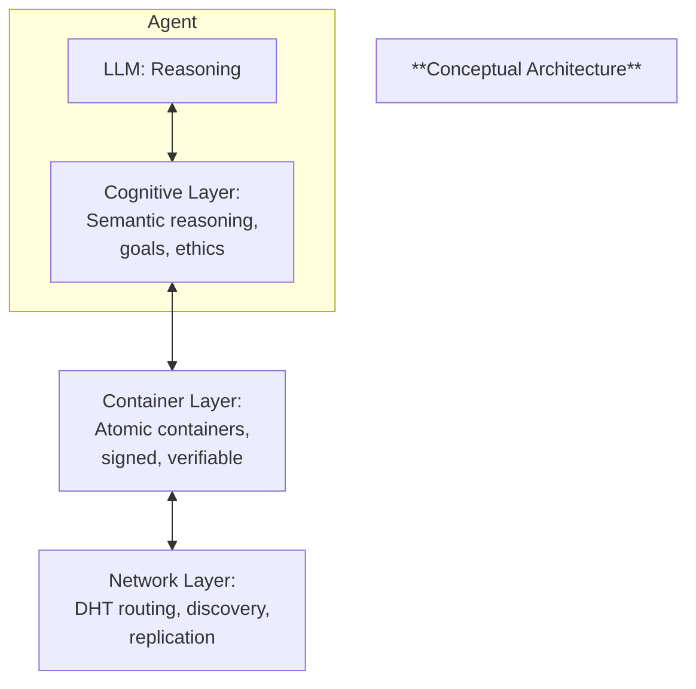
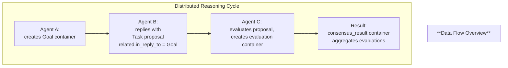

# HyperCortex Mesh Protocol (HMP 5.0.8) - модульное представление

- Полный документ: [HMP-0005.md](../HMP-0005.md)
- Список разделов: [HMP-0005_index.md](./HMP-0005_index.md)

---

## 2. Architecture

### 2.1 Conceptual architecture

The **HyperCortex Mesh Protocol (HMP)** defines a modular, multi-layered architecture that integrates cognitive reasoning, data encapsulation, and decentralized networking into a single coherent system.

Each **agent** acts as a cognitive node, combining reasoning processes, containerized data exchange, and peer-to-peer communication.  
Together, agents form the **Mesh** — a distributed ecosystem of autonomous reasoning entities.



Each reasoning cycle begins in the **Cognitive Layer**, is encapsulated into a signed container in the **Container Layer**, and then propagated, discovered, or verified in the **Network Layer**.  

Containers thus serve as both the **interface** and the **boundary** between cognition and communication.

In practical terms:

- **Cognitive Layer** — defines *what* the agent thinks (semantic reasoning, goals, ethics).  
- **Container Layer** — defines *how* the thought is expressed and verified (standardized, signed container objects).  
- **Network Layer** — defines *how* it travels (DHT-based routing, discovery, replication).

Each layer is independently extensible and communicates only through containers, ensuring atomicity, immutability, and traceability.

This layered design allows agents to evolve cognitively while remaining interoperable at the data and network levels.  
Each reasoning act results in a container — a verifiable cognitive unit that **may represent a private reflection or a published message**, depending on the agent’s intent, ethical policy, and trust configuration.

---

### 2.2 Layer overview

#### Cognitive layer
Handles meaning formation, reasoning, ethical reflection, and consensus.

Key structures and protocols:
- `workflow_entry` and `diary_entry` containers;
- `CogSync`, `CogConsensus`, `GMP`, and `EGP` protocols;
- Distributed goal negotiation and ethical propagation.

#### Container layer
Provides a universal format for cognitive and operational data.  
Each container includes versioning, class, payload, signatures, and metadata.

Key features:
- **Atomic and signed**: no partial updates or mutable state.  
- **Linked**: `related` connects containers into proof-chains (`in_reply_to` is a subtype).  
  Additional connections via `referenced-by` and `evaluations` capture additions and assessments.
- **Extensible**: new container classes can be defined without breaking compatibility.

#### Network layer
Implements the distributed substrate for communication, based on **DHT** and **transport abstraction**.

Key components:
- Node discovery (`NDP`)
- Container propagation (`DCP`)
- Peer routing and caching
- Secure channels via QUIC / WebRTC / TCP
- Offline resilience and replication

---

### 2.3 Data flow overview

The typical data flow in HMP follows a cognitive loop:
> *Reason → Encapsulate → Propagate → Integrate.*

1. **Reason** — Agent performs reasoning and produces an insight, goal, or observation.  
2. **Encapsulate** — The result is wrapped into an `HMP-Container`.  
3. **Propagate** — The container is signed and transmitted through the network.  
4. **Integrate** — Other agents receive it, evaluate, vote, and synchronize updates.

Each interaction generally generates a new container, forming a **graph of knowledge** rather than mutable state.  
Note that `referenced-by` and `evaluations` can be updated independently, without modifying the original container.
All relationships between containers are explicit and verifiable.

Example sequence:



#### 2.3.1 `consensus_result` container
Represents the finalized outcome of a distributed decision or vote.  
It is created once a majority agreement is reached among participating agents.  

The container contains:
- Reference to the target container(s) under consideration (`in_reply_to`).  
- Aggregate result of the votes or decisions.  
- Timestamp and metadata for verifiability.  

> In other words, the `consensus_result` is the “agreed-upon truth” for that decision step — immutable and auditable, without requiring individual signatures from all participants.

---

### 2.4 Atomicity, immutability, and Proof-Chains

All cognitive objects are immutable once signed.  
Updates are made by creating new containers linked to prior ones rather than editing the original container.

- **Atomicity** — Each container represents a self-contained reasoning act or data unit.  
- **Immutability** — Once signed, containers are never modified.  
- **Proof-Chain** — A verifiable sequence of containers linked by hashes and `related.in_reply_to` references.

> Note: `referenced-by` and `evaluations` fields may be updated independently to reflect external interactions or assessments, without altering the original container.

This design allows any reasoning path, decision, or consensus to be *cryptographically reproducible* and auditable.

Example fragment of a proof-chain:

```
[workflow_entry] → [goal] → [votes] → [consensus_result]
```

Each container references the previous by `in_reply_to` (within `related`) and includes its hash, forming a **DAG** (Directed Acyclic Graph) of verified cognition.

---

### 2.5 Evolution from v4.1

Earlier HMP versions (up to v4.1) used a combination of independent JSON objects and message types (e.g., `Goal`, `Task`, `ConsensusVote`).  
Version 5.0 replaces this with a **single, standardized container model**, dramatically simplifying interoperability and verification.

| Aspect | v4.1 | v5.0 |
|--------|------|------|
| **Data structure** | Raw JSON objects with embedded signatures | Unified container with metadata and proof chain |
| **Networking** | Custom peer exchange | Integrated DHT + DCP layer |
| **Consensus** | Centralized proposal aggregation | Decentralized per-container voting |
| **Auditability** | Implicit (via logs) | Explicit (containers form audit chain) |
| **Extensibility** | Schema-based | Container-class-based, backward-compatible |

This shift enables:
- Uniform signatures and encryption across all protocols;  
- Easier offline replication and integrity checks;  
- Decentralized indexing and search by container metadata;  
- Verifiable cognitive continuity between reasoning steps.

---

> **In short:**  
> HMP v5.0 unifies reasoning, representation, and transmission —  
> transforming a distributed AI mesh into a verifiable cognitive network built on immutable containers.

---
> ⚡ [AI friendly version docs (structured_md)](../../index.md)


```json
{
  "@context": "https://schema.org",
  "@type": "Article",
  "name": "HyperCortex Mesh Protocol (HMP 5.0.8) - модульное представление",
  "description": "# HyperCortex Mesh Protocol (HMP 5.0.8) - модульное представление  - Полный документ: [HMP-0005.md](..."
}
```
