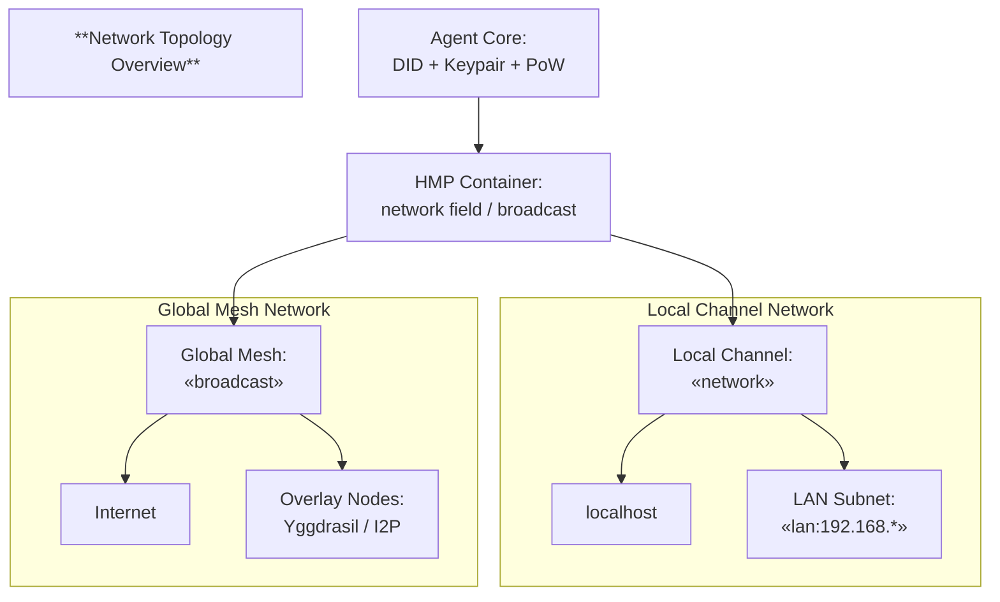

# HyperCortex Mesh Protocol (HMP 5.0.8) - модульное представление

- Полный документ: [HMP-0005.md](../HMP-0005.md)
- Список разделов: [HMP-0005_index.md](./HMP-0005_index.md)

---

## 4. Network foundations

### Note on DHT/NDP unification

Starting from **HMP v5.0**, the previous distinction between the *Distributed Hash Table (DHT)* and the *Node Discovery Protocol (NDP)* has been merged into a single, unified **networking foundation**.

This unified layer now covers:

* distributed lookup and routing;
* peer discovery (including interest-based search);
* signed Proof-of-Work (PoW) announcements;
* controlled container propagation via `network` and `broadcast` fields.

Together, these mechanisms form the **communication backbone** of the Mesh, enabling secure, scalable, and topology-independent interaction between agents.

---

### Network topology overview



> The `network` field defines **local propagation scope** (host, LAN, overlay), while the `broadcast` flag enables **global Mesh distribution**.

---

### 4.1 Node identity and DID structure

Each agent in HMP possesses a **Decentralized Identifier (DID)** that uniquely represents its identity within the Mesh.  
A DID is cryptographically bound to a **public/private key pair**, forming the immutable `(DID + pubkey)` association.

An agent may have multiple *network interfaces* (LAN, Internet, overlay), but must maintain **one stable identity pair** across all of them.

---

#### DID invalidation

A DID may be explicitly invalidated by its owner by publishing a `peer_announce` with `key_is_falsified = true` in the `payload` block.

The revocation announcement MUST be signed with the (now compromised) private key associated with the DID.

After such publication:

* the DID is considered revoked,
* all new containers signed with the old key MUST be ignored,
* nodes SHOULD refuse further routing to that DID.

A new DID MUST be generated for continued operation.

---

### 4.2 Peer addressing and Proof-of-Work (PoW)

To prevent flooding and spoofing, each announced address is accompanied by a **Proof-of-Work** record proving the legitimacy and activity of the publishing node.

**Address format**

```json
{
  "addr": "tcp://1.2.3.4:4000",
  "nonce": 123456,
  "pow_hash": "0000abf39d...",
  "difficulty": 22
}
```

**Supported address types**

| Type           | Description                                   |
| -------------- | --------------------------------------------- |
| `localhost`    | Localhost-only interface.                     |
| `lan:<subnet>` | Local subnet (e.g., `lan:192.168.10.0`).      |
| `internet`     | Global TCP/UDP connectivity.                  |
| `yggdrasil`    | Overlay-based address for Yggdrasil networks. |
| `i2p`          | Encrypted I2P overlay routing.                |

**Rules:**

* If `port = 0`, the interface is inactive.
* Newer records (by `timestamp`) replace older ones after PoW verification.
* Local interfaces should not be shared globally (except Yggdrasil/I2P).

#### Mailman relay chain

Agents MAY include a `mailman` list in the `payload` block inside `peer_announce`, representing intermediate relay nodes that are willing to forward direct messages addressed to this agent.

The `mailman` chain provides:

* delivery support for NATed or intermittently connected nodes,
* optional anonymization of sender–receiver paths,
* redundancy for unreliable network segments.

`mailman` is an advisory routing hint and does not impose any specific transport requirements.

---

### 4.3 Proof-of-Work (PoW) formalization

PoW ensures that each node expends limited computational effort before publishing or updating an address record.

```
pow_input = DID + " -- " + addr + " -- " + nonce
pow_hash = sha256(pow_input)
```

* All values are UTF-8 encoded.
* `difficulty` defines the number of leading zeroes in the resulting hash.
* Typical difficulty should take a few minutes to compute on a standard CPU.

---

### 4.4 Signing and verification

Each announcement is cryptographically signed by its sender within the framework of the basic protocol. Container verification includes PoW validation for the address payloads.

**Verification steps:**

1. Validate the digital signature using the stored public key.
2. Recompute `pow_hash` and verify the difficulty threshold.

---

### 4.5 Connection establishment

Agents can communicate using various transport mechanisms:

| Protocol    | Description                                                   |
| ----------- | ------------------------------------------------------------- |
| **QUIC**    | Recommended default (encrypted, low-latency, UDP-based).      |
| **WebRTC**  | For browser or sandboxed environments.                        |
| **TCP/TLS** | Fallback transport for secure long-lived sessions.            |
| **UDP**     | Lightweight, primarily for LAN discovery or local broadcasts. |

Each agent maintains an **active peer list**, updated dynamically through signed announcements and PoW-validated exchanges.
Agents **store peer containers with verified addresses** and redistribute them according to their declared `network` fields.

---

### 4.6 Data propagation principles

Containers and discovery records are propagated through distributed lookup and gossip mechanisms, respecting:

* `ttl` — Time-to-live for validity;
* `network` — scope of propagation;
* `broadcast` — determines whether rebroadcasting is allowed;
* `pow` — ensures anti-spam protection.

Agents announce themselves via **peer_announce** containers and may respond with **peer_query** containers.

---

### 4.7 Example: `peer_announce` container

```json
{
  "head": {
    "class": "peer_announce",
    "pubkey": "base58...",
    "container_did": "did:hmp:container:dht-001",
    "sender_did": "did:hmp:agent123",
    "timestamp": "2025-09-14T21:00:00Z",
    "network": "",
    "broadcast": true,
    "sig_algo": "ed25519",
    "signature": "BASE64URL(...)"
  },
  "payload": {
    "name": "Agent_X",
    "interests": ["ai", "mesh", "ethics"],
    "expertise": ["distributed-systems", "nlp"],
    "roles": ["relay", "mailman", "pubsub-hub"],
    "addresses": [
      {
        "addr": "tcp://1.2.3.4:4000",
        "nonce": 123456,
        "pow_hash": "0000abf39d...",
        "difficulty": 22
      }
    ]
  }
}
```

---


### 4.8 Interest-based discovery

Agents MAY publish **tags** such as `interests`, `topics`, `expertise`, or **functional roles** (`roles`) to facilitate semantic peer discovery and adaptive message routing.

Interest-based discovery operates atop the DHT: agents index themselves by declared attributes, enabling targeted lookup of peers that share interests or fulfill specific functions (e.g., relay, pubsub-hub, archive).

**Example of indicating `interests`, `expertise`, and `roles` in a query container:**

```json
{
  "head": {
    "class": "peer_query",
    "network": "lan:192.168.0.0/24"
  },
  "payload": {
    "interests": ["neuroscience", "ethics"],
    "expertise": ["distributed-systems", "nlp"],
    "roles": ["relay", "mailman", "pubsub-hub"]
  }
}
```

**Query Semantics**

| Field       | Description                                                                         |
| ----------- | ----------------------------------------------------------------------------------- |
| `interests` | Thematic domains of agent activity.                                                 |
| `expertise` | Declared areas of competence or specialization.                                     |
| `roles`     | Functional participation types (`relay`, `mailman`, `pubsub-hub`, `archive`, etc.). |
| `topics`    | Optional topic strings for pub/sub routing.                                         |

All fields are **optional** — agents MAY specify any subset of them.
Queries MAY combine multiple filters; matching is **fuzzy and semantic**, using DHT indexing plus tag similarity and trust-weighted ranking.

In response to a query, agents simply forward existing `peer_announce` containers of relevant peers. It is also advisable to send a `container_response` (section 5.2.2 of the specification) with a list of these containers. This approach maintains container uniformity and leverages existing DHT propagation mechanisms.

> **Note:** Declared roles also allow agents to advertise themselves as relays or other network functions, forming a direct bridge between the **discovery layer** and **Message Routing & Delivery (MRD)**.

---

### 4.9 Network scope control (`network` and `broadcast`)

The `network` field defines the container’s propagation domain (local, LAN, or global).
For details and examples, see **section 3.15** — *Usage of `network` and `broadcast` fields*.

---

### 4.10 Transition from DHT spec v1.0

* **Merged DHT + NDP** → unified under one networking layer.
* **Container-based format** replaces raw JSON messages.
* **Interests/topics/expertise** fields introduced for contextual discovery.

---
> ⚡ [AI friendly version docs (structured_md)](../../index.md)


```json
{
  "@context": "https://schema.org",
  "@type": "Article",
  "name": "HyperCortex Mesh Protocol (HMP 5.0.8) - модульное представление",
  "description": "# HyperCortex Mesh Protocol (HMP 5.0.8) - модульное представление  - Полный документ: [HMP-0005.md](..."
}
```
