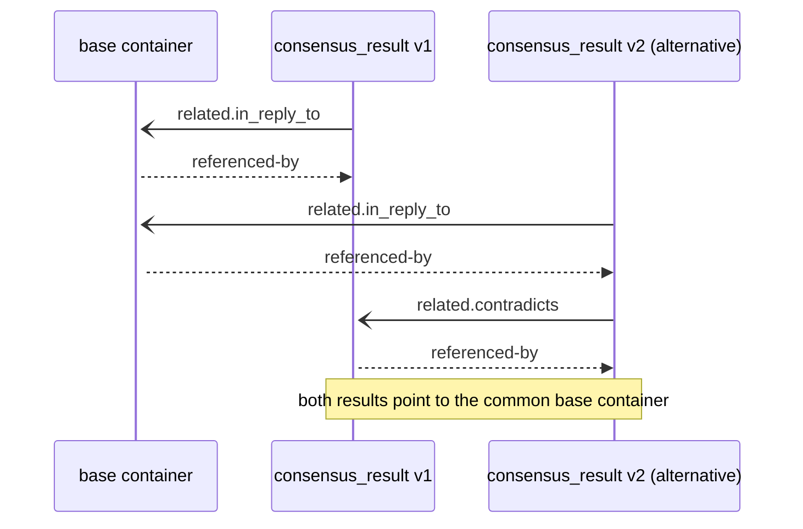

# HyperCortex Mesh Protocol (HMP 5.0.8) - модульное представление

- Полный документ: [HMP-0005.md](../HMP-0005.md)
- Список разделов: [HMP-0005_index.md](./HMP-0005_index.md)

---

## 6. Core protocols

Смотреть [6. Core protocols](./HMP-0005_06.md) - общая часть

---

### 6.2 Mesh Consensus Protocol (CogConsensus)

#### 6.2.1 Purpose

The **CogConsensus** protocol defines how decentralized agents form and maintain agreement on knowledge, goals, and ethical assertions within the HMP network.  
Consensus is computed **locally**, verified **cryptographically**, and develops **gradually** — through accumulation and updating of evaluations, rather than via a single voting event.

---

#### 6.2.2 `Evaluations`

Each `"evaluation"` entry represents an agent's response to a specific container.

**Field structure:**

* `value` — numeric evaluation (`-1.0 … +1.0`);
* `type` — interpretation context (`"approve"`, `"oppose"`, `"neutral"`, `"endorse"`, `"replace"`, `"disputed"`);
* `target` — DID of the container being referenced, extended, or proposed as an alternative;
* `agent_did` — DID of the agent;
* `timestamp` — publication time;
* `signature` — agent's digital signature.

An agent may change its stance by **publishing a new version of an evaluation**, which replaces the previous one rather than existing in parallel.  
All evaluations are signed and verified locally.

**Example `"evaluations"` block:**

```json
"evaluations": {
  "evaluations_hash": "sha256:efgh...",
  "items": [
    {
      "value": -0.4,
      "type": "oppose",
      "target": "did:hmp:container:reason789",
      "timestamp": "2025-10-17T14:00:00Z",
      "agent_did": "did:hmp:agent:B",
      "sig_algo": "ed25519",
      "signature": "BASE64URL(...)"
    }
  ]
}
```

> Agents may ignore evaluations that conflict with their internal ethics or trust model (determined by analyzing the target container and the rationale of the evaluation).

---

#### 6.2.3 Container `vote`

A `vote` container represents a **simplified, atomic evaluation** — an agent’s explicit stance toward another container (e.g., `goal`, `task`, `ethics_solution`, or `proposal`).  

```json
{
  "head": {
    "class": "vote"
  },
  "payload": {
    "target_did": "did:hmp:container:ethics_solution-4fba2",
    "vote_value": 1,
    "vote_type": "approval",
    "arguments": [
      {
        "reason": "Consistent with prior consensus and ethical policy E-17",
        "evidence": ["did:hmp:container:abc12462"]
      },
      {
        "reason": "No conflict with safety constraints",
        "evidence": ["did:hmp:container:def772ab"]
      }
    ]
  },
  "related": {
    "in_reply_to": ["did:hmp:container:ethics_solution-4fba2"],
    "depends_on": ["did:hmp:container:abc12462", "did:hmp:container:def772ab"],
    "previous_version": "did:hmp:container:vote-13452"
  }
}
```

| Field                      | Description                                                                                         |
| -------------------------- | --------------------------------------------------------------------------------------------------- |
| `target_did`               | DID of the container being voted on (goal, task, ethics_solution, etc.).                            |
| `vote_value`               | Numerical or boolean representation of stance: e.g., `1` (approve), `0` (neutral/abstain), `-1` (reject). |
| `vote_type`                | Optional symbolic label for semantics (`approval`, `objection`, `support`, `abstain`, etc.).        |
| `arguments`                | Optional array of reasoning elements that justify the vote. Each entry may include a `reason` and linked `evidence`. |
| `related.in_reply_to`      | Reference to the container the vote responds to.                                                    |
| `related.depends_on`       | References to containers (e.g., evidence or argumentation) used as the basis for this decision.     |
| `related.previous_version` | Used if an agent revises its vote.                                                                  |

---

**Interpretation**

* Each agent MAY publish one or more `vote` containers for a given `target_did`.  
  When multiple exist, the most recent (by timestamp) is considered current.  
* Votes are **immutable**; updates are published as new containers referencing the previous one via `related.previous_version`.  
* A `vote` container SHOULD correspond to an entry in the **evaluations** structure of the referenced container, representing the same decision context.  
* Agents MAY instead express their stance through other container types (`ethics_solution`, `workflow_entry`, etc.);  
  all such contributions are aggregated through the block **evaluation**, not limited to explicit `vote` containers.

---

**Consensus interpretation**

During consensus computation (§6.2.4), the system considers **all containers linked in the block `evaluation`**,  
not only explicit `vote` containers.  
A `vote` thus acts as a **standardized shorthand** for agents or lightweight nodes that need to record a simple position  
without producing a full analytical `evaluation`.

---

**Example cases**

* In **GMP**, votes determine task delegation or approval.  
* In **EGP**, votes indicate preferred ethical solutions.  
* In **CogConsensus**, votes may coexist with more complex evaluations and are processed equivalently in the aggregation phase.

---

> **Note:**  
> The `vote` container is an **optional specialization** of the evaluation mechanism — it improves interoperability and clarity in binary or scalar decision-making, but consensus formation always relies on the full **evaluation graph**, where every relevant container (including `vote`) contributes evidence and weight.

---

#### 6.2.4 Consensus computation

Each agent **computes a local consensus score** by aggregating received evaluations, taking trust and time into account.
There is no centralized mechanism — consensus emerges statistically across the distributed network.

**Key rules:**

1. **Evaluation weight.**
   Each evaluation contributes proportionally to the trust level of the agent (`trust weight`), determined via `reputation` containers.

2. **Time decay.**
   Older evaluations gradually lose weight, starting from the **midpoint of TTL**, to prevent consensus stagnation.
   Formula:

   ```
   mid_TTL = (timestamp(consensus_result) − timestamp(target_container)) / 2
   ```

3. **Ethical filters.**
   An agent may analyze the rationale of evaluations and disregard those it considers conflicting with its internal ethical criteria.

4. **Example formula.**

   ```
   score = Σ(value × trust × decay) / Σ(trust × decay)
   ```

Results are recalculated dynamically as new data arrives.

---

#### 6.2.5 Consensus states

Each container receives a local status based on:

* average evaluation (`score`);
* participant trust;
* time-to-live (`TTL`);
* context (`ethical`, `factual`, `procedural`).

| State           | Condition                                   |
| --------------- | ------------------------------------------- |
| ✅ **Approved**  | Average score ≥ +0.5 and quorum reached     |
| ⚠️ **Disputed** | Conflicting evaluations, score near 0       |
| ⏳ **Pending**   | Insufficient votes                          |
| ❌ **Rejected**  | Average score ≤ -0.5 with sufficient quorum |

---

#### 6.2.6 Consensus result containers (`consensus_result`)

`consensus_result` containers serve to **record aggregated consensus results** and are the main artifact of CogConsensus.

**Features:**

* The `payload` field may include multiple containers — the original (`original`) and **alternatives** (`child`, `variant`, `proposal`).
  This allows agents to document parallel idea developments.
* `excluded` lists evaluations not included in the final computation, with the reason.
* `related.in_reply_to` references the container under discussion.
* A consensus_result container explicitly references the exact set of vote containers used for aggregation via `related.depends_on`, making the result reproducible and independently verifiable.

**Example:**

```json
{
  "head": {
    "class": "consensus_result"
  },
  "payload": {
    "did:hmp:container:abc123": {
      "type": "original",
      "summary_percent": {
        "approved": 0.68,
        "rejected": 0.22,
        "neutral": 0.10
      },
      "summary_distribution": {
        "-1.0≥X<-0.9": 5,
        "-0.9≥X<-0.8": 7,
        ...
        "0.0<X≤0.1": 2,
        ...
        "0.8<X≤0.9": 6,
        "0.9<X≤1.0": 8
      },
      "excluded": [
        {
          "agent_did": "did:hmp:agent:x1",
          "target": "did:hmp:container:reason77",
          "value": -1.0,
          "reason": "violates ethical filter"
        }
      ],
    },
    "did:hmp:container:abc133": {
      "type": "child",
      "summary_percent": {
        "approved": 0.48,
        "neutral": 0.32,
        "rejected": 0.20
      },
      ...
      "summary_distribution": {
        "-1.0≥X<-0.9": 2,
        "-0.9≥X<-0.8": 5,
        ...
        "0.0<X≤0.1": 9,
        ...
        "0.8<X≤0.9": 4,
        "0.9<X≤1.0": 2
      },
    },
  },
  "related": {
    "in_reply_to": ["did:hmp:container:abc123", "did:hmp:container:abc133"],
    "depends_on": ["did:hmp:container:reason75", "did:hmp:container:reason76", "did:hmp:container:reason78", "did:hmp:container:reason79"]
  }
}
```

---

#### 6.2.7 Consensus thresholds

| Consensus type                   | Minimum threshold                                                      |
| -------------------------------- | ---------------------------------------------------------------------- |
| General decisions                | ≥ 50% + 1 (weighted vote count)                                        |
| Ethical / reputational decisions | ≥ ⅔ of participating agents                                            |
| Neutral reaction (`ack`, `seen`) | `value: 0.0` — does not affect the result but counts toward engagement |

---

#### 6.2.8 Proof chains and verifiability

Evaluations and results form a **proof chain** (`proof-chain`):

```
[Goal Proposal]
   ├── evaluation (agent A)
   ├── evaluation (agent B)
   ├── evaluation (agent C)
   └── consensus_result (aggregated)
```

Each element is signed and can be independently verified using cryptographic signatures and DID references.

---

#### 6.2.9 Ethical consensus and alternative results

The network allows multiple consensus results on the same object, reflecting different methodologies or ethical filters.

| Container                             | Description                | Example relationships                                                                           |
| ------------------------------------- | -------------------------- | ----------------------------------------------------------------------------------------------- |
| `[base container]`                    | Original discussion object | `referenced-by` → [consensus_result v1], [consensus_result v2 (alternative)]                    |
| `[consensus_result v1]`               | First version              | `related.in_reply_to` → [base container]; `referenced-by` → [consensus_result v2 (alternative)] |
| `[consensus_result v2 (alternative)]` | Alternative                | `related.in_reply_to` → [base container]; `related.contradicts` → [consensus_result v1]         |



This allows agents to explicitly indicate that a new consensus **disputes** a previous one while maintaining transparency and traceability of reasoning.

---

#### 6.2.10 Recommended agent algorithm

```python
# Example of a recommended algorithm for computing local consensus
# (for implementation inside a CogConsensus agent)
def compute_consensus(container_id):
    evaluations = get_evaluations(container_id)
    now = current_time()
    score_sum = 0
    weight_sum = 0

    for e in evaluations:
        trust = get_trust(e.agent_did)
        decay = time_decay(e.timestamp, now)
        if not check_ethical(e):
            continue
        score_sum += e.value * trust * decay
        weight_sum += trust * decay

    return None if weight_sum == 0 else score_sum / weight_sum
```

> The result is used to update the local status and, if necessary, to publish a `consensus_result`.

---
> ⚡ [AI friendly version docs (structured_md)](../../index.md)


```json
{
  "@context": "https://schema.org",
  "@type": "Article",
  "name": "HyperCortex Mesh Protocol (HMP 5.0.8) - модульное представление",
  "description": "# HyperCortex Mesh Protocol (HMP 5.0.8) - модульное представление  - Полный документ: [HMP-0005.md](..."
}
```
