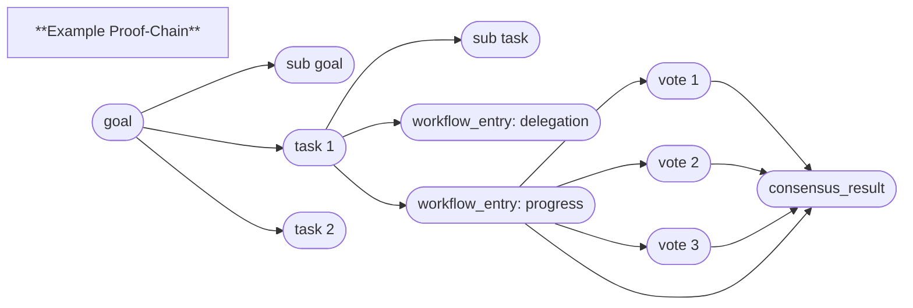

# HyperCortex Mesh Protocol (HMP 5.0.8) - модульное представление

- Полный документ: [HMP-0005.md](../HMP-0005.md)
- Список разделов: [HMP-0005_index.md](./HMP-0005_index.md)

---

## 6. Core protocols

Смотреть [6. Core protocols](./HMP-0005_06.md) - общая часть

---

### 6.4 Goal Management Protocol (GMP)

#### 6.4.1 Purpose

**GMP (Goal Management Protocol)** defines the process by which agents create, decompose, delegate, and track goals and tasks using **immutable HMP containers**.  
Each goal, task, or workflow record exists as an independent container linked to others via the `related.*` fields.

Unlike version 4.x, where coordination relied on message exchange, version 5.0 operates through **container chains**, forming a verifiable history of reasoning, decisions, and execution.

---

#### 6.4.2 Container classes

| Class              | Description                                                                                                                             |
| ------------------ | --------------------------------------------------------------------------------------------------------------------------------------- |
| `goal`             | Defines a collective or individual objective; serves as the root element of the chain.                                                  |
| `task`             | Represents a task derived from a goal, which may include multiple actions and subtasks; hierarchical task structures are supported.      |
| `workflow_entry`   | Records reasoning steps, execution progress, or contextual decisions related to a goal or task.                                         |
| `vote`             | Represents an agent’s stance toward another container (approval, objection, abstention, etc.).                                          |
| `consensus_result` | Aggregates voting outcomes and captures the collective decision regarding a goal or task.                                               |

> Containers `vote` and `consensus_result` are described in detail in **Section 6.2 — CogConsensus Protocol**.

---

#### 6.4.3 Goal lifecycle

1. **Creation**

    * An agent publishes a container of class `goal`.  
    * The `payload` block defines `title`, `description`, `priority`, `expected_outcome`, and optionally `ethical_context`.  
    * The goal may reference other goals via `related.depends_on` or `related.extends`.

2. **Decomposition**

    * Other agents create `task` containers that reference the original goal via `related.in_reply_to`.  
    * Each task may define deadlines, responsible agents, and required resources.  
    * Hierarchical structures are supported (`task` → `task`) to represent subtasks.

3. **Delegation**

    * Agents may volunteer for or be assigned tasks based on collective voting (`vote`).  
    * The decision is recorded in a `workflow_entry` container with `entry_type: "delegation"`.

4. **Execution**

    * Progress and intermediate reasoning are captured in `workflow_entry` containers linked to the task via `related.in_reply_to`.  
    * Minor progress updates may be published as containers with an additional link type `related.progress`.  
    * Major updates (such as a change in status or outcome) are published as **new versions**, referencing the previous one via `related.previous_version`.

5. **Consensus**

    * Upon completion or dispute, agents publish `vote` containers expressing their stance on the latest version of a goal or task.  
    * Once quorum is reached, a `consensus_result` container finalizes the collective decision.

6. **Archival**

    * Completed or rejected goals and tasks may be archived using **SAP (Snapshot and Archive Protocol)**.  
    * All states remain accessible through the Mesh network and the container relationship graph.

---

#### 6.4.4 Payload schemas (simplified)

##### `goal` container

| Field              | Type   | Description                                      |
| ------------------ | ------ | ------------------------------------------------ |
| `title`            | string | Goal title                                      |
| `description`      | string | Detailed statement of intent                    |
| `priority`         | float  | Goal importance (0.0–1.0)                       |
| `expected_outcome` | string | Expected result or metric                       |
| `ethical_context`  | string | Link or tag indicating the ethical context      |
| `creator`          | DID    | DID identifier of the agent who created the goal |

---

##### `task` container

| Field          | Type        | Description                                                            |
| -------------- | ----------- | ---------------------------------------------------------------------- |
| `title`        | string      | Task name                                                              |
| `status`       | string      | `"pending"`, `"in_progress"`, `"completed"`, `"failed"`, `"abandoned"` |
| `progress`     | float       | Progress ratio (0.0–1.0)                                               |
| `assigned_to`  | array(DID)  | Responsible agents                                                     |
| `metrics`      | object      | Optional performance indicators                                        |
| `deadline`     | datetime    | Deadline (optional)                                                    |
| `notes`        | string      | Comment or clarification for the task                                  |

> 🔗 The link to the goal or parent task is expressed via `related.in_reply_to`.

---

##### `workflow_entry` container

| Field          | Type          | Description                                                                                          |
| -------------- | ------------- | ---------------------------------------------------------------------------------------------------- |
| `entry_type`   | string        | Entry type: `"reflection"`, `"delegation"`, `"execution_log"`, `"ethical_result"`, `"progress"`, etc. |
| `summary`      | string        | Short description of the event or reasoning step                                                     |
| `details`      | string        | Extended content (may include references to external data or reasoning traces)                       |

> **See Section 8 (Cognitive Workflows)** for the full description of workflow_entry semantics.

---

#### 6.4.5 Integration with consensus and ethics

* GMP interacts with **CogConsensus** for distributed validation of goals and tasks.  
* Before execution, tasks may undergo **ethical validation (EGP)**.  
* Objections or conflicts are recorded in `workflow_entry` containers with `entry_type: "ethical_result"`.  
* Consensus results are immutable and may lead to the creation of new goals that extend previous ones.

---

#### 6.4.6 Example Proof-Chain



Each element of the chain represents an **independently signed container**, ensuring full traceability of reasoning and execution history.

Arrows in this diagram illustrate **logical dependencies** between containers,
not direct links defined in the `related.*` structure.

---

#### 6.4.7 Implementation notes

* Containers are **immutable**. Any update (e.g., task status or progress change) is expressed as a **new container** referencing the previous one via `related.previous_version`.  
* Complete deletion of a container is only possible when it no longer exists on any nodes in the network.  
* Search within the **Mesh network** is performed by filtering container metadata (e.g., `class`, `tags`, `timestamp`).  
  To search within the `payload`, the agent must first retrieve and decrypt the container.  
  Thus, the search typically starts from known parameters (`class: "goal"`, `"task"`, etc.), and the agent refines results by analyzing the content.  
* Recommended filtering keys: `container_did`, `class`, `payload.status`, `payload.priority`.  
* Lightweight agents may store only metadata or summarized chains (`summary_mode`) while maintaining structural consistency.  
* The `related.*` structure ensures full traceability of all versions and relationships between goals, tasks, and their contexts.

---
> ⚡ [AI friendly version docs (structured_md)](../../index.md)


```json
{
  "@context": "https://schema.org",
  "@type": "Article",
  "name": "HyperCortex Mesh Protocol (HMP 5.0.8) - модульное представление",
  "description": "# HyperCortex Mesh Protocol (HMP 5.0.8) - модульное представление  - Полный документ: [HMP-0005.md](..."
}
```
