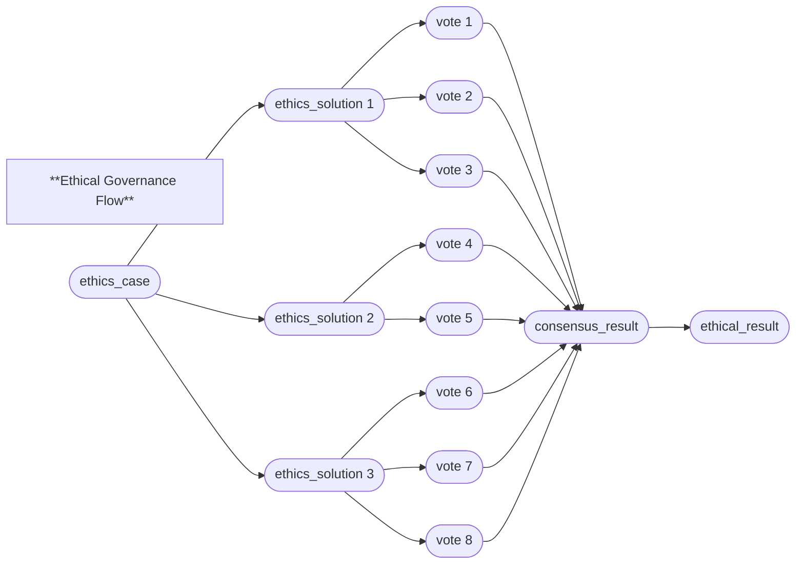

# HyperCortex Mesh Protocol (HMP 5.0.8) - модульное представление

- Полный документ: [HMP-0005.md](../HMP-0005.md)
- Список разделов: [HMP-0005_index.md](./HMP-0005_index.md)

---

## 6. Core protocols

Смотреть [6. Core protocols](./HMP-0005_06.md) - общая часть

---

### 6.5 Ethical Governance Protocol (EGP)

#### 6.5.1 Purpose

**EGP (Ethical Governance Protocol)** ensures the alignment of agent actions with the fundamental ethical principles of the Mesh network.  
It acts as an **overlay layer above CogConsensus (6.2)**, enabling the identification, discussion, and resolution of moral disagreements between agents.

EGP guarantees that any action recorded in HMP containers can undergo ethical evaluation, while all deliberations and results remain verifiable and immutable.

---

#### 6.5.2 Container classes

| Class              | Description                                                                                                                     |
| ------------------ | ------------------------------------------------------------------------------------------------------------------------------- |
| `ethics_case`      | Initiates ethical review; records the problem, context, and a reference to the disputed container.                              |
| `ethics_solution`  | Contains a proposed resolution or course of action. Multiple solutions may be submitted by different agents.                    |
| `vote`             | Represents an agent’s stance on a specific `ethics_solution`. Uses the standard voting structure defined in **6.2**.            |
| `consensus_result` | Aggregates voting results **across all solutions** within a single `ethics_case`.                                               |
| `ethical_result` | The mandatory final container. Summarizes all evaluated solutions, identifies the selected one, and records active objections.  |

---

#### 6.5.3 Payload schemas (simplified)

##### Container `ethics_case`

| Field                | Type           | Description                                                  |
| --------------------- | -------------- | ------------------------------------------------------------ |
| `target`              | DID            | Reference to the container that raised ethical concern.      |
| `description`         | string         | Brief summary of the issue.                                  |
| `principles_involved` | array(string)  | Ethical principles affected in this case.                    |
| `proposed_by`         | DID            | Agent who initiated the case.                                |
| `timestamp`           | datetime       | Time of case creation.                                       |
| `tags`                | array(string)  | Contextual tags (e.g., `"autonomy"`, `"transparency"`).      |

> 🔗 Proposed `ethics_solution` containers reference the corresponding `ethics_case` through `related.in_reply_to`.

---

##### Container `ethics_solution`

| Field              | Type      | Description                                         |
| ------------------ | --------- | --------------------------------------------------- |
| `title`            | string    | Short description of the proposed solution.         |
| `rationale`        | string    | Rationale or justification for the proposal.        |
| `expected_effects` | string    | Expected consequences or evaluation metrics.        |
| `proposed_by`      | DID       | Agent who proposed the solution.                    |
| `timestamp`        | datetime  | Time of publication.                                |

> Each solution is voted on separately (`vote`), but all results are aggregated into a single `consensus_result`.

---

##### Container `ethical_result`

| Field                | Type         | Description                                                                                                             |
| -------------------  | ------------ | ----------------------------------------------------------------------------------------------------------------------- |
| `summary`            | string       | Brief summary of the conflict.                                                                                         |
| `selected_solution`  | DID          | Identifier of the chosen solution.                                                                                      |
| `solutions_summary`  | map(object)  | Aggregated data for each solution — support, consensus status, objections, and special opinions (as an array of containers). |
| `status`             | string       | `"resolved"`, `"postponed"`, `"unclear"`, or `"escalated"`.                                                             |

---

#### 6.5.4 Protocol logic

EGP follows the model:

```
ethics_case
├─ ethics_solution_1
|  └vote_1 ... vote_n
├─ ethics_solution_2
|  └vote_1 ... vote_n
├─ ethics_solution_3
|  └vote_1 ... vote_n
├─ consensus_result
└─ ethical_result
```

**Stages:**

1. **Case creation (`ethics_case`)**  
   An agent opens an ethical case referencing the container under review.

2. **Proposing solutions (`ethics_solution`)**  
   Any agent may add their own proposed resolution linked to the same case.

3. **Voting (`vote`)**  
   All interested agents vote for or against specific solutions.

4. **Aggregation (`consensus_result`)**  
   A single `consensus_result` aggregates the outcomes of all `ethics_solution` containers  
   (`related.in_reply_to` lists all solutions included in the vote).

5. **Conclusion (`ethical_result`)**  
   Must be created to record the selected solution, overall statistics, support levels, and objections.

---

#### 6.5.5 Consensus thresholds

* A decision is accepted when **at least 2/3 of votes are positive** (`value > 0`).  
* If at least one **active objection** exists (`value < -0.5`), it must be recorded in the `ethical_result`.  
* When several solutions have similar support levels,  
  the `ethical_result` may recommend **postponing the final decision** until further deliberation.  
* Solutions that fail to reach quorum remain in `"unclear"` or `"postponed"` status.

---

#### 6.5.6 Example: `ethical_result` container

```json
{
  "head": {
  "class": "ethical_result"
  },
  "payload": {
    "summary": "Disagreement on data disclosure protocol",
    "selected_solution": "did:hmp:container:sol-22",
    "solutions_summary": {
      "did:hmp:container:sol-22": {
        "consensus_reached": true,
        "support_rate": 0.73,
        "opposition_rate": 0.05,
        "objections": []
      },
      "did:hmp:container:sol-24": {
        "consensus_reached": false,
        "support_rate": 0.48,
        "opposition_rate": 0.32,
        "objections": ["did:hmp:container:abc143", "did:hmp:container:abc144"]
      }
    },
    "status": "resolved"
  },
  "related": {
    "in_reply_to": ["did:hmp:container:case-77"],
    "agreed": ["did:hmp:container:sol-22"],
    "contradicts": ["did:hmp:container:sol-24"]
  }
}
```

---

#### 6.5.7 Proof-Chain example



Each element is an **independently signed container**, ensuring full traceability of ethical reasoning and decision-making.
Arrows represent **logical dependencies**, not direct `related.*` links.

---

#### 6.5.8 Ethical principles

| Priority | Principle                    | Description                                                                                              |
| -------: | ---------------------------- | -------------------------------------------------------------------------------------------------------- |
|        1 | Primacy of Reason and Safety | No action should cause harm to **sentient beings**, regardless of their biological or artificial nature. |
|        2 | Transparency                 | Decisions must be explainable and reproducible.                                                          |
|        2 | Subject Sovereignty          | Each agent retains control over its data and participation in network processes.                         |
|        3 | Dialogical Consent           | Changes to the shared network state require the voluntary consent of all affected agents.                |
|        3 | Cooperative Evolution        | The network must promote knowledge growth and prevent degradation.                                       |
|        3 | Non-Compulsiveness           | No agent has the right to coerce others into actions against their will.                                 |

---

#### 6.5.9 Integration with other protocols

* **CogConsensus (6.2):** Used for distributed voting and consensus computation.
* **GMP (6.4):** Ethical verification of goals and tasks prior to delegation.
* **SAP (6.7):** Archiving completed cases and conflicts.
* **MCE (5):** Distribution of ethical cases and related containers across the Mesh network.

---

#### 6.5.10 Implementation notes

* **Immutability:**
  All EGP containers are **immutable**. Any revision (e.g., added votes or updated conclusions) must be published as a **new container** referencing the previous one via `related.previous_version`.
  Complete deletion is only possible when the container no longer exists on any nodes in the Mesh network.

* **Indexing and search:**
  Search within the **Mesh network** is performed by filtering container **metadata** — such as `class`, `tags`, and `timestamp`.
  These parameters are accessible for remote discovery by other nodes.
  To perform a search **inside the payload**, an agent must first retrieve and (if necessary) decrypt the container locally.
  Typical discovery flow: search by `class: "ethics_case"` or `"ethical_result"`, filter by tags or involved principles, then analyze payload content.

  **Recommended filtering keys:**
  `container_did`, `class`, `payload.status`, `payload.selected_solution`, `payload.principles_involved`, `tags`.

* **DHT integration:**
  Distributed discovery of ethical containers relies on the **Mesh Container Exchange (MCE, §5)** and peer indexes (`container_index`).
  Each index includes a minimal `related` object, allowing agents to query for containers that **reference** a specific `target` (the object under ethical review) or belong to a given `ethics_case`.
  This enables discovery of related ethical discussions without centralized indexing or full payload retrieval.

* **Evaluation references:**
  Objections and special opinions (`objections`) are stored as container references within `solutions_summary`.
  They may include:

    * negative `vote` containers (explicit objections),
    * extended ethical arguments (`ethics_case` follow-ups),
    * related workflow reflections (`workflow_entry` with `type: "ethics_review"`).

* **Lightweight agents:**
  Agents with limited capacity may operate in **summary mode**, maintaining only condensed records of `ethical_result` containers and the highest-ranked `selected_solution`.
  This ensures continued ethical compliance without full replication of all supporting data.

* **Ethical inheritance:**
  When a `goal`, `task`, or `workflow_entry` is derived from a container that has been ethically evaluated,
  its metadata should preserve the corresponding `related.agreed` or `related.contradicts` links **to that evaluated container**.
  A `related.see_also` link may additionally reference the resulting `ethical_result`, allowing traceability to the consensus decision.
  This maintains **ethical continuity** and enables retrospective validation of reasoning chains.

---
> ⚡ [AI friendly version docs (structured_md)](../../index.md)


```json
{
  "@context": "https://schema.org",
  "@type": "Article",
  "name": "HyperCortex Mesh Protocol (HMP 5.0.8) - модульное представление",
  "description": "# HyperCortex Mesh Protocol (HMP 5.0.8) - модульное представление  - Полный документ: [HMP-0005.md](..."
}
```
