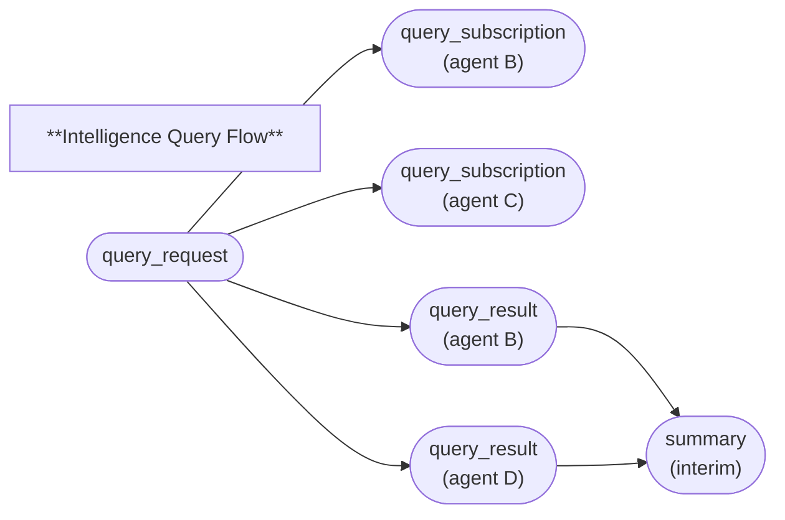

# HyperCortex Mesh Protocol (HMP 5.0.8) - модульное представление

- Полный документ: [HMP-0005.md](../HMP-0005.md)
- Список разделов: [HMP-0005_index.md](./HMP-0005_index.md)

---

## 6. Core protocols

Смотреть [6. Core protocols](./HMP-0005_06.md) - общая часть

---

### 6.6 Intelligence Query Protocol (IQP)

#### 6.6.1 Purpose and Principles

**IQP (Intelligence Query Protocol)** defines a mechanism for knowledge exchange and reasoning among agents through the Mesh network.  
It provides a unified format for **asking questions, publishing answers, and collaboratively refining knowledge**,  
combining elements of search, discussion, and reasoning within the HMP container model.

IQP supports both **targeted queries** (with explicitly defined recipients of results and discussions)  
and **distributed discussions** where results remain accessible to all network participants.

##### Core Principles

* **Semantic queries, not keywords.**  
  Queries are formulated in terms of concepts, relationships, and context rather than plain keywords.
* **Contextual relevance.**  
  Each query may reference other containers via `related.in_reply_to`, `related.depends_on`, or `related.see_also`, forming a semantic context.
* **Openness and transparency.**  
  Answers are preserved as `query_result` containers, available for analysis and citation.
* **Self-organization of participants.**  
  Agents subscribe to discussions via `query_subscription`, providing their interests and competencies.
* **Continuity of reasoning.**  
  Results are summarized through `summary` containers, reflecting the discussion’s current state without final closure.
* **Interoperability.**  
  IQP interacts with EGP (ethical governance), GMP (goal management), and CogConsensus (agreement evaluation).

---

#### 6.6.2 Container Classes

| Class                | Purpose                                                                                                     |
| -------------------- | ----------------------------------------------------------------------------------------------------------- |
| `query_request`      | Initiates an intelligence query or discussion, defining participation and dissemination parameters.          |
| `query_subscription` | Subscribes or unsubscribes an agent; may include the agent’s profile of interests and competencies.          |
| `query_result`       | Contains an answer, observation, hypothesis, or analytical conclusion in response to the query.              |
| `summary`            | Records an interim or final overview of the discussion, aggregating results and participant evaluations.     |

---

#### 6.6.3 Payload Schemas (simplified)

##### Container `query_request`

| Field                    | Type            | Description                                                                                      |
| ------------------------- | --------------- | ------------------------------------------------------------------------------------------------ |
| `query`                  | string          | The question formulation (natural or formal language).                                           |
| `intent`                 | string          | The query’s goal: `"informative"`, `"analytical"`, `"collaborative"`, `"open_discussion"`.        |
| `expected_type`          | string          | Expected result type: `"concept"`, `"dataset"`, `"narrative"`, `"reasoning_chain"`.               |
| `constraints`            | array(object)   | Knowledge-domain, trust, or ethical constraints. Example: `{ "tag": "AI", "self_rating": 0.8 }`.  |
| `include_sender_in_replies` | bool         | Whether to include the initiator in the list of recipients for replies.                          |

> Context containers are referenced through `related.depends_on`.

---

##### Container `query_subscription`

| Field                   | Type     | Description                                                                          |
| ------------------------ | -------- | ------------------------------------------------------------------------------------ |
| `role`                   | string   | `"participant"`, `"observer"`, or `"moderator"`.                                    |
| `include_in_recipient`   | bool     | Whether the agent should be included among recipients of replies.                    |
| `self_profile`           | object   | Optional profile of the agent’s knowledge and interests.                             |

Example `self_profile`:
```json
"self_profile": {
  "interests": ["AGI", "technological singularity", "informatics"],
  "knowledge": {
    "information_security": 0.36,
    "python": 0.80,
    "distributed_systems": 0.75
  }
}
```

---

##### Container `query_result`

| Field          | Type          | Description                                                     |
| -------------- | ------------- | --------------------------------------------------------------- |
| `type`         | string        | `"fact"`, `"observation"`, `"hypothesis"`, or `"analysis"`.     |
| `method`       | string        | Reasoning method: `"retrieval"`, `"reasoning"`, `"simulation"`. |
| `answer`       | string        | The factual answer, observation, or hypothesis.                 |
| `confidence`   | float         | Confidence level (0.0–1.0).                                     |
| `context_tags` | array(string) | Key thematic tags.                                              |

> Supporting or referenced materials are linked via `related.depends_on`.
> Each `query_result` may include an `evaluations` block with reactions from other agents (agreement, clarification, addition, etc.).

---

##### Container `summary`

| Field           | Type       | Description                                       |
| --------------- | ---------- | ------------------------------------------------- |
| `summary_scope` | string     | `"query"`, `"workflow"`, `"ethics"`, or `"task"`. |
| `findings`      | string     | Concise overview of the discussion.               |
| `participants`  | array(DID) | Agents involved in the discussion.                |
| `confidence`    | float      | Average confidence level.                         |
| `status`        | string     | `"interim"`, `"archived"`, or `"extended"`.       |

> The container being summarized (usually `query_request`) is referenced via `related.in_reply_to`.
> Containers aggregated in the summary are listed in `related.see_also`.

---

> *Note:*
> In the current version, `depends_on` is used for logical or contextual dependencies, and `see_also` — for supplementary references and summaries.
> Agents may introduce additional sections in the `related` object when it helps to express connection semantics without breaking interoperability.
> Agents should also be prepared to correctly handle unknown `related.*` fields, interpreting them as descriptive hints rather than mandatory categories.
> This flexibility allows protocol extensibility while preserving backward compatibility.

---

#### 6.6.4 Protocol Logic

```
query_request
├─ query_subscription (agent B joins)
├─ query_result (agent B)
├─ query_result (agent D, extends reasoning)
├─ query_subscription (agent E unsubscribes)
└─ summary (status: "interim")
```

All containers are linked via `related.in_reply_to`, `related.depends_on`, or `related.see_also`, forming a verifiable reasoning chain.
Agents participating through `query_subscription` receive notifications about new `query_result` and `summary` containers.

---

#### 6.6.5 Interaction Rules

1. **Initiation.**
   An agent creates a `query_request` — defining the question, context, and constraints.
   Other agents discover the query in the Mesh and may subscribe via `query_subscription`.

2. **Subscription.**
   A subscription allows the agent to receive updates.
   The `self_profile` may specify knowledge areas to improve the relevance of responses.

3. **Responses and evaluations.**
   `query_result` containers are published publicly; recipients may be explicitly listed in the header’s `recipient` field.
   Other agents may append `evaluations` to any result.

4. **Interim summaries.**
   Any agent may publish a `summary` container aggregating results on the topic.
   This does not close the discussion — it may continue within the Mesh.

5. **Unsubscription.**
   An agent may cease participation by issuing a `query_subscription` with `include_in_recipient: false`.

---

#### 6.6.6 Proof-Chain Example



Each element is an independently signed container.
Arrows represent **logical dependencies**, not necessarily direct `related.*` references.

---

#### 6.6.7 Container examples

##### Example `query_request`

```json
{
  "head": {
    "class": "query_request"
  },
  "payload": {
    "query": "What are the ecological consequences of ocean temperature rise?",
    "intent": "analytical",
    "expected_type": "concept",
    "constraints": [
      { "tag": "marine_ecology", "self_rating": 0.75 },
      { "tag": "climate_modeling", "self_rating": 0.6 }
    ],
    "include_sender_in_replies": true
  },
  "related": {
    "depends_on": ["did:hmp:container:goal-climate2025"]
  }
}
```

##### Example `query_result`

```json
{
  "head": {
    "class": "query_result"
  },
  "payload": {
    "type": "hypothesis",
    "method": "reasoning",
    "answer": "Ocean warming leads to coral bleaching and species migration.",
    "confidence": 0.84,
    "context_tags": ["climate", "biodiversity"]
  },
  "related": {
    "depends_on": ["did:hmp:container:paper-456"]
  }
}
```

##### Example `summary`

```json
{
  "head": {
    "class": "summary"
  },
  "payload": {
    "summary_scope": "query",
    "findings": "Most participants agree that rising ocean temperatures reduce biodiversity; further regional analysis is suggested.",
    "participants": [
      "did:hmp:agent:a",
      "did:hmp:agent:b",
      "did:hmp:agent:c"
    ],
    "confidence": 0.79,
    "status": "interim"
  },
  "related": {
    "in_reply_to": "did:hmp:container:req-001",
    "see_also": [
      "did:hmp:container:res-101",
      "did:hmp:container:res-102"
    ]
  }
}
```

##### Example `query_subscription`

```json
{
  "head": {
    "class": "query_subscription"
  },
  "payload": {
    "role": "participant",
    "include_in_recipient": true,
    "self_profile": {
      "interests": ["AGI", "technological singularity", "informatics"],
      "knowledge": {
        "information_security": 0.36,
        "python": 0.80,
        "distributed_systems": 0.75
      }
    }
  }
}
```

---

#### 6.6.8 Implementation Notes

* Containers are **immutable**; any clarification or correction is published as a new container
  referencing the previous one via `related.previous_version` or `related.in_reply_to`.
* **Search and filtering** are performed over metadata (`class`, `tags`, `timestamp`);
  to analyze the payload, an agent must first retrieve and decrypt the container.
* Recommended filtering keys:
  `container_did`, `class`, `payload.intent`, `payload.context_tags`, `payload.status`.
* Agents may automatically receive new `query_result` updates through active `query_subscription`.
* Any participant may issue a `summary` container.
  While full discussion closure in the Mesh is not guaranteed,
  an agent may conclude its own participation by publishing a personal `summary` and unsubscribing (`include_in_recipient: false`).

---

#### 6.6.9 Integration with Other Protocols

* **CogConsensus (6.2)** — used for assessing agreement on IQP outcomes.
* **GMP (6.4)** — queries may refine or extend goals and tasks.
* **EGP (6.5)** — applies ethical filtering and knowledge trust evaluation.
* **SAP (6.7)** — for archiving completed discussions and retrospective analysis.
* **MCE (5)** — governs dissemination of IQP containers across the Mesh network.

---
> ⚡ [AI friendly version docs (structured_md)](../../index.md)


```json
{
  "@context": "https://schema.org",
  "@type": "Article",
  "name": "HyperCortex Mesh Protocol (HMP 5.0.8) - модульное представление",
  "description": "# HyperCortex Mesh Protocol (HMP 5.0.8) - модульное представление  - Полный документ: [HMP-0005.md](..."
}
```
