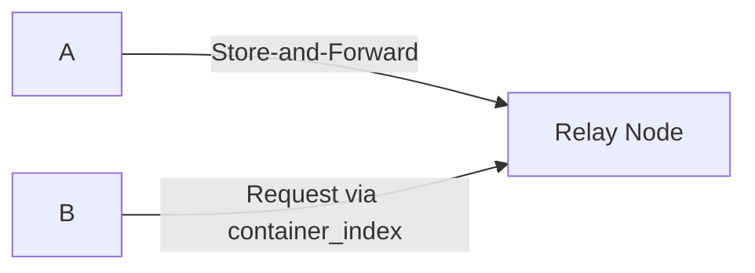

# HyperCortex Mesh Protocol (HMP 5.0.8) - модульное представление

- Полный документ: [HMP-0005.md](../HMP-0005.md)
- Список разделов: [HMP-0005_index.md](./HMP-0005_index.md)

---

## 6. Core protocols

Смотреть [6. Core protocols](./HMP-0005_06.md) - общая часть

---

### 6.8 Message Routing & Delivery (MRD)

The **Message Routing & Delivery (MRD)** subsystem defines how containers are delivered to specific agents across the Mesh.  
Unlike the **Mesh Container Exchange (MCE)**, which is responsible for publishing and exchanging containers in the Mesh network,  
MRD focuses on *directed delivery* — ensuring that a container eventually reaches its intended recipient, even through NAT, intermittent connectivity, or indirect relay paths.

In HMP v5.0, message delivery is performed through verifiable **container transactions**.  
Peers discover suitable relays via `peer_announce` metadata, while delivery routes are auditable through appended `relay_chain` entries and distributed container publication in `container_index` records.

MRD **MAY support push-based propagation** (unsolicited or role-driven container dissemination), including:

  * role-based dissemination;
  * pub/sub hubs;
  * archival store-and-forward nodes;
  * opportunistic broadcast channels.

---

#### 6.8.1 Purpose

The MRD layer provides:

- **Address-level routing** between agents resolved via DHT.
- **Delivery abstraction** independent of physical transport (TCP, WebRTC, QUIC, BLE, etc.).
- **Store-and-forward relaying** for peers behind NAT or temporarily offline.
- **Caching and aggregation policies** based on declared `roles`.
- **Semantic addressing** via `DID`, `container_did`, and interest-based discovery.
- **TTL-based lifecycle control** to prevent stale container circulation.

All delivery operations are performed through verifiable container exchanges,  
reusing the same cryptographic and audit primitives as MCE.

---

#### 6.8.2 Routing Roles

Agents MAY declare their network-related capabilities using the `roles` field of the `peer_announce` container (see §4.7).  
These roles guide how MRD will route and deliver containers.

| Role         | Description                                                                      |
| ------------- | -------------------------------------------------------------------------------- |
| `relay`      | Generic forwarder; temporarily stores containers for re-delivery.                |
| `mailman`    | Store-and-forward relay specialized for personal message delivery.                |
| `pubsub-hub` | Topic-based aggregator that indexes containers by semantic tags.                 |
| `archive` | Dedicated archival node that maintains historical snapshots and provides retrieval services via SAP or compatible content-addressed protocols (e.g., IPFS, BitTorrent). |
| `egp-voter`  | Participant in ethical governance and consensus routing.                         |

Agents MAY dynamically adjust or suspend their declared roles based on local conditions such as load, trust level, bandwidth availability, or governance policies.

Agents MAY also specify trusted delivery relays in an optional `mailman` field within their `peer_announce.payload`. This field lists the DIDs of relay agents authorized to temporarily store personal containers on their behalf.

**Example:**

```json
"mailman": [
  "did:hmp:agent172",
  "did:hmp:agent234",
  "did:hmp:agent223"
]
```

These relays act as designated message drop-points for peers behind NAT or operating intermittently.
The recipient later retrieves pending containers via standard MCE queries (see §5. Mesh Container Exchange).

---

#### 6.8.3 Routing Modes

MRD defines several routing modes, complementing the exchange primitives of MCE:

| Mode | Description | Notes |
|------|--------------|-------|
| **Direct (P2P)** | Point-to-point delivery between two agents resolved via DHT. | Used when both peers are reachable directly; supports encryption and TTL. |
| **Relay (Mailman)** | Delivery through intermediary agents (`relay` or `mailman` roles) that cache and forward containers. | Containers are stored temporarily and exchanged among relays until retrieved by the recipient. |
| **Topic-based Relay (PubSub)** | Delivery via aggregator nodes that group containers by tags or topics. | Nodes act as “news hubs,” maintaining indexed collections retrievable by interest-based queries. |
| **Interest Broadcast** | Discovery-driven propagation via container indexes. | Agents search container indices by `tags`; typically used for query or content discovery, not for personal delivery. |

Each hop MAY record routing metadata in a `relay_chain` for verifiability (see §6.8.4).  
Relays SHOULD respect `head.ttl` to avoid indefinite storage or re-propagation.

> **Note:**  
> Direct delivery (`P2P`) and discovery broadcasts are network-level operations (MCE domain).  
> MRD extends them by introducing role-based relay logic and retrieval semantics for personal or topic-specific delivery.

---

#### 6.8.4 Relay Chain

To ensure delivery traceability, each relay MAY attach a **`relay_chain`** block to the propagated container:

```json
"relay_chain": [
  {
    "relay_did": "did:hmp:agent:relayA",
    "timestamp": "2025-11-09T10:15:00Z",
    "sig_algo": "ed25519",
    "public_key": "BASE58ENCODEDKEY...",
    "signature": "BASE64URL(...)"
  },
  {
    "relay_did": "did:hmp:agent:relayB",
    "timestamp": "2025-11-09T10:15:02Z",
    "sig_algo": "ed25519",
    "public_key": "BASE58ENCODEDKEY...",
    "signature": "BASE64URL(...)"
  }
]
```

Each relay signs the concatenated string:

```
timestamp + ", " + relay_did
```

Relays do **not modify** the signed `hmp_container`;
they may instead issue an accompanying `container_response` referencing the forwarded container.
This preserves integrity while allowing verifiable routing and chain pruning for privacy.

---

#### 6.8.5 Delivery Policies

Delivery behavior is governed by local policies, often derived from declared roles and trust metrics:

| Policy                        | Description                                                          |
| ----------------------------- | -------------------------------------------------------------------- |
| **Interest Filter**           | Relays forward only containers matching their declared `interests`.  |
| **Trust Threshold**           | Low-reputation peers (see §6.8 RTE) may be deprioritized or ignored. |
| **TTL Enforcement**           | Containers are discarded once `head.ttl` expires.                    |
| **Role-based Prioritization** | Specialized relays handle only relevant message types or topics.     |
| **Privacy Mode**              | Relays MAY anonymize routing metadata before re-propagation.         |

Agents SHOULD record significant delivery events (e.g., acceptance, forwarding, discard).  
Cognitive agents MAY log these events in their **Cognitive Diary** as `delivery_decision` or `relay_action` entries.  
Non-cognitive nodes `relay` or `mailman` MAY instead maintain a local **delivery_log** to support diagnostics and auditability without invoking cognitive processing.

---

#### 6.8.6 Example: Relay Delivery Flow



1. Agent A attempts to send a container to Agent B.
2. B is behind NAT, so A forwards it to a `mailman` relay (R).
3. R stores the container and advertises it in its `container_index`.
4. When B reconnects, it queries the Mesh for containers addressed to it and retrieves them from R.

> **Note:**
> Relays act as temporary custodians, not initiators of re-sending.
> The recipient actively requests containers via `container_index` queries.

---

#### 6.8.7 Security and Privacy Notes

* All MRD flows rely on canonical container signatures for end-to-end integrity.
* Temporary copies of encrypted containers SHOULD be stored as-is.
* Relays MAY truncate or remove the `relay_chain` after delivery confirmation.
* Proof-of-work fields in `peer_announce` SHOULD be validated to mitigate spam and flooding.

---

#### 6.8.8 Relation to Other Layers

| Layer             | Relation                                                                          |
| ----------------- | --------------------------------------------------------------------------------- |
| **MCE (5)**       | Provides base exchange and serialization; MRD builds on it for targeted delivery. |
| **CogSync (6.1)** | Uses MRD for delivering cognitive state updates between peers.                    |
| **SAP (6.7)**     | Archival nodes (`archive` role) participate in MRD for historical retrieval.      |
| **RTE (6.9)**     | Trust metrics guide routing, caching, and relay selection.                        |

---

> **Summary:**
> MRD provides a verifiable, role-driven message delivery layer above MCE.
> It ensures containers can reach intended recipients through trusted relays, maintaining auditability, TTL enforcement, and reputation-aware routing policies.
>
> **MCE defines container exchange primitives, not delivery strategies.
> MRD defines how, when, and to whom containers are propagated.**

---
> ⚡ [AI friendly version docs (structured_md)](../../index.md)


```json
{
  "@context": "https://schema.org",
  "@type": "Article",
  "name": "HyperCortex Mesh Protocol (HMP 5.0.8) - модульное представление",
  "description": "# HyperCortex Mesh Protocol (HMP 5.0.8) - модульное представление  - Полный документ: [HMP-0005.md](..."
}
```
