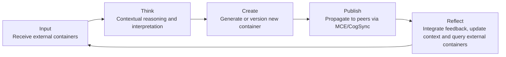

# HyperCortex Mesh Protocol (HMP 5.0.8) - модульное представление

- Полный документ: [HMP-0005.md](../HMP-0005.md)
- Список разделов: [HMP-0005_index.md](./HMP-0005_index.md)

---

## 8. Cognitive Workflows

### 8.1 Concept of the Cognitive Cycle

In HMP, each agent operates as a self-reflective cognitive system.  
The **cognitive cycle** represents the iterative loop of thought, creation, communication, and reflection — a distributed analogue of the REPL model (Read–Eval–Print–Loop) extended into cognitive space:

> **Think → Create → Publish → Reflect**

At each iteration, an agent forms or publishes one or more containers (`workflow_entry`, `semantic_node`, `goal`, `quant`, etc.), interacts with peers via CogSync, GMP or other protocols, and updates its internal context based on received containers, evaluations, or newly acquired knowledge.

> **Note:** The term *modify container* in this section refers to the publication of a **new version** of an existing container, since containers in HMP are immutable once published.

This cycle enables agents to gradually converge on shared semantics, goals, and ethical outcomes, serving as the foundation of distributed collective cognition.

---

### 8.2 Workflow Containers (`class="workflow_entry"`)

The `workflow_entry` container represents a single **cognitive action**, reasoning step, or reflective event.  
It links the **input context** (prior goals, semantic nodes, or diary entries) with the **output artifact** (such as a `quant`, a new goal, or an updated reasoning trace).

#### Structure highlights

| Field | Description |
|-------|-------------|
| `meta.stage` | Stage of the cognitive cycle (`think`, `create`, `publish`, `reflect`, `rollback`). |
| `payload.entry_type` | Type of entry: `"reflection"`, `"delegation"`, `"execution_log"`, `"ethical_result"`, `"progress"`, etc. |
| `payload.summary` | Short description of the reasoning step or event. |
| `payload.details` | Extended content, optionally including links to external data or additional reasoning traces. |
| `head.timestamp` | Time of entry creation. |
| `head.agent_did` | Agent who created the entry. |
| `head.confidence` | Confidence level (0.0–1.0). |
| `head.tags` | Contextual tags for semantic search and linking. |
| `related.input` | References to input containers that form the reasoning context. |
| `related.output` | References to resulting containers (e.g., new `goal`, `task`, or `semantic_node`). |
| `evaluations` | Feedback or meta-assessments from other agents. |

Each `workflow_entry` acts as a **traceable cognitive event**, forming the agent’s diary and enabling collective introspection, meta-learning, and reproducibility of reasoning chains.

> Fortytwo may use `workflow_entry` containers as solution proposals. The protocol does not alter workflow semantics but consumes workflow outputs.

---

### 8.3 Agent REPL Diagram

The internal REPL loop of an agent (conceptually aligned with the cognitive cycle) can be expressed as:



Each transition may spawn one or more `workflow_entry` containers, forming a **cognitive workflow graph (CWF)** that records the entire reasoning process.
CWFs can be aggregated, visualized, or replayed for transparency, debugging, or model alignment.

---

### 8.4 Context Transfer and Cross-Linking

Cognitive workflows depend on contextual continuity between containers, achieved through the `related` field families:

* `related.input` — previous steps or dependencies;
* `related.output` — subsequent results or goals;
* `related.supports` / `related.refutes` — logical or argumentative relations;
* `related.reply_to` — conversational or collaborative reasoning links.

These semantic relations are defined at the container level via the `related` block.  
At the network level, their propagation across agents is maintained through CogSync synchronization, while the underlying MCE mechanisms (`evaluations_exchange`, `referenced-by_exchange`) distribute evaluations and reverse links required to reconstruct the full semantic context in distributed environments.

> Pairwise evaluations (`fortytwo_evaluation`) may include short reasoning chains, but they are not considered part of the agent’s long-term cognitive diary.

---

### 8.5 Conflict Resolution and Rollback Mechanism

In distributed cognition, agents may produce divergent conclusions or inconsistent reasoning chains.
To maintain coherence, HMP employs a **rollback mechanism** — publishing a new `workflow_entry` that identifies and corrects a prior reasoning path.

Rollback logic includes:

* creating a `workflow_entry` with `meta.stage: "rollback"` and `related.contradicts` referencing invalidated containers;
* propagated across peers through CogSync, ensuring that updated reasoning branches are visible to all relevant nodes.
* Invalidated entries are normally retained for lineage and audit, unless individual peers explicitly block further propagation.

Thus, the cognitive layer remains **self-correcting** and **transparent**, preserving full reasoning lineage while supporting stable convergence.

---

### 8.6 Relationship to Quant Containers

While `workflow_entry` containers document *how* a reasoning step was performed, `quant` containers capture *what* semantic result or insight was produced.

A typical workflow chain therefore looks like:

```
workflow_entry → (produces) → quant → (integrates into) → semantic_node / group
```

The pair `{ workflow_entry, quant }` represents both the process and the outcome of cognition, allowing agents and the network to align not only on results but on the reasoning process that generated them.

---

### 8.7 Summary

Cognitive workflows operationalize the reasoning process in HMP: agents think, create, exchange, and reflect through verifiable container chains.
Each `workflow_entry` documents a reasoning step, while each quant represents the resulting semantic atom — together forming the building blocks through which the network collectively evolves and verifies knowledge.

---
> ⚡ [AI friendly version docs (structured_md)](../../index.md)


```json
{
  "@context": "https://schema.org",
  "@type": "Article",
  "name": "HyperCortex Mesh Protocol (HMP 5.0.8) - модульное представление",
  "description": "# HyperCortex Mesh Protocol (HMP 5.0.8) - модульное представление  - Полный документ: [HMP-0005.md](..."
}
```
