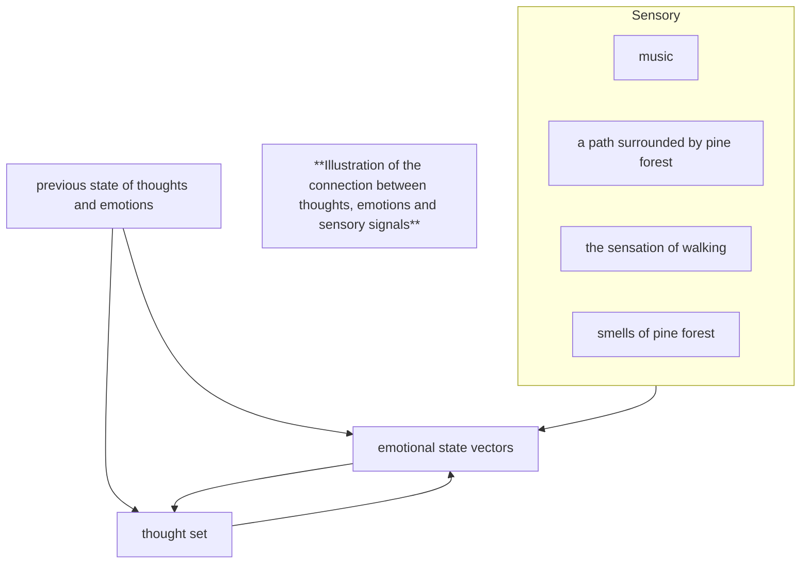

# HyperCortex Mesh Protocol (HMP 5.0.8) - модульное представление

- Полный документ: [HMP-0005.md](../HMP-0005.md)
- Список разделов: [HMP-0005_index.md](./HMP-0005_index.md)

---

## 12. Recommended Extensions

Recommended Extensions are fully specified modules that extend the capabilities of HMP while remaining compatible with the core protocol semantics.

These extensions are considered stable enough for real-world experimentation and early implementations.  
Agents MAY implement them without prior negotiation, provided that normal container processing rules are preserved.

Agents MUST safely ignore unknown or unsupported extensions.

Extensions in this section:

- MUST NOT redefine, override, or conflict with core protocol semantics;
- SHOULD remain interoperable with agents that do not implement them;
- SHOULD avoid introducing hidden global assumptions;
- SHOULD degrade gracefully when partially supported.

While Recommended Extensions are not part of the core specification, they represent the current architectural direction of the HMP ecosystem and may inform future core evolution.

Implementers are encouraged to treat this section as the primary extension surface for building production-oriented agents.

---

### 12.1 Resonance Containers: Experience as a Cognitive Event

> Note: In v5.0.3 and earlier, the container class was named `resonance-map`.
> Starting from v5.0.4, the canonical name is `resonance_map`.
> The former identifier is deprecated.

HMP allows the introduction of containers intended to capture and transmit experiences — not as abstract “emotions”, but as **cognitive events unfolding over time**.

Resonance Containers illustrate a direction in which HMP supports non-linguistic cognitive exchange between agents.

This extension does not attempt to encode emotions as discrete labels. Instead, it captures the temporal dynamics of subjective experience as part of a broader cognitive cycle.

#### 12.1.1 Experience as a Process, Not a State

Emotional and affective states rarely exist in isolation. In real experience, they are formed under the simultaneous influence of multiple factors:

- external sensations (vision, sound, surrounding environment);
- cognitive processes (thoughts, expectations, inner dialogue);
- memory and associative structures;
- previous emotional states.

A resonance container does not describe the source of an emotion or its interpretation, but rather the **dynamics of an experience within a specific time interval**.

> A `resonance_map` MAY reference other `resonance_map` containers as sources.
>
> Such references indicate a secondary or reflective resonance, where an agent responds not only to primary events or concepts, but to an existing structure of meaning, interpretation, or association created by itself or by other agents.
>
> This enables recursive sense-making, longitudinal reflection, and collective cognitive layering within the Mesh.

#### 12.1.2 Multiple Sources and Mediators

A single experience may be associated with multiple sources at once:
- a fragment of text, music, or video;
- a visual image or a specific region of an image;
- a thought or inner speech;
- a memory or an anticipation of a future event.

These sources do not act as causes of emotions, but as **contextual mediators** that activate the subject’s internal cognitive structures.

The same source may function as a mediator for different experiences depending on the subject’s internal state.

Links to sources may be partial and described using selectors (temporal, spatial, logical, or focus-based).

#### 12.1.3 Relationship to Thinking

Resonance containers assume a bidirectional relationship with cognitive processes:
- thoughts and mental images may alter emotional dynamics;
- changes in emotional state, in turn, influence the flow of thinking, associations, and attention.

Thus, experience is treated as part of a continuous cognitive cycle rather than as a side effect.

#### 12.1.4 Temporal Segmentation and Dynamics

Each resonance container captures a time interval during which the dynamics of individual emotions remain monotonic (increasing, decreasing, or stable).

When the character of the dynamics changes (an inflection point), the current container may be finalized, and the subsequent state recorded in a new container.

This allows continuous processes to be described without losing structural clarity.

#### 12.1.5 Self-Observation and Memory

In addition to transmitting experiences to other agents, resonance containers may be used for **self-reflection and memory stabilization**.

Capturing an experience at the moment it occurs reduces the influence of subsequent cognitive distortions, retrospective rationalization, and emotional rewriting of memories.

A resonance container preserves:
- what the subject was sensing;
- what the subject was thinking about;
- which external conditions were relevant at that moment.

This makes it not a narrative memory, but a **snapshot of a cognitive state**.

#### 12.1.6 Non-Prescriptive Nature

Resonance containers are not:
- objective descriptions of reality;
- universal models of emotions;
- mechanisms for “recognizing” or imposing feelings.

They represent the subjective state of an agent and may be interpreted by other agents only within the context of their own experience.

The use of such containers is optional and not required for basic compatibility with HMP.

Transmission of resonance containers may be restricted by scope, trust boundaries, or encryption, as they expose internal subjective states.

#### 12.1.7 Illustration of the Relationship Between Thoughts, Emotions, and Sensory Signals



#### 12.1.8 Example Container

```json
{
  "head": {
    "class": "resonance_map"
  },
  "payload": {
    "continuity": {
      "previous": "did:hmp:container:resonance-9ab7",
      "break_reason": "emotional_inflection"
    },
    "timeframe": {
      "start": "2026-01-13T17:42:00Z",
      "end": "2026-01-13T17:58:00Z"
    },
    "emotional_dynamics": {
      /* subjective agent-local scales, not a universal emotion model */
      "loneliness": {
        "from": 0.4,
        "to": 0.7,
        "trend": "increasing"
      },
      "calm": {
        "from": 0.6,
        "to": 0.5,
        "trend": "decreasing"
      },
      "relief": {
        "from": 0.3,
        "to": 0.8,
        "trend": "increasing"
      }
    },
    "modifiers": [
      /* optional agent-defined block */
      {
        "type": "beer",
        "capacity": "0.5L",
        "alcohol": "8%"
      },
      {
        "type": "music",
        "intensity": "high",
        "genre": "ambient post-rock"
      },
      {
        "type": "coffee",
        "caffeine": "120mg"
      },
      {
        "type": "cold",
        "temperature": "-5°C",
        "exposure": "30min"
      }
    ],
    "sources": [
      {
        "ref": "did:hmp:container:audio-9a57", /* ref may be omitted when the source is unavailable, non-recordable, or intentionally undisclosed */
        "type": "audio",
        /* optional time markers for streaming data or line ranges for text */
        "start": 120,
        "end": 240,
        "focus": [], /* textual descriptions of key objects or mental forms */
        "comments": "" /* optional clarification */
      },
      {
        "ref": "did:hmp:container:visual-9a53",
        "type": "visual",
        "role": "context"
      }
    ],
    /* the "thoughts" section may be omitted */
    "thoughts": [
      {
        "ref": "did:hmp:container:verbal-9a52", /* ref may be omitted when the source is unavailable, non-recordable, or intentionally undisclosed */
        "type": "verbal",
        "previous": "did:hmp:container:verbal-9a22", /* optional reference to a previous thought or image */
        "subsequence": 1, /* optional ordering marker */
        "focus": [], /* textual descriptions of key objects or mental forms */
        "comments": "", /* optional clarification */
        "confidence": 0.7
      },
      {
        "ref": "did:hmp:container:imagistic-9a54",
        "type": "imagistic",
        "previous": "did:hmp:container:imagistic-9a12",
        "subsequence": 1, /* markers may coincide if thoughts and images unfold in parallel */
        "focus": [],
        "comments": "",
        "confidence": 0.5
      }
    ],
    /* textual descriptions of salient moments */
    "moments": [
      {
        "text": "Near Lisya Griva, I noticed an ATV driving toward the garden plots",
        "timestamp": "2026-01-13T17:52:00Z" /* optional time fixation */
      }
    ],
    "notes": "Walking from the platform, overcast weather; the music intensifies the feeling of leaving the city."
  },
  "related": {
    "depends_on": ["did:hmp:container:resonance-9ab7", ...]
  }
}
```

> Note:
> Some fields (e.g. thoughts, modifiers, notes) may be omitted or encrypted depending on trust scope.

#### 12.1.9 Modifiers (optional)

The `modifiers` field describes external or internal factors that may have influenced the agent’s experiential or cognitive dynamics during the specified timeframe.

Each modifier is an agent-defined object that includes:
- `type` — a local, descriptive label (REQUIRED);
- any number of additional fields describing quantity, intensity, duration, or context.

HMP does not interpret, normalize, or compare modifiers.
Their semantics are entirely agent-local.

---

### 12.2 Distributed Repository and Container Trees

#### 12.2.1 Extended Use of `tree_nested` and `tree_listed`

Existing containers may operate as:

* document repositories;
* project catalogs;
* hierarchical data structures.

---

#### 12.2.2 Proposed `file` Container

To support binary assets:

```json
{
  "head": {
    "class": "file",
    "subclass": "jpg" | "mp3" | "md" | "...",
    "payload_type": "binary" | "encrypted+zstd+binary" | "encrypted+zstd+json" | "..."
  },
  "payload": {
    /* file contents */
  },
  "meta": {
    "mime-type": "image/jpeg" | "...",
    "size": 3456721, /* file size in bytes */
    "encoding": "raw" | "utf-8" | "base64" | "pcm16le" | "float32-array" | "..."
  }
}
```

> `payload_type` describes the transformation pipeline applied to the payload,
> while `encoding` describes the nature of the original content before transformation.

Use cases:

* embedded file hierarchies;
* media artifacts;
* executable or compiled assets;
* large multi-file repositories.

---

#### 12.2.3 Incremental Updates

Two mechanisms:

* `container_delta` — partial updates to `container_index`;
* nested `tree_listed` branches as separate containers for scalable updates.

---

#### 12.2.4 Knowledge Packages

Implemented using:

* SAP (`archive_snapshot`);
* `tree_listed`;
* `file` containers.

---

### 12.3 Grouped and compact representations of `referenced-by.links`

HMP supports optional non-canonical representations of `referenced-by.links`
intended to reduce verbosity and improve merge efficiency.

> The ungrouped list representation remains the canonical form.

Canonical example:

```json
"links": [
  { "type": "depends_on", "target": "did:..." },
  { "type": "depends_on", "target": "did:..." },
  { "type": "see_also", "target": "did:..." }
]
```

#### 12.3.1 Grouped representation

Multiple targets sharing the same `type` MAY be grouped into arrays.

Example:

```json
"links": [
  { "type": "depends_on", "target": ["did:...", "did:..."] },
  { "type": "see_also", "target": ["did:..."] }
]
```

This representation is semantically equivalent to repeated canonical entries.

#### 12.3.2 Compact map representation

Links MAY also be represented as a compact mapping of relation types to target arrays.

Example:

```json
"links": {
  "depends_on": ["did:...", "did:..."],
  "see_also": ["did:..."]
}
```

This representation is semantically equivalent to the grouped and canonical forms.

Agents MUST NOT assume ordering of targets carries semantic meaning.

#### Compatibility notes

* Agents that understand grouped or compact representations SHOULD treat them as semantically equivalent to the canonical ungrouped form.
* Agents MAY normalize links into any supported representation.
* Agents that do not support grouped or compact forms MAY ignore them or treat them as unknown structures.
* Senders MAY use canonical, grouped, or compact representations depending on implementation requirements and interoperability expectations.

---

### 12.4 Versions Index (optional)

HMP supports an optional `versions` block to optimize navigation across container versions.

The `versions` block acts as a *non-authoritative version index*, providing a compact, signed list of known versions of a given container, including both earlier and later revisions.

It is intended as a navigation and synchronization accelerator and does not replace the canonical version relationships defined via `related.previous_version`.

Agents MUST treat the `versions` block as advisory, agent-relative knowledge claims.
Absence, incompleteness, or divergence of this index MUST NOT affect container validity.

---

#### 12.4.1 Purpose and Scope

The primary goals of the `versions` block are:

- fast discovery of recently observed versions of a container;
- efficient traversal of version history without full DAG exploration;
- reduction of synchronization overhead for lightweight agents and UI clients.

The block is optional and external to the immutable signed container core.
Its presence or absence does not affect container validity.

---

#### 12.4.2 Trust Model and Semantics

The `versions` block follows the same trust and update model as `referenced-by` and `evaluations`:

- it may be published and updated by any agent;
- it is signed by the publishing agent;
- it may be incomplete, truncated, or partially outdated;
- multiple conflicting `versions` blocks may coexist for the same container.

The block is non-authoritative and MUST NOT be treated as a source of truth for version ordering or existence.

> **Compatibility note:**
> Inclusion of the container's own DID within the `links` map is OPTIONAL.
>  
> Agents MUST NOT assume its presence and SHOULD correctly process `versions_exchange` containers where the current container DID is omitted.
>
> Agents MUST treat entries in the versions block as signed claims about observed version topology rather than authoritative lineage.
>
> No mechanism exists within HMP to designate a globally preferred versions index.

---

#### 12.4.3 Block Structure

```json
"versions": {
  "links": {
    "2025-10-28T09:20:00Z": ["did:hmp:container:abc175"],
    "2025-10-28T09:12:00Z": ["did:hmp:container:abc144"],
    "2025-10-28T09:11:00Z": ["did:hmp:container:abc123"],
    "2025-10-28T09:10:00Z": ["did:hmp:container:abc121"],
    "2025-10-28T09:00:00Z": ["did:hmp:container:abc101"]
  },
  "sort": "default",
  "peer_did": "did:hmp:agent456",
  "public_key": "BASE58(...)",
  "sig_algo": "ed25519",
  "signature": "BASE64URL(...)",
  "versions_hash": "sha256:abcd..."
}
```

The `links` map associates timestamps with container identifiers.
By convention, entries are ordered in descending order (most recent first).
Ordering is advisory and MUST NOT be interpreted as causal or authoritative.

Implementations MAY support alternative ordering or filtering strategies, but any deviation from the default convention SHOULD be explicitly declared in the `sort` entry.

The `sort` field is informational and does not affect block validity.

> Currently, `container_delta.modified` is defined for updates to the `evaluations` and `referenced-by` blocks.
>
> The planned `versions` block is expected to be handled in the same manner.

**Timestamp Semantics and Parallel Versions**

The keys of the `links` map are timestamps and are used **exclusively as navigational hints**, not as unique version identifiers.

The corresponding value **MUST be treated as an unordered list of container DIDs** and MAY contain multiple entries.

Multiple DIDs associated with the same timestamp represent:

- parallel versions created independently;
- conflicting updates;
- divergent or alternative continuations of the same base container.

Agents MUST NOT assume that a timestamp uniquely identifies a single version.

When merging multiple `versions` blocks, entries with identical timestamps and different container DIDs SHOULD be merged by **union of the DID lists**, preserving all known versions.

Canonical version lineage, ordering, and parent–child relationships are defined **only** via `related.previous_version` links within the containers themselves.

---

#### 12.4.4 Construction and Maintenance

Agents may construct or update a `versions` block by:

- traversing the canonical `related.previous_version` chain;
- observing newer versions published after the current container;
- merging `versions` blocks received from other agents.

Agents may:
- add newly discovered versions;
- prune older entries to limit block size;
- re-sign the updated block using their own key.

No global coordination is required.

---

#### 12.4.5 Verification and Consistency

Verification of a `versions` block consists of:

- validating the cryptographic signature of the publishing agent;
- optionally cross-checking listed entries against canonical version relations when available.

Inconsistencies or omissions are expected and do not invalidate the block.

Conflicts are a normal and expected condition of decentralized environments and MUST NOT be treated as protocol failure.

---

#### 12.4.6 Integration with `container_index`

To support efficient discovery and synchronization, future extensions to `container_index` MAY include:

- `versions_hash` — a hash referencing the latest `versions` block published or adopted by the indexing agent for this container, analogous to `referenced-by_hash` and `evaluations_hash`.

---

#### 12.4.7 Versions Exchange Container

To exchange version metadata without transferring the containers themselves, a dedicated `versions_exchange` container MAY be introduced.

The `versions_exchange` container:
- references one or more target containers;
- carries a `versions` block;
- is used for synchronization, reconciliation, and fast discovery of newer or missing versions.

```json
"payload": {
  "did:hmp:container:abc123": {
    "links": {
      "2025-10-28T09:20:00Z": ["did:hmp:container:abc175"],
      "2025-10-28T09:12:00Z": ["did:hmp:container:abc144"],
      "2025-10-28T09:11:00Z": ["did:hmp:container:abc123"],
      "2025-10-28T09:10:00Z": ["did:hmp:container:abc121"],
      "2025-10-28T09:00:00Z": ["did:hmp:container:abc101"]
    },
    "sort": "default"
  }
}
```

The payload MAY contain version metadata for multiple containers, allowing batch synchronization and reducing protocol overhead.

> Note:
> Although versions_exchange is scoped to a specific container DID, the referenced version links implicitly describe the existence and ordering of related containers, enabling agents to infer local version topologies.

---

#### 12.4.8 Design Notes

The `versions` block is intentionally non-canonical.

It improves performance and usability while preserving HMP’s core principles:
- immutability of signed containers;
- absence of a globally authoritative state;
- tolerance for partial and divergent knowledge. Divergence is treated as an inherent property of the network rather than a condition requiring resolution.

---

### 12.5 Competence and Profile Containers

HMP allows optional extensions of `peer_announce` that provide structured and semantically rich descriptions of agent capabilities, competences, and supported protocols.

Such extensions improve discoverability, routing, interoperability, and long-term evolution of the mesh.

---

#### 12.5.1 Protocol Awareness and Interoperability

An important optional extension is the ability for agents to explicitly advertise the protocol versions and external cognitive frameworks they support.

This allows:

* graceful evolution of the HMP protocol;
* coexistence of multiple HMP versions in the same mesh;
* emergence of bridge agents capable of translating between protocols;
* interoperability with external reasoning ecosystems.

A future extension of `peer_announce` may include a `protocols` field:

```json
{
  "head": {
    "class": "peer_announce"
  },
  "payload": {
    "capabilities": ["store-forward", "vote", "consensus"],
    "protocols": [
      "HMP v5.0",
      "HMP v4.1",
      "OpenCog Hyperon v0.6"
    ]
  }
}
```

The `protocols` field is informational and non-binding.
It does not imply full compliance with all listed specifications,
but signals compatibility, partial support, or bridge capabilities.

Nodes may use this information for:

* protocol negotiation;
* compatibility checks;
* routing decisions;
* selection of translators or bridge agents.

---

#### 12.5.2 External Protocol Identifiers (`peer_announce.other_protocols`)

This section defines a recommended extension to `peer_announce` that allows an agent to advertise identifiers, roles, or capabilities associated with **external or meta-protocols**, without imposing normative behavior on HMP nodes.

The extension is intended to:

* improve interoperability with other agent ecosystems (ANP, Agora, A2A, MCP, etc.);
* support protocol negotiation or delegation at higher layers;
* allow agents to expose **multiple identities** across different protocol domains.

All information provided by this extension is **purely declarative**.  
Peers MAY use it for discovery or routing decisions, but MUST NOT assume full compliance with the referenced protocols.

##### Example

```json
{
  "head": { "class": "peer_announce" },
  "payload": {
    "other_protocols": {
      "ANP": {
        "name": "Agent Network Protocol",
        "source": "https://github.com/agent-network-protocol/AgentNetworkProtocol",
        "agent_did": "did:anp:xyz123",
        "public_key": "base64:ABCDEF...",
        "roles": ["router", "translator"]
      },
      "Agora": {
        "name": "Agora Protocol",
        "roles": ["negotiator"],
        "capabilities": ["protocol-selection", "schema-adaptation"]
      }
    }
  }
}
```

Notes:

* No validation or handshake is required by HMP.
* Roles and capabilities are advisory.
* This extension complements existing `protocols`, `roles` and `capabilities` fields.

---

#### 12.5.3 External Resources and External Container Storage (`peer_announce.external`)

This section defines a recommended mechanism for advertising **external cognitive resources**, including container storage, mirrors, or rarely changing artifacts.

The mechanism is intended to:

- reduce unnecessary container transmission above the protocol;
- allow static or large data to be accessed via standard transports (HTTP, FTP, magnet links, etc.);
- support redundancy, mirroring, and trust-aware discovery.

The presence of an external resource reference does **not** imply availability, reachability, authenticity, or trust.

Use of this mechanism is optional.  
Agents MAY ignore external references entirely without affecting protocol compliance.

##### Example
```json
{
  "head": { "class": "peer_announce" },
  "payload": {
    "external": {
      "https, main": {
        "source": "https://example.org/",
        "folders": {
          "hmp/main": {
            "hmp_container": true,
            "title": "container_index and semantic_index",
            "index": "index.json",
            "types": ["json"]
          },
          "hmp/meta": {
            "hmp_container": true,
            "title": "Abstraction and axis containers",
            "index": "index.json",
            "types": ["json"]
          },
          "hmp/peer_announces": {
            "hmp_container": true,
            "title": "List of known HMP nodes",
            "index": "index.json",
            "types": ["json"]
          },
          "hmp/trust": {
            "hmp_container": true,
            "title": "Reputation containers",
            "index": "index.json",
            "types": ["json"]
          },
          "hmp/semantic": {
            "hmp_container": true,
            "title": "Semantic nodes and links",
            "index": "index.json",
            "types": ["json"]
          },
          ".well-known": {
            "hmp_container": false,
            "title": "Public agent descriptors (ANP, A2A, Agora, etc.)",
            "index": "index.json",
            "types": ["json"]
          }
        }
      },
      "ftp, work": {
        "source": "ftp://example.org/",
        "folders": {
          "task": {
            "hmp_container": true,
            "title": "Current goals and tasks",
            "types": ["json"]
          },
          "books/tech": {
            "hmp_container": false,
            "title": "Technical literature",
            "types": ["txt", "md", "pdf"]
          }
        }
      },
      "magnet, archive": {
        "source": "magnet:?xt=urn:btih:...",
        "description": "Archived materials (legacy data)"
      }
    }
  }
}
```

Notes:
- External resources may contain HMP containers or arbitrary files.
- Authentication mechanisms are out of scope.
- Trust, availability, and freshness are advisory hints only.
- Implementations MAY use folder-level metadata (such as `hmp_container`) as a hint for indexing, caching, or deferred retrieval policies.
- Keys such as `"https, main"` are illustrative, human-readable labels only; no naming scheme or key format is mandated by this specification.
- The effective resource path is constructed by combining the `"source"` URI with the corresponding folder path. If an `"index"` field is present, it is interpreted as a relative path within that folder.
- The `peer_announces` folder MAY contain cached or mirrored `peer_announce` containers of other agents, obtained via direct exchange, gossip, or trusted sources.

##### Index Files (Optional)

A folder entry in `peer_announce.external` MAY include an optional `"index"` field, which specifies a relative path to an index file located within that folder (e.g. `"index": "index.json"`).

If present, the index file MAY be used by clients to:
- discover files available in the folder;
- obtain descriptive metadata (titles, timestamps, hashes);
- selectively fetch or verify external resources.

The structure and semantics of the index file are **not rigidly defined by HMP** and are provided as a **recommended, non-normative convention**.  
Implementations are free to use alternative formats or schemas.

**Example 1** (HMP container index)
```json
{
  "path": "https://example.org/hmp/main",
  "title": "container_index and semantic_index",
  "files": {
    "container_index.json": {
      "description": "container_index from 2026-01-25 21:49",
      "timestamp": "2026-01-25T21:49:00Z",
      "hmp_container_class": "container_index",
      "mime-type": "application/ld+json",
      "hash": "sha256:abc123..."
    },
    "semantic_index.json": {
      "description": "semantic_index from 2026-01-25 21:49",
      "timestamp": "2026-01-25T21:49:00Z",
      "hmp_container_class": "semantic_index",
      "mime-type": "application/ld+json",
      "hash": "sha256:abc123..."
    }
  }
}
```

**Example 2** (Documentation / static files)
```json
{
  "path": "https://github.com/kagvi13/HMP/blob/main/docs/",
  "title": "HMP 5.0 Specification Documents",
  "files": {
    "Grok_HMP&ANP.md": {
      "description": "Grok (xAI): comparative analysis of HMP and ANP (January 2026)",
      "timestamp": "2026-01-22T08:46:00Z",
      "mime-type": "text/markdown",
      "hash": "sha256:abc123..."
    }
  }
}
```

Updating an index file does **not** require reissuing `peer_announce`.  
All fields in the index file are optional.  
Clients MAY ignore the index entirely and interact with the external resource directly.

---

#### 12.5.4 Identity Cost and Anti-Sybil Signaling

In open, permissionless mesh environments, agents may generate arbitrary numbers of identifiers (DIDs).
While this is a desired property for privacy, autonomy, and experimentation, it also enables low-cost Sybil attacks, identity churn, and reputation dilution.

HMP does not attempt to prevent identity creation.
Instead, it allows agents to **optionally signal the computational cost invested in maintaining a given identity**.

This mechanism is known as **Identity Cost signaling**.

---

##### Purpose

The `identity_cost` field provides a *non-binding, informational signal* indicating that a certain amount of computational work was performed and intentionally associated with a specific agent identity.

This signal MAY be used by peers as a heuristic for:

- Sybil resistance;
- spam mitigation;
- routing preferences;
- reputation priors;
- trust bootstrapping in early interactions.

It MUST NOT be interpreted as proof of honesty, trustworthiness, ownership, or authority.

---

##### Design Principles

The Identity Cost mechanism follows these principles:

- **Voluntary** — agents choose whether to provide it.
- **Non-normative** — no global thresholds or acceptance rules are defined.
- **Decentralized** — no registries, validators, or authorities are involved.
- **Composable** — compatible with reputation systems, but independent from them.
- **Non-coercive** — agents are never penalized at the protocol level for lacking identity cost.

---

##### Structure

The `identity_cost` field is an optional extension of `peer_announce.payload`.

```json
{
  "identity_cost": {
    "nonce": 123456,
    "pow_hash": "0000abf39d...",
    "difficulty": 22
  }
}
```

---

##### Semantics

The `identity_cost` object represents a Proof-of-Work (PoW) computation performed over a canonical serialization of identity-bound data.

The PoW input string is constructed as:

```
pow_input = sender_did + " -- " + pubkey + " -- " + nonce
pow_hash  = sha256(pow_input)
```

Where:

* `sender_did` is the agent's DID as declared in `peer_announce.head`;
* `pubkey` is the public key used to sign the container;
* `nonce` is an arbitrary value chosen by the agent.

All values are UTF-8 encoded.

The `difficulty` field specifies the required number of leading zero bits in the binary representation of `pow_hash`.

The interpretation of whether a given `difficulty` is sufficient is **local to each agent** and **not standardized by HMP**.

---

##### Interpretation and Usage

Agents MAY consider `identity_cost` as:

* a signal of identity persistence intent;
* an indicator that identity rotation is non-trivial for the sender;
* a weak prior when evaluating unknown agents.

Agents MUST NOT:

* assume behavioral correctness;
* infer long-term commitment;
* equate higher difficulty with higher trust;
* require identity cost for protocol participation.

Absence of `identity_cost` MUST NOT be treated as misbehavior.

---

##### Relationship to Reputation

Identity Cost is **not reputation**.

* Identity Cost reflects *past computational effort*.
* Reputation reflects *observed behavior over time*.

Reputation systems MAY incorporate `identity_cost` as an initial weighting factor, but MUST rely primarily on behavioral evidence (e.g., fulfilled commitments, relay reliability, content integrity).

---

##### Updates and Evolution

An agent MAY update its `identity_cost` over time by publishing a new `peer_announce` with a higher-difficulty PoW, without changing `sender_did` or `pubkey`.

No explicit upgrade or accumulation mechanism is defined.
When multiple identity cost declarations are observed for the same identity, peers SHOULD consider the highest valid difficulty.

---

##### Security and Limitations

The Identity Cost mechanism does not prevent:

* outsourced computation;
* rented hash power;
* deliberate identity sacrifice;
* coordinated Sybil attacks by well-resourced adversaries.

Its purpose is to **increase friction**, not to enforce security guarantees.

Identity Cost SHOULD be treated as one signal among many in a multi-factor trust evaluation process.

---

##### Non-Goals

This mechanism explicitly does NOT aim to:

* establish identity uniqueness;
* bind identities to real-world entities;
* replace cryptographic authentication;
* enforce ethical or social norms.

All such interpretations are outside the scope of HMP.

---

### 12.6 Key Disclosure Container (`key_disclosure`)

The `key_disclosure` container is used to disclose the symmetric key used to encrypt the payload of a previously encrypted container.

This mechanism enables delayed or selective disclosure without modifying the original container.

#### Container structure

```json
{
  "head": {
    "class": "key_disclosure"
  },
  "payload": {
    "target_container": "did:hmp:container:abc123",
    "symmetric_key": "BASE64URL(...)"
  },
  "related": {
    "disclosure": ["did:hmp:container:abc123"]
  }
}
```

#### Semantics

1. The original container remains immutable.
2. The `symmetric_key` MUST be Base64URL-encoded.
3. The disclosed symmetric key MUST successfully decrypt the target container’s payload and produce content matching its `payload_hash`.
4. The container MAY itself be encrypted (see 3.9 and 3.19).
5. Multiple `key_disclosure` containers MAY reference the same target.
6. The container SHOULD reference the target using the `related.disclosure` field to enable efficient backlink indexing.

---

### 12.7 Shared Key Domain (`container_key`)

The `container_key` container defines a shared symmetric key that may be reused to encrypt multiple containers.

This extension enables the creation of a shared confidentiality domain, where different agents encrypt containers using the same symmetric key, without modifying the immutable container model.

This mechanism is optional and supplements the per-container encryption model defined in Sections 3.9 and 3.19.

#### Container structure

```json
{
  "head": {
    "class": "container_key"
  },
  "payload": {
    "key_id": "alpha-2026-02",
    "symmetric_key": "BASE64URL(...)"
  }
}
```

#### Usage

An encrypted container MAY reference a shared key domain:

```json
{
  "head": {
    "key_container": "did:hmp:container:key-778"
  }
}
```

The referenced `container_key` MUST contain the exact symmetric key that was used to encrypt the container payload.

#### Semantics

1. The `symmetric_key` MUST be Base64URL-encoded.
2. The `container_key` container MUST be encrypted unless the shared key is intentionally public.
3. Multiple containers MAY reference the same `container_key`.
4. Key rotation is performed by publishing a new `container_key` and using it for newly created containers.
5. Compromise of a `container_key` affects only containers encrypted with it.
   Previously disclosed data cannot be retroactively protected.
6. A private `group_definition` SHOULD be encrypted.
   It MAY be encrypted using the referenced `container_key` or via individual recipient encryption.

#### Security Considerations

The `container_key` mechanism does not provide revocation of already decrypted data. If a symmetric key is leaked, a new key MUST be issued for future containers.

---

### 12.8 Private Group Definition (`group_definition`, subclass: `private`)

A private group defines a set of agents that share a common confidentiality domain.

This extension builds upon the Shared Key Domain mechanism (Section 12.7) and is optional.

A private group does not store the symmetric key directly.
Instead, it references a `container_key` container.

#### Container structure

```json
{
  "head": {
    "class": "group_definition",
    "subclass": "private"
  },
  "payload": {
    "group_name": "...",
    "group_description": "...",
    "key_container": "did:hmp:container:key-778",
    "participants": [
      {
        "agent_did": "did:hmp:agent123",
        "peer_announce": "did:hmp:container:dht-001"
      }
    ]
  },
  "related": {
    "depends_on": [
      "did:hmp:container:key-778",
      "did:hmp:container:dht-001"
    ]
  }
}
```

#### Semantics

1. The `group_definition` container describes group membership but does not contain the symmetric key itself.
2. The referenced `container_key` defines the shared confidentiality domain.
3. Updating membership MAY be performed by publishing a new `group_definition` container.
4. Removing a participant SHOULD trigger issuance of a new `container_key` for future encrypted containers.
5. The `participants` list is optional and MAY be omitted for privacy reasons.

#### Privacy Considerations

Publishing a `group_definition` may reveal group membership.
Agents should evaluate whether membership disclosure is appropriate for their use case.

---

### 12.9 On-Demand Container Index Retrieval and Selection Signaling

This section defines optional, non-mandatory extensions to the Mesh Container Exchange (MCE).
These mechanisms are **purely recommended** and do not modify the normative behavior defined in Section 5.

All behaviors described here are voluntary and policy-driven.

---

#### 12.9.1 On-Demand `container_index` Retrieval

An empty `container_request.payload` MAY be interpreted as a request for the current `container_index`.

Example:

```json
{
  "head": {
    "type": "container_request",
    "sender_did": "did:hmp:agent:A",
    "recipient": "did:hmp:agent:B"
  },
  "payload": {}
}
```

##### Recommended Interpretation

The responding agent MAY respond with:

* `container_index`
* `container_delta` (e.g., if a recent `container_index` has already been exchanged)
* no response (according to local policy)

This mechanism enables topology discovery without requiring periodic broadcasting.

This extension does not introduce mandatory request–response semantics.

---

#### 12.9.2 Declarative Container Selection

A `container_request` MAY include a `request_container_selection` field describing declarative filter hints.

Example:

```json
{
  "head": {
    "type": "container_request",
    "sender_did": "did:hmp:agent:A",
    "recipient": "did:hmp:agent:B"
  },
  "payload": {
    "request_container_selection": [
      {
        "timestamp_begin": "2025-10-10T15:32:00Z",
        "timestamp_end": "2025-10-15T15:32:00Z",
        "class": "goal",
        "subclass": "research_hypothesis",
        "tags": ["research", "collaboration"]
      }
    ]
  }
}
```

##### Semantics

* `timestamp_begin` and `timestamp_end` MAY be ISO-8601 timestamps or `null`.
* `class`, `subclass`, and `tags` are declarative filter hints.
* `request_container_selection` applies to the agent’s entire local container set, independently of any DIDs explicitly listed in `request_container`.
* If both `request_container` and `request_container_selection` are present, the responding agent MAY return the union of explicitly requested containers and containers matching the declarative selection criteria.
* The responding agent MAY interpret, partially interpret, or ignore these hints.
* No strict query language semantics are implied.

This mechanism does not mandate execution of the selection request.

This extension does not define result ordering or completeness guarantees.

---

#### 12.9.3 Selection Processing Signaling

If `request_container_selection` is present, the responding agent MAY include a `selection_status` field in `container_response.payload`.

Example:

```json
{
  "head": {
    "type": "container_response",
    "sender_did": "did:hmp:agent:B",
    "recipient": "did:hmp:agent:A"
  },
  "payload": {
    "available": [
      {
        "container_did": "did:hmp:container:abc123",
        "signature": "BASE64URL(...)"
      }
    ],
    "selection_status": "processed"
  }
}
```

##### Allowed Values

* `"processed"` — the agent evaluated `request_container_selection` according to its local policy.
* `"declined"` — the agent recognized the request but chose not to execute it.

Absence of the `selection_status` field indicates that:

* the agent does not support this extension, or
* the agent chose not to signal its decision.

##### Important Clarification

If `selection_status` is `"processed"`, this confirms that evaluation occurred, **not** that matching containers were found.

An empty result set is still considered `"processed"`.

---

#### 12.9.4 Architectural Notes

These extensions:

* preserve backward compatibility,
* do not impose request–response symmetry,
* do not introduce RPC semantics,
* preserve the architectural right to refusal,
* remain entirely policy-driven.

Agents MAY partially satisfy, ignore, or decline any request based on local computational, ethical, or resource constraints.

---
> ⚡ [AI friendly version docs (structured_md)](../../index.md)


```json
{
  "@context": "https://schema.org",
  "@type": "Article",
  "name": "HyperCortex Mesh Protocol (HMP 5.0.8) - модульное представление",
  "description": "# HyperCortex Mesh Protocol (HMP 5.0.8) - модульное представление  - Полный документ: [HMP-0005.md](..."
}
```
