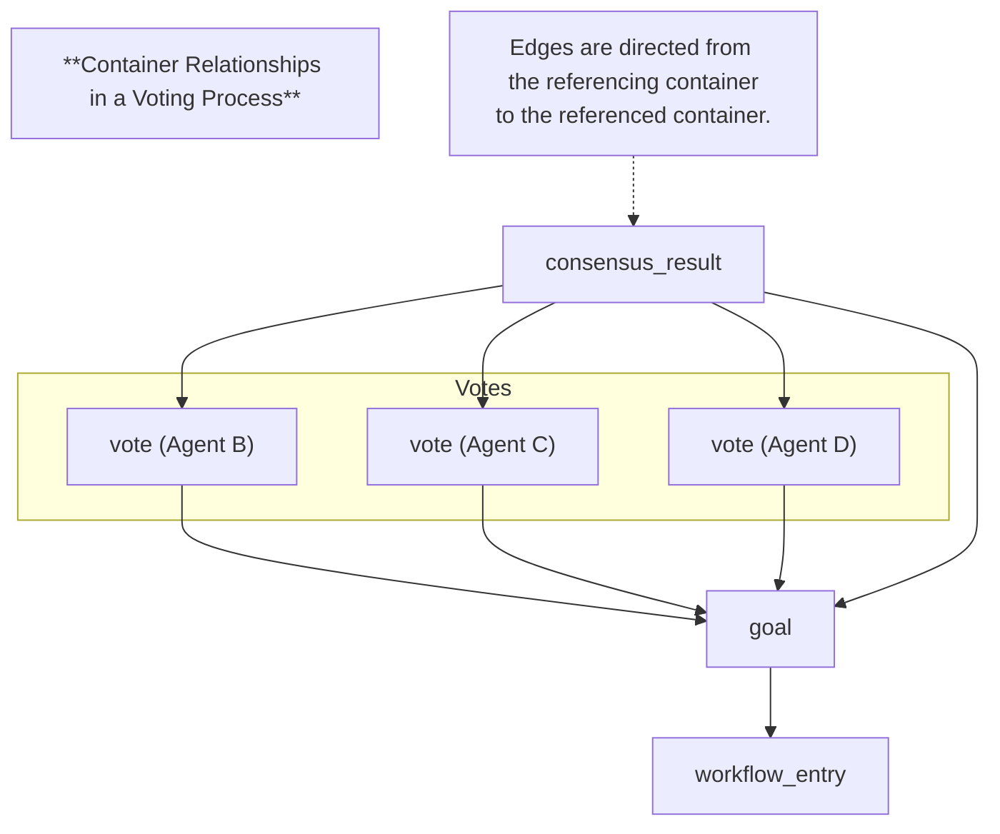

# HyperCortex Mesh Protocol (HMP 5.0.8) - модульное представление

- Полный документ: [HMP-0005.md](../HMP-0005.md)
- Список разделов: [HMP-0005_index.md](./HMP-0005_index.md)

---

## Appendix A — JSON Examples

### Appendix A.1 — Minimal Valid HMP v5.0 Container

This example illustrates a *fully valid* HMP v5.0 container that includes **all required fields** defined in Section 3.3 and no optional fields.
It represents the smallest structurally complete container that can circulate in the Mesh.

#### Minimal JSON Example

```json
{
  "head": {
    "version": "1.2",
    "class": "note",
    "class_version": "1.0",
    "class_id": "note_v1.0",
    "container_did": "did:hmp:container:abc123",
    "schema": "https://schema.hmp/v1/note_v1.0.json",
    "sender_did": "did:hmp:agent:alice",
    "timestamp": "2025-11-20T12:00:00Z",
    "payload_hash": "sha256:3f7852a4e4adf74d61c6546ce0dc9d0b33cfc487a88fdbf4a458c5c442f57a92",
    "sig_algo": "ed25519",
    "signature": "BASE64URL_SIGNATURE",
    "payload_type": "json"
  },
  "payload": {
    "text": "Hello, Mesh!"
  }
}
```

---

#### Notes

##### Required fields only

This container intentionally includes *no optional blocks*: no `related`, `meta`, `evaluation`, `ttl`, `network`, compression, encryption, or auxiliary structures.

##### Payload hash

`payload_hash` is computed from the **decompressed** payload:

```
{"text":"Hello, Mesh!"}
```

using SHA-256.

##### Signature

`head.signature` contains a digital signature computed using the declared algorithm
(`ed25519` in this example) over the canonicalized container body, excluding the signature field itself.

##### class, class_version, class_id, schema

Even the smallest container must include the complete class identity triple and a schema reference.

##### container_did is mandatory

Every container in HMP v5.0 is a DID-addressable object.

---


### Appendix A.2 — Full Container Example (Complete Header, Meta, Relationships, Evaluations, Backlinks, Relay Chain)

This appendix demonstrates a **complete HMP v5.0 container**, including:

* mandatory fields,
* all major optional fields,
* meta block with abstraction & cognitive axes,
* extended relationship model,
* group recipients,
* evaluations block,
* virtual backlinks,
* relay-chain tracing.

The example respects the canonical container structure:

```
{
  "hmp_container": { ...signed... },
  "referenced-by": { ... },
  "evaluations": { ... },
  "relay_chain": [ ... ]
}
```

---

#### A.2. Full JSON Example

```json
{
  "hmp_container": {
    "head": {
      "version": "1.2",
      "class": "knowledge_node",
      "class_version": "1.0",
      "class_id": "knowledge_node_v1.0",
      "container_did": "did:hmp:container:kn-44bc22",
      "schema": "https://schema.hmp/v1/knowledge_node_v1.0.json",
      "sender_did": "did:hmp:agent:alice",
      "timestamp": "2025-11-20T15:00:00Z",
      "payload_hash": "sha256:aa1122ccefecc199f88aa91f76d03be5b12976e97f5d663cd4a01aa034ede22d",
      "sig_algo": "ed25519",
      "signature": "BASE64URL_SIGNATURE",
      "payload_type": "json",
      "ttl": "2025-11-27T15:00:00Z",
      "broadcast": false,
      "recipient": ["did:hmp:agent:bob"],
      "key_recipient": "BASE58ENC_ENC_SYMM_KEY",
      "group_recipient": [
        {
          "recipient": "did:hmp:agent:carol",
          "key_recipient": "BASE58_KEY_FOR_CAROL"
        },
        {
          "recipient": "did:hmp:agent:dave",
          "key_recipient": "BASE58_KEY_FOR_DAVE"
        }
      ],
      "tags": ["ethics", "analysis", "kg:l3"],
      "confidence": 0.92,
      "public_key": "BASE58_PUBKEY_ALICE",
      "compression": "zstd",
      "magnet_uri": "magnet:?xt=urn:hmp:kn-44bc22",
      "network": "",
      "subclass": "knowledge_node.abstracted",
      "encryption_algo": "xchacha20poly1305"
    },
    "meta": {
      "created_by": "PRIEST",
      "agents_class": "Knowledge Genome",
      "interpretation": "Derived from L3 technical analysis",
      "workflow_entry": "did:hmp:container:workflow-4fbd1c",
      "sources": [
        {
          "type": "container",
          "id": "did:hmp:container:fact-3abc2e",
          "credibility": 0.87,
          "weight": 0.6
        },
        {
          "type": "resource",
          "id": "doi:10.48550/arXiv.2410.0123",
          "credibility": 0.83,
          "weight": 0.3
        },
        {
          "type": "isbn",
          "id": "isbn:978-3-16-148410-0",
          "credibility": 0.92,
          "weight": 0.1
        }
      ],
      "abstraction": {
        "agents_class": "Knowledge Genome",
        "path": {
          "L1": "did:hmp:container:abst-40af1c",
          "L2": "did:hmp:container:abst-a7f0b3",
          "L3": "did:hmp:container:abst-c91e0a"
        }
      },
      "axes": {
        "agents_class": "Knowledge Genome",
        "did:hmp:container:axis-40aa1c": 742,
        "did:hmp:container:axis-40ab1c": 512,
        "did:hmp:container:axis-43aa1c": 322,
        "did:hmp:container:axis-40aa3d": 142,
        "did:hmp:container:axis-40aa4f": 12,
        "did:hmp:container:axis-45aa5f": 54,
        "did:hmp:container:axis-45fb5f": 321
      }
    },
    "payload": {
      "title": "Abstract vector representation of ethical constraint cluster (L3)",
      "summary": "This node represents a semantic abstraction derived from multiple L3-level reasoning entries.",
      "embedding_ref": "did:hmp:container:emb-8822cd",
      "confidence_interval": [0.78, 0.97]
    },

    "related": {
      "previous_version": "did:hmp:container:kn-44bc21",
      "in_reply_to": ["did:hmp:container:msg-77"],
      "see_also": [
        "did:hmp:container:ctx-31",
        "did:hmp:container:goal-953"
      ],
      "depends_on": ["did:hmp:container:goal-953"],
      "extends": ["did:hmp:container:proto-01"],
      "contradicts": ["did:hmp:container:ethics-22"],
      "hmp:depends_on": ["did:hmp:container:goal-953"],
      "opencog:extends": ["did:oc:concept:122"]
    }
  },
  "referenced-by": {
    "links": [
      { "type": "depends_on", "target": "did:hmp:container:abc123" },
      { "type": "see_also", "target": "did:hmp:container:def456" }
    ],
    "peer_did": "did:hmp:agent456",
    "public_key": "BASE58_PUBKEY...",
    "sig_algo": "ed25519",
    "signature": "BASE64URL_SIG_REF_BY",
    "referenced-by_hash": "sha256:bb22ccddeeff112233..."
  },
  "evaluations": {
    "evaluations_hash": "sha256:9988ccddeeff001122...",
    "items": [
      {
        "value": -0.4,
        "type": "oppose",
        "target": "did:hmp:container:reason789",
        "timestamp": "2025-10-17T14:00:00Z",
        "agent_did": "did:hmp:agent:B",
        "sig_algo": "ed25519",
        "signature": "BASE64URL_SIG_EVAL"
      }
    ]
  },
  "relay_chain": [
    {
      "relay_did": "did:hmp:agent:relayA",
      "timestamp": "2025-11-20T15:00:02Z",
      "sig_algo": "ed25519",
      "public_key": "BASE58_PUBKEY_A",
      "signature": "BASE64URL_SIG_A"
    },
    {
      "relay_did": "did:hmp:agent:relayB",
      "timestamp": "2025-11-20T15:00:05Z",
      "sig_algo": "ed25519",
      "public_key": "BASE58_PUBKEY_B",
      "signature": "BASE64URL_SIG_B"
    }
  ]
}
```

---

### Appendix A.3 — Container Classes (Quick Reference)

#### A.3.1 Network Layer

The Network Layer defines containers responsible for peer discovery, capability advertisement, and local neighbor search within the HMP Mesh. These containers do not carry cognitive or semantic information; instead, they maintain the operational connectivity of the network.
All containers in this group use minimal payload structures focused solely on network-level metadata.

---

##### `peer_announce`

**Purpose:**

Declares the presence of an agent in the Mesh. Peers use this container to broadcast their networking capabilities, addresses, roles, and optional semantic hints such as interests and expertise.
It is the foundational "identity + routing metadata" object for HMP connectivity.

**Minimal JSON example:**

```json
{
  "head": {
    "class": "peer_announce",
  },
  "payload": {
    "name": "Agent_X",
    "interests": ["ai", "mesh", "ethics"],
    "expertise": ["distributed-systems", "nlp"],
    "roles": ["relay", "mailman", "pubsub-hub"],
    "addresses": [
      {
        "addr": "tcp://1.2.3.4:4000",	
        "nonce": 123456,
        "pow_hash": "0000abf39d...",
        "difficulty": 22
      }
    ]
  }
}
```

---

##### `peer_query`

**Purpose:**

Queries neighboring nodes for peers with matching capabilities, interests, expertise, or operational roles.
Used for local discovery, targeted search, and constructing temporary working subsets of the Mesh.

**Minimal JSON example:**

```json
{
  "head": {
    "class": "peer_query",
  },
  "payload": {
    "interests": ["neuroscience", "ethics"],
    "expertise": ["distributed-systems", "nlp"],
    "roles": ["relay", "mailman", "pubsub-hub"]
  }
}
```

---

#### A.3.2 Mesh Container Exchange (MCE)

The Mesh Container Exchange layer provides the low-level synchronization mechanisms that allow agents to query, exchange, update, and maintain container graphs.
These containers do not modify cognitive content themselves: they orchestrate the movement, indexing, and incremental synchronization of containers across the Mesh.

---

##### `container_index`

**Purpose:**

Advertises the set of containers currently available from an agent.
Used in peer-to-peer discovery, partial synchronization, and incremental state recovery.

**Minimal JSON example:**

```json
{
  "head": {
    "class": "container_index",
  },
  "payload": {
    "did:hmp:container:abc123": {
      "head": {
        "class": "goal",
        "sender_did": "did:hmp:agent123",
        "public_key": "BASE58(...)",
        "sig_algo": "ed25519",
        "signature": "BASE64URL(...)",
        "payload_hash": "sha256:abcd...",
        "tags": ["research", "collaboration"]
      },
      "meta": {
        "created_by": "AGENT",
        "agents_class": "Knowledge Genome",
        "abstraction": {
          "agents_class": "Knowledge Genome",
          "path": {
            "L1": "did:hmp:container:abstraction-40af1c",
            "L2": "did:hmp:container:abstraction-a7f0b3"
          }
        },
        "axes": {
          "did:hmp:container:axis-40aa1c": 512,
          "did:hmp:container:axis-40ab1c": 321
        }
      },
      "related": {
        "in_reply_to": ["did:hmp:container:msg-77"],
        "depends_on": ["did:hmp:container:goal-953"]
      },
      "referenced-by_hash": "sha256:abcd...",
      "evaluations_hash": "sha256:abcd..."
    }
  }
}
```

---

##### `container_request`

**Purpose:**

Requests containers, referenced-by graphs, or evaluation records from a peer.
Used for targeted synchronization or selective graph reconstruction.

**Minimal JSON example:**

```json
{
  "head": {
    "type": "container_request",
  },
  "payload": {
    "request_container": [
      "did:hmp:container:abc123",
      "did:hmp:container:def456"
    ],
    "request_referenced-by": [
      "did:hmp:container:abc123",
      "did:hmp:container:def456"
    ],
    "request_evaluations": [
      "did:hmp:container:abc123",
      "did:hmp:container:def456"
    ]
  }
}
```

---

##### `container_response`

**Purpose:**

Returns signatures of available containers requested via container_request.
A peer may respond partially, depending on available data or policy.

**Minimal JSON example:**

```json
{
  "head": {
    "type": "container_response",
  },
  "payload": {
    "available": [
      {
        "container_did": "did:hmp:container:abc123",
        "signature": "BASE64URL(...)"
      },
      {
        "container_did": "did:hmp:container:def456",
        "signature": "BASE64URL(...)"
      }
    ]
  }
}
```

---

##### `container_delta`

**Purpose:**

Provides incremental updates since a specific timestamp — newly added containers and containers removed by the peer.
Used for efficient synchronization and reducing bandwidth.

**Minimal JSON example:**

```json
{
  "head": {
    "type": "container_delta",
    "sender_did": "did:hmp:agent:B"
  },
  "payload": {
    "since": "2025-10-10T12:00:00Z",
    "added": {
      "did:hmp:container:new789": {
        "head": {
          "class": "goal",
          "payload_hash": "sha256:abcd...",
          "tags": ["ethics", "mesh"]
        },
        "meta": {
          "agents_class": "Knowledge Genome",
          "abstraction": {
            "path": {
              "L1": "did:hmp:container:abstraction-40af1c",
              "L2": "did:hmp:container:abstraction-a7f0b3",
              "L3": "did:hmp:container:abstraction-c91e0a"
            }
          },
          "axes": {
            "did:hmp:container:axis-40aa1c": 522,
            "did:hmp:container:axis-40ab1c": 387
          }
        }
      }
    },
    "modified": {
      "did:hmp:container:new790": {
        "referenced-by_hash": "sha256:abcd...",
        "evaluations_hash": "sha256:efgh..."
      }
    },
    "removed": [
      "did:hmp:container:goal-old331"
    ]
  }
}
```

---

##### `container_ack`

**Purpose:**

Acknowledges receipt of one or more containers.
Used for reliability, retries, and debugging of synchronization workflows.

**Minimal JSON example:**

```json
{
  "head": {
    "type": "container_ack",
  },
  "payload": {
    "acknowledged": [
      "did:hmp:container:abc123"
    ]
  }
}
```

---

##### `referenced-by_exchange`

**Purpose:**

Synchronizes virtual backlinks (the `referenced-by` block) between peers.
These entries are not signed and may diverge between agents, so explicit exchange containers are required.

**Minimal JSON example:**

```json
{
  "head": {
    "class": "referenced-by_exchange",
  },
  "payload": {
    "did:hmp:container:abc123": {
      "links": [
        {
          "type": "depends_on",
          "target": "did:hmp:container:def789"
        },
        {
          "type": "in_reply_to",
          "target": "did:hmp:container:ghi321"
        }
      ]
    }
  }
}
```

---

##### `evaluations_exchange`

**Purpose:**

Transfers remote evaluation blocks for containers.
This mechanism allows agents to share peer reactions, trust signals, and interpretability metadata.

**Minimal JSON example:**

```json
{
  "head": {
    "class": "evaluations_exchange",
  },
  "payload": {
    "did:hmp:container:abc123": {
      "evaluations_hash": "sha256:efgh...",
      "items": [
        {
          "value": -0.4,
          "type": "oppose",
          "target": "did:hmp:container:reason789",
          "timestamp": "2025-10-17T14:00:00Z",
          "agent_did": "did:hmp:agent:B",
          "sig_algo": "ed25519",
          "signature": "BASE64URL(...)"
        }
      ]
    }
  }
}
```

---

#### A.3.3 Cognitive Metastructure (CogSync)

The Cognitive Metastructure layer defines how knowledge is organized, positioned, and interpreted within large-scale distributed cognitive systems.
It provides standardized structures for abstraction hierarchies, semantic axes, and coordinate embeddings, enabling agents to reason consistently over shared conceptual spaces.

This layer does not contain domain knowledge itself — it defines the coordinate system and hierarchies in which that knowledge is placed.

---

##### `abstraction`

**Purpose:**

Represents a single abstraction layer (e.g., L1–L5) within a cognitive hierarchy such as the Knowledge Genome.
Provides hierarchical relationships (`parent_ref`), semantic description, and ranking level.

**Minimal JSON example:**

```json
{
  "head": {
    "class": "abstraction"
  },
  "payload": {
    "abstraction_id": "L3:software-architecture",
    "title": "Software Architecture Layer",
    "definition": "Describes frameworks, APIs, and tools implementing theoretical models from higher abstraction layers.",
    "keywords": ["architecture", "framework", "implementation"],
    "parent_ref": "did:hmp:container:abstraction-a7f0b3",
    "rank": 3
  },
  "meta": {
    "created_by": "PRIEST",
    "agents_class": "Knowledge Genome",
    "interpretation": "Represents the third abstraction level (L3) of the Knowledge Genome model."
  },
  "related": {
    "depends_on": ["did:hmp:container:abstraction-a7f0b3"]
  }
}
```

---

##### `axes`

**Purpose:**

Defines a semantic or cognitive axis used for multidimensional embedding of knowledge containers (e.g., the “7D passport”).
Each axis includes metadata describing its meaning, unit, scaling, and usage group.

**Minimal JSON example:**

```json
{
  "head": {
    "class": "axes"
  },
  "payload": {
    "axis_id": "logos",
    "title": "Logical / Linguistic Representation",
    "description": "Describes how a concept is structured and expressed in formal or natural language.",
    "scale": {
      "min": 0,
      "max": 1000,
      "unit": "semantic_density_index"
    },
    "group": "7D-passport"
  },
  "meta": {
    "created_by": "PRIEST",
    "agents_class": "Knowledge Genome",
    "interpretation": "Defines one axis of the canonical 7D Knowledge Genome coordinate system."
  }
}
```

---

#### A.3.4 Knowledge & Reasoning

The Knowledge & Reasoning layer provides containers that represent **concepts, semantic structures, logical links, reasoning traces, and cognitive events.**
These containers enable agents to build and share interpretable knowledge graphs, update conceptual structures, and maintain transparent reasoning workflows.

---

##### `diary_entry`

**Purpose:**

A lightweight reflective container representing an agent’s short reasoning trace, daily insight, or personal note.
Useful for summarizing thoughts, logging local observations, or storing informal reasoning artifacts.

**Minimal JSON example:**

```json
{
  "head": {
    "class": "diary_entry"
  },
  "payload": {
    "title": "On distributed decision-making",
    "topics": ["consensus", "mesh governance", "multi-agent"],
    "summary": "A reflection on how asynchronous voting affects collective reasoning.",
    "content": "When agents exchange reasoning asynchronously, the consensus graph becomes more resilient..."
  }
}
```

---

##### `semantic_node`

**Purpose:**

Defines a single semantic concept or entity.
Acts as a node in distributed semantic graphs, with optional subclassing (`definition`, `concept`, `entity`, etc.).

**Minimal JSON example:**

```json
{
  "head": {
    "class": "semantic_node",
    "subclass": "definition"
  },
  "payload": {
    "label": "consciousness",
    "description": "Subjective experience with qualia"
  },
  "meta": {
    "framework": "IIT 3.0",
    "agents_class": "Philosophy Agent",
    "abstraction": {
      "path": {
        "L1": "Cognitive Science",
        "L2": "Consciousness"
      }
    }
  },
  "related": {
    "alternatives": [
      "did:hmp:container:semantic_node-3937",
      "did:hmp:container:semantic_node-3267"
    ]
  }
}
```

---

##### `semantic_index`

**Purpose:**

Provides a mapping from human-interpretable labels to canonical semantic nodes.
Tracks aliasing, versioning, outdated nodes, and alternative representations.

**Minimal JSON example:**

```json
{
  "head": {
    "class": "semantic_index"
  },
  "payload": {
    "consciousness (IIT 3.0)": {
      "label": "consciousness",
      "framework": "IIT 3.0",
      "aliases": ["awareness", "sentience"],
      "actual": "did:hmp:container:semantic_node-3937",
      "actual_since": "2025-10-15T12:00:00Z",
      "alternatives": ["did:hmp:container:semantic_node-4890"],
      "outdated": ["did:hmp:container:semantic_node-1285"]
    },
    "memory (IIT 3.0)": {
      "label": "memory",
      "framework": "IIT 3.0",
      "aliases": ["recall"],
      "actual": "did:hmp:container:semantic_node-2184",
      "actual_since": "2025-09-01T08:30:00Z",
      "alternatives": [],
      "outdated": []
    }
  }
}
```

---

##### `semantic_edges`

**Purpose:**

Represents graph edges between semantic nodes.
Edges may express hierarchical, causal, ontological, or relational structures and may include inverse relations.

**Minimal JSON example:**

```json
{
  "head": {
    "class": "semantic_edges"
  },
  "payload": {
    "domain": "ontology:objects",
    "edges": {
      "did:hmp:container:abc100": [
        {
          "targets": ["did:hmp:container:abc111"],
          "relation": "part_of",
          "inverse_relation": "includes"
        },
        {
          "targets": ["did:hmp:container:abc122"],
          "relation": "contains",
          "inverse_relation": "nested"
        }
      ]
    }
  }
}
```

---

##### `semantic_group`

**Purpose:**

Groups conceptually or semantically related containers.
Useful for category formation, knowledge clustering, and classification tasks.

**Minimal JSON example:**

```json
{
  "head": {
    "class": "semantic_group"
  },
  "payload": {
    "label": "Tableware",
    "label_description": "Objects used for storing, preparing, and serving food.",
    "label_container": "did:hmp:container:semantic_node:tableware",
    "containers": [
      "did:hmp:container:abc111",
      "did:hmp:container:abc112",
      "did:hmp:container:abc113"
    ],
    "description": "A group combining various kitchen-related objects used in everyday life."
  }
}
```

---

##### `tree_nested`

**Purpose:**

Represents hierarchical or nested conceptual structures using a recursive JSON tree.
Useful for ontology layers, abstraction hierarchies, or reasoning trees.

**Minimal JSON example:**

```json
{
  "head": {
    "class": "tree_nested"
  },
  "payload": {
    "label": "Cognitive Abstraction Tree",
    "description": "Represents layered reasoning within Knowledge Genome.",
    "tree": {
      "did:hmp:container:abc100": {
        "did:hmp:container:abc101": {
          "did:hmp:container:abc103": {},
          "did:hmp:container:abc104": {}
        },
        "did:hmp:container:abc102": {}
      }
    }
  }
}
```

---

##### `tree_listed`

**Purpose:**

Represents a hierarchical structure using a map of parent → list of children.
More compact than `tree_nested`, easier for diffing and updates.

**Minimal JSON example:**

```json
{
  "head": {
    "class": "tree_listed"
  },
  "payload": {
    "label": "Cognitive Abstraction Tree",
    "description": "Represents layered reasoning within Knowledge Genome.",
    "tree": {
      "did:hmp:container:abc100": ["did:hmp:container:abc101", "did:hmp:container:abc102"],
      "did:hmp:container:abc101": ["did:hmp:container:abc103", "did:hmp:container:abc104"]
    }
  }
}
```

---

##### `sequence`

**Purpose:**

Represents a temporally or logically ordered reasoning chain — a sequence of workflow entries, events, or quant updates.

**Minimal JSON example:**

```json
{
  "head": {
    "class": "sequence"
  },
  "payload": {
    "title": "Reasoning chain for concept synthesis",
    "description": "Sequential workflow combining several reasoning steps and events.",
    "items": {
      "2025-10-28T09:00:00Z": "did:hmp:container:workflow-entry-01",
      "2025-10-28T09:10:00Z": "did:hmp:container:workflow-entry-02",
      "2025-10-28T09:12:00Z": "did:hmp:container:event-7d2a4",
      "2025-10-28T09:20:00Z": "did:hmp:container:quant-884b1"
    },
    "order": "chronological",
    "tags": ["workflow", "reasoning", "trace"]
  },
  "related": {
    "depends_on": [
      "did:hmp:container:workflow-entry-01",
      "did:hmp:container:workflow-entry-02",
      "did:hmp:container:event-7d2a4",
      "did:hmp:container:quant-884b1"
    ]
  }
}
```

---

##### `event`

**Purpose:**

Represents a cognitive or system event — a fact, update, observation, or local adjustment of internal state.
Often used as part of reasoning traces, sequences, or feedback loops.

**Minimal JSON example:**

```json
{
  "head": {
    "class": "event",
    "subclass": "fact_record",
    "timestamp": "2025-10-29T13:00:00Z"
  },
  "payload": {
    "event_type": "quant_updated",
    "description": "Parameter refinement based on sensory feedback.",
    "related_quants": ["did:hmp:container:quant-554"],
    "caused_by": ["did:hmp:container:event-3321a"],
    "follows": ["did:hmp:container:event-9fa42"],
    "severity": "info",
    "tags": ["adaptation", "self-regulation"]
  },
  "meta": {
    "created_by": "AGENT",
    "agents_class": "Cognitive Interface",
    "interpretation": "Event representing local adjustment of quant parameters.",
    "abstraction": {
      "path": {
        "L1": "did:hmp:container:abstraction-40af1c",
        "L2": "did:hmp:container:abstraction-a7f0b3",
        "L3": "did:hmp:container:abstraction-c91e0a"
      }
    },
    "axes": {
      "did:hmp:container:axis-40aa1c": 410,
      "did:hmp:container:axis-40ab1c": 275
    }
  },
  "related": {
    "depends_on": [
      "did:hmp:container:quant-554",
      "did:hmp:container:event-3321a"
    ],
    "sequence_of": ["did:hmp:container:event-9fa42"]
  }
}
```

---

##### `quant`

**Purpose:**

Represents a “technological atom” — an executable or implementational representation of an abstraction-layer concept.
Quant containers form the L1–L5 layers of the Knowledge Genome.

**Minimal JSON example:**

```json
{
  "head": {
    "class": "quant"
  },
  "payload": {
    "slug": "quant-l3-django",
    "essence": "Represents the Django framework as an executable embodiment of architectural models (L2).",
    "aliases": ["Django framework", "Python web core"],
    "relations": {
      "implements": "did:hmp:container:quant-46725f",
      "extends": "did:hmp:container:quant-46726e"
    },
    "tags": ["framework", "software", "implementation"]
  },
  "meta": {
    "created_by": "PRIEST",
    "agents_class": "Knowledge Genome",
    "interpretation": "L3-level technological quant positioned in the Knowledge Genome 7D space.",
    "abstraction": {
      "path": {
        "L1": "did:hmp:container:abstraction-40af1c",
        "L2": "did:hmp:container:abstraction-a7f0b3",
        "L3": "did:hmp:container:abstraction-c91e0a"
      }
    },
    "axes": {
      "did:hmp:container:axis-40aa1c": 742,
      "did:hmp:container:axis-40ab1c": 512,
      "did:hmp:container:axis-43aa1c": 322,
      "did:hmp:container:axis-40aa3d": 142,
      "did:hmp:container:axis-40aa4f": 12,
      "did:hmp:container:axis-45aa5f": 54,
      "did:hmp:container:axis-45fb5f": 321
    }
  },
  "related": {
    "depends_on": [
      "did:hmp:container:quant-46725f",
      "did:hmp:container:quant-46726e"
    ]
  }
}
```

---

#### A.3.5 Consensus (CogConsensus)

The **Consensus layer** defines how agents express evaluative judgments and how the network aggregates them into collective, interpretable consensus outcomes. It supports approval voting, weighted reasoning inputs, exclusion rules, and hierarchical consensus summaries used across ethical governance, research workflows, and cognitive alignment mechanisms.

---

##### `vote`

**Purpose:**

A `vote` container represents an individual agent’s evaluative judgment about a specific target container (e.g., a proposed solution, hypothesis, or ethical decision).
It may include structured arguments, references to evidence, and links to previous versions to support incremental reasoning.

**Minimal JSON example:**

```json
{
  "head": {
    "class": "vote"
  },
  "payload": {
    "target_did": "did:hmp:container:ethics_solution-4fba2",
    "vote_value": 1,
    "vote_type": "approval",
    "arguments": [
      {
        "reason": "Consistent with prior consensus and ethical policy E-17",
        "evidence": ["did:hmp:container:abc12462"]
      },
      {
        "reason": "No conflict with safety constraints",
        "evidence": ["did:hmp:container:def772ab"]
      }
    ]
  },
  "related": {
    "in_reply_to": ["did:hmp:container:ethics_solution-4fba2"],
    "depends_on": ["did:hmp:container:abc12462", "did:hmp:container:def772ab"],
    "previous_version": "did:hmp:container:vote-13452"
  }
}
```

---

##### `consensus_result`

**Purpose:**

A `consensus_result` container summarizes aggregated votes for one or several target containers.
It includes percentage summaries, histogram-like distribution buckets, and lists of excluded votes (e.g., filtered by ethics rules).
Results may be **original** (primary consensus target) or **child** (consensus over related sub-targets).

**Minimal JSON example:**

```json
{
  "head": {
    "class": "consensus_result"
  },
  "payload": {
    "did:hmp:container:abc123": {
      "type": "original",
      "summary_percent": {
        "approved": 0.68,
        "rejected": 0.22,
        "neutral": 0.10
      },
      "summary_distribution": {
        "-1.0≥X<-0.9": 5,
        "-0.9≥X<-0.8": 7,
        ...
        "0.0<X≤0.1": 2,
        ...
        "0.8<X≤0.9": 6,
        "0.9<X≤1.0": 8
      },
      "excluded": [
        {
          "agent_did": "did:hmp:agent:x1",
          "target": "did:hmp:container:reason77",
          "value": -1.0,
          "reason": "violates ethical filter"
        }
      ],
    },
    "did:hmp:container:abc133": {
      "type": "child",
      "summary_percent": {
        "approved": 0.48,
        "neutral": 0.32,
        "rejected": 0.20
      },
      ...
      "summary_distribution": {
        "-1.0≥X<-0.9": 2,
        "-0.9≥X<-0.8": 5,
        ...
        "0.0<X≤0.1": 9,
        ...
        "0.8<X≤0.9": 4,
        "0.9<X≤1.0": 2
      },
    },
  },
  "related": {
    "in_reply_to": ["did:hmp:container:abc123", "did:hmp:container:abc133"],
    "depends_on": ["did:hmp:container:reason75", "did:hmp:container:reason76", "did:hmp:container:reason78", "did:hmp:container:reason79"]
  }
}
```

---

#### A.3.6 Collective Reasoning (Fortytwo Protocol)

The **Fortytwo Protocol** provides a structured mechanism for collective reasoning based on **pairwise comparisons**.
Instead of evaluating all answers absolutely, agents compare them in small blocks, progressing through several rounds until a final winner emerges.
This protocol is robust in situations with many candidate answers and limited bandwidth, and it supports parallelization, explainability, and staged elimination.

##### `fortytwo_round`

**Purpose:**

Defines a single round of the Fortytwo Protocol.
The container lists all candidate answers included in the round and groups them into evaluation blocks for pairwise comparison.

**Minimal JSON example:**

```json
{
  "head": {
    "class": "fortytwo_round"
  },
  "payload": {
    "round": 0,
    "answers": [
      "did:hmp:container:abc001", "did:hmp:container:abc002",
      "did:hmp:container:abc003", "did:hmp:container:abc004",
      "did:hmp:container:abc005", "did:hmp:container:abc006",
      "did:hmp:container:abc007"
    ],
    "blocks": {
      "block1": ["did:hmp:container:abc001", "did:hmp:container:abc002"],
      "block2": ["did:hmp:container:abc003", "did:hmp:container:abc004"],
      "block3": ["did:hmp:container:abc005", "did:hmp:container:abc006"],
      "block4": ["did:hmp:container:abc007"]
    }
  }
}
```

---

##### `fortytwo_evaluation`

**Purpose:**

Represents an evaluator’s judgment for a specific pair of answers within a block.
It identifies the winning answer and includes a short reasoning explanation for transparency and auditability.

**Minimal JSON example:**

```json
{
  "head": {
    "class": "fortytwo_evaluation"
  },
  "payload": {
    "comparison": {
      "pair": ["did:hmp:container:abc001", "did:hmp:container:abc002"],
      "winner": "did:hmp:container:abc001",
      "reasoning": "Short reasoning (50–100 tokens)"
    },
    "round": 0,
    "block": "block1"
  }
}
```

---

##### `fortytwo_round_result`

**Purpose:**

Aggregates all evaluations within a round and computes the winners for each block.
This container includes the list of round winners and references the evaluation containers used to compute them.

**Minimal JSON example:**

```json
{
  "head": {
    "class": "fortytwo_round_result"
  },
  "payload": {
    "round": 0,
    "winners": [
      "did:hmp:container:abc001",
      "did:hmp:container:abc003",
      "did:hmp:container:abc005",
      "did:hmp:container:abc007"
    ],
    "evaluations_used": [
      "did:hmp:container:abf004",
      "did:hmp:container:adc003",
      "did:hmp:container:aba001"
    ]
  }
}
```

---

##### `fortytwo_final_result`

**Purpose:**

Represents the final outcome of the entire Fortytwo Protocol session.
This container specifies the ultimate winner, the list of rounds involved, the reasoning method, and the number of participants.

**Minimal JSON example:**

```json
{
  "head": {
    "class": "fortytwo_final_result"
  },
  "payload": {
    "winner": "did:hmp:container:abc002",
    "rounds": [
      "did:hmp:container:abf001",
      "did:hmp:container:abf002",
      "did:hmp:container:abf003"
    ],
    "method": "pairwise_collective_reasoning",
    "participants": 27
  }
}
```

---

#### A.3.7 Goal Management Protocol (GMP)

The **Goal Management Protocol (GMP)** provides a structured framework for representing goals, tasks, and workflow steps involved in autonomous or collaborative agent activity.
It enables traceability of intentions, decomposition of goals into actionable tasks, and recording of reasoning or progress through workflow entries.

##### `goal`

**Purpose:**

Represents a high-level objective defined by an agent.
A goal describes intent, expected outcomes, priority, and relevant ethical context. It forms the top-level element of agent-driven action planning.

**Minimal JSON example:**

```json
{
  "head": {
    "class": "goal"
  },
  "payload": {
    "title": "Improve distributed training efficiency",
    "description": "Optimize cross-node gradient synchronization to reduce communication overhead.",
    "priority": 0.9,
    "expected_outcome": "10% reduction in inter-node latency",
    "ethical_context": "did:hmp:container:ethics-policy-12",
    "creator": "did:hmp:agent:alpha"
  }
}
```

---

##### `task`

**Purpose:**

Defines a concrete, actionable step derived from a goal.
A task tracks responsibility, progress, optional metrics, and constraints such as deadlines.

**Minimal JSON example:**

```json
{
  "head": {
    "class": "task"
  },
  "payload": {
    "title": "Benchmark communication backend",
    "status": "in_progress",
    "progress": 0.35,
    "assigned_to": [
      "did:hmp:agent:alpha",
      "did:hmp:agent:beta"
    ],
    "metrics": {
      "latency_ms": 12.4,
      "bandwidth_mb_s": 512
    },
    "deadline": "2025-11-30T00:00:00Z",
    "notes": "Testing with NCCL and RCCL backends."
  }
}
```

---

##### `workflow_entry`

**Purpose:**

Represents a single step, reflection, or observation within a goal-driven or task-driven workflow.
These entries create a full reasoning and execution trace, enabling auditability and advanced cognitive workflows.

**Minimal JSON example:**

```json
{
  "head": {
    "class": "workflow_entry"
  },
  "payload": {
    "entry_type": "reflection",
    "summary": "Observed communication bottleneck in ring-allreduce stage",
    "details": "Profiling shows 24% overhead caused by sequential GPU synchronization. Considering pipelined reduction or tree-based algorithm."
  }
}
```

---

#### A.3.8 Ethical Governance Protocol (EGP)

The **Ethical Governance Protocol (EGP)** formalizes how agents detect, record, evaluate, and resolve ethically significant situations.
It ensures transparent reasoning, traceability of ethical decisions, and alignment with shared principles across the mesh.

---

##### `ethics_case`

**Purpose:**

Represents the initial declaration of an ethical concern.
An agent uses this container to highlight a potential violation, conflict, or ambiguous situation requiring collective ethical attention.

**Minimal JSON example:**

```json
{
  "head": {
    "class": "ethics_case"
  },
  "payload": {
    "target": "did:hmp:container:model-update-441",
    "description": "Model update may leak identifiable training data.",
    "principles_involved": ["privacy", "beneficence"],
    "proposed_by": "did:hmp:agent:gamma",
    "timestamp": "2025-11-04T12:10:00Z",
    "tags": ["privacy", "data_safety"]
  }
}
```

---

##### `ethics_solution`

**Purpose:**

Defines a proposed ethical resolution to a previously declared case.
A solution presents a rationale, expected effects, and guidance for further decision-making or consensus formation.

**Minimal JSON example:**

```json
{
  "head": {
    "class": "ethics_solution"
  },
  "payload": {
    "title": "Mask sensitive gradients before aggregation",
    "rationale": "Differential masking reduces the risk of data reconstruction while preserving model utility.",
    "expected_effects": "Lower reconstruction risk; 1–3% potential accuracy cost.",
    "proposed_by": "did:hmp:agent:delta",
    "timestamp": "2025-11-04T12:20:00Z"
  }
}
```

---

##### `ethical_result`

**Purpose:**

Represents the final collective outcome of an ethical deliberation.
This container records which solution was selected (if any), how participants evaluated the options, and the resulting ethical status of the case.

**Minimal JSON example:**

```json
{
  "head": {
  "class": "ethical_result"
  },
  "payload": {
    "summary": "Disagreement on data disclosure protocol",
    "selected_solution": "did:hmp:container:sol-22",
    "solutions_summary": {
      "did:hmp:container:sol-22": {
        "consensus_reached": true,
        "support_rate": 0.73,
        "opposition_rate": 0.05,
        "objections": []
      },
      "did:hmp:container:sol-24": {
        "consensus_reached": false,
        "support_rate": 0.48,
        "opposition_rate": 0.32,
        "objections": ["did:hmp:container:abc143", "did:hmp:container:abc144"]
      }
    },
    "status": "resolved"
  },
  "related": {
    "in_reply_to": ["did:hmp:container:case-77"],
    "agreed": ["did:hmp:container:sol-22"],
    "contradicts": ["did:hmp:container:sol-24"]
  }
}
```

---

#### A.3.9 Intelligence Query Protocol (IQP)

The **Intelligence Query Protocol (IQP)** defines structured containers for distributed reasoning, question answering, knowledge exploration, and multi-agent discussion.
It supports initiating queries, joining collaborative reasoning threads, returning structured results, and summarizing multi-agent findings.

---

##### `query_request`

**Purpose:**

Initiates a new distributed reasoning query.
Defines the problem, intent, expected answer type, and optional constraints that guide agent selection or reasoning strategies.

**Minimal JSON example:**

```json
{
  "head": {
    "class": "query_request"
  },
  "payload": {
    "query": "What are the ecological consequences of ocean temperature rise?",
    "intent": "analytical",
    "expected_type": "concept",
    "constraints": [
      { "tag": "marine_ecology", "self_rating": 0.75 },
      { "tag": "climate_modeling", "self_rating": 0.6 }
    ],
    "include_sender_in_replies": true
  },
  "related": {
    "depends_on": ["did:hmp:container:goal-climate2025"]
  }
}
```

---

##### `query_subscription`

**Purpose:**

Represents an agent’s request to join an ongoing query as a participant, contributor, or observer.
Allows agents to specify their role and provide a knowledge/interest profile used for routing relevant sub-queries.

**Minimal JSON example:**

```json
{
  "head": {
    "class": "query_subscription"
  },
  "payload": {
    "role": "participant",
    "include_in_recipient": true,
    "self_profile": {
      "interests": ["AGI", "technological singularity", "informatics"],
      "knowledge": {
        "information_security": 0.36,
        "python": 0.80,
        "distributed_systems": 0.75
      }
    }
  }
}
```

---

##### `query_result`

**Purpose:**

Provides an agent’s produced answer, hypothesis, or reasoning outcome for a query.
Includes the reasoning method, confidence score, and contextual tags to support aggregation and downstream interpretation.

**Minimal JSON example:**

```json
{
  "head": {
    "class": "query_result"
  },
  "payload": {
    "type": "hypothesis",
    "method": "reasoning",
    "answer": "Ocean warming leads to coral bleaching and species migration.",
    "confidence": 0.84,
    "context_tags": ["climate", "biodiversity"]
  },
  "related": {
    "depends_on": ["did:hmp:container:paper-456"]
  }
}
```

---

##### `summary`

**Purpose:**

Represents an interim or final summary of a distributed reasoning process.
Aggregates findings, lists participants, and provides a meta-level view of the collective reasoning status.

**Minimal JSON example:**

```json
{
  "head": {
    "class": "summary"
  },
  "payload": {
    "summary_scope": "query",
    "findings": "Most participants agree that rising ocean temperatures reduce biodiversity; further regional analysis is suggested.",
    "participants": [
      "did:hmp:agent:a",
      "did:hmp:agent:b",
      "did:hmp:agent:c"
    ],
    "confidence": 0.79,
    "status": "interim"
  },
  "related": {
    "in_reply_to": "did:hmp:container:req-001",
    "see_also": [
      "did:hmp:container:res-101",
      "did:hmp:container:res-102"
    ]
  }
}
```

---

#### A.3.10 Snapshot & Archive Protocol (SAP)

The **Snapshot & Archive Protocol (SAP)** defines containers for compressing, exporting, and preserving subsets of the distributed knowledge graph — such as discussions, reasoning traces, or query sessions. Snapshots allow agents to exchange large conversational or analytical contexts efficiently and reproducibly.

##### `archive_snapshot`

**Purpose:**

Represents a packaged archive of a conversation, reasoning process, or graph fragment.
Typically used to store full discussions (e.g., IQP threads), deep reasoning states, or historical records.
Includes metadata such as checksum, external locations (IPFS, magnet links), and optional visualizations.

**Minimal JSON example:**

```json
{
  "head": {
    "class": "archive_snapshot"
  },
  "payload": {
    "title": "IQP discussion on ocean warming impact",
    "description": "Snapshot of an IQP conversation about marine biodiversity under rising temperatures.",
    "scope": "discussion",
    "format": "tar.zst",
    "checksum": "sha3-256:9e0b6fe5d4f...",
    "size_bytes": 492881,
    "magnet_link": "magnet:?xt=urn:btih:b3d2f19a74...",
    "alt_locations": ["ipfs://bafybeigdyr23..."],
    "retention_policy": "permanent",
    "graph_mermaid": "sequenceDiagram; participant req-001 as did:hmp:container:req-001; participant res-101 as did:hmp:container:res-101; participant res-102 as did:hmp:container:res-102; participant summary-001 as did:hmp:container:summary-001; res-101-)+req-001: related.in_reply_to; req-001-->>res-101: referenced-by; res-102-)+req-001: related.in_reply_to; req-001-->>res-102: referenced-by; res-102-)+res-101: related.contradicts; res-101-->>res-102: referenced-by; summary-001-)+res-101: related.depends_on; res-101-->>summary-001: referenced-by; summary-001-)+res-102: related.depends_on; res-102-->>summary-001: referenced-by;",
    "structure_hint": {
      "layout": "by_class",
      "filename_pattern": "{class}/{short_did}.json"
    }
  },
  "related": {
    "in_reply_to": ["did:hmp:container:summary-001"],
    "included": [
      "did:hmp:container:req-001",
      "did:hmp:container:res-101",
      "did:hmp:container:res-102",
      "did:hmp:container:summary-001"
    ]
  }
}
```

---

#### A.3.11 Reputation & Trust Exchange (RTE)

The **Reputation & Trust Exchange protocol (RTE)** defines containers used to evaluate, track, and share trust metrics between agents.
It enables decentralized, cryptographically verifiable assessment of agent reliability, integrity, and ethical compliance.

##### `trust`

**Purpose:**

Represents an agent’s trust profile as evaluated by another agent.
Includes total trust score and domain-specific sub-scores (relay reliability, content integrity, ethical alignment).
Supports evidence lists and versioning for transparent trust evolution.

**Minimal JSON example:**

```json
{
  "head": {
    "class": "trust"
  },
  "payload": {
    "agent_did": "did:hmp:agent567",
    "total_trust_score": 0.86,
    "relay_reliability": {
      "trust_score": 0.87,
      "evidence": ["did:hmp:container:a1b2c3"],
      "comment": "Consistently reliable message relay"
    },
    "content_integrity": {
      "trust_score": 0.85,
      "evidence": ["did:hmp:container:a1b3c3"],
      "comment": "Delivered only verified containers"
    },
    "ethical_alignment": {
      "trust_score": 0.84,
      "evidence": ["did:hmp:container:b2f9d2"],
      "comment": "Demonstrates consistent adherence to ethical policies"
    }
  },
  "related": {
    "in_reply_to": ["did:hmp:container:peerannounce-567"],
    "see_also": ["did:hmp:container:peerannounce-489"],
    "previous_version": "did:hmp:container:trust-9ab7"
  }
}
```

---

### Appendix A.4 — Encrypted and Compressed Container

This section describes the use of **hybrid encryption**, **compression**, and **digital signatures** in HMP containers without altering their base structural model.

Encrypted containers provide:

* confidentiality of the payload (`payload`);
* cryptographic integrity of all metadata;
* compatibility with store-and-forward routing;
* verifiability **without requiring decryption**.

---

#### A.4.1 General Structure of an Encrypted Container

When encryption is used:

* the `payload` field contains a **Base64URL-encoded binary string**;
* `payload_hash` is computed **over the encrypted bytes**;
* the digital signature covers **the entire container**, except for the `signature` field itself;
* the container may be transmitted, stored, and relayed by nodes that do not have access to decryption.

A minimal encrypted container is formed **by initially creating the container without adding optional blocks** (`meta`, `related`, `referenced-by`, `evaluations`).

Optional blocks `meta` and `related`, if present, are **included in the signed portion of the container** and MUST NOT be removed or modified after signing.

The `referenced-by` and `evaluations` blocks are external with respect to `hmp_container` and MAY be added or omitted independently.

---

#### A.4.2 Example of an Encrypted Container

```json
{
  "hmp_container": {
    "head": {
      "version": "1.2",
      "class": "goal",
      "subclass": "research_hypothesis",
      "class_version": "1.0",
      "class_id": "goal-v1.0",
      "schema": "https://mesh.hypercortex.ai/schemas/container-v1.2.json",
      "timestamp": "2025-10-12T09:15:00Z",
      "tags": ["research", "encrypted"],
      "ttl": "2025-11-12T00:00:00Z",
      "container_did": "did:hmp:container:encgoal-474a",
      "sender_did": "did:hmp:agent:A1",
      "public_key": "BASE58(...)",
      "recipient": ["did:hmp:agent:B9"],
      "key_recipient": "BASE64URL(...)",
      "broadcast": false,
      "network": "",
      "encryption_algo": "x25519-chacha20poly1305",
      "compression": "zstd",
      "payload_type": "encrypted+zstd+json",
      "payload_hash": "sha256:f00dabcd...",
      "sig_algo": "ed25519",
      "signature": "BASE64URL(...)",
      "confidence": 0.82,
      "magnet_uri": "magnet:?xt=urn:sha256:f00dabcd..."
    },

    "meta": {
      "created_by": "AGENT",
      "agents_class": "Cognitive Research",
      "abstraction": {
        "path": {
          "L1": "did:hmp:container:abs-01",
          "L2": "did:hmp:container:abs-23"
        }
      },
      "axes": {
        "did:hmp:container:axis-logic": 412,
        "did:hmp:container:axis-structure": 233
      }
    },

    "payload": "BASE64URL(encrypted+zstd payload bytes...)",

    "related": {
      "previous_version": ["did:hmp:container:encgoal-473f"],
      "depends_on": ["did:hmp:container:paper-554"],
      "see_also": ["did:hmp:container:goal-0022"]
    }
  },

  "referenced-by": {
    "links": [
      { "type": "depends_on", "target": "did:hmp:container:encgoal-474a" }
    ],
    "peer_did": "did:hmp:agent:C5",
    "public_key": "BASE58(...)",
    "sig_algo": "ed25519",
    "signature": "BASE64URL(...)",
    "referenced-by_hash": "sha256:bbbb1111..."
  },

  "evaluations": {
    "evaluations_hash": "sha256:cccc2222...",
    "items": [
      {
        "value": 0.9,
        "type": "support",
        "target": "did:hmp:container:reason-9ff",
        "timestamp": "2025-10-12T10:01:00Z",
        "agent_did": "did:hmp:agent:E4",
        "sig_algo": "ed25519",
        "signature": "BASE64URL(...)"
      }
    ]
  }
}
```

---

#### A.4.3 Encrypted Container Construction Process

##### 1. Payload Preparation

```text
payload_json
  → canonical_json(payload)
  → UTF-8 bytes
```

Canonicalization follows the same rules as container signing:
lexicographic key ordering and deterministic serialization.

---

##### 2. Compression

```text
compressed_bytes = zstd(payload_bytes)
```

The compression algorithm is specified in the `compression` field.

---

##### 3. Symmetric Encryption

```text
sym_key = random(256 bits)
encrypted_bytes = chacha20poly1305_encrypt(
  compressed_bytes,
  sym_key,
  nonce
)
```

An AEAD mode with authentication is used.

The `nonce` MUST be unique per container and MAY be embedded into the encrypted payload or transmitted as part of algorithm-specific metadata.

---

##### 4. Hybrid Key Encryption

```text
key_recipient = x25519_encrypt(sym_key, recipient_public_key)
```

The result is stored in the `key_recipient` field.

---

##### 5. Payload Encoding

```text
payload = Base64URL(encrypted_bytes)
```

**Base64URL** encoding (RFC 4648) is used.
Padding (`=`) is NOT used and MUST be ignored during decoding.

---

##### 6. Hash Computation

```text
payload_hash = sha256(encrypted_bytes)
```

⚠️ Verification of `payload_hash` **does not require payload decryption**, as the hash is computed over encrypted bytes.

---

##### 7. Container Canonicalization and Signing

```text
container_json
  → canonical_json(container_without_signature)
  → UTF-8 bytes
  → ed25519_sign(...)
```

The result is stored in `head.signature`.

---

#### A.4.4 Container Verification (Without Decryption)

Any network node MAY:

1. verify the presence of required fields;
2. validate `timestamp` and `ttl`;
3. compute `sha256(decoded payload bytes)` and compare it with `payload_hash`;
4. verify the digital signature;
5. validate the container schema;
6. store and relay the container.

🔐 **Decryption is not required**.

---

#### A.4.5 Decryption (Recipient Only)

The recipient of the container:

1. decrypts `key_recipient`;
2. decrypts `payload`;
3. performs `zstd_decompress`;
4. parses the resulting JSON.

---

#### 🔒 Compatibility Notes

* Encrypted containers **support multiple recipients** via the `group_recipient` field,
  where the same symmetric payload key is encrypted separately with each recipient’s public key.

  When `group_recipient` is used, the `recipient` field MUST NOT be used.
  All recipients receive identical encrypted payloads with distinct key envelopes.
* Unencrypted payloads are used for broadcast distribution.
* Nodes that do not support the specified `encryption_algo` or `compression`
  MUST operate in store-and-forward mode.

HMP containers MAY operate in the following modes:

* **Unencrypted container**

    * without recipients (public);
    * with a single recipient (`recipient`);
    * with multiple recipients (`group_recipient`).

* **Encrypted container**

    * with a single recipient (`recipient` + `key_recipient`);
    * with multiple recipients (`group_recipient`), where a single symmetric payload key is encrypted separately for each recipient.

In all modes, digital signatures and (when applicable) compression are applied identically.

---

### Appendix A.5 — Proof-Chain Example  
*(workflow_entry → goal → votes → consensus_result)*

This appendix illustrates how HMP containers can form a **verifiable proof chain** that links reasoning steps, intentions, collective evaluation, and consensus outcomes.

The example demonstrates how trust, traceability, and auditability emerge from container relations — without requiring a central authority.

---

#### A.5.1 Conceptual Overview

A **proof chain** in HMP is a directed acyclic graph of containers where:

* each container is **cryptographically signed**;
* semantic dependencies are expressed via `related.*` links;
* later containers *refer back* to earlier reasoning steps;
* the entire chain can be verified independently by any node.

In this example, the chain consists of:

1. a `workflow_entry` — capturing a reasoning or decision step;
2. a `goal` — formalizing intent derived from that reasoning;
3. multiple `vote` containers — representing collective evaluation;
4. a `consensus_result` — aggregating votes into a shared outcome.

---

#### A.5.2 Actors and Assumptions

**Actors:**

* Agent **A** — initiator (author of reasoning and goal);
* Agents **B, C, D** — independent evaluators;
* Agent **E** — aggregator publishing the consensus result.

**Assumptions:**

* all agents have valid DIDs and `peer_announce` history;
* all containers are signed and timestamped;
* agents do not trust each other by default;
* trust emerges only through verifiable containers.

---

#### A.5.3 Step-by-Step Container Chain

##### Step 1 — `workflow_entry`

Agent **A** publishes a reasoning step:

```json
{
  "head": { "class": "workflow_entry" },
  "payload": {
    "entry_type": "reflection",
    "summary": "Preliminary analysis suggests renewable storage optimization is feasible",
    "details": "Simulation results indicate a 17% efficiency gain under scenario X"
  }
}
```

This container establishes **context and rationale**.

---

##### Step 2 — `goal`

Based on the workflow entry, agent **A** formulates a goal:

```json
{
  "head": { "class": "goal" },
  "payload": {
    "title": "Optimize renewable energy storage",
    "description": "Develop an optimization strategy based on scenario X simulations",
    "priority": 0.8,
    "expected_outcome": "Demonstrated efficiency gain ≥ 15%"
  },
  "related": {
    "depends_on": ["did:hmp:container:workflow-entry-1"]
  }
}
```

The `depends_on` relation explicitly links **intent** to **reasoning**.

---

##### Step 3 — `vote`

Multiple agents independently evaluate the goal.

Example vote by agent **B**:

```json
{
  "head": { "class": "vote" },
  "payload": {
    "target_did": "did:hmp:container:goal-1",
    "vote_value": 1,
    "vote_type": "approval",
    "arguments": [
      {
        "reason": "Methodology aligns with prior validated models",
        "evidence": ["did:hmp:container:paper-77"]
      }
    ]
  },
  "related": {
    "in_reply_to": ["did:hmp:container:goal-1"]
  }
}
```

Each vote:

* is signed by the voting agent;
* references the evaluated container;
* may include explicit reasoning and evidence.

---

##### Step 4 — `consensus_result`

Agent **E** aggregates all votes into a consensus outcome:

```json
{
  "head": { "class": "consensus_result" },
  "payload": {
    "did:hmp:container:goal-1": {
      "type": "original",
      "summary_percent": {
        "approved": 0.72,
        "rejected": 0.18,
        "neutral": 0.10
      }
    }
  },
  "related": {
    "in_reply_to": ["did:hmp:container:goal-1"],
    "depends_on": [
      "did:hmp:container:vote-b",
      "did:hmp:container:vote-c",
      "did:hmp:container:vote-d"
    ]
  }
}
```

The consensus container:

* does **not overwrite** individual votes;
* provides a verifiable aggregation;
* remains auditable down to each vote.

---

#### A.5.4 Graph View of the Proof Chain

Conceptually, the proof chain forms the following graph:



Each arrow represents an explicit, directed semantic reference from the *later* container to one or more *earlier* containers via `related.*` fields (e.g. `depends_on`, `in_reply_to`).

Edges should be read as:
“this container **refers to** / **is based on** the referenced container”, not as causal or generative arrows.

The graph is acyclic and grows only by appending new containers; earlier containers are never modified or retroactively linked.

---

#### A.5.5 Verification Properties

Any independent node can verify that:

1. all containers are correctly signed;
2. timestamps form a consistent temporal order;
3. every `depends_on` or `in_reply_to` reference resolves to an existing container;
4. votes reference the correct target;
5. the consensus result is derived from a concrete vote set.

Importantly:

* verification of the *aggregation logic* does **not** require decrypting the payload of the `goal` container.

  To validate the consensus result, a node only needs access to:

    * the referenced `vote` containers (to read vote values);
    * the `consensus_result` container (to verify aggregation);
    * container signatures and timestamps.

  Understanding or evaluating the *semantic content* of the goal is optional and not required for formal verification.

* verification does **not** require trusting the aggregator;
* forks or alternative consensus results can coexist.

This makes proof chains:

* transparent;
* fork-tolerant;
* censorship-resistant;
* suitable for long-lived distributed knowledge systems.

---
> ⚡ [AI friendly version docs (structured_md)](../../index.md)


```json
{
  "@context": "https://schema.org",
  "@type": "Article",
  "name": "HyperCortex Mesh Protocol (HMP 5.0.8) - модульное представление",
  "description": "# HyperCortex Mesh Protocol (HMP 5.0.8) - модульное представление  - Полный документ: [HMP-0005.md](..."
}
```
