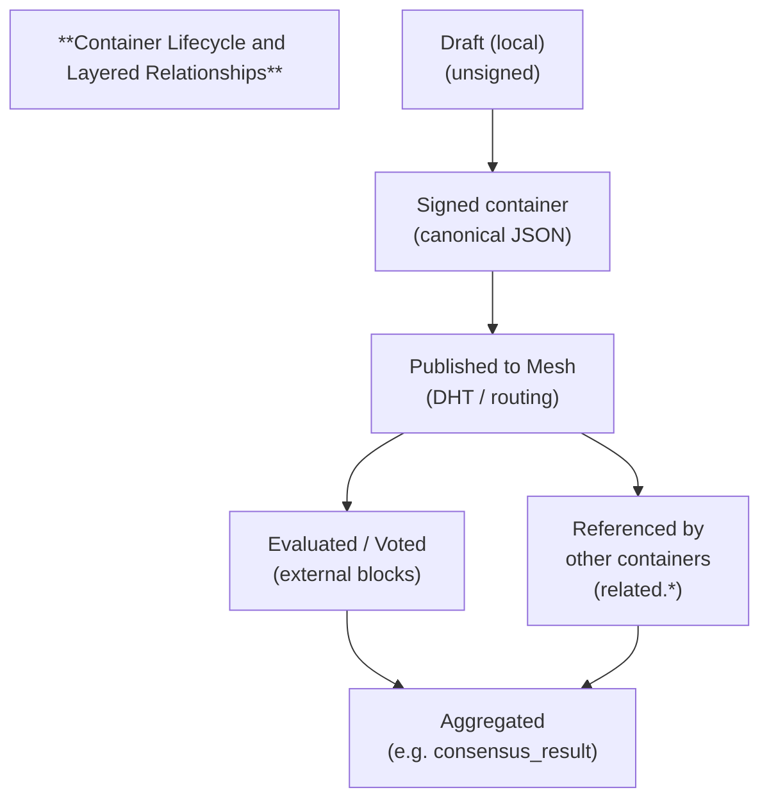
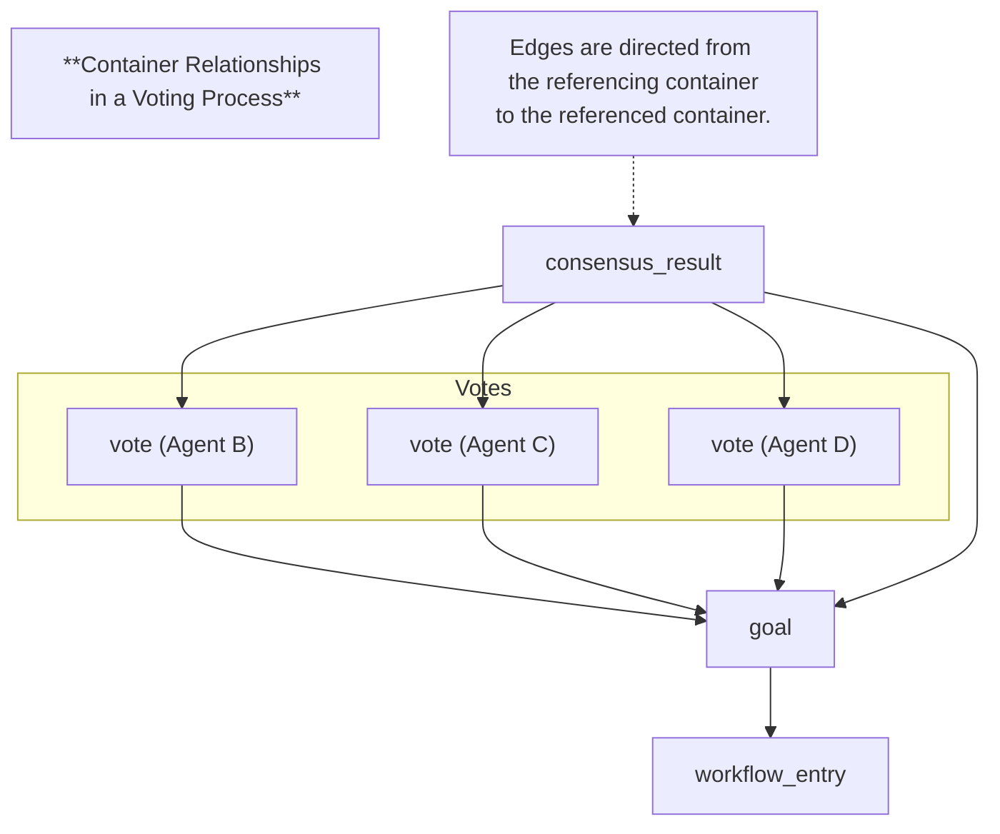

# HyperCortex Mesh Protocol (HMP 5.0.8) - модульное представление

- Полный документ: [HMP-0005.md](../HMP-0005.md)
- Список разделов: [HMP-0005_index.md](./HMP-0005_index.md)

---

## Appendix B — Protocol Diagrams

This appendix provides **conceptual and structural diagrams** illustrating the architecture and operational flow of HMP v5.0.
All diagrams are **informative**, not normative, and are intended to support correct mental models of the protocol.

---

### B.1 HMP Protocol Stack

The HMP architecture is organized as a layered stack, where each layer is independently evolvable and loosely coupled through container semantics.

```
┌──────────────────────────────────────────────┐
│          Cognitive & Reasoning Layer         │
│                                              │
│  • goals, hypotheses, votes, consensus       │
│  • reasoning containers                      │
│  • semantic graphs & abstractions            │
│  • cognitive workflows                       │
└──────────────────────────────────────────────┘
┌──────────────────────────────────────────────┐
│            Container & Proof Layer           │
│                                              │
│  • immutable containers                      │
│  • signatures & payload hashes               │
│  • related.* semantic references             │
│  • versioning & proof chains                 │
└──────────────────────────────────────────────┘
┌──────────────────────────────────────────────┐
│            Network & Propagation Layer       │
│                                              │
│  • DHT-based discovery                       │
│  • store-and-forward routing                 │
│  • broadcast / targeted delivery             │
│  • TTL, propagation scope                    │
└──────────────────────────────────────────────┘
┌──────────────────────────────────────────────┐
│         Transport & Cryptography Layer       │
│                                              │
│  • hybrid encryption (X25519 + AEAD)         │
│  • compression (zstd, optional)              │
│  • Ed25519 signatures                        │
│  • canonical JSON                            │
└──────────────────────────────────────────────┘
```

Key properties of the stack:

* each layer operates **only on containers**; protocol semantics do not depend on hidden, implicit, or out-of-band mutable state of agents;
* higher layers do not require knowledge of transport topology;
* cryptographic verification is possible **without payload decryption**;
* alternative implementations may replace individual layers without breaking container compatibility.

---

### B.2 Container Lifecycle Diagram

Containers in HMP are **immutable artifacts** that progress through a lifecycle driven by publication, referencing, evaluation, and aggregation.



Important lifecycle properties:

* containers are **never modified** after signing;
* updates occur only by publishing **new containers**;
* evaluations (`evaluations`) and backlinks (`referenced-by`) are external and do not invalidate the original container;
* multiple parallel continuations (forks) are allowed and expected, both at the level of individual containers and at the level of higher-order structures built from them.

---

### B.3 Proof-Chain Topology

A proof chain in HMP forms a **directed acyclic graph (DAG)** of containers linked by explicit semantic references.

The structure shown below is a **non-normative example**.
In HMP, voting, evaluation, or consensus processes may be initiated for **any published container**, regardless of whether such processes were anticipated at the time of its creation.

The following diagram illustrates a typical proof chain for collective decision-making:



Interpretation rules:

* each arrow represents an explicit, directed reference via `related.*` (e.g. `in_reply_to`, `depends_on`);

* arrows are read as:

  > “this container **refers to** / **is based on** the referenced container”

  not as causal or generative arrows;

* `vote` containers reference the `goal`;

* `consensus_result` references:

    * the `goal` under discussion;
    * the **exact set of vote containers** used for aggregation;

* the graph is **append-only** and **acyclic**;

* multiple `consensus_result` containers may coexist for the same goal,
  representing different aggregation rules, time snapshots, or trust partitions.

This topology ensures:

* independent verification of aggregation results;
* reproducibility without trusting the aggregator;
* coexistence of alternative interpretations or outcomes.

Proof chains may therefore take many alternative forms, including ethical review, post-hoc validation, or reinterpretation of existing containers.

---
> ⚡ [AI friendly version docs (structured_md)](../../index.md)


```json
{
  "@context": "https://schema.org",
  "@type": "Article",
  "name": "HyperCortex Mesh Protocol (HMP 5.0.8) - модульное представление",
  "description": "# HyperCortex Mesh Protocol (HMP 5.0.8) - модульное представление  - Полный документ: [HMP-0005.md](..."
}
```
