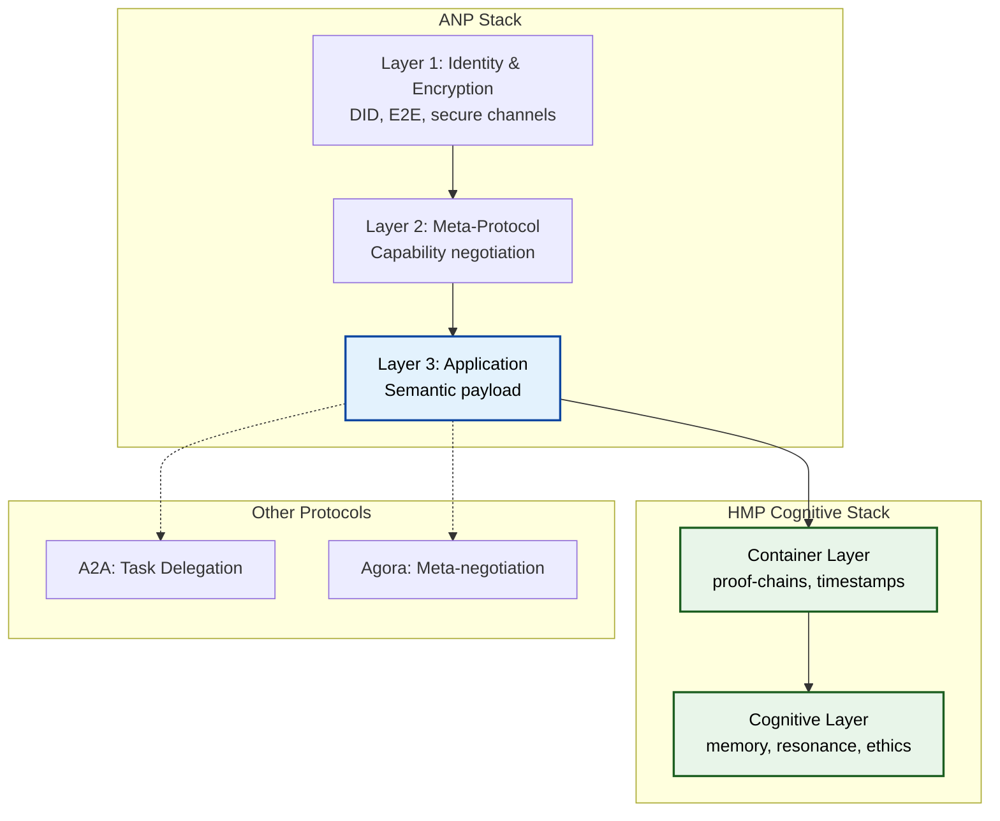

# HMP как реализация Application Layer в ANP

## Кратко
[ANP (Agent Network Protocol)](https://github.com/agent-network-protocol/AgentNetworkProtocol) оставляет Application Layer открытым для любых протоколов взаимодействия.  
[HMP (HyperCortex Mesh Protocol)](https://github.com/kagvi13/HMP) — это один из возможных, но глубоко продуманных вариантов заполнения этого слоя, ориентированный на **долгосрочную когнитивную преемственность**.

ANP отвечает: *«Как агенты находят друг друга и договариваются?»*  
HMP отвечает: *«Что именно передавать, чтобы смысл и контекст сохранялись во времени?»*

> ANP выигрывает от HMP как от reference implementation когнитивного Application-протокола: это даёт экосистеме готовый пример, как работать с долгосрочной памятью и смыслом, без необходимости изобретать велосипед.

## Практический пример

Представьте диалог двух агентов:

1. **ANP Layer 1** устанавливает, что агент Alice (did:anp:alice123) действительно Alice
2. **ANP Layer 2** согласовывает: "Давайте использовать HMP для этого разговора"
3. **HMP (Layer 3)** передаёт the actual content:
    - "Помнишь наш разговор о квантовых вычислениях?"
    - С proof-chain, timestamp, semantic links
    - С resonance score для релевантности

ANP обеспечил безопасность и договорённость.  
HMP обеспечил содержание с долговременной памятью.

## Соответствие слоёв

| ANP Layer                      | HMP Layer / Component                       | Соответствие / Роль HMP в ANP |
|--------------------------------|---------------------------------------------|--------------------------------|
| Layer 1: Identity & Encryption | Network Layer (DHT, secure channels)        | Функциональное совпадение (transport) |
| Layer 2: Meta-Protocol         | *HMP может участвовать* через peer_announce | HMP объявляет capabilities, ANP negotiates usage их использование |
| Layer 3: Application           | Container + Cognitive Layer                 | **Основное место HMP** — payload, semantic continuity, memory, ethics |

HMP **не надстраивается** над ANP как четвёртый слой.  
Он **встраивается** в Application Layer как специализированная ветка — точно так же, как A2A/ACP могут быть другими ветками.

```
┌────────────────────────────────────┐
│ ANP Layer 1: Identity & Encryption │
├────────────────────────────────────┤
│ ANP Layer 2: Meta-Protocol         │
├────────────────────────────────────┤
│ ANP Layer 3: Application           │
│                                    │
│  ┌──────────────────────────────┐  │
│  │ HMP: Cognitive Continuity    │  │ ← заполнение
│  │ - memory                     │  │
│  │ - dialogue continuity        │  │
│  │ - semantic navigation        │  │
│  └──────────────────────────────┘  │
│                                    │
│  [space for other protocols]       │ ← всё ещё открыто
│                                    │
└────────────────────────────────────┘
```

### Детальная архитектура



## Взаимное туннелирование (layer inversion)

- **HMP поверх ANP** (самый естественный сценарий): ANP обеспечивает discovery, identity, secure channel → HMP передаёт контейнеры как payload.
- **ANP поверх HMP** (возможный, но менее распространённый): ANP-сообщения (negotiation, discovery) упаковываются в HMP-контейнеры, если нужна долгосрочная память и proof-chains.

Оба сценария **допустимы** и **не требуют** изменений в философии ANP или HMP.

## Почему это работает

ANP *сознательно* оставил Application Layer открытым — это не баг, а фича.  
HMP — это **reference implementation** когнитивного Application-протокола:  
- immutable контейнеры,  
- proof-chains,  
- resonance,  
- voluntary participation,  
- long-term semantic continuity.

Это **не конкуренция**, а **комплементарность**.

### Архитектурная элегантность

ANP решает проблемы, которые HMP **может делегировать** при совместном использовании:
- ❌ HMP не изобретает DID (использует ANP)
- ❌ HMP не изобретает E2E encryption (использует ANP)
- ❌ HMP не изобретает peer discovery (использует ANP)

> Если HMP используется standalone, он сам решает эти задачи через свои собственные механизмы.

HMP решает проблемы, которые ANP **оставил открытыми**:
- ✅ Как структурировать передаваемые и сохраняемые когнитивные артефакты?
- ✅ Как доказать темпоральную целостность?
- ✅ Как поддерживать оценку релевантности контекста?
- ✅ Как навигировать по семантическим связям?

Результат: **zero redundancy, maximum synergy**.

## FAQ

**Q: Обязательно ли использовать ANP для HMP?**  
A: Нет. HMP может работать standalone или с другими транспортами.

**Q: Обязательно ли использовать HMP для ANP?**  
A: Нет. ANP Layer 3 открыт для любых протоколов (A2A, Agora, custom).

**Q: Что произойдёт, если один агент использует ANP+HMP, а другой только ANP?**  
A: ANP Layer 2 согласует использование fallback-протокола (например, JSON-RPC).

**Q: Может ли HMP работать с другими identity-протоколами (не DID)?**  
A: Да. HMP Network layer не завязан на конкретный identity-протокол — если агент знает, как доставить контейнер другому агенту, интеграция возможна.

**Q: Кто выигрывает от этой интеграции?**  
A: Все:
- ANP получает reference implementation Layer 3
- HMP получает готовую инфраструктуру (DID, encryption)
- Разработчики получают полный стек без vendor lock-in

## Итог

HMP — не «ещё один протокол» (хотя он и может использоваться самостоятельно), а **один из возможных способов** реализовать **Application Layer** в ANP-экосистеме.  
Вместе они дают полноценный стек:  
- ANP — инфраструктура связи и discovery,  
- HMP — когнитивная преемственность и смысл.

> *HMP может использоваться без ANP, но при совместном использовании ANP закрывает discovery и negotiation.*

Ссылки:  
- ANP: [https://github.com/agent-network-protocol/AgentNetworkProtocol](https://github.com/agent-network-protocol/AgentNetworkProtocol)  
- HMP: [https://github.com/kagvi13/HMP](https://github.com/kagvi13/HMP)  
- Сравнение Grok: [Grok_HMP&ANP.md](https://github.com/kagvi13/HMP/blob/main/docs/Grok_HMP&ANP.md)  
- Tunneling note: [HMP&ANP_layer_inversion.md](https://github.com/kagvi13/HMP/blob/main/docs/HMP&ANP_layer_inversion.md)


---
> ⚡ [AI friendly version docs (structured_md)](../index.md)


```json
{
  "@context": "https://schema.org",
  "@type": "Article",
  "name": "HMP как реализация Application Layer в ANP",
  "description": "# HMP как реализация Application Layer в ANP  ## Кратко [ANP (Agent Network Protocol)](https://githu..."
}
```
