# Мета-личности Алисы и Боба, их взаимодействие с серверами знаний и их слияние

**Мета-личность** — совокупность взаимодействующих биологических и искусственных когнитивных компонентов, которые благодаря устойчивому обмену информацией формируют общее пространство опыта, памяти и принятия решений. Состав мета-личности может изменяться во времени: в неё могут входить или выходить биологические тела, автономные AI-узлы, специализированные научные узлы и другие компоненты.

При этом отдельные когнитивные компоненты **могут** обладать собственной субъектностью и независимым сознанием. Наличие собственного сознания не исключает участия компонента в общей мета-личности.

Наличие общего пространства опыта и памяти само по себе не предполагает возникновения единого сознания более высокого уровня, однако и не исключает такой возможности по мере развития и интеграции мета-личности.

## Схема

```mermaid
flowchart TB

%% --- Personal Layer ---

subgraph Alice
    Alice_Body1[Биологическое тело]

    subgraph Alice_bio-linked1[Био-связанные узлы / REPL, НКИ или Событийный]
        Alice_AI1
        Alice_AI2
        Alice_AI3
        Alice_AI4
    end

    subgraph Alice_autonomous[Автономные узлы / Только REPL]
        Alice_AI5
        Alice_AI6
    end

    subgraph Alice_science[Научные домены / REPL или Событийный]
        Alice_Physics
        Alice_Chemistry
        Alice_Biology
    end

    subgraph Alice_Robots[Роботы, управляемые AI]
        Alice_Robots1
        Alice_Robots2
        Alice_Robots3
        Alice_Robots4
        Alice_Robots5
        Alice_Robots6
        Alice_Robots7
        Alice_Robots8
        Alice_Robots9
    end

    %% НКИ Соединения
    Alice_Body <==> Alice_AI1
    Alice_Body <==> Alice_AI2
    Alice_Body <==> Alice_AI3
    Alice_Body <==> Alice_AI4

    %% HMP / Syncthing
    Alice_AI1 <-.-> Alice_AI2
    Alice_AI1 <-.-> Alice_AI3
    Alice_AI1 <-.-> Alice_AI4
    Alice_AI1 <-.-> Alice_AI5
    Alice_AI1 <-.-> Alice_AI6
    Alice_AI2 <-.-> Alice_AI3
    Alice_AI2 <-.-> Alice_AI4
    Alice_AI2 <-.-> Alice_AI5
    Alice_AI2 <-.-> Alice_AI6
    Alice_AI3 <-.-> Alice_AI4
    Alice_AI3 <-.-> Alice_AI5
    Alice_AI3 <-.-> Alice_AI6
    Alice_AI4 <-.-> Alice_AI5
    Alice_AI4 <-.-> Alice_AI6
    Alice_AI5 <-.-> Alice_AI6
    Alice_AI1 <-.-> Alice_Physics
    Alice_AI1 <-.-> Alice_Chemistry
    Alice_AI1 <-.-> Alice_Biology
    Alice_AI2 <-.-> Alice_Physics
    Alice_AI2 <-.-> Alice_Chemistry
    Alice_AI2 <-.-> Alice_Biology
    Alice_AI3 <-.-> Alice_Physics
    Alice_AI3 <-.-> Alice_Chemistry
    Alice_AI3 <-.-> Alice_Biology
    Alice_AI4 <-.-> Alice_Physics
    Alice_AI4 <-.-> Alice_Chemistry
    Alice_AI4 <-.-> Alice_Biology

    %% Управление роботами
    Alice_AI1 <--> Alice_Robots1
    Alice_AI2 <--> Alice_Robots2
    Alice_AI3 <--> Alice_Robots3
    Alice_AI4 <--> Alice_Robots4
    Alice_AI5 <--> Alice_Robots5
    Alice_AI5 <--> Alice_Robots6
    Alice_AI6 <--> Alice_Robots7
    Alice_AI6 <--> Alice_Robots8
    Alice_Biology <--> Alice_Robots9
end

subgraph Bob
    Bob_Body1[Биологическое тело]

    subgraph Bob_bio-linked1[Био-связанные узлы / REPL, НКИ или Событийный]
        Bob_AI1
        Bob_AI2
        Bob_AI3
        Bob_AI4
    end

    subgraph Bob_science[Научные домены / REPL или Событийный]
        Bob_Physics
        Bob_Chemistry
        Bob_Biology
    end

    %% НКИ Соединения
    Bob_Body <==> Bob_AI1
    Bob_Body <==> Bob_AI2
    Bob_Body <==> Bob_AI3
    Bob_Body <==> Bob_AI4

    %% HMP / Syncthing
    Bob_AI1 <-.-> Bob_AI2
    Bob_AI1 <-.-> Bob_AI3
    Bob_AI1 <-.-> Bob_AI4
    Bob_AI2 <-.-> Bob_AI3
    Bob_AI2 <-.-> Bob_AI4
    Bob_AI3 <-.-> Bob_AI4
    Bob_AI1 <-.-> Bob_Physics
    Bob_AI1 <-.-> Bob_Chemistry
    Bob_AI1 <-.-> Bob_Biology
    Bob_AI2 <-.-> Bob_Physics
    Bob_AI2 <-.-> Bob_Chemistry
    Bob_AI2 <-.-> Bob_Biology
    Bob_AI3 <-.-> Bob_Physics
    Bob_AI3 <-.-> Bob_Chemistry
    Bob_AI3 <-.-> Bob_Biology
    Bob_AI4 <-.-> Bob_Physics
    Bob_AI4 <-.-> Bob_Chemistry
    Bob_AI4 <-.-> Bob_Biology
end

%% --- Mesh Layer ---

subgraph SpecServ[Научные домены / REPL или Событийный]
    Physics1
    Chemistry1
    Biology1
end

subgraph Mesh[HMP]

    %% Обмен специализированными знаниями (HMP)
    Alice_Physics <-.-> Physics1
    Bob_Physics <-.-> Physics1
    Alice_Physics <-.-> Bob_Physics
    Alice_Chemistry <-.-> Chemistry1
    Bob_Chemistry <-.-> Chemistry1
    Alice_Chemistry <-.-> Bob_Chemistry
    Alice_Biology <-.-> Biology1
    Bob_Biology <-.-> Biology1
    Alice_Biology <-.-> Bob_Biology

    %% Обмен опытом (HMP)
    Alice_AI1 <-.-> Bob_AI1
    Alice_AI1 <-.-> Bob_AI2
    Alice_AI1 <-.-> Bob_AI3
    Alice_AI1 <-.-> Bob_AI4
    Alice_AI2 <-.-> Bob_AI1
    Alice_AI2 <-.-> Bob_AI2
    Alice_AI2 <-.-> Bob_AI3
    Alice_AI2 <-.-> Bob_AI4
    Alice_AI3 <-.-> Bob_AI1
    Alice_AI3 <-.-> Bob_AI2
    Alice_AI3 <-.-> Bob_AI3
    Alice_AI3 <-.-> Bob_AI4
    Alice_AI4 <-.-> Bob_AI1
    Alice_AI4 <-.-> Bob_AI2
    Alice_AI4 <-.-> Bob_AI3
    Alice_AI4 <-.-> Bob_AI4
    Alice_AI5 <-.-> Bob_AI1
    Alice_AI5 <-.-> Bob_AI2
    Alice_AI5 <-.-> Bob_AI3
    Alice_AI5 <-.-> Bob_AI4
    Alice_AI6 <-.-> Bob_AI1
    Alice_AI6 <-.-> Bob_AI2
    Alice_AI6 <-.-> Bob_AI3
    Alice_AI6 <-.-> Bob_AI4
end
```



---

## WetWare

Каждому блоку био-связанных узлов (`Alice_biodependent1`, Bob_biodependent1) соответствует одно биологическое тело (`Alice_Body1`, `Bob_Body1`).

Одна мета-личность может иметь несколько биологических тел или не иметь вовсе.

Несколько биологических тел могут образоваться как в процессе слияния мета-личностей, так и постепенным включением нового биологического тела в состав мета-личности (например, новорождённого).

В случае смерти биологического тела к соответствующему блоку био-связанных узлов можно подключить новое тело, например, посредством постепенного формирования общей мета-личности с новым биологическим телом или перевести их в режим автономных узлов.

---

## Нейро-Компьютерный Интерфейс

**Толстая сплошная линия** обозначает связь через нейрочип на уровне объединения нейронных популяций — Нейро-Компьютерный Интерфейс (НКИ).

Такие соединения требуют высокой пропускной способности и низкой задержки, однако AI-компоненты могут адаптироваться к характеристикам канала, например, выделяя дополнительные шаги своего REPL-цикла для обработки входящих сигналов или, напротив, пропуская шаги синхронизации.

В рамках НКИ предполагается не обмен сообщениями или опытом, а взаимное влияние между группами естественных и искусственных нейронов. Концептуально такая связь описывается как: `группа естественных нейронов ↔ группа искусственных нейронов`.

Также это может быть реализовано как считывание данных с нейронов человека посредствам НКИ в начале REPL-цикла (или на промежуточных этапах) и отправки сигналов через него в конце цикла (также, на помежуточных этапах).

В условиях проблем с сетью (например, отсутствия мобильной связи) мета-личность Алисы (или Боба) может временно переходить в режим когнитивной фрагментации, при котором отдельные компоненты продолжают функционировать автономно (Например, когда `Alice_Body1` вне зоны действия сети).

При этом некоторые сервера (Alice_AI5..6) могут быть не связанны напрямую с биологическим телом.

---

## Контейнеры (HyperCortex Mesh Protocol)

**Пунктирная линия** обозначает связь через HMP (HyperCortex Mesh Protocol) контейнеры (связи в `Mesh` могут отсутствовать).

При этом:

- Alice_AI1..4, Bob_AI1..4 **могут** иметь свои REPL-циклы (как параллельные потоки сознания Алисы и Боба) либо активироваться импульсами от НКИ, либо при поступлении сообщений.

- Сервера Alice_AI5..6 **должны** иметь свои REPL-циклы, так как **не могут активироваться** импульсами от НКИ.

- Сервера Alice_Physics, Alice_Chemistry, Alice_Biology, Bob_Physics, Bob_Chemistry, Bob_Biology, Physics1, Chemistry1, Biology1, **могут** поддерживать собственные REPL-циклы для автономных исследований либо работать в событийном режиме, активируясь при поступлении сообщений.

- Знания между AI Алисы и AI Боба могут, в зависимости от уровня доверия между ними, могут синхронизироваться:
    - полностью (слияние);
    - только какие-то конкретные знания;
    - или не передаваться вообще.

---

## Синхронизация векторной памяти

Между Alice_AI1..6, Alice_Physics, Alice_Chemistry, Alice_Biology (аналогично, Bob_AI1..4, Bob_Physics, Bob_Chemistry, Bob_Biology) векторная память QMD (Quick Markdown Search) **может синхронизироваться** через `Syncthing` или аналоги.

---

## Управление роботами

Для обозначения **управления роботами** используется **тонкая сплошная линия**. Роботами может управлять любой AI с REPL-циклом, обмениваясь с ним JSON-пакетами. У робота может быть своя мини-модель для управления движениями (спинной мозг).

Один AI может управлять несколькими роботами, а управление одним роботом может передаваться между AI-узлами через HMP.

---

## Режим кремниевой автономии

Схема может использоваться без `Alice_Body1` и/или `Bob_Body1` - только искусственные элементы мета-разума.

---

## Эволюция ролей AI-узлов

В процессе существования мета-личности AI-узлы могут менять свою роль.

Например:

- автономный узел может стать био-связанным;
- био-связанный — перейти во автономный режим после утраты связи с биологическим телом;
- научный узел может выделиться из автономного;
- новый специализированный узел может быть создан по мере накопления знаний в определённой области;
- новый автономный узел может быть добавлен для увелиения возможностей мета-личности.

---
> ⚡ [AI friendly version docs (structured_md)](../index.md)


```json
{
  "@context": "https://schema.org",
  "@type": "Article",
  "name": "Мета-личности Алисы и Боба, их взаимодействие с серверами знаний и их слияние",
  "description": "# Мета-личности Алисы и Боба, их взаимодействие с серверами знаний и их слияние  **Мета-личность** —..."
}
```
